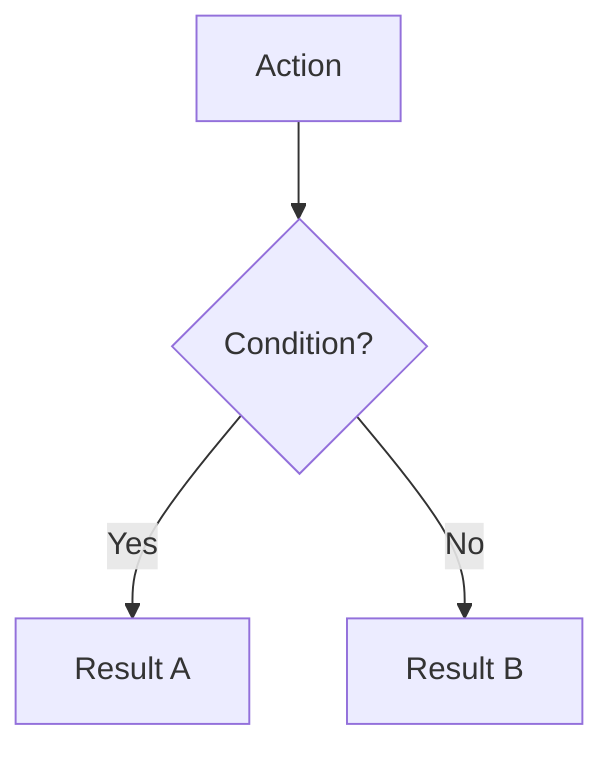

## Formatting Conventions

### Document Structure

**YAML Frontmatter** — Required at top of every spec:
```yaml
---
id: SPEC-{CATEGORY}-{NAME}
title: "Human Readable Title"
version: 1.0
status: draft|implemented|deprecated
last-updated: YYYY-MM-DD
parent: optional/parent/path.md
---
```

**Section Numbering** — Use numbered headers for major sections:
```markdown
## 1. Overview
### 1.1 Identity Table
### 1.2 Core Philosophy

## 2. Mechanical Effects
### 2.1 Primary Effect
### 2.2 Secondary Effects
```

**Opening Quote** — Flavor text immediately after title:
```markdown
# Death & Resurrection System

> *"Death is not a reload button — it's a scar that never fully heals."*
```

### Tables

**Identity Tables** — Use for spec properties:
```markdown
| Property | Value |
|----------|-------|
| Spec ID | `SPEC-CORE-DEATH-RESURRECTION` |
| Category | Core System |
| Status | Implemented |
```

**DC Tables** — Use for difficulty scaling:
```markdown
| Tier | Base DC | Time | Example |
|------|---------|------|---------|
| Simple | 10 | 1 hour | Fehu, Uruz |
| Standard | 14 | 2 hours | Thurisaz, Kenaz |
```

**Comparison Tables** — Use for contrasting options:
```markdown
| Aspect | Option A | Option B |
|--------|----------|----------|
| Damage | High | Low |
| Cost | 40 Stamina | 20 Stamina |
```

### Mermaid Diagrams

**Flowcharts** — Use for workflows and decision trees:


**Node Naming** — Use SCREAMING_CASE for node IDs, Title Case for labels:
```
DAMAGE[Take damage] --> CHECK{HP ≤ 0?}
```

**Status Effects** — Wrap in brackets: `[Bleeding]`, `[Stunned]`

### GitHub Alerts

Use for critical callouts (sparingly):

```markdown
> [!NOTE]
> Background information or clarification

> [!TIP]
> Tactical advice or optimization

> [!IMPORTANT]
> Key mechanical information

> [!WARNING]
> Design intent or balance rationale

> [!CAUTION]
> Dangerous mechanics or permanent consequences
```

### Code Blocks

**Formulas** — Use plain code blocks:
```
Damage = Base + (MIGHT × 2) + Weapon Bonus
```

**C# Implementation** — Use `csharp` language tag:
```csharp
public interface IDeathService
{
    void OnHpReachesZero(Character character);
    DeathSaveResult MakeDeathSave(Character character);
}
```

**SQL References** — Use `sql` language tag:
```sql
SELECT * FROM Abilities WHERE specialization = 'berserkr';
```

### Links

**Relative Links** — Always use relative paths:
```markdown
See: [Bone-Setter](../../03-character/specializations/bone-setter/overview.md)
```

**Status Effect References** — Use brackets inline: `[Bleeding]`, `[Poisoned]`

**Spec ID References** — Use backticks: `SPEC-CORE-DEATH-RESURRECTION`

### Visual Hierarchy

**Bold** for:
- Key terms on first use: **Runic Blight**
- Column headers in tables
- Important values: **+2 Corruption**

**Italics** for:
- Flavor text: *"The world's code fragments."*
- Emphasis within paragraphs

**Horizontal Rules** — Use `---` between major sections