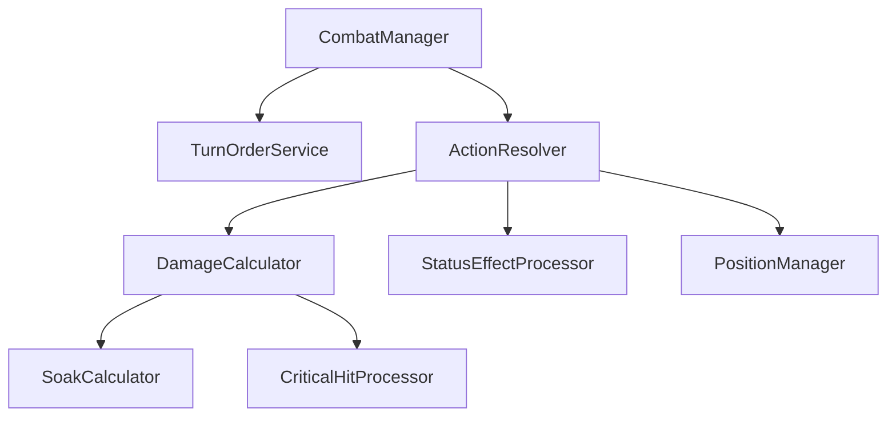

# Rune & Rust — Technical Architecture

Technical stack and project structure for implementation.

---

## 1. Technology Stack

| Layer | Technology | Purpose |
|-------|------------|---------|
| Language | C# (.NET 8+) | Core game logic |
| Database | PostgreSQL | Persistent storage |
| ORM | Entity Framework Core | Database access |
| Terminal UI | Custom text interface | Dev/testing interface |
| GUI | AvaloniaUI | Player-facing interface |
| Testing | xUnit + FluentAssertions | Unit & integration tests |
| DI | Microsoft.Extensions.DI | Dependency injection |

---

## 2. Solution Structure

```
RuneAndRust/
├── src/
│   ├── RuneAndRust.Core/           # Domain models, enums, interfaces
│   │   ├── Entities/               # Character, Creature, Item, etc.
│   │   ├── Enums/                  # DamageType, Attribute, Status, etc.
│   │   ├── Interfaces/             # IRepository, IGameService, etc.
│   │   └── ValueObjects/           # DiceRoll, Position, etc.
│   │
│   ├── RuneAndRust.Engine/         # Game logic & services
│   │   ├── Combat/                 # CombatEngine, DamageCalculator
│   │   ├── Specializations/        # SpecializationFactory, abilities
│   │   ├── Environment/            # DungeonEngine, MovementService
│   │   └── Services/               # GameStateService, etc.
│   │
│   ├── RuneAndRust.Persistence/    # Database layer
│   │   ├── DbContext/              # RuneAndRustDbContext
│   │   ├── Repositories/           # EntityFramework implementations
│   │   ├── Migrations/             # EF migrations
│   │   └── DataSeeder.cs           # Initial data population
│   │
│   ├── RuneAndRust.Terminal/       # Terminal interface
│   │   ├── Commands/               # Command handlers
│   │   ├── Rendering/              # Text output formatting
│   │   └── Program.cs              # Entry point
│   │
│   └── RuneAndRust.Avalonia/       # GUI application
│       ├── Views/                  # XAML views
│       ├── ViewModels/             # MVVM view models
│       ├── Controls/               # Custom controls
│       └── App.axaml               # Application entry
│
├── tests/
│   ├── RuneAndRust.Core.Tests/
│   ├── RuneAndRust.Engine.Tests/
│   └── RuneAndRust.Integration.Tests/
│
└── docs/                           # Specifications (this folder)
```

---

## 3. Layer Responsibilities

### 3.1 Core Layer
- **No external dependencies** (pure domain)
- Defines entities, enums, interfaces, value objects
- Contains no business logic—only data structures

### 3.2 Engine Layer
- **References Core only**
- Implements all game logic
- Services are stateless; state lives in entities
- Combat, specializations, environment logic

### 3.3 Persistence Layer
- **References Core only**
- Entity Framework Core with PostgreSQL
- Repository pattern for data access
- Migrations for schema changes

### 3.4 UI Layers (Terminal & Avalonia)
- **References Engine + Core**
- Thin presentation layer
- Delegates logic to Engine services
- Handles input/output only

---

## 4. Database Design Principles

### 4.1 Normalization
- Specializations, Abilities, StatusEffects as separate tables
- Join tables for many-to-many (e.g., `character_abilities`)
- Denormalize for read performance only where measured

### 4.2 Key Tables (Preview)

| Table | Purpose |
|-------|---------|
| `characters` | Player characters |
| `archetypes` | Warrior, Mage, etc. |
| `specializations` | Atgeir-Wielder, etc. |
| `abilities` | All specialization abilities |
| `ability_ranks` | Per-rank effects and formulas |
| `status_effects` | Bleeding, Stunned, etc. |
| `items` | All item definitions |
| `dungeons` | Dungeon definitions |
| `rooms` | Individual room data |

Full schema in [09-data/schema.md](../09-data/schema.md).

---

## 5. Combat Engine Architecture



### 5.1 Key Interfaces

```csharp
interface ICombatEngine
{
    void StartCombat(IEnumerable<ICombatant> participants);
    void ProcessTurn(ICombatant actor, IAction action);
    CombatResult EndCombat();
}

interface IDamageCalculator
{
    DamageResult Calculate(AttackContext context);
}

interface IPositionManager
{
    bool CanAttack(ICombatant attacker, ICombatant target);
    bool TryPush(ICombatant pusher, ICombatant target);
    bool TryPull(ICombatant puller, ICombatant target);
}
```

---

## 6. Configuration

### 6.1 appsettings.json Structure

```json
{
  "ConnectionStrings": {
    "DefaultConnection": "Host=localhost;Database=runeandrust;..."
  },
  "GameSettings": {
    "MaxPartySize": 4,
    "StartingLegend": 1,
    "BaseHP": 20
  }
}
```

### 6.2 Environment Variables

| Variable | Purpose |
|----------|---------|
| `RR_DB_CONNECTION` | Database connection string |
| `RR_LOG_LEVEL` | Logging verbosity |
| `RR_SEED_DATA` | Run data seeder on startup |

---

## 7. Testing Strategy

### 7.1 Test Categories

| Type | Location | Scope |
|------|----------|-------|
| Unit | `*.Tests/` | Single class/method |
| Integration | `Integration.Tests/` | Multiple systems |
| Database | `Integration.Tests/` | EF + PostgreSQL |

### 7.2 Test Naming

```
MethodName_StateUnderTest_ExpectedBehavior
```

Example: `CalculateDamage_WithSoak_ReducesDamage`

---

## 8. Related Documents

- [CONVENTIONS.md](./CONVENTIONS.md) — Naming standards
- [../09-data/schema.md](../09-data/schema.md) — Full database schema
- [../10-testing/](../10-testing/) — Detailed test specifications
