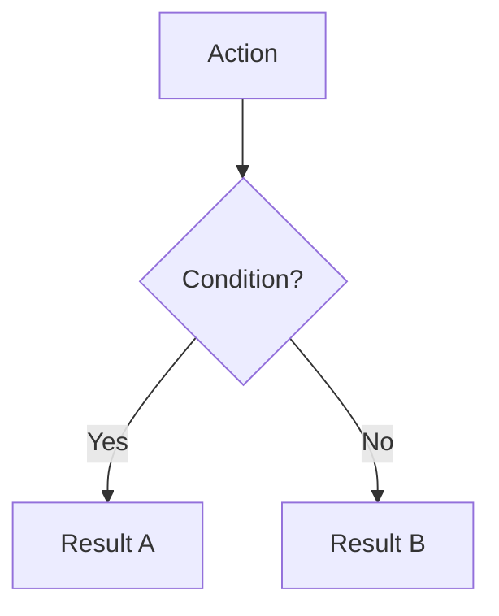

# Rune & Rust Documentation Standards

## Project Phase

**CURRENT PHASE: Feature Specification — NO code implementation yet.**

| Activity | Status |
|----------|--------|
| Writing game design specs | ✅ Active |
| Documenting game mechanics | ✅ Active |
| Creating spec templates | ✅ Active |
| Auditing documentation | ✅ Active |
| Writing C# code | ❌ Not Yet |
| Database migrations | ❌ Not Yet |
| Building UI | ❌ Not Yet |
| Unit tests | ❌ Not Yet |

All work should be in the `docs/` directory. Technical Implementation sections in specs are **design documentation only**.

---

## Dice System

**CRITICAL**: This project uses **d10 for resolution** and a **tiered d4-d10 hierarchy for damage**.

### Resolution Rolls (d10 Only)

All skill checks, attribute checks, and resolution rolls use **d10 exclusively**:

```
Resolution Roll = [Attribute] d10 vs DC
Example: WITS 6 → Roll 6d10, count successes ≥ DC
```

### Damage Dice (Tiered Hierarchy)

Damage rolls use a **tier-based die system** (d4–d10) for mechanical differentiation:

| Tier | Die | Avg | Use Case |
|------|-----|-----|----------|
| **Minor** | d4 | 2.5 | DoT ticks, trinkets, improvised weapons |
| **Light** | d6 | 3.5 | Daggers, unarmed, Tier 1 abilities |
| **Medium** | d8 | 4.5 | Swords, axes, polearms, Tier 2 abilities |
| **Heavy** | d10 | 5.5 | Greatswords, Tier 3+, elite abilities |

### Examples

**Resolution (always d10):**
```
WITS check DC 3 → Roll 6d10, count successes
Resist Fear → Roll WILL d10 vs DC
```

**Damage (tiered):**
```
Dagger: 2d6 + 2
Longsword: 2d8 + 3
Greatsword: 2d10 + 5
DoT tick: 1d4 per stack
```

### When Auditing

| Context | Correct Die |
|---------|-------------|
| Skill/attribute checks | d10 |
| Resistance rolls | d10 |
| Weapon damage | d4/d6/d8/d10 by weapon tier |
| Ability damage | d4/d6/d8/d10 by ability tier |
| DoT/trinket damage | d4 |

### Invalid Notation (Flag These)

- ❌ `Roll 6d8 for your WITS check` — Resolution should be d10
- ❌ `Greatsword deals 2d6` — Heavy weapons use d10
- ❌ `All damage is d10` — Ignores tier hierarchy

---

## Cross-References

### Core Systems

| System | Spec | Path |
|--------|------|------|
| **Dice System** | Resolution & damage mechanics | `docs/01-core/dice-system.md` |
| **Game Loop** | Turn structure, phase order | `docs/01-core/game-loop.md` |
| **Death & Resurrection** | Death saves, respawn, Corruption | `docs/01-core/death-resurrection.md` |
| **Persistence** | Save/load, database schema | `docs/01-core/persistence.md` |
| **Character Creation** | Starting attributes, origins | `docs/01-core/character-creation.md` |
| **Trauma Economy** | Stress, Traumas, recovery | `docs/01-core/trauma-economy.md` |
| **Saga System** | Legend, achievements, meta-progression | `docs/01-core/saga-system.md` |
| **Events** | Game events, signals | `docs/01-core/events.md` |

### Resources

| Resource | Description | Path |
|----------|-------------|------|
| **HP** | Health points | `docs/01-core/resources/hp.md` |
| **Stamina** | Action currency (25%/turn regen) | `docs/01-core/resources/stamina.md` |
| **Stress** | Psychological damage (0-100) | `docs/01-core/resources/stress.md` |
| **Fury** | Berserkr-specific rage resource | `docs/01-core/resources/fury.md` |
| **Corruption** | Permanent, transforms at 100 | `docs/01-core/resources/corruption.md` |

### Attributes

| Attribute | Role | Path |
|-----------|------|------|
| **MIGHT** | Physical power | `docs/01-core/attributes/might.md` |
| **FINESSE** | Agility, precision | `docs/01-core/attributes/finesse.md` |
| **STURDINESS** | Endurance, HP | `docs/01-core/attributes/sturdiness.md` |
| **WITS** | Perception, crafting | `docs/01-core/attributes/wits.md` |
| **WILL** | Mental fortitude, stress resistance | `docs/01-core/attributes/will.md` |

### Templates

| Template | Purpose | Path |
|----------|---------|------|
| **Ability** | Individual ability specs | `docs/.templates/ability.md` |
| **Specialization** | Specialization overviews | `docs/.templates/specialization.md` |
| **Status Effect** | Status effect specs | `docs/.templates/status-effect.md` |
| **System** | Core system documentation | `docs/.templates/system.md` |
| **Resource** | Resource specifications | `docs/.templates/resource.md` |
| **Craft** | Crafting trade specs | `docs/.templates/craft.md` |
| **Skill** | Skill definitions | `docs/.templates/skill.md` |
| **Flavor Text Library** | 13 voice/tone guides | `docs/.templates/flavor-text/` |

### Specializations

| Specialization | Archetype | Path |
|----------------|-----------|------|
| **Berserkr** ⭐ | Warrior (Heretical) | `docs/03-character/specializations/berserkr/berserkr-overview.md` |
| **Bone-Setter** | Support (Coherent) | `docs/03-character/specializations/bone-setter/bone-setter-overview.md` |
| **Ruin Stalker** | Scout (Coherent) | `docs/03-character/specializations/ruin-stalker/ruin-stalker-overview.md` |
| **Rúnasmiðr** | Crafter (Heretical) | `docs/03-character/specializations/runasmidr/runasmidr-overview.md` |

### Crafting Trades

| Trade | Skill | Path |
|-------|-------|------|
| **Field Medicine** | First aid, healing | `docs/04-systems/crafting/field-medicine.md` |
| **Runeforging** | Inscribing runes | `docs/04-systems/crafting/runeforging.md` |
| **Alchemy** | Potions, poisons | `docs/04-systems/crafting/alchemy.md` |
| **Bodging** | Improvised repairs | `docs/04-systems/crafting/bodging.md` |

---

## Documentation Templates

All specifications should conform to templates in `/docs/.templates/`:

### Core Templates
- `ability.md` — Individual ability specifications
- `specialization.md` — Specialization overviews
- `status-effect.md` — Status effect specifications
- `system.md` — Core game system documentation
- `resource.md` — Resource specifications
- `craft.md` — Crafting trade specifications
- `skill.md` — Skill specifications

### Required Sections (All Specs)
1. YAML frontmatter (id, title, version, status, last-updated)
2. Overview table
3. Mechanical Effects
4. **Balance Data** — Power curves, effectiveness ratings, economy analysis
5. **Voice Guidance** — Reference to flavor-text templates
6. **Implementation Status** — Checklist of dev tasks
7. **Changelog** — Version history

### Flavor Text Library
Located at `/docs/.templates/flavor-text/` — Contains 13 templates for voice, tone, and writing guidance.

---

## Golden Standard Specs

### Purpose

Golden standards are **fully-conformant reference implementations** — specs that demonstrate every required section, proper formatting, and appropriate depth. When creating or auditing specs, compare against the relevant golden standard rather than just the template.

### Why Golden Standards?

| Problem | Solution |
|---------|----------|
| Templates show *structure*, not *content depth* | Golden standards show real examples |
| Unclear how much detail is "enough" | Copy the golden standard's depth |
| Inconsistent quality across specs | One authoritative reference per category |
| New contributors unsure of expectations | "Make it look like this one" |

### Current Golden Standards

| Category | Spec | Path | Lines |
|----------|------|------|-------|
| **Specialization** | Berserkr | `docs/03-character/specializations/berserkr/berserkr-overview.md` | 319 |
| **Ability** | Corridor Maker | `docs/03-character/specializations/ruin-stalker/abilities/corridor-maker.md` | 226 |
| **Status Effect** | Bleeding | `docs/04-systems/status-effects/bleeding.md` | 284 |

### Required Sections by Category

**Specialization Overview:**
- YAML frontmatter (id, title, version, status, last-updated)
- Opening flavor quote
- Identity table
- Core philosophy
- Ability tree with tier/rank structure
- **Balance Data** (power curve, role effectiveness, resource economy)
- **Voice Guidance** (tone profile, example text)
- **Implementation Status** (checklist)
- Related documentation
- **Changelog**

**Ability Spec:**
- YAML frontmatter
- Quick reference table (tier, cost, range, etc.)
- Mechanical effects
- Rank progression (if applicable)
- Workflow diagram (Mermaid)
- Synergies
- Tactical applications
- **Balance Data** (power budget, effectiveness ratings)
- **Technical Implementation** (C# interface)
- **Implementation Status**
- **Changelog**

**Status Effect Spec:**
- YAML frontmatter
- Quick reference table
- Application/removal triggers
- Stacking rules
- Duration mechanics
- Synergies AND Conflicts
- Counter-play options
- **Balance Data** (severity analysis, DoT comparison)
- **Voice Guidance** (flavor text templates)
- **Implementation Status**
- **Changelog**

### Maintaining Golden Standards

| Rule | Reason |
|------|--------|
| **Never simplify** a golden standard | Others copy it; simplification propagates |
| **Update when templates change** | Keep in sync |
| **One per category** | Avoid ambiguity |
| **Choose specs with natural complexity** | Simple specs don't demonstrate all sections |

### Promoting a Spec to Golden Standard

Before promoting:
- [ ] Spec has all required sections
- [ ] Balance Data is populated with real values
- [ ] Technical Implementation includes C# interface
- [ ] Changelog has at least 2 versions
- [ ] Peer review completed
- [ ] Line count is representative (not minimal)

---

## Audit Standards

### Purpose

Audits ensure documentation quality and consistency. Every spec should be periodically reviewed against templates and golden standards to identify gaps.

### Audit Methodology

**Step 1: Identify spec category**
- Specialization, Ability, Status Effect, System, Resource, Craft, etc.

**Step 2: Load reference materials**
- Template: `/docs/.templates/{category}.md`
- Golden standard: See Golden Standards section

**Step 3: Check each required section**
- Mark present/absent
- Note quality issues (incomplete, outdated, wrong format)

**Step 4: Check content quality**
- Dice notation (d10 for resolution, tiered d4-d10 for damage)
- Link validity (no broken relative links)
- Table formatting (proper alignment)
- Mermaid diagram syntax

**Step 5: Calculate conformance score**
- Count present required sections ÷ total required sections

### Conformance Scoring

| Score | Rating | Action |
|-------|--------|--------|
| 90-100% | ✅ Excellent | No action needed |
| 75-89% | 🟡 Good | Minor additions |
| 50-74% | 🟠 Needs Work | Schedule remediation |
| Below 50% | 🔴 Critical | Prioritize immediately |

### Conformance Checklist (All Specs)

| Section | Required? | Check |
|---------|-----------|-------|
| YAML frontmatter (id, title, version, status, last-updated) | ✅ All | [ ] |
| Opening flavor quote | ✅ All | [ ] |
| Identity/Quick Reference table | ✅ All | [ ] |
| Mechanical effects | ✅ All | [ ] |
| Mermaid workflow diagram | ✅ Complex | [ ] |
| Balance Data section | ✅ All | [ ] |
| Voice Guidance reference | ✅ All | [ ] |
| Implementation Status checklist | ✅ All | [ ] |
| Changelog | ✅ All | [ ] |
| Technical Implementation (C#) | ✅ Complex | [ ] |

### Content Quality Checks

| Check | Flag If |
|-------|---------|
| **Dice notation** | Uses `d10` as universal die without context |
| **Status effect refs** | Not wrapped in brackets: `Bleeding` → `[Bleeding]` |
| **Links** | Broken or absolute paths instead of relative |
| **Tables** | Misaligned or missing headers |
| **Code blocks** | Missing language tag |
| **Mermaid** | Syntax errors or missing diagrams for complex flows |

### Issue Documentation Format

For each spec audited, document:

```markdown
### [spec-name.md]

**Score:** 75% (9/12 sections)
**Path:** `docs/path/to/spec.md`

**Missing Sections:**
- [ ] Balance Data (line ~150)
- [ ] Changelog (end of file)
- [ ] Voice Guidance reference

**Content Issues:**
- Line 45: Uses `6d10` without proficiency context
- Line 78: Broken link to `../status-effects/bleeding.md`

**Priority:** Medium
```

### Remediation Priority

| Priority | Criteria | Timeline |
|----------|----------|----------|
| 🔴 **Critical** | Score < 50%, or blocking development | Immediate |
| 🟠 **High** | Missing Balance Data or Implementation Status | This sprint |
| 🟡 **Medium** | Missing Changelog, Voice Guidance | Next sprint |
| 🟢 **Low** | Minor formatting, dice notation | Backlog |

### Batch Audit Process

When auditing multiple specs:

1. **Group by category** — All abilities together, all status effects together
2. **Sample first** — Audit 3-5 per category to identify patterns
3. **Document common gaps** — Issues appearing in most specs
4. **Prioritize universal fixes** — E.g., add Changelog to all specs at once
5. **Track progress** — Update audit report after each batch

### Audit Report Structure

```markdown
# Audit Report

## Summary
| Category | Specs Audited | Avg Score |
|----------|---------------|-----------|
| Abilities | 5 | 62% |

## Universal Gaps
- Balance Data: Missing in 100%
- Changelog: Missing in 100%

## Per-Spec Issues
### wild-swing.md
...
```

---

## Directory Structure

### Top-Level Organization

```
docs/
├── .templates/               # Documentation templates (do not modify lightly)
│   ├── ability.md
│   ├── craft.md
│   ├── resource.md
│   ├── skill.md
│   ├── specialization.md
│   ├── status-effect.md
│   ├── system.md
│   ├── README.md
│   └── flavor-text/          # Voice/tone guidance (13 files)
│
├── 00-project/               # Meta-documentation, standards, planning
│   ├── DOCUMENTATION_STANDARDS.md  ← You are here
│   └── ...
│
├── 01-core/                  # Core game systems
│   ├── attributes/           # MIGHT, FINESSE, STURDINESS, WITS, WILL
│   ├── resources/            # HP, Stamina, Stress, Fury, AP
│   ├── skills/               # Skill definitions and overview
│   ├── character-creation.md
│   ├── death-resurrection.md
│   ├── dice-system.md
│   ├── game-loop.md
│   ├── persistence.md
│   ├── saga-system.md
│   └── trauma-economy.md
│
├── 02-entities/              # NPCs, enemies, archetypes
│   ├── archetypes/           # Enemy types (Forlorn, Draugr, etc.)
│   └── npcs/                 # Named characters
│
├── 03-character/             # Player character options
│   └── specializations/      # One folder per specialization
│       ├── berserkr/
│       │   ├── overview.md   # ⭐ Golden standard
│       │   └── abilities/    # Individual ability specs
│       ├── bone-setter/
│       ├── ruin-stalker/
│       │   └── abilities/
│       │       └── corridor-maker.md  # ⭐ Golden standard
│       └── runasmidr/
│
├── 03-combat/                # Combat system mechanics
│
├── 04-systems/               # Game subsystems
│   ├── crafting/             # Field Medicine, Runeforging, Alchemy, Bodging
│   └── status-effects/       # All status effect specs
│       └── bleeding.md       # ⭐ Golden standard
│
├── 04-magic/                 # Magic system details (if separated)
│
├── 05-items/                 # Equipment, consumables, materials
│
├── 06-crafting/              # Alternate crafting location (consolidate with 04-systems)
│
├── 07-environment/           # Biomes, room engine, locations
│
├── 08-ui/                    # UI/UX specifications
│
├── 09-data/                  # Data schemas, tables
│
├── 10-testing/               # Test specifications
│
└── 99-legacy/                # Legacy Notion exports (968 files, reference only)
```

### Naming Conventions

| Element | Convention | Example |
|---------|------------|---------|
| **Folders** | `lowercase-kebab` | `bone-setter/`, `status-effects/` |
| **Files** | `lowercase-kebab.md` | `death-resurrection.md` |
| **Specialization folders** | ASCII version of name | `runasmidr/` (not Rúnasmiðr) |
| **Ability files** | Ability name in kebab-case | `corridor-maker.md` |
| **Overview files** | Now `{name}-overview.md` | `berserkr/berserkr-overview.md` |

### File Placement Guide

| Content Type | Location |
|--------------|----------|
| New specialization | `03-character/specializations/{name}/{name}-overview.md` |
| New ability | `03-character/specializations/{spec}/abilities/{ability}.md` |
| New status effect | `04-systems/status-effects/{effect}.md` |
| New crafting trade | `04-systems/crafting/{trade}.md` |
| Core resource (HP, Stamina) | `01-core/resources/{resource}.md` |
| Core system | `01-core/{system}.md` |
| New enemy type | `02-entities/archetypes/{type}.md` |
| UI specification | `08-ui/{component}.md` |

### Legacy Folder

`99-legacy/` contains ~968 files exported from Notion. These are **reference only**:

- ❌ Do not edit legacy files
- ❌ Do not link to legacy files from active specs
- ✅ Use as source material for new specs
- ✅ Extract patterns and content, then create proper specs

---

## Formatting Conventions

### Document Structure

**YAML Frontmatter** — Required at top of every spec:
```yaml
---
id: SPEC-{CATEGORY}-{NAME}
title: "Human Readable Title"
version: 1.0
status: draft|implemented|deprecated
last-updated: YYYY-MM-DD
parent: optional/parent/path.md
---
```

**Section Numbering** — Use numbered headers for major sections:
```markdown
## 1. Overview
### 1.1 Identity Table
### 1.2 Core Philosophy

## 2. Mechanical Effects
### 2.1 Primary Effect
### 2.2 Secondary Effects
```

**Opening Quote** — Flavor text immediately after title:
```markdown
# Death & Resurrection System

> *"Death is not a reload button — it's a scar that never fully heals."*
```

### Tables

**Identity Tables** — Use for spec properties:
```markdown
| Property | Value |
|----------|-------|
| Spec ID | `SPEC-CORE-DEATH-RESURRECTION` |
| Category | Core System |
| Status | Implemented |
```

**DC Tables** — Use for difficulty scaling:
```markdown
| Tier | Base DC | Time | Example |
|------|---------|------|---------|
| Simple | 10 | 1 hour | Fehu, Uruz |
| Standard | 14 | 2 hours | Thurisaz, Kenaz |
```

**Comparison Tables** — Use for contrasting options:
```markdown
| Aspect | Option A | Option B |
|--------|----------|----------|
| Damage | High | Low |
| Cost | 40 Stamina | 20 Stamina |
```

### Mermaid Diagrams

**Flowcharts** — Use for workflows and decision trees:


**Node Naming** — Use SCREAMING_CASE for node IDs, Title Case for labels:
```
DAMAGE[Take damage] --> CHECK{HP ≤ 0?}
```

**Status Effects** — Wrap in brackets: `[Bleeding]`, `[Stunned]`

### GitHub Alerts

Use for critical callouts (sparingly):

```markdown
> [!NOTE]
> Background information or clarification

> [!TIP]
> Tactical advice or optimization

> [!IMPORTANT]
> Key mechanical information

> [!WARNING]
> Design intent or balance rationale

> [!CAUTION]
> Dangerous mechanics or permanent consequences
```

### Code Blocks

**Formulas** — Use plain code blocks:
```
Damage = Base + (MIGHT × 2) + Weapon Bonus
```

**C# Implementation** — Use `csharp` language tag:
```csharp
public interface IDeathService
{
    void OnHpReachesZero(Character character);
    DeathSaveResult MakeDeathSave(Character character);
}
```

**SQL References** — Use `sql` language tag:
```sql
SELECT * FROM Abilities WHERE specialization = 'berserkr';
```

### Links

**Relative Links** — Always use relative paths:
```markdown
See: [Bone-Setter](../../03-character/specializations/bone-setter/bone-setter-overview.md)
```

**Status Effect References** — Use brackets inline: `[Bleeding]`, `[Poisoned]`

**Spec ID References** — Use backticks: `SPEC-CORE-DEATH-RESURRECTION`

### Visual Hierarchy

**Bold** for:
- Key terms on first use: **Runic Blight**
- Column headers in tables
- Important values: **+2 Corruption**

**Italics** for:
- Flavor text: *"The world's code fragments."*
- Emphasis within paragraphs

**Horizontal Rules** — Use `---` between major sections

---

## Technical Stack

### Core Technologies

| Component | Technology | Version |
|-----------|------------|---------|
| **Language** | C# | .NET 8 |
| **Database** | PostgreSQL | 16+ |
| **ORM** | Entity Framework Core | 8.x |
| **Unit Testing** | xUnit | Latest |
| **Mocking** | Moq | Latest |

### Architecture

| Layer | Pattern |
|-------|---------|
| **Engine** | Service-oriented, DI-based |
| **Data Access** | Repository + Unit of Work |
| **Game State** | Entity-based with soft deletes |
| **Save System** | Ironman (auto-save, no reload) |

### UI Targets

| Platform | Technology |
|----------|------------|
| **Terminal/CLI** | Spectre.Console (rich terminal UI) |
| **GUI** | Planned: Avalonia or terminal-first |
| **Web** | Not planned |

### Code Conventions

- **Interfaces**: All services have `I{ServiceName}` interfaces
- **Async**: Use `async/await` for I/O operations
- **Nullable**: Enable nullable reference types
- **Records**: Use for immutable data (results, events)

### Example Service Pattern

```csharp
public interface IExampleService
{
    Task<Result> DoSomethingAsync(int id);
}

public class ExampleService : IExampleService
{
    private readonly IUnitOfWork _unitOfWork;
    
    public ExampleService(IUnitOfWork unitOfWork)
    {
        _unitOfWork = unitOfWork;
    }
    
    public async Task<Result> DoSomethingAsync(int id)
    {
        // Implementation
    }
}
```

---

## Setting Context

**Rune & Rust** is a **post-apocalyptic, Nordic-themed RPG** with cyberpunk-adjacent aesthetics. Key setting elements:

### The World of Aethelgard

- **Lost Knowledge**: The inhabitants have lost all advanced understanding of the Old World. They don't know *why* technology works — only that certain patterns and rituals produce results.
- **Bodge Culture**: Technology is maintained through trial-and-error tinkering ("bodging"), not engineering. Repairs are improvised from salvage.
- **Automata**: Ancient machines (Dvergr constructs, Jötun engines) still roam the ruins. Inhabitants fear, exploit, and occasionally worship them.
- **Runic Mysticism**: Elder Futhark runes produce real effects, but the underlying principles are forgotten. Rúnasmiðr carve patterns their masters taught them without understanding why they work.
- **Nordic Mythology Filtered Through Collapse**: Gods, monsters, and cosmology are reinterpreted through a lens of technological catastrophe (The Ginnungagap Glitch).

### Thematic Pillars

| Pillar | Expression |
|--------|------------|
| **Cargo Cult Technology** | Characters interact with tech they cannot comprehend |
| **Survival Horror** | Resources are scarce, death is permanent-ish, corruption accumulates |
| **Nordic Fatalism** | Doom is coming; glory is in how you face it |
| **Body Horror** | Corruption physically transforms characters |
| **Found Family** | Party bonds matter; isolation is death |

### Writing Tone

When creating content, maintain:
- **Ignorance as aesthetic**: Characters describe effects, not mechanisms
- **Pragmatic spiritualism**: "The rune works" replaces "the algorithm executes"
- **Grit over glamour**: Everything is weathered, repaired, jury-rigged
- **Dread undertones**: Even successes come with costs

---

## Magic System

### Core Concept

Runes are **not spells** — they are command syntax for interfacing with the Aetheric Field. The Aesir civilization engineered an operating system for reality manipulation, which is now broken.

### The Three-Layer Architecture

| Layer | Pre-Glitch Function | Post-Glitch State |
|-------|---------------------|-------------------|
| **Aetheric Field** | Reality's "hardware" — passive, responsive substrate | Still exists, uncorrupted |
| **FUTHARK Protocol** | Runic interface OS — 100% deterministic | Compiler corrupted, unpredictable |
| **ODIN AI Matrix** | Centralized governance | Fragmented, dormant, or hostile |

### FUTHARK Protocol (Historical)

The **Field-Utilizing Thaumaturgic Heuristic & Runic Kernel**:

- **24-rune Elder Futhark API**: Each rune = protected kernel function
- **Command-Compile-Execute cycle**: Inscribe → validate → compile → manifest
- **Pre-Glitch**: 100% deterministic (<0.001% failure rate)
- **Bio-electric authentication**: User tiers controlled access

### The Ginnungagap Glitch

The **All-Rune** (Project Gungnir) attempted to define itself while defining the system — creating an infinite recursive cascade that **corrupted the compiler**, not the substrate.

**Result**: Runic Blight — a permanent paradoxical anti-logic woven into reality.

### Post-Glitch Magic Protocols

| Protocol | Mechanism | Success Rate | Trade-offs |
|----------|-----------|--------------|------------|
| **Corrupted Runic** (Rúnasmiðr) | Degraded FUTHARK + safety doctrine | 30-50% | Teachable; inevitable Blight exposure |
| **Blood Magic** | Bio-electric coupling via life force | 60-80% | No Blight; high physiological cost |
| **Shamanic Seiðr** | Intuitive attunement (Vanir practices) | 10-90% | Adaptive; practitioner-dependent |
| **Evoker Magic** | Direct consciousness-to-Aether | Varies | No intermediary; extremely rare |
| **Scrap-Runes** (Gutter-Galdr) | Crude runes on charged salvage | Low | Wild Magic Surges, accelerated Blight |

### Key Irony

The Aesir believed FUTHARK was the **only** valid interface. The methods they suppressed (Vanir Seiðr, will-based manipulation) now represent the only viable paths forward.

### Canonical Constraints

**Allowed:**
- ✅ Runes as focal points/conduits for Aetheric manipulation
- ✅ Weaving disciplines: Rune-Wardens, Shamans, Blot-Priests, Galdr-Casters
- ✅ Wild Magic Surges from corrupted rune use
- ✅ Runic Blight as consequence of magic use

**Not Allowed:**
- ❌ Pre-Glitch magic users (system was locked down)
- ❌ Traditional spellcasting without runic focal points
- ❌ "Galdr" as an entity type (it's a discipline)
- ❌ Characters understanding *why* runes work

---

## Narrative Voice

### Sensory & Visceral

Aethelgard is a world experienced through **senses**, not abstractions. Writing should evoke:

| Sense | Examples |
|-------|----------|
| **Sight** | Flickering rune-light, rust-streaked metal, the green glow of blight |
| **Sound** | Grinding gears, distant thunder, the wet snap of breaking bone |
| **Smell** | Ozone from ancient machines, copper blood, rot beneath the snow |
| **Touch** | Cold iron, slick mud, the vibration of dormant engines |
| **Taste** | Ash on the wind, salt tears, iron in the mouth after a blow |

### Gritty & Unforgiving

- **Beauty exists, but it costs**: A sunrise over ruins is beautiful, but you're bleeding
- **No clean victories**: Winning means surviving, often broken
- **Scars accumulate**: Characters are marked by their journey — missing fingers, clouded eyes, limps

### Medieval-Flavored Language

**Avoid** modern/technical terminology. The inhabitants don't have those words.

| Don't Write | Write Instead |
|-------------|---------------|
| "Emergency bypass terminal" | "The humming altar" |
| "Power core" | "The heart-stone" |
| "Database" | "The memory-well" |
| "Algorithm" | "The pattern" |
| "Malfunction" | "Curse" or "blight" |
| "Synthetic" | "Dvergr-made" or "Old World craft" |
| "Robot" | "Automaton" or "iron-walker" |
| "Computer" | "Oracle-box" or "rune-mirror" |

### Example Descriptions

**Technical (avoid):**
> "The terminal's display flickered as corrupted data scrolled across the screen."

**Medieval-flavored (preferred):**
> "The oracle-box shuddered, its glass face swimming with ghost-light and symbols no sage could parse."

---

## Naming Conventions

### Player-Facing vs. Code

Use **special characters** for player-facing text, **ASCII** for code identifiers.

| Context | Format | Example |
|---------|--------|---------|
| **Player-facing** | Full diacritics | Skjaldmær, Rúnasmiðr, Jötun |
| **Code identifiers** | ASCII only | `skjaldmaer`, `runasmidr`, `jotun` |
| **File names** | ASCII lowercase | `skjaldmaer.md`, `runasmidr-overview.md` |
| **Database** | ASCII snake_case | `runasmidr_abilities`, `jotun_encounters` |

### Conversion Rules

| Character | ASCII Equivalent |
|-----------|------------------|
| ð | d |
| þ | th |
| æ | ae |
| ø | o |
| á, é, í, ó, ú | a, e, i, o, u |

### Examples

| Player-Facing | Code | File |
|---------------|------|------|
| Berserkr | `berserkr` | `berserkr.md` |
| Rúnasmiðr | `runasmidr` | `runasmidr/runasmidr-overview.md` |
| Seiðkona | `seidkona` | `seidkona.md` |
| Hólmgangr | `holmgangr` | `holmgangr.md` |
| Jötun | `jotun` | `jotun-engine.md` |

---

## Key Game Mechanics

| Mechanic | Note |
|----------|------|
| **Corruption** | Permanent, accumulates on death, leads to Forlorn transformation at 100 |
| **Stress** | Accumulates to 100, triggers Trauma Check, causes permanent Traumas |
| **Runic Blight** | Corruption from runic sources with specific thematic effects |
| **Coherent vs Heretical** | Two path types: stable vs. power-at-a-cost |
| **Stamina** | Universal action resource, regenerates 25%/turn |
| **Fury** | Berserkr-specific, grants power but penalizes WILL |
| **Bodging** | Improvised repair/creation using salvage |
| **CPS (Corruption Per Second)** | Environmental hazard in Old World ruins |
| **Glitched Remnant** | Corpse run mechanic — gear drops at death location |


