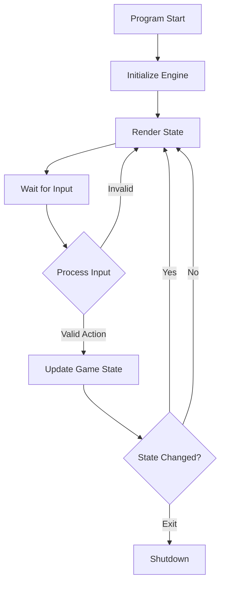

# Phase 2: The Game Loop — Detailed Specification

> *"Time is a wheel, but the runes determine where it strikes the ground."*

## 1. Overview
Phase 2 transforms the static "Foundational" skeleton into a living, breathing application. The objective is to implement the **State Machine** that governs the game's flow and the **Input Abstraction** layer that decouples logical commands from physical key presses.

**Success Definition**: A user can launch the terminal app, see a Main Menu, navigate to a "Gameplay" state, and exit the application—all controlled by a robust architectural loop, not hardcoded `Console.ReadLine()` calls.

## 2. Architectural Design

### 2.1 The Core Loop Pattern
We will use a **Variable Time Step** loop (though simplified for TUI) to standardize behavior:
1.  **Render**: Display the current state to the user.
2.  **Input**: Wait for and capture user intent.
3.  **Update**: Process the intent and advance game time.



### 2.2 Input Abstraction (Crucial Decision)
To support both TUI (Spectre.Console) and GUI (Avalonia), we cannot depend on `System.Console` events in the Engine.

**Decision**: We will implement an **Command Pattern** for input.
*   **Role**: `IInputProvider` (in UI layer) converts platform-specific raw input (Key presses) into platform-agnostic `GameCommand` objects (in Core).
*   **Benefit**: The Engine never knows if a "Move North" command came from typing "N", clicking a button, or a voice command.

## 3. Detailed Specifications

### 3.1 Core Additions (`RuneAndRust.Core`)

#### 3.1.1 The Game State
`Entities/GameState.cs` must act as the single source of truth.
```csharp
public class GameState
{
    public GamePhase CurrentPhase { get; private set; } = GamePhase.MainMenu;
    // Future: PlayerCharacter, Dungeon, etc.

    public void SetPhase(GamePhase newPhase)
    {
        // Validation logic here (can't go from MainMenu to Combat directly)
        CurrentPhase = newPhase;
    }
}
```

#### 3.1.2 Game Phases
`Enums/GamePhase.cs`:
*   `MainMenu`: Initial state. Options: New Game, Load, Quit.
*   `Exploration`: The standard gameplay loop.
*   `Combat`: Turn-based battle mode.
*   `Encyclopedia`: Static information view.

#### 3.1.3 The Command System
`Models/GameInput.cs`:
```csharp
public record GameInput(InputType Type, string? RawValue = null);

public enum InputType
{
    None,
    Navigation, // Up, Down, Left, Right
    Confirm,    // Enter
    Cancel,     // Esc
    Command     // Typed text
}
```

### 3.2 Engine Additions (`RuneAndRust.Engine`)

#### 3.2.1 The Phase Manager
The Engine needs a switchboard to route commands based on the active phase.
*   **Workflow**:
    1.  Engine receives `GameInput`.
    2.  Engine checks `GameState.CurrentPhase`.
    3.  Engine delegates to `IMainMenuController` or `IExplorationController`.
    4.  Controller returns a `Result` (State updated, Invalid input, etc.).

### 3.3 UI Additions (`RuneAndRust.UI.Terminal`)

#### 3.3.1 Spectre.Console Input Provider
Implementation of `IInputProvider`.
*   Uses `AnsiConsole.Console.Input.ReadKey()` for real-time responsiveness.
*   Maps `ConsoleKey.UpArrow` -> `InputType.Navigation`.

#### 3.3.2 The Renderer
A dedicated service `GameRenderer` that switches "Screens" based on the Phase.
*   `RenderMainMenu()`: Shows ASCII art logo and menu options.
*   `RenderExploration()`: (Placeholder) Shows "You are in a void."

## 4. Implementation Workflow

### Step 1: Core Definitions
- [ ] Define `GamePhase` enum.
- [ ] Define `GameInput` record.
- [ ] Update `IGameEngine` to accept `GameInput`.

### Step 2: Engine Logic
- [ ] Implement `RunLoop()` method in `GameEngine` (or `Tick()`).
- [ ] Create basic state transition logic (Menu -> Exploration).

### Step 3: Input Service
- [ ] Create `TerminalInputProvider` class.
- [ ] Map basic keys (Arrows, Enter, Esc) to `GameInput`.

### Step 4: The TUI Loop
- [ ] Update `Program.cs` to run a `while` loop.
- [ ] Connect `InputProvider` -> `Engine.Update` -> `Renderer`.

## 5. Technical Decision Tree / Recommendations

### Q: Should the loop be blocking or async?
**Recommendation**: **Async**.
*   **Why**: File I/O (saving) and future complex calculations (proc-gen) should not freeze the UI. `Spectre.Console` supports async rendering.
*   **Implementation**: `public async Task RunAsync(CancellationToken token)`

### Q: How do we handle "dirty" rendering (efficient redraws)?
**Recommendation**: **Full Clear Redraw** (Phase 2), **Live Display** (Phase 3).
*   For now, `AnsiConsole.Clear()` followed by a full redraw is acceptable simplicity.
*   **Optimization**: Later we can use `AnsiConsole.Status()` or Layouts to only update changed regions.

### Q: Dependencies?
**Recommendation**: Avoid heavyweight libraries.
*   **MediatR**: **NO** for now. Direct method calls are easier to debug for this scale.
*   **Events**: Use C# Events `OnStateChanged` for UI updates if push-based logic is needed, but the Loop pattern favors Pull/Update.

### Q: Logging?
**Recommendation**: **Serilog** with Console sink.
*   **Why**: Structured logging is invaluable for debugging state transitions.
*   **Packages**:
    ```bash
    dotnet add src/RuneAndRust.Engine/ package Serilog
    dotnet add src/RuneAndRust.Engine/ package Serilog.Extensions.Logging
    dotnet add src/RuneAndRust.UI.Terminal/ package Serilog.Sinks.Console
    ```
*   **Usage**: Inject `ILogger<GameEngine>` via DI, log phase transitions.

## 6. Deliverable Checklist

- [ ] **Core**: `GamePhase` Enum exists.
- [ ] **Core**: `IGameEngine` has `Update(GameInput input)` method.
- [ ] **Engine**: State Machine allows transitioning `MainMenu` -> `Exploration`.
- [ ] **Logging**: Serilog configured with Console sink.
- [ ] **Logging**: Phase transitions logged at `Information` level.
- [ ] **UI**: Application launches to a Graphical Menu (using Spectre).
- [ ] **UI**: User can select "New Game" and see the state change.
- [ ] **UI**: User can select "Quit" and the application terminates gracefully.

