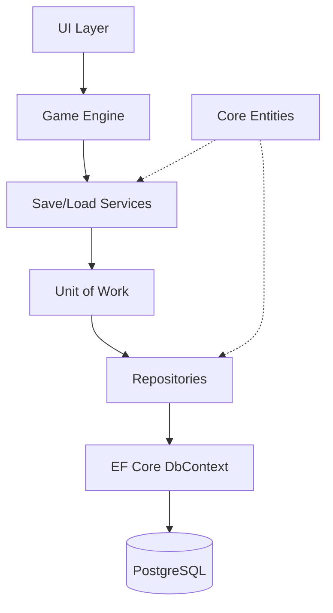
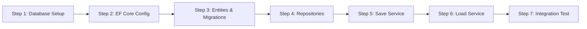

# Phase 3: Persistence — Detailed Specification

> *"What is not written in stone is lost to the void."*

## 1. Overview

Phase 3 introduces **persistent state** to the game. Until now, all state exists only in memory and vanishes when the application closes. This phase implements Entity Framework Core, PostgreSQL integration, and the Save/Load system.

**Success Definition**: A player can start a new game, move between rooms, save their progress, close the application, relaunch, load the save, and continue from exactly where they left off.

## 2. Architectural Design

### 2.1 The Persistence Layer Philosophy

We follow the **Repository Pattern** with **Unit of Work** to maintain clean separation:



**Key Principle**: The Engine never directly touches the database. All persistence flows through Service interfaces defined in `Core`.

### 2.2 Database vs. SQLite Decision Tree

**Question**: Should we use PostgreSQL or SQLite for development?

| Criteria | PostgreSQL | SQLite |
|----------|-----------|--------|
| **Production Target** | ✅ Yes | ❌ No |
| **Dev Setup Complexity** | ⚠️ Requires Docker/Install | ✅ Zero setup |
| **Feature Parity** | ✅ Full JSONB, schemas | ⚠️ Limited JSON support |
| **Testing Speed** | ⚠️ Slower (network) | ✅ In-memory mode |

**Recommendation**: 
- **Primary**: PostgreSQL (matches production)
- **Optional**: SQLite for unit tests (fast, disposable)
- **Implementation**: Use EF Core's provider abstraction to support both

## 3. Technical Decision Trees

### 3.1 Migration Strategy

**Question**: Code-First or Database-First?

**Decision**: **Code-First** with EF Core Migrations.

**Rationale**:
- Game design is evolving; schema will change frequently
- Migrations provide version control for database schema
- Easy rollback and forward migration during development

### 3.2 Connection Management

**Question**: One DbContext per request or long-lived singleton?

**Decision**: **Scoped DbContext** (one per "game operation").

**Rationale**:
- Prevents stale data from cached entities
- Avoids concurrency issues with tracked entities
- Aligns with ASP.NET Core patterns (future-proofing for web admin panel)

### 3.3 Save Slot Architecture

**Question**: How many save slots? Overwrite behavior?

**Decision**: 
- **10 Manual Slots** (1-10)
- **1 Quicksave Slot** (dedicated, always overwrites)
- **3 Autosave Slots** (rotating, oldest replaced)

**Rationale**:
- Manual slots: Player control, prevents accidental loss
- Quicksave: Convenience (F5 muscle memory)
- Autosaves: Safety net without cluttering save list

## 4. Implementation Workflow

### 4.1 Phase 3 Breakdown



### Step 1: Database Setup

**Objective**: Install and configure PostgreSQL.

**Options**:
1. **Docker** (Recommended for consistency):
   ```bash
   docker run --name runeandrust-db \
     -e POSTGRES_PASSWORD=dev_password \
     -e POSTGRES_DB=runeandrust_dev \
     -p 5432:5432 \
     -d postgres:16
   ```

2. **Local Install**: 
   - macOS: `brew install postgresql@16`
   - Verify: `psql --version`

**Deliverable**: Running PostgreSQL instance accessible at `localhost:5432`.

### Step 2: EF Core Configuration

**Objective**: Add EF Core packages and configure `DbContext`.

**Packages** (add to `RuneAndRust.Data`):
```bash
dotnet add package Microsoft.EntityFrameworkCore
dotnet add package Microsoft.EntityFrameworkCore.Design
dotnet add package Npgsql.EntityFrameworkCore.PostgreSQL
```

**Create `RuneAndRustDbContext.cs`**:
```csharp
using Microsoft.EntityFrameworkCore;
using RuneAndRust.Core.Entities;

namespace RuneAndRust.Data.Contexts;

public class RuneAndRustDbContext : DbContext
{
    public RuneAndRustDbContext(DbContextOptions<RuneAndRustDbContext> options)
        : base(options)
    {
    }

    // DbSets
    public DbSet<SaveGame> SaveGames => Set<SaveGame>();
    public DbSet<Character> Characters => Set<Character>();
    public DbSet<Room> Rooms => Set<Room>();
    public DbSet<VisitedRoom> VisitedRooms => Set<VisitedRoom>();

    protected override void OnModelCreating(ModelBuilder modelBuilder)
    {
        base.OnModelCreating(modelBuilder);
        
        // Apply configurations from separate files
        modelBuilder.ApplyConfigurationsFromAssembly(typeof(RuneAndRustDbContext).Assembly);
    }
}
```

**Connection String** (in `appsettings.json` for `UI.Terminal`):
```json
{
  "ConnectionStrings": {
    "DefaultConnection": "Host=localhost;Database=runeandrust_dev;Username=postgres;Password=dev_password"
  }
}
```

### Step 3: Entities & Migrations

**Objective**: Define core entities and generate initial migration.

**Core Entities** (in `RuneAndRust.Core/Entities`):

**SaveGame.cs**:
```csharp
public class SaveGame
{
    public Guid Id { get; set; }
    public int SlotNumber { get; set; }
    public string SaveName { get; set; } = string.Empty;
    public Guid CharacterId { get; set; }
    public Guid CurrentRoomId { get; set; }
    public long PlaytimeSeconds { get; set; }
    public DateTime CreatedAt { get; set; }
    public DateTime UpdatedAt { get; set; }
    public bool IsAutosave { get; set; }
    
    // Navigation properties
    public Character Character { get; set; } = null!;
    public Room CurrentRoom { get; set; } = null!;
}
```

**Entity Configuration** (in `RuneAndRust.Data/Configurations`):
```csharp
using Microsoft.EntityFrameworkCore;
using Microsoft.EntityFrameworkCore.Metadata.Builders;
using RuneAndRust.Core.Entities;

namespace RuneAndRust.Data.Configurations;

public class SaveGameConfiguration : IEntityTypeConfiguration<SaveGame>
{
    public void Configure(EntityTypeBuilder<SaveGame> builder)
    {
        builder.ToTable("save_games", "core");
        
        builder.HasKey(s => s.Id);
        
        builder.Property(s => s.SaveName)
            .IsRequired()
            .HasMaxLength(100);
            
        builder.Property(s => s.SlotNumber)
            .IsRequired();
            
        builder.HasIndex(s => s.SlotNumber);
        
        builder.HasOne(s => s.Character)
            .WithMany()
            .HasForeignKey(s => s.CharacterId)
            .OnDelete(DeleteBehavior.Restrict);
    }
}
```

**Generate Migration**:
```bash
# From repository root
dotnet ef migrations add InitialCreate --project src/RuneAndRust.Data --startup-project src/RuneAndRust.UI.Terminal

# Apply migration
dotnet ef database update --project src/RuneAndRust.Data --startup-project src/RuneAndRust.UI.Terminal
```

### Step 4: Repositories

**Objective**: Implement Repository pattern for data access.

**Generic Repository** (in `RuneAndRust.Data/Repositories`):
```csharp
using Microsoft.EntityFrameworkCore;
using RuneAndRust.Core.Interfaces;

namespace RuneAndRust.Data.Repositories;

public class GenericRepository<T> : IRepository<T> where T : class
{
    protected readonly RuneAndRustDbContext _context;
    protected readonly DbSet<T> _dbSet;

    public GenericRepository(RuneAndRustDbContext context)
    {
        _context = context;
        _dbSet = context.Set<T>();
    }

    public async Task<T?> GetByIdAsync(Guid id)
    {
        return await _dbSet.FindAsync(id);
    }

    public async Task<IReadOnlyList<T>> GetAllAsync()
    {
        return await _dbSet.ToListAsync();
    }

    public async Task<T> AddAsync(T entity)
    {
        await _dbSet.AddAsync(entity);
        return entity;
    }

    public Task UpdateAsync(T entity)
    {
        _dbSet.Update(entity);
        return Task.CompletedTask;
    }

    public Task DeleteAsync(T entity)
    {
        _dbSet.Remove(entity);
        return Task.CompletedTask;
    }
}
```

**SaveGameRepository** (specialized):
```csharp
public class SaveGameRepository : GenericRepository<SaveGame>, ISaveGameRepository
{
    public SaveGameRepository(RuneAndRustDbContext context) : base(context)
    {
    }

    public async Task<SaveGame?> GetBySlotAsync(int slot)
    {
        return await _dbSet
            .Include(s => s.Character)
            .Include(s => s.CurrentRoom)
            .FirstOrDefaultAsync(s => s.SlotNumber == slot);
    }

    public async Task<IReadOnlyList<SaveGame>> GetAllActiveSavesAsync()
    {
        return await _dbSet
            .Where(s => !s.IsAutosave)
            .OrderBy(s => s.SlotNumber)
            .ToListAsync();
    }
}
```

### Step 5: Unit of Work

**Objective**: Coordinate multiple repositories in a single transaction.

**IUnitOfWork Interface** (in `RuneAndRust.Core/Interfaces`):
```csharp
public interface IUnitOfWork : IDisposable
{
    ISaveGameRepository SaveGames { get; }
    IVisitedRoomRepository VisitedRooms { get; }
    
    Task<int> SaveChangesAsync();
    Task BeginTransactionAsync();
    Task CommitAsync();
    Task RollbackAsync();
}
```

**Implementation** (in `RuneAndRust.Data`):
```csharp
public class UnitOfWork : IUnitOfWork
{
    private readonly RuneAndRustDbContext _context;
    private IDbContextTransaction? _transaction;

    public UnitOfWork(RuneAndRustDbContext context)
    {
        _context = context;
        SaveGames = new SaveGameRepository(context);
        VisitedRooms = new VisitedRoomRepository(context);
    }

    public ISaveGameRepository SaveGames { get; }
    public IVisitedRoomRepository VisitedRooms { get; }

    public async Task<int> SaveChangesAsync()
    {
        return await _context.SaveChangesAsync();
    }

    public async Task BeginTransactionAsync()
    {
        _transaction = await _context.Database.BeginTransactionAsync();
    }

    public async Task CommitAsync()
    {
        if (_transaction != null)
        {
            await _transaction.CommitAsync();
            await _transaction.DisposeAsync();
            _transaction = null;
        }
    }

    public async Task RollbackAsync()
    {
        if (_transaction != null)
        {
            await _transaction.RollbackAsync();
            await _transaction.DisposeAsync();
            _transaction = null;
        }
    }

    public void Dispose()
    {
        _transaction?.Dispose();
        _context.Dispose();
    }
}
```

### Step 6: Save Service

**Objective**: High-level service for saving game state.

**ISaveService Interface** (in `RuneAndRust.Core/Interfaces`):
```csharp
public interface ISaveService
{
    Task<SaveResult> SaveGameAsync(GameState state, int slot, string saveName);
    Task<SaveResult> QuickSaveAsync(GameState state);
}

public record SaveResult(bool Success, Guid? SaveId, string? ErrorMessage);
```

**Implementation** (in `RuneAndRust.Engine/Services`):
```csharp
public class SaveService : ISaveService
{
    private readonly IUnitOfWork _unitOfWork;

    public SaveService(IUnitOfWork unitOfWork)
    {
        _unitOfWork = unitOfWork;
    }

    public async Task<SaveResult> SaveGameAsync(GameState state, int slot, string saveName)
    {
        try
        {
            await _unitOfWork.BeginTransactionAsync();

            var saveGame = new SaveGame
            {
                Id = Guid.NewGuid(),
                SlotNumber = slot,
                SaveName = saveName,
                CharacterId = state.Party.ActiveCharacterId,
                CurrentRoomId = state.World.CurrentRoomId,
                PlaytimeSeconds = (long)state.Time.TotalPlaytime.TotalSeconds,
                CreatedAt = DateTime.UtcNow,
                UpdatedAt = DateTime.UtcNow,
                IsAutosave = false
            };

            await _unitOfWork.SaveGames.AddAsync(saveGame);
            await _unitOfWork.SaveChangesAsync();
            await _unitOfWork.CommitAsync();

            return new SaveResult(true, saveGame.Id, null);
        }
        catch (Exception ex)
        {
            await _unitOfWork.RollbackAsync();
            return new SaveResult(false, null, ex.Message);
        }
    }

    public async Task<SaveResult> QuickSaveAsync(GameState state)
    {
        return await SaveGameAsync(state, 0, "Quicksave");
    }
}
```

### Step 7: Load Service

**Objective**: Reconstruct GameState from database.

**ILoadService Interface**:
```csharp
public interface ILoadService
{
    Task<LoadResult> LoadGameAsync(Guid saveId);
    Task<IReadOnlyList<SaveSummary>> GetSaveSummariesAsync();
}

public record LoadResult(bool Success, GameState? State, string? ErrorMessage);
public record SaveSummary(Guid Id, int Slot, string Name, DateTime SavedAt);
```

**Implementation**:
```csharp
public class LoadService : ILoadService
{
    private readonly IUnitOfWork _unitOfWork;

    public LoadService(IUnitOfWork unitOfWork)
    {
        _unitOfWork = unitOfWork;
    }

    public async Task<LoadResult> LoadGameAsync(Guid saveId)
    {
        try
        {
            var saveGame = await _unitOfWork.SaveGames.GetByIdAsync(saveId);
            if (saveGame == null)
                return new LoadResult(false, null, "Save not found");

            // Reconstruct GameState
            var gameState = new GameState
            {
                SessionId = Guid.NewGuid(),
                // ... populate from saveGame
            };

            return new LoadResult(true, gameState, null);
        }
        catch (Exception ex)
        {
            return new LoadResult(false, null, ex.Message);
        }
    }

    public async Task<IReadOnlyList<SaveSummary>> GetSaveSummariesAsync()
    {
        var saves = await _unitOfWork.SaveGames.GetAllActiveSavesAsync();
        return saves.Select(s => new SaveSummary(
            s.Id,
            s.SlotNumber,
            s.SaveName,
            s.UpdatedAt
        )).ToList();
    }
}
```

## 5. Dependency Injection Setup

**In `Program.cs`** (UI.Terminal):
```csharp
var builder = Host.CreateDefaultBuilder(args)
    .ConfigureServices((context, services) =>
    {
        // Database
        services.AddDbContext<RuneAndRustDbContext>(options =>
            options.UseNpgsql(
                context.Configuration.GetConnectionString("DefaultConnection")));

        // Repositories
        services.AddScoped<IUnitOfWork, UnitOfWork>();

        // Services
        services.AddScoped<ISaveService, SaveService>();
        services.AddScoped<ILoadService, LoadService>();
        services.AddSingleton<IGameEngine, GameEngine>();
    });

var host = builder.Build();
```

## 6. Deliverable Checklist

### 6.1 Infrastructure
- [ ] PostgreSQL running (Docker or local)
- [ ] Connection string configured in `appsettings.json`
- [ ] EF Core packages installed in `Data` project

### 6.2 Code Artifacts
- [ ] `RuneAndRustDbContext` created
- [ ] `SaveGame` entity defined
- [ ] `SaveGameConfiguration` created
- [ ] Initial migration generated and applied
- [ ] Database schema exists (verify with `psql` or pgAdmin)

### 6.3 Repositories
- [ ] `GenericRepository<T>` implemented
- [ ] `SaveGameRepository` implemented
- [ ] `UnitOfWork` implemented
- [ ] All interfaces defined in `Core`

### 6.4 Services
- [ ] `SaveService` implemented
- [ ] `LoadService` implemented
- [ ] Services registered in DI container

### 6.5 Verification
- [ ] **Build**: `dotnet build` succeeds
- [ ] **Migration**: Database tables exist
- [ ] **Integration Test**: Save → Close → Load → Verify

## 7. Integration Test Specification

**Test Name**: `SaveLoadRoundTrip`

**Objective**: Verify complete save/load cycle.

**Steps**:
1. Create a new `GameState` with known values
2. Call `SaveService.SaveGameAsync(state, 1, "Test Save")`
3. Verify `SaveResult.Success == true`
4. Query database directly to confirm `save_games` row exists
5. Call `LoadService.LoadGameAsync(saveId)`
6. Verify `LoadResult.Success == true`
7. Assert loaded state matches original state

**Implementation Location**: `tests/RuneAndRust.Integration.Tests/PersistenceTests.cs`

**Run Command**:
```bash
dotnet test tests/RuneAndRust.Integration.Tests/ --filter "FullyQualifiedName~SaveLoadRoundTrip"
```

## 8. Troubleshooting Guide

### Issue: "Npgsql.NpgsqlException: Connection refused"
**Cause**: PostgreSQL not running or wrong port.
**Fix**: 
```bash
# Check if running
docker ps | grep runeandrust-db

# Restart if needed
docker start runeandrust-db
```

### Issue: "No migrations found"
**Cause**: Migration not generated or wrong project.
**Fix**:
```bash
# Ensure you're in repo root
dotnet ef migrations add InitialCreate \
  --project src/RuneAndRust.Data \
  --startup-project src/RuneAndRust.UI.Terminal
```

### Issue: "Foreign key constraint violation"
**Cause**: Trying to save `SaveGame` without valid `Character`.
**Fix**: Ensure `Character` entity exists before creating `SaveGame`, or use `OnDelete(DeleteBehavior.Restrict)` temporarily.

## 9. Performance Considerations

### 9.1 Connection Pooling
Npgsql automatically pools connections. Verify in connection string:
```
Pooling=true;MinPoolSize=5;MaxPoolSize=100
```

### 9.2 Query Optimization
- Use `.AsNoTracking()` for read-only queries (save summaries)
- Eager load navigation properties with `.Include()` to avoid N+1 queries

### 9.3 Save Performance Target
- **Manual Save**: < 500ms for typical game state
- **Load Game**: < 2s for save with 1000+ visited rooms

## 10. Future Enhancements (Post-Phase 3)

- [ ] **Autosave Service**: Background timer for periodic saves
- [ ] **Save Compression**: JSONB compression for large state data
- [ ] **Cloud Sync**: Optional save upload to remote storage
- [ ] **Save Versioning**: Migration system for old save formats
