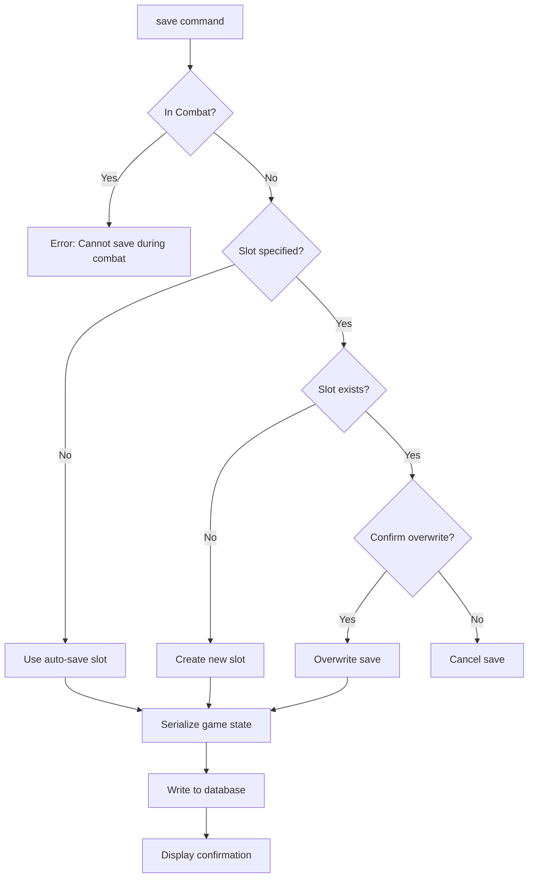
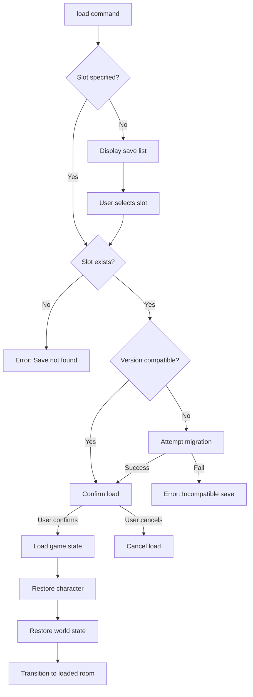
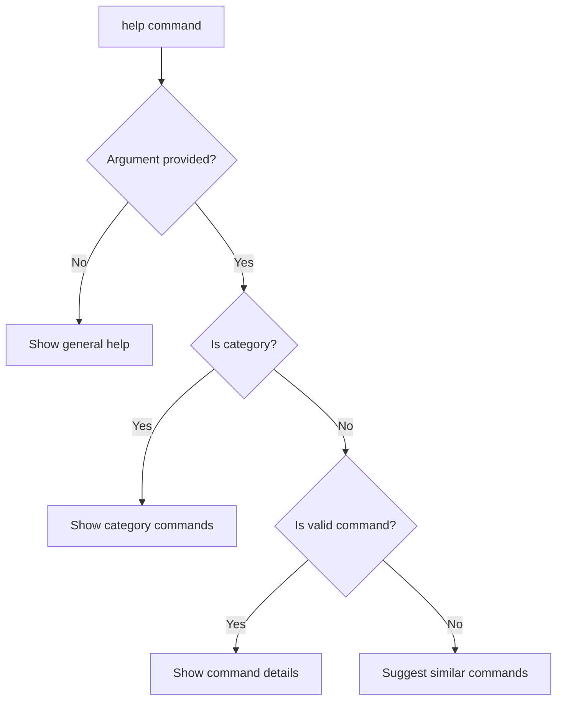
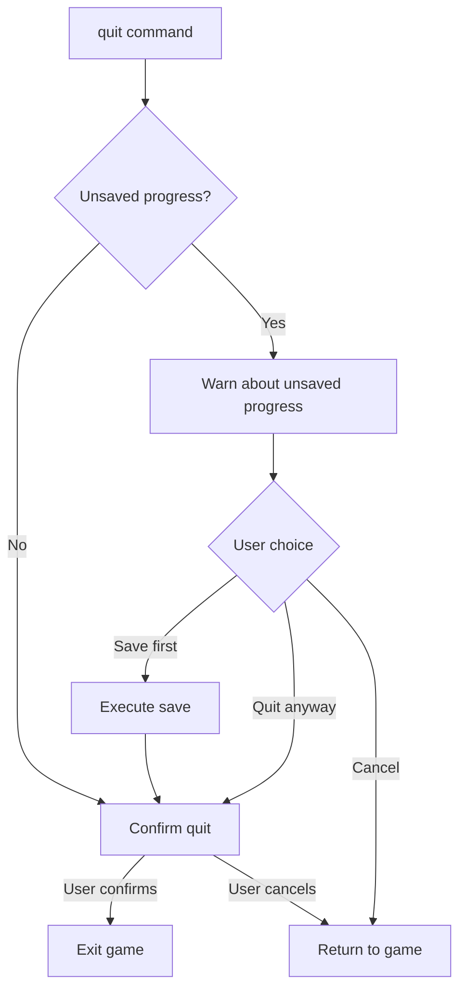
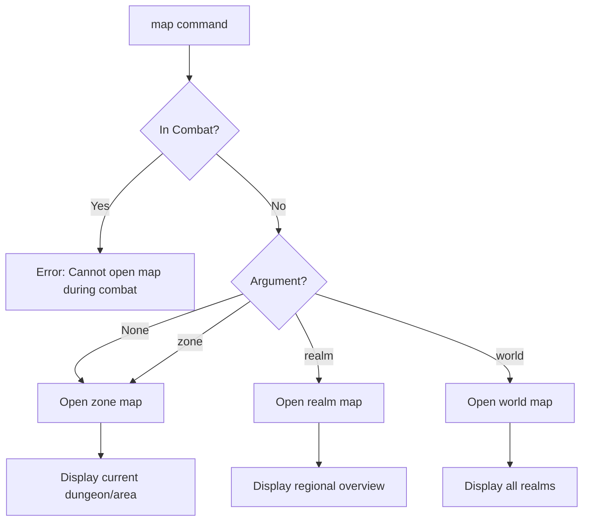

# System Commands

> *"Every scavenger needs to know when to record their progress and when to study the lay of the land."*

---

## Overview

System commands provide meta-game functionality: saving/loading progress, viewing character information, managing quests, accessing the map, adjusting settings, and getting help.

| Command | Aliases | Syntax | Context |
|---------|---------|--------|---------|
| `save` | — | `save [slot]` | Non-combat |
| `load` | — | `load [slot]` | Any |
| `help` | `h`, `?` | `help [command]` | Any |
| `quit` | `q`, `exit` | `quit` | Any |
| `character` | `char`, `stats` | `character` | Any |
| `journal` | `j`, `quests` | `journal [quest]` | Any |
| `codex` | `lore` | `codex [entry]` | Any |
| `map` | `m` | `map [zone]` | Non-combat |
| `settings` | `options` | `settings [category]` | Any |

---

## 1. Save

### 1.1 Syntax

```
save
save <slot_number>
save <name>
save quick
```

### 1.2 Aliases

| Input | Resolves To |
|-------|-------------|
| `save` | `save` (auto-slot) |
| `save 1` | `save 1` |
| `save before_boss` | `save before_boss` |
| `save quick` | Quick save to dedicated slot |

### 1.3 Behavior



### 1.4 Save Slot Display

**Auto-save (no argument):**
```
> save

  Game saved to Auto-Save Slot.
  [2025-12-14 18:30 — Abandoned Workshop, Level -1]
  Character: Ranulf (Warrior / Atgeir-Wielder)
  Legend: 5 | HP: 45/60 | Play Time: 2h 34m
```

**Named save:**
```
> save before_boss

  Game saved to "before_boss".
  [2025-12-14 18:35 — Control Chamber, Level -2]
```

**Numbered slot:**
```
> save 1

  Slot 1 contains existing save:
  [2025-12-14 17:00 — Entry Hall]

  Overwrite? (y/n): > y

  Game saved to Slot 1.
```

### 1.5 Save Data Contents

| Category | Data Saved |
|----------|------------|
| **Character** | Name, archetype, specialization, attributes, HP, Stamina, AP |
| **Progression** | Legend, PP, milestone, abilities unlocked |
| **Resources** | Scrip, inventory, equipped items, consumables |
| **World State** | Current room, explored rooms, cleared encounters |
| **Quests** | Active quests, completed quests, objectives |
| **Factions** | Reputation standings with all factions |
| **Trauma** | Psychic Stress, Corruption, acquired traumas |
| **Meta** | Save timestamp, play time, game version |

### 1.6 Validation

- Cannot save during combat
- Cannot save during cutscenes
- Cannot save with empty character name
- Auto-save triggers on room transition (configurable)
- Quick save (`save quick`) always overwrites quick slot

### 1.7 Events Raised

| Event | When | Properties |
|-------|------|------------|
| `GameSavedEvent` | After successful save | `SlotId`, `SaveName`, `Timestamp` |
| `SaveFailedEvent` | On save error | `Reason`, `SlotId` |

---

## 2. Load

### 2.1 Syntax

```
load
load <slot_number>
load <name>
load quick
```

### 2.2 Aliases

| Input | Resolves To |
|-------|-------------|
| `load` | List available saves |
| `load 1` | `load 1` |
| `load before_boss` | `load before_boss` |
| `load quick` | Load quick save slot |

### 2.3 Behavior



### 2.4 Save List Display

```
> load

  SAVED GAMES
  ═══════════════════════════════════════════════════════════════

  [Q] Quick Save
      2025-12-14 18:30 — Abandoned Workshop
      Ranulf (Warrior / Atgeir-Wielder) | Legend 5 | 2h 34m

  [1] Auto-Save
      2025-12-14 18:25 — Narrow Corridor
      Ranulf (Warrior / Atgeir-Wielder) | Legend 5 | 2h 29m

  [2] before_boss
      2025-12-14 18:00 — Control Chamber
      Ranulf (Warrior / Atgeir-Wielder) | Legend 4 | 2h 05m

  [3] Slot 3
      2025-12-13 20:15 — Rusthaven Settlement
      Sigrid (Adept / Skald) | Legend 2 | 45m

  ───────────────────────────────────────────────────────────────
  [Q/1-9] Load save  [D] Delete  [C] Cancel

  Load which save? > _
```

### 2.5 Load Confirmation

```
> load 2

  Load save "before_boss"?

  WARNING: Current progress will be lost!

  Save Info:
  • Location: Control Chamber (Iron Crypts, Level -2)
  • Character: Ranulf, Legend 4
  • Last Played: 2025-12-14 18:00

  [Y] Load  [N] Cancel

  > y

  Loading save...

  ═══════════════════════════════════════════════════════════════

  CONTROL CHAMBER
  The heart of the complex hums with dormant energy...
```

### 2.6 Version Migration

When loading an older save:

```
> load 3

  Save "Slot 3" is from an older game version (v0.20).

  Migration required:
  • Adding new stance system fields
  • Updating equipment format
  • Setting default faction values

  [M] Migrate and load  [C] Cancel

  > m

  Migrating save... Done.
  Loading...
```

### 2.7 Validation

- Can load from any context (even during combat)
- Loading during combat ends current combat (no rewards)
- Unsaved progress is lost (with confirmation)
- Corrupted saves display recovery options

### 2.8 Events Raised

| Event | When | Properties |
|-------|------|------------|
| `GameLoadedEvent` | After successful load | `SlotId`, `SaveName`, `CharacterName` |
| `LoadFailedEvent` | On load error | `Reason`, `SlotId` |
| `SaveMigratedEvent` | After migration | `FromVersion`, `ToVersion` |

---

## 3. Help

### 3.1 Syntax

```
help
help <command>
help <category>
?
h
```

### 3.2 Aliases

| Input | Resolves To |
|-------|-------------|
| `?` | `help` |
| `h` | `help` |
| `help attack` | `help attack` |
| `help combat` | `help combat` (category) |

### 3.3 Behavior



### 3.4 General Help (No Argument)

```
> help

  ╔═══════════════════════════════════════════════════════════════╗
  ║  RUNE & RUST — COMMAND REFERENCE                              ║
  ╚═══════════════════════════════════════════════════════════════╝

  NAVIGATION                    COMBAT
  ─────────────────────         ─────────────────────
  go, look, search              attack, defend, use
  investigate, examine          flee, stance, move

  INTERACTION                   INVENTORY
  ─────────────────────         ─────────────────────
  open, close, unlock           inventory, equip, take
  pull, push, turn, press       drop, use, examine

  DIALOGUE                      CRAFTING
  ─────────────────────         ─────────────────────
  talk, say, leave              craft, repair, salvage
  ask, barter                   brew, forge

  SYSTEM
  ─────────────────────
  save, load, character, journal, map, settings, help, quit

  ───────────────────────────────────────────────────────────────
  Type 'help <command>' for details.
  Type 'help <category>' for all commands in a category.

  Example: help attack | help combat | help navigation
```

### 3.5 Category Help

```
> help combat

  COMBAT COMMANDS
  ═══════════════════════════════════════════════════════════════

  attack <target>        — Attack an enemy
  defend                 — Raise defense until next turn
  use <ability>          — Use a combat ability
  flee                   — Attempt to escape combat
  stance <type>          — Change combat stance
  move <direction>       — Move on the combat grid
  end                    — End your turn
  target <enemy>         — Set focus target
  status [target]        — View combatant status
  abilities              — List available abilities

  ───────────────────────────────────────────────────────────────
  Type 'help <command>' for detailed usage.
```

### 3.6 Command-Specific Help

```
> help attack

  ╔═══════════════════════════════════════════════════════════════╗
  ║  ATTACK                                                       ║
  ╚═══════════════════════════════════════════════════════════════╝

  SYNTAX
    attack <target>
    attack <target> with <weapon>

  ALIASES
    a, hit, strike

  DESCRIPTION
    Perform a basic attack against an enemy target. Uses your
    equipped weapon's damage and your relevant attribute:
    • Heavy weapons: MIGHT
    • Light/Ranged: FINESSE
    • Aetheric: WILL

  COST
    Stamina cost varies by weapon (typically 10-25)

  EXAMPLES
    > attack goblin
    > attack rust horror with longsword
    > a 1
    > hit wounded enemy

  CONTEXT
    Available only during Combat.

  SEE ALSO
    defend, use, stance, target
```

### 3.7 Contextual Help

Help adapts to current game context:

```
[Combat] > help

  COMBAT COMMANDS (Current Context)
  ═══════════════════════════════════════════════════════════════

  AVAILABLE NOW:
  • attack <target>  — Attack an enemy
  • defend           — Raise defense
  • use <ability>    — Use combat ability
  • stance <type>    — Change stance
  • move <dir>       — Move on grid
  • flee             — Attempt escape
  • end              — End your turn

  NOT AVAILABLE IN COMBAT:
  • save, inventory management, travel

  Type 'help <command>' for details.
```

### 3.8 Command Suggestions

```
> help attck

  Unknown command: 'attck'

  Did you mean?
  • attack — Perform a basic attack
  • activate — Activate a mechanism

  Type 'help' for all commands.
```

### 3.9 Help Categories

| Category | Commands Included |
|----------|-------------------|
| `navigation` | go, look, search, investigate, examine |
| `combat` | attack, defend, use, flee, stance, move, end, target, status, abilities |
| `interaction` | open, close, unlock, lock, pull, push, turn, press, activate, break, climb |
| `inventory` | inventory, equip, unequip, take, drop, use, examine |
| `dialogue` | talk, say, leave, ask, barter |
| `crafting` | craft, repair, salvage, brew, forge |
| `rest` | rest, camp, saga |
| `system` | save, load, character, journal, codex, map, settings, help, quit |

### 3.10 Events Raised

| Event | When | Properties |
|-------|------|------------|
| `HelpViewedEvent` | User views help | `Topic`, `Category` |

---

## 4. Quit

### 4.1 Syntax

```
quit
q
exit
```

### 4.2 Behavior



### 4.3 Quit Confirmation

**No unsaved changes:**
```
> quit

  Quit Rune & Rust?

  [Y] Quit  [N] Cancel

  > y

  Farewell, scavenger. May the Rust spare you.
```

**Unsaved changes:**
```
> quit

  ══════════════════════════════════════════════════════
  WARNING: You have unsaved progress!
  ══════════════════════════════════════════════════════

  Last save: 25 minutes ago (Entry Hall)
  Current location: Control Chamber

  [S] Save and quit
  [Q] Quit without saving
  [C] Cancel

  > s

  Game saved to Auto-Save Slot.
  Farewell, scavenger.
```

### 4.4 Events Raised

| Event | When | Properties |
|-------|------|------------|
| `GameExitingEvent` | Before exit | `SavedBeforeExit` |

---

## 5. Character

### 5.1 Syntax

```
character
char
stats
character <section>
```

### 5.2 Aliases

| Input | Resolves To |
|-------|-------------|
| `char` | `character` |
| `stats` | `character` |
| `character abilities` | Show abilities section |
| `character equipment` | Show equipment section |

### 5.3 Full Character Sheet

```
> character

  ╔════════════════════════════════════════════════════════════════╗
  ║  RANULF THE IRONBOUND                              Legend: 5   ║
  ║  Human Warrior — Atgeir-Wielder                                ║
  ╠════════════════════════════════════════════════════════════════╣
  ║                                                                ║
  ║  ATTRIBUTES                                                    ║
  ║  ──────────────────────────────────────────────────────────    ║
  ║    MIGHT: 7       FINESSE: 4      STURDINESS: 6                ║
  ║    WITS: 3        WILL: 5                                      ║
  ║                                                                ║
  ║  RESOURCES                                                     ║
  ║  ──────────────────────────────────────────────────────────    ║
  ║    HP:        45/110   ████████████░░░░░░░░ (41%)              ║
  ║    Stamina:   80/80    ████████████████████ (100%)             ║
  ║    AP:        0/60     ░░░░░░░░░░░░░░░░░░░░ (0%)               ║
  ║                                                                ║
  ║  COMBAT STATS                                                  ║
  ║  ──────────────────────────────────────────────────────────    ║
  ║    Defense: 14 (FINESSE 4 + Armor 10)                          ║
  ║    Vigilance: 7 (FINESSE 4 + WITS 3)                           ║
  ║    Carry Capacity: 55/55 kg (0 burden)                         ║
  ║                                                                ║
  ║  TRAUMA & STRESS                                               ║
  ║  ──────────────────────────────────────────────────────────    ║
  ║    Psychic Stress: 25/100  █████░░░░░░░░░░░░░░░                ║
  ║    Corruption: 5%                                              ║
  ║    Active Traumas: None                                        ║
  ║                                                                ║
  ║  PROGRESSION                                                   ║
  ║  ──────────────────────────────────────────────────────────    ║
  ║    Legend: 5 (1,250 / 2,000 to next)                           ║
  ║    PP Available: 3                                             ║
  ║    PP Spent: 12                                                ║
  ║                                                                ║
  ╠════════════════════════════════════════════════════════════════╣
  ║  [A] Abilities  [E] Equipment  [S] Skills  [F] Factions  [C]   ║
  ╚════════════════════════════════════════════════════════════════╝
```

### 5.4 Abilities Section

```
> character abilities

  ABILITIES — RANULF
  ═══════════════════════════════════════════════════════════════

  ARCHETYPE: WARRIOR
  ───────────────────────────────────────────────────────────────
  ★ Stalwart I (Passive)
    +10 Max HP, +1 STURDINESS die on Physical Resolve checks.

  SPECIALIZATION: ATGEIR-WIELDER
  ───────────────────────────────────────────────────────────────
  ★ Formal Training II (Passive)
    +2 Attack dice with polearms.

  ◆ Skewer II — 35 Stamina
    Thrust attack: 2d8+MIGHT damage, +2 dice on next attack if hit.
    Reach: Extended (2 tiles).

  ★ Disciplined Stance II (Passive)
    +1 Defense while in Defensive stance.

  ───────────────────────────────────────────────────────────────
  ★ = Passive    ◆ = Active (costs Stamina/AP)

  [C] Close
```

### 5.5 Equipment Section

```
> character equipment

  EQUIPMENT — RANULF
  ═══════════════════════════════════════════════════════════════

  WEAPON
  ───────────────────────────────────────────────────────────────
  [Uncommon] Rune-Etched Atgeir
    Damage: 2d8+7 (MIGHT)  |  Stamina: 20  |  Reach: Extended
    Properties: Polearm, Two-Handed, Piercing

  ARMOR
  ───────────────────────────────────────────────────────────────
  [Common] Salvaged Plate
    Defense: +10  |  Burden: 15 kg
    Properties: Heavy

  ACCESSORIES
  ───────────────────────────────────────────────────────────────
  [Slot 1] Empty
  [Slot 2] Empty

  PACK
  ───────────────────────────────────────────────────────────────
  Burden: 40/55 kg (0 penalty)
  Items: 12 (Mending Draught x3, Rations x5, ...)

  ───────────────────────────────────────────────────────────────
  [I] Open Inventory  [C] Close
```

### 5.6 Skills Section

```
> character skills

  SKILLS — RANULF
  ═══════════════════════════════════════════════════════════════

  Skill Name              Rank    Attribute    Total Pool
  ───────────────────────────────────────────────────────────────
  Melee Combat            2       MIGHT (7)    9 dice
  Athletics               1       MIGHT (7)    8 dice
  Intimidation            1       MIGHT (7)    8 dice
  Perception              0       WITS (3)     3 dice
  Survival                0       WITS (3)     3 dice

  ───────────────────────────────────────────────────────────────
  Skill Pool = Attribute + Skill Rank
  Success on 8+ per die

  [C] Close
```

### 5.7 Factions Section

```
> character factions

  FACTION STANDINGS — RANULF
  ═══════════════════════════════════════════════════════════════

  Faction                  Standing      Rank
  ───────────────────────────────────────────────────────────────
  Midgard Combine          +45           Respected
  Rust-Clans               +12           Neutral
  Dvergr Hegemony          -5            Neutral
  Scavenger Barons         +8            Neutral
  Iron-Banes               +50           Friendly
  Jötun-Readers            0             Unknown

  ───────────────────────────────────────────────────────────────
  Rank Thresholds:
  • Hostile: < -50    • Unfriendly: -50 to -25
  • Neutral: -25 to +25    • Friendly: +25 to +50
  • Respected: +50 to +75  • Honored: > +75

  [C] Close
```

### 5.8 Events Raised

| Event | When | Properties |
|-------|------|------------|
| `CharacterSheetOpenedEvent` | Sheet opened | `Section` |

---

## 6. Journal

### 6.1 Syntax

```
journal
j
quests
journal <quest_name>
journal active
journal completed
```

### 6.2 Aliases

| Input | Resolves To |
|-------|-------------|
| `j` | `journal` |
| `quests` | `journal` |
| `journal iron` | Search for quests containing "iron" |

### 6.3 Journal Overview

```
> journal

  ╔═══════════════════════════════════════════════════════════════╗
  ║  SCAVENGER'S JOURNAL                                          ║
  ╠═══════════════════════════════════════════════════════════════╣
  ║                                                                ║
  ║  ACTIVE CONTRACTS (3)                                          ║
  ║  ──────────────────────────────────────────────────────────    ║
  ║  ★ The Iron Path [Main] ◄ TRACKED                              ║
  ║    Objective: Find the descent to the Iron Crypts              ║
  ║    Progress: 2/4 objectives                                    ║
  ║                                                                ║
  ║  ○ Lost Tools [Side]                                           ║
  ║    Objective: Collect Dvergr Hammers (2/5)                     ║
  ║                                                                ║
  ║  ◇ Patrol Route [Dynamic]                                      ║
  ║    Objective: Eliminate Rust-Horrors (3/5)                     ║
  ║                                                                ║
  ║  ──────────────────────────────────────────────────────────    ║
  ║  COMPLETED: 4 contracts                                        ║
  ║  FAILED: 0 contracts                                           ║
  ║                                                                ║
  ╠═══════════════════════════════════════════════════════════════╣
  ║  [1-3] View quest  [T] Track  [A] Active  [C] Completed        ║
  ╚═══════════════════════════════════════════════════════════════╝
```

### 6.4 Quest Detail View

```
> journal iron

  ╔═══════════════════════════════════════════════════════════════╗
  ║  ★ THE IRON PATH                                [Main Quest]  ║
  ╠═══════════════════════════════════════════════════════════════╣
  ║                                                                ║
  ║  "The rumours speak of an ancient Dvergr forge, hidden        ║
  ║  beneath Ironhold. Kjartan believes it may hold the key to    ║
  ║  breaking the Rust Curse that plagues the eastern valleys."   ║
  ║                                                                ║
  ║  Given By: Kjartan the Smith (Ironhold)                        ║
  ║  Status: Active                                                ║
  ║  Accepted: 2 days ago                                          ║
  ║                                                                ║
  ║  OBJECTIVES                                                    ║
  ║  ──────────────────────────────────────────────────────────    ║
  ║  ☑ Speak with Kjartan about the forge legends                  ║
  ║  ☑ Travel to the Iron Crypts entrance                          ║
  ║  ☐ Find the descent to the Deep Forge                          ║
  ║  ☐ Defeat the Rust Lord                                        ║
  ║  ☐ Return to Kjartan with proof                                ║
  ║                                                                ║
  ║  REWARDS                                                       ║
  ║  ──────────────────────────────────────────────────────────    ║
  ║  • +500 Legend                                                 ║
  ║  • +200 Dvergr Cogs                                            ║
  ║  • Rune-Etched Blade [Rare]                                    ║
  ║  • +50 Iron-Banes Reputation                                   ║
  ║                                                                ║
  ╠═══════════════════════════════════════════════════════════════╣
  ║  [T] Track  [M] Show on Map  [A] Abandon  [C] Close            ║
  ╚═══════════════════════════════════════════════════════════════╝
```

### 6.5 Quest Tracking

```
> journal track iron

  Now tracking: ★ The Iron Path

  Current objective displayed on HUD:
  "Find the descent to the Deep Forge"
```

### 6.6 Events Raised

| Event | When | Properties |
|-------|------|------------|
| `JournalOpenedEvent` | Journal opened | `Tab` |
| `QuestTrackedEvent` | Quest tracked | `QuestId`, `QuestName` |
| `QuestAbandonedEvent` | Quest abandoned | `QuestId`, `QuestName` |

---

## 7. Codex

### 7.1 Syntax

```
codex
lore
codex <entry_name>
codex <category>
```

### 7.2 Aliases

| Input | Resolves To |
|-------|-------------|
| `lore` | `codex` |
| `codex rust` | Search entries containing "rust" |
| `codex enemies` | Show enemy category |

### 7.3 Codex Overview

```
> codex

  ╔═══════════════════════════════════════════════════════════════╗
  ║  CODEX — COLLECTED KNOWLEDGE                                  ║
  ╠═══════════════════════════════════════════════════════════════╣
  ║                                                                ║
  ║  CATEGORIES                           Entries   Progress       ║
  ║  ──────────────────────────────────────────────────────────    ║
  ║  [1] Bestiary                         12/45     27%            ║
  ║  [2] Factions & People                8/30      27%            ║
  ║  [3] Locations                        15/60     25%            ║
  ║  [4] Items & Artifacts                22/80     28%            ║
  ║  [5] History & Lore                   5/35      14%            ║
  ║  [6] Mechanics & Systems              10/10     100%           ║
  ║                                                                ║
  ║  RECENT DISCOVERIES                                            ║
  ║  ──────────────────────────────────────────────────────────    ║
  ║  📖 Rust-Horror — Entry complete                               ║
  ║  📜 The Rust Lord (3/5 fragments)                              ║
  ║  📜 Dvergr Forge Techniques (2/4 fragments)                    ║
  ║                                                                ║
  ╠═══════════════════════════════════════════════════════════════╣
  ║  [1-6] Browse category  [S] Search  [C] Close                  ║
  ╚═══════════════════════════════════════════════════════════════╝
```

### 7.4 Codex Entry View

```
> codex rust-horror

  ╔═══════════════════════════════════════════════════════════════╗
  ║  RUST-HORROR                                      [Bestiary]  ║
  ╠═══════════════════════════════════════════════════════════════╣
  ║                                                                ║
  ║  Classification: Construct (Corrupted)                         ║
  ║  Threat Tier: 2 (Dangerous)                                    ║
  ║  Habitats: Ruins, Abandoned Forges, Rust-Blighted Areas        ║
  ║                                                                ║
  ║  ──────────────────────────────────────────────────────────    ║
  ║                                                                ║
  ║  Once proud automata of Dvergr craftsmanship, Rust-Horrors     ║
  ║  are machines that have succumbed to the Rust Plague. Their    ║
  ║  corrupted cores drive them to attack any living being while   ║
  ║  spreading the infection further.                              ║
  ║                                                                ║
  ║  COMBAT NOTES                                                  ║
  ║  • Resistant to: Slashing, Psychic                             ║
  ║  • Vulnerable to: Lightning, Pure Steel                        ║
  ║  • Tactics: Slow but relentless; target joints to slow them    ║
  ║                                                                ║
  ║  NOTABLE DROPS                                                 ║
  ║  • Corroded Plating, Rust Essence, Corrupted Core (rare)       ║
  ║                                                                ║
  ╠═══════════════════════════════════════════════════════════════╣
  ║  Entry Status: Complete (5/5 fragments)                        ║
  ╚═══════════════════════════════════════════════════════════════╝
```

### 7.5 Incomplete Entry

```
> codex rust-lord

  ╔═══════════════════════════════════════════════════════════════╗
  ║  THE RUST LORD                                    [History]   ║
  ╠═══════════════════════════════════════════════════════════════╣
  ║                                                                ║
  ║  "The Rust Lord was a ████████████ who ruled the Iron Crypts  ║
  ║  during the ████████████. His iron heart, a ████████████,     ║
  ║  granted him dominion over all automata within..."            ║
  ║                                                                ║
  ║  ──────────────────────────────────────────────────────────    ║
  ║                                                                ║
  ║  [2 fragments missing]                                         ║
  ║  Explore the Iron Crypts to learn more.                        ║
  ║                                                                ║
  ╠═══════════════════════════════════════════════════════════════╣
  ║  Entry Status: Partial (3/5 fragments)  ██████████░░░░ 60%    ║
  ╚═══════════════════════════════════════════════════════════════╝
```

### 7.6 Events Raised

| Event | When | Properties |
|-------|------|------------|
| `CodexOpenedEvent` | Codex opened | `Category` |
| `CodexEntryViewedEvent` | Entry viewed | `EntryId`, `EntryName` |

---

## 8. Map

### 8.1 Syntax

```
map
m
map zone
map realm
map world
```

### 8.2 Aliases

| Input | Resolves To |
|-------|-------------|
| `m` | `map` |
| `map zone` | Zone map view |
| `map world` | World/realm map view |

### 8.3 Behavior



### 8.4 Zone Map Display

```
> map

  ╔═══════════════════════════════════════════════════════════════╗
  ║  ZONE MAP — THE IRON CRYPTS                    Level: -1      ║
  ╠═══════════════════════════════════════════════════════════════╣
  ║                                                                ║
  ║        ? ? ? ? ? ? ? ? ? ? ?                                   ║
  ║        ?┌───┬───┬───┐? ? ? ?                                   ║
  ║        ?│ ░ │ ░ │ ◊ │? ? ? ?     LEGEND                        ║
  ║        ?├───┼───┼───┤? ? ? ?     ─────────────────             ║
  ║        ?│ ░ │ @ │ ░ │? ? ? ?     @ = You are here              ║
  ║        ?├───┼───┼───┤? ? ? ?     ░ = Explored                  ║
  ║        ?│ ↑ │ ░ │ ▣ │? ? ? ?     ◊ = Point of Interest         ║
  ║        ?└───┴───┴───┘? ? ? ?     ↑ = Stairs up                 ║
  ║        ? ? ? ? ? ? ? ? ? ? ?     ▣ = Locked door               ║
  ║                                  ? = Unexplored                ║
  ║  ──────────────────────────────────────────────────────────    ║
  ║  Explored: 8/24 rooms (33%)                                    ║
  ║  Points of Interest: 1 discovered                              ║
  ║                                                                ║
  ╠═══════════════════════════════════════════════════════════════╣
  ║  [←↑↓→] Navigate  [Z/X] Change level  [F] Fast travel  [C]    ║
  ╚═══════════════════════════════════════════════════════════════╝
```

### 8.5 Realm Map Display

```
> map realm

  ╔═══════════════════════════════════════════════════════════════╗
  ║  REALM MAP — MIDGARD                                          ║
  ╠═══════════════════════════════════════════════════════════════╣
  ║                                                                ║
  ║                     ▲ NIFLHEIM                                 ║
  ║                     │ (7-12 days)                              ║
  ║                                                                ║
  ║   ┌─────────────────┼─────────────────┐                        ║
  ║   │                 │                 │                        ║
  ║   │   THE MIRE    IRONHOLD   THE SCAR │                        ║
  ║   │       ○          ⌂          ◊     │                        ║
  ║   │                  │                │                        ║
  ║   │      ASHENDALE ──┼── KNOTWOOD     │                        ║
  ║   │         ⌂        │       ○        │                        ║
  ║   │                  │                │                        ║
  ║   │     RIVERCROSS ──┴── DEEPWELL     │                        ║
  ║   │         @            ⌂           ◀──── JÖTUNHEIM           ║
  ║   │                                   │                        ║
  ║   └─────────────────┬─────────────────┘                        ║
  ║                     │                                          ║
  ║                     ▼ VANAHEIM                                 ║
  ║                                                                ║
  ║  @ = Current    ⌂ = Settlement    ○ = POI    ◊ = Dungeon       ║
  ║                                                                ║
  ╠═══════════════════════════════════════════════════════════════╣
  ║  [Enter] Select location  [F] Fast travel  [C] Close           ║
  ╚═══════════════════════════════════════════════════════════════╝
```

### 8.6 Validation

- Cannot open map during combat
- Fast travel requires discovered waypoints
- Some zones may be locked until quest progress

### 8.7 Events Raised

| Event | When | Properties |
|-------|------|------------|
| `MapOpenedEvent` | Map opened | `MapType`, `CurrentLocation` |
| `FastTravelInitiatedEvent` | Fast travel started | `Origin`, `Destination` |

---

## 9. Settings

### 9.1 Syntax

```
settings
options
settings <category>
settings <setting> <value>
```

### 9.2 Aliases

| Input | Resolves To |
|-------|-------------|
| `options` | `settings` |
| `settings display` | Display settings category |
| `settings text_size large` | Set specific setting |

### 9.3 Settings Overview

```
> settings

  ╔═══════════════════════════════════════════════════════════════╗
  ║  SETTINGS                                                     ║
  ╠═══════════════════════════════════════════════════════════════╣
  ║                                                                ║
  ║  [1] Display                                                   ║
  ║      Text size, colors, minimap size                           ║
  ║                                                                ║
  ║  [2] Audio                                                     ║
  ║      Music, sound effects, ambience                            ║
  ║                                                                ║
  ║  [3] Accessibility                                             ║
  ║      Screen reader, high contrast, color modes                 ║
  ║                                                                ║
  ║  [4] Gameplay                                                  ║
  ║      Difficulty, auto-save, tutorials                          ║
  ║                                                                ║
  ║  [5] Controls                                                  ║
  ║      Key bindings, shortcuts                                   ║
  ║                                                                ║
  ╠═══════════════════════════════════════════════════════════════╣
  ║  [1-5] Select category  [R] Reset all  [C] Close               ║
  ╚═══════════════════════════════════════════════════════════════╝
```

### 9.4 Display Settings

```
> settings display

  ╔═══════════════════════════════════════════════════════════════╗
  ║  DISPLAY SETTINGS                                             ║
  ╠═══════════════════════════════════════════════════════════════╣
  ║                                                                ║
  ║  [1] Text Size              [Medium]                           ║
  ║      Options: Small / Medium / Large / Extra Large             ║
  ║                                                                ║
  ║  [2] Minimap Size           [7x7]                              ║
  ║      Options: 5x5 / 7x7 / 9x9 / Hidden                         ║
  ║                                                                ║
  ║  [3] Combat Log Lines       [10]                               ║
  ║      Options: 5 / 10 / 15 / 20                                 ║
  ║                                                                ║
  ║  [4] Show Room Names        [On]                               ║
  ║      Options: On / Off                                         ║
  ║                                                                ║
  ║  [5] Animation Speed        [Normal]                           ║
  ║      Options: Slow / Normal / Fast / Instant                   ║
  ║                                                                ║
  ╠═══════════════════════════════════════════════════════════════╣
  ║  [1-5] Change  [D] Defaults  [B] Back  [C] Close               ║
  ╚═══════════════════════════════════════════════════════════════╝
```

### 9.5 Accessibility Settings

```
> settings accessibility

  ╔═══════════════════════════════════════════════════════════════╗
  ║  ACCESSIBILITY SETTINGS                                       ║
  ╠═══════════════════════════════════════════════════════════════╣
  ║                                                                ║
  ║  [1] Screen Reader Mode     [Off]                              ║
  ║      Optimizes output for screen readers                       ║
  ║                                                                ║
  ║  [2] High Contrast          [Off]                              ║
  ║      Increases text/background contrast                        ║
  ║                                                                ║
  ║  [3] Color Mode             [Normal]                           ║
  ║      Options: Normal / Deuteranopia / Protanopia / Tritanopia  ║
  ║                                                                ║
  ║  [4] Reduce Motion          [Off]                              ║
  ║      Minimizes animations and transitions                      ║
  ║                                                                ║
  ║  [5] Combat Pause           [Off]                              ║
  ║      Pauses combat between each action for review              ║
  ║                                                                ║
  ║  [6] Extended Timers        [Off]                              ║
  ║      Doubles time for timed events                             ║
  ║                                                                ║
  ╠═══════════════════════════════════════════════════════════════╣
  ║  [1-6] Change  [D] Defaults  [B] Back  [C] Close               ║
  ╚═══════════════════════════════════════════════════════════════╝
```

### 9.6 Gameplay Settings

```
> settings gameplay

  ╔═══════════════════════════════════════════════════════════════╗
  ║  GAMEPLAY SETTINGS                                            ║
  ╠═══════════════════════════════════════════════════════════════╣
  ║                                                                ║
  ║  [1] Auto-Save              [On Room Change]                   ║
  ║      Options: Off / On Room Change / Every 5 Min / Both        ║
  ║                                                                ║
  ║  [2] Combat Difficulty      [Normal]                           ║
  ║      Options: Story / Easy / Normal / Hard / Brutal            ║
  ║                                                                ║
  ║  [3] Show Tutorials         [On]                               ║
  ║      Options: On / Off / First Time Only                       ║
  ║                                                                ║
  ║  [4] Confirm Dangerous      [On]                               ║
  ║      Confirm before risky actions                              ║
  ║                                                                ║
  ║  [5] Fast Travel Mode       [Journey]                          ║
  ║      Options: Manual / Auto-Path / Journey / Instant           ║
  ║                                                                ║
  ║  [6] Show Damage Numbers    [On]                               ║
  ║      Options: On / Off                                         ║
  ║                                                                ║
  ╠═══════════════════════════════════════════════════════════════╣
  ║  [1-6] Change  [D] Defaults  [B] Back  [C] Close               ║
  ╚═══════════════════════════════════════════════════════════════╝
```

### 9.7 Direct Setting Change

```
> settings text_size large

  Setting changed: Text Size → Large

  (Some changes may require restart to take full effect.)
```

### 9.8 Settings Summary Table

| Category | Setting | Default | Options |
|----------|---------|---------|---------|
| **Display** | `text_size` | Medium | Small/Medium/Large/Extra Large |
| **Display** | `minimap_size` | 7x7 | 5x5/7x7/9x9/Hidden |
| **Display** | `combat_log_lines` | 10 | 5/10/15/20 |
| **Display** | `show_room_names` | On | On/Off |
| **Display** | `animation_speed` | Normal | Slow/Normal/Fast/Instant |
| **Audio** | `music_volume` | 80% | 0-100% |
| **Audio** | `sfx_volume` | 100% | 0-100% |
| **Audio** | `ambience_volume` | 60% | 0-100% |
| **Accessibility** | `screen_reader` | Off | On/Off |
| **Accessibility** | `high_contrast` | Off | On/Off |
| **Accessibility** | `color_mode` | Normal | Normal/Deuteranopia/Protanopia/Tritanopia |
| **Accessibility** | `reduce_motion` | Off | On/Off |
| **Accessibility** | `combat_pause` | Off | On/Off |
| **Gameplay** | `auto_save` | On Room Change | Off/Room Change/5 Min/Both |
| **Gameplay** | `combat_difficulty` | Normal | Story/Easy/Normal/Hard/Brutal |
| **Gameplay** | `show_tutorials` | On | On/Off/First Time Only |
| **Gameplay** | `fast_travel_mode` | Journey | Manual/Auto-Path/Journey/Instant |

### 9.9 Events Raised

| Event | When | Properties |
|-------|------|------------|
| `SettingsOpenedEvent` | Settings opened | `Category` |
| `SettingChangedEvent` | Setting changed | `SettingKey`, `OldValue`, `NewValue` |

---

## 10. Service Interface

### 10.1 ISystemCommandService

```csharp
public interface ISystemCommandService
{
    // Save/Load
    SaveResult Save(Character character, GameState state, string? slotName = null);
    LoadResult Load(string slotIdentifier);
    IReadOnlyList<SaveInfo> GetAllSaves();
    DeleteResult DeleteSave(string slotIdentifier);

    // Help
    HelpResult GetHelp(string? topic = null, InputContext context = InputContext.Exploration);
    IReadOnlyList<string> GetCommandSuggestions(string partialCommand);

    // Character
    CharacterSheetData GetCharacterSheet(Character character);
    AbilitiesData GetAbilities(Character character);
    EquipmentData GetEquipment(Character character);
    SkillsData GetSkills(Character character);
    FactionData GetFactionStandings(Character character);

    // Journal
    JournalData GetJournal(Character character);
    QuestDetail GetQuestDetail(Guid questId);
    void TrackQuest(Character character, Guid questId);
    void AbandonQuest(Character character, Guid questId);

    // Codex
    CodexData GetCodex(Character character);
    CodexEntry GetCodexEntry(string entryId);
    IReadOnlyList<CodexEntry> SearchCodex(string query);

    // Map
    ZoneMapData GetZoneMap(Character character);
    RealmMapData GetRealmMap(Character character);
    IReadOnlyList<Waypoint> GetFastTravelDestinations(Character character);

    // Settings
    SettingsData GetSettings();
    void SetSetting(string key, object value);
    void ResetSettings(string? category = null);

    // Application
    void QuitGame(bool saveFirst);
}
```

### 10.2 Data Records

```csharp
public record SaveResult(bool Success, string Message, string? SlotId = null);
public record LoadResult(bool Success, string Message, GameState? State = null);
public record DeleteResult(bool Success, string Message);

public record SaveInfo(
    string SlotId,
    string SlotName,
    string CharacterName,
    string Archetype,
    string? Specialization,
    int Legend,
    string LocationName,
    DateTime LastSaved,
    TimeSpan PlayTime
);

public record HelpResult(
    string Topic,
    string Content,
    IReadOnlyList<string> RelatedTopics
);

public record CharacterSheetData(
    string Name,
    string Title,
    string Archetype,
    string? Specialization,
    int Legend,
    AttributeBlock Attributes,
    ResourceBlock Resources,
    CombatStatsBlock CombatStats,
    TraumaBlock Trauma,
    ProgressionBlock Progression
);

public record JournalData(
    IReadOnlyList<QuestSummary> ActiveQuests,
    IReadOnlyList<QuestSummary> AvailableQuests,
    int CompletedCount,
    int FailedCount,
    Guid? TrackedQuestId
);

public record CodexData(
    IReadOnlyList<CodexCategory> Categories,
    IReadOnlyList<CodexEntry> RecentDiscoveries,
    int TotalEntries,
    int CompletedEntries
);

public record ZoneMapData(
    string ZoneName,
    int CurrentZLevel,
    int ExploredCount,
    int TotalRooms,
    RoomInfo[,] Grid,
    IReadOnlyList<PointOfInterest> PointsOfInterest
);

public record SettingsData(
    IReadOnlyDictionary<string, SettingInfo> AllSettings
);

public record SettingInfo(
    string Key,
    string Category,
    string DisplayName,
    string Description,
    object CurrentValue,
    IReadOnlyList<object> ValidOptions
);
```

---

## 11. Keyboard Navigation

| Key | Context | Action |
|-----|---------|--------|
| `Esc` | Any modal | Close/Cancel |
| `Enter` | Selection | Confirm selection |
| `↑↓` | Lists | Navigate items |
| `←→` | Tabs | Switch tabs |
| `1-9` | Lists | Quick select by number |
| `Tab` | Forms | Next field |
| `C` | Any modal | Close |
| `?` | Any | Context help |

---

## 12. Implementation Status

| Command | File Path | Status |
|---------|-----------|--------|
| SaveCommand | `RuneAndRust.Engine/Commands/SaveCommand.cs` | ❌ Planned |
| LoadCommand | `RuneAndRust.Engine/Commands/LoadCommand.cs` | ❌ Planned |
| HelpCommand | `RuneAndRust.Engine/Commands/HelpCommand.cs` | ❌ Planned |
| QuitCommand | `RuneAndRust.Engine/Commands/QuitCommand.cs` | ❌ Planned |
| CharacterCommand | `RuneAndRust.Engine/Commands/CharacterCommand.cs` | ❌ Planned |
| JournalCommand | `RuneAndRust.Engine/Commands/JournalCommand.cs` | ❌ Planned |
| CodexCommand | `RuneAndRust.Engine/Commands/CodexCommand.cs` | ❌ Planned |
| MapCommand | `RuneAndRust.Engine/Commands/MapCommand.cs` | ❌ Planned |
| SettingsCommand | `RuneAndRust.Engine/Commands/SettingsCommand.cs` | ❌ Planned |

---

## 13. Phased Implementation Guide

### Phase 1: Core Save/Load
- [ ] `SaveCommand` with slot management
- [ ] `LoadCommand` with save list display
- [ ] Save data serialization
- [ ] Version migration support

### Phase 2: Help System
- [ ] General help display
- [ ] Category-based help
- [ ] Command-specific help
- [ ] Contextual help adaptation
- [ ] Command suggestions for typos

### Phase 3: Character & Journal
- [ ] `CharacterCommand` with full sheet
- [ ] Section navigation (abilities, equipment, skills, factions)
- [ ] `JournalCommand` with quest tracking
- [ ] Quest detail views

### Phase 4: Codex & Map
- [ ] `CodexCommand` with categories
- [ ] Incomplete entry display
- [ ] `MapCommand` integration
- [ ] Fast travel from map

### Phase 5: Settings
- [ ] `SettingsCommand` with categories
- [ ] Display settings
- [ ] Accessibility settings
- [ ] Gameplay settings
- [ ] Settings persistence

### Phase 6: Polish
- [ ] `QuitCommand` with save confirmation
- [ ] Keyboard shortcuts
- [ ] Accessibility compliance

---

## 14. Testing Requirements

### 14.1 Unit Tests

- [ ] Save creates valid database entry
- [ ] Load restores complete game state
- [ ] Help returns correct content for each topic
- [ ] Settings persist between sessions
- [ ] Character sheet displays accurate stats

### 14.2 Integration Tests

- [ ] Save → Load roundtrip preserves all data
- [ ] Journal updates when quests change
- [ ] Map reflects explored rooms
- [ ] Settings changes affect gameplay

### 14.3 Manual QA

- [ ] Save slot overwrite confirmation works
- [ ] Load during combat warns about losing progress
- [ ] Help is contextually accurate
- [ ] Accessibility settings function correctly

---

## 15. Logging Requirements

**Reference:** [logging.md](../../logging.md)

### 15.1 Log Events

| Event | Level | Message Template | Properties |
|-------|-------|------------------|------------|
| Game Saved | Info | "Game saved to {Slot} for {Character}." | `Slot`, `Character` |
| Game Loaded | Info | "Loaded save {Slot} for {Character}." | `Slot`, `Character` |
| Save Failed | Error | "Save failed: {Error}" | `Error`, `Slot` |
| Load Failed | Error | "Load failed: {Error}" | `Error`, `Slot` |
| Setting Changed | Info | "Setting {Key} changed: {Old} → {New}" | `Key`, `Old`, `New` |
| Help Viewed | Verbose | "Help viewed: {Topic}" | `Topic` |

---

## 16. Related Specifications

| Spec ID | Relationship |
|---------|--------------|
| `SPEC-UI-QUEST-JOURNAL` | Journal UI details |
| `SPEC-UI-MAP` | Map display details |
| `SPEC-UI-CHARACTER-SHEET` | Character sheet UI details |
| `SPEC-CORE-ATTRIBUTES` | Character attributes |
| `SPEC-SAVE-LOAD` | Save system internals |
| `SPEC-CMD-PARSER` | Command parsing |

---

## 17. Changelog

| Version | Date | Changes |
|---------|------|---------|
| 1.0 | 2025-12-07 | Initial specification |
| 2.0 | 2025-12-14 | Major expansion: added codex command, map command, comprehensive help system, settings categories, service interface, keyboard navigation, events, and detailed examples |
