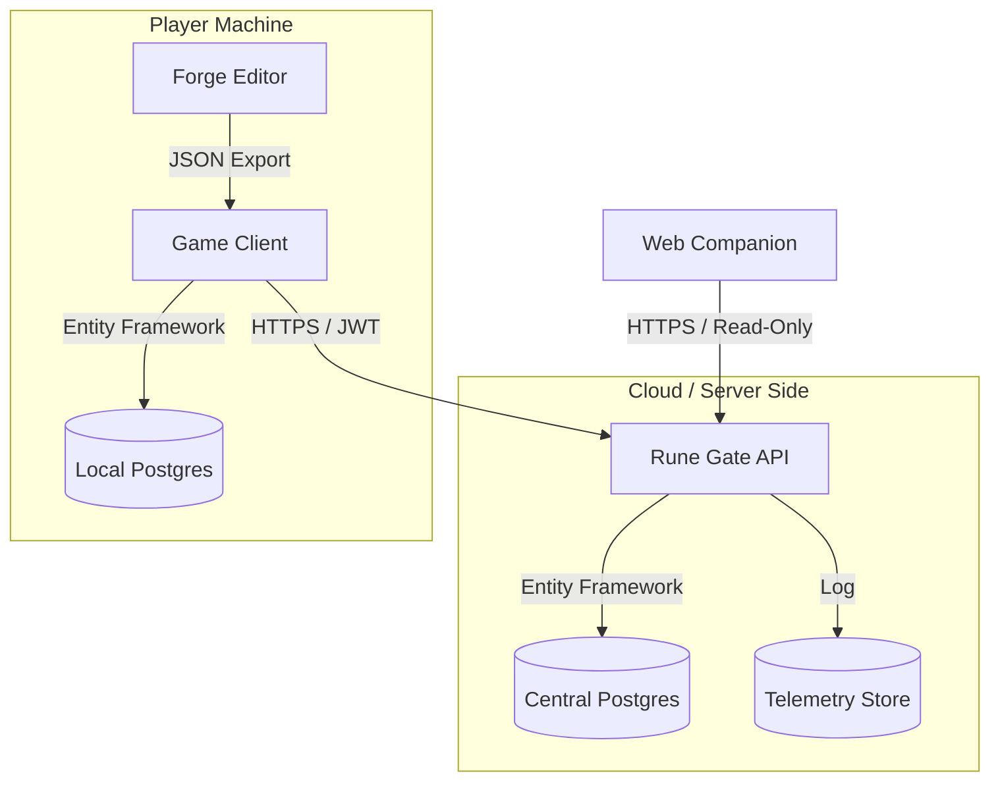

# Rune & Rust — Ecosystem & Integration Overview

This document outlines the proposed architecture for expanding `Rune & Rust` from a single repository into a complementary ecosystem of tools and services.

## 1. The Core Philosophy: "The Source of Truth"

To maintain consistency across multiple tools (Game, Wiki, Editor, API), we must ensure that game logic and data definitions are not duplicated.

### Recommendation: The Shared Core Strategy

We should package `RuneAndRust.Core` (and potentially parts of `RuneAndRust.Engine`) as a **NuGet Package** or use a **Git Submodule** strategy.

*   **RuneAndRust.Core**: Contains Enums, Entities, ValueObjects, and Formulas.
*   **Consumers**:
    *   **The Game (Client)**: Uses Core for runtime logic.
    *   **The API**: Uses Core to validate incoming telemetry/save data.
    *   **The Editor**: Uses Core to ensure created content is valid.
    *   **The Web Tools**: Can consume a JSON export of the Core data *or* use a WASM compilation of the Core C# library (via Blazor or similar).

---

## 2. Integration & Security Architecture

The user has expressed concern about security ("hacking") and data integration.

### 2.1 The Danger Zone: Direct DB Access
**Bad Practice**: Allowing external tools (like a website) to connect directly to the player's local PostgreSQL database or a central game database.
*   *Risk*: SQL Injection, Data corruption, Cheating.

### 2.2 The Solution: The "Rune Gate" API Layer

We introduce a central authority, the **Rune Gate API**.

### 2.3 Data Flow

1.  **Local Gameplay**: The game reads/writes to the **Local Postgres DB**. No internet required.
2.  **Telemetry/Leaderboards**:
    *   When a run ends, the Client creates a signed payload (Run Summary).
    *   Client POSTs this to `api.runeandrust.com/runs`.
    *   **Security**: The API validates the run data against the *Shared Core* rules (e.g., "Did they really deal 9999 damage with a rusty sword?"). If valid, it's stored.
3.  **Content Creation**:
    *   The **Forge Editor** saves `json` or `yaml` files.
    *   The Game Client loads these files into the Local DB at startup (Mod Loading).

---

## 3. Proposed Ecosystem Repositories

| Repo Name | Purpose | Tech Stack | Audience | Spec |
|-----------|---------|------------|----------|------|
| **rune-archive-web** | Wiki, Planner, Leaderboards | React / Next.js | Players | [Spec](00-project/ecosystem/01-rune-archive-web.md) |
| **rune-gate-api** | Backend Services, Telemetry | C# .NET 8 Web API | Ops / Dev | [Spec](00-project/ecosystem/02-rune-gate-api.md) |
| **forge-editor** | Content Creation Tool | AvaloniaUI | Modders / Dev | [Spec](00-project/ecosystem/03-forge-editor.md) |
| **discord-oracle** | Community Integration Bot | Python or C# | Community | [Spec](00-project/ecosystem/04-discord-oracle.md) |

Additional tooling documented in [Integrated Dev Tools](00-project/ecosystem/05-integrated-dev-tools.md).
