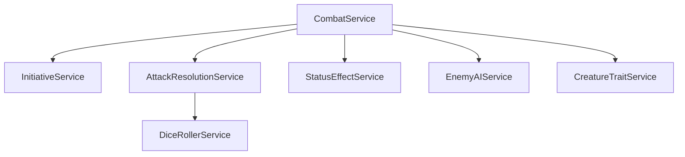

# Rune & Rust — Technical Architecture

Technical stack and project structure for implementation.

---

## 1. Technology Stack

| Layer | Technology | Version | Purpose | Status |
|-------|------------|---------|---------|--------|
| Language | C# (.NET 9.0) | 9.0 | Core game logic | ✅ Implemented |
| Database | PostgreSQL | 16+ | Persistent storage | ✅ Implemented |
| ORM | Entity Framework Core | 9.0.4 | Database access | ✅ Implemented |
| Terminal UI | Spectre.Console + Custom | 0.54.0 | Dev/testing interface | ✅ Implemented |
| GUI | AvaloniaUI + ReactiveUI | 11.0.0 | Player-facing interface | 🔮 Planned |
| Testing | xUnit + FluentAssertions + NSubstitute + Moq | Various | Unit & integration tests | ✅ Implemented |
| DI | Microsoft.Extensions.DI | 10.0.1 | Dependency injection | ✅ Implemented |
| Logging | Serilog (File + Console) | 4.3.0 | Structured logging | ✅ Implemented |

---

## 2. Solution Structure

```
RuneAndRust/
├── RuneAndRust.Core/               # Domain models, enums, interfaces
│   ├── Attributes/                 # Custom C# attributes
│   ├── Constants/                  # Game constants
│   ├── Data/                       # Data structures/DTOs
│   ├── Entities/                   # Character, Creature, Item, etc.
│   ├── Enums/                      # DamageType, Attribute, Status, etc. (46 files)
│   ├── Interfaces/                 # IRepository, IGameService, etc. (75 files)
│   ├── Models/                     # Additional model types
│   ├── Serialization/              # Serialization utilities
│   ├── Settings/                   # Configuration models
│   ├── ValueObjects/               # DiceRoll, Position, etc.
│   └── ViewModels/                 # MVVM ViewModels (9 subdirectories)
│
├── RuneAndRust.Engine/             # Game logic & services
│   ├── Algorithms/                 # Algorithmic utilities
│   ├── Factories/                  # Factory implementations
│   ├── Helpers/                    # Helper utilities
│   ├── Performance/                # Performance optimization
│   ├── Services/                   # All game services (57 files)
│   └── Simulation/                 # Game simulation logic
│
├── RuneAndRust.Persistence/        # Database layer
│   ├── Data/                       # DbContext, Seeders, Factory
│   ├── Repositories/               # EF Core implementations (13 files)
│   └── Migrations/                 # EF migrations (13 files)
│
├── RuneAndRust.Terminal/           # Terminal interface
│   ├── Controllers/                # Input handling
│   ├── Helpers/                    # Helper utilities
│   ├── Rendering/                  # Spectre.Console output (15 files)
│   ├── Services/                   # Terminal-specific services
│   └── Program.cs                  # Entry point
│
├── RuneAndRust.Avalonia/           # 🔮 PLANNED: GUI application
│   ├── Views/                      # XAML views
│   ├── ViewModels/                 # MVVM view models
│   ├── Controls/                   # Custom controls
│   └── App.axaml                   # Application entry
│
├── RuneAndRust.Tests/              # Unified test project
│   ├── Core/                       # Core layer tests
│   ├── Engine/                     # Engine layer tests
│   ├── Infrastructure/             # Infrastructure tests
│   ├── Integration/                # Integration tests
│   ├── Persistence/                # Persistence tests
│   └── Terminal/                   # Terminal tests
│
├── data/                           # Game content (biomes, dialogues, schemas)
├── docs/                           # Specifications (design, specs, plans)
└── scripts/                        # Build/utility scripts
```

> **Note:** Projects are at the repository root level, not nested under `src/`.

---

## 3. Layer Responsibilities

### 3.1 Core Layer
- **No external dependencies** (pure domain)
- Defines entities, enums, interfaces, value objects
- Contains no business logic—only data structures

### 3.2 Engine Layer
- **References Core only**
- Implements all game logic
- Services are stateless; state lives in entities
- Combat, specializations, environment logic

### 3.3 Persistence Layer
- **References Core only**
- Entity Framework Core with PostgreSQL
- Repository pattern for data access
- Migrations for schema changes

### 3.4 UI Layers (Terminal & Avalonia)
- **References Engine + Core**
- Thin presentation layer
- Delegates logic to Engine services
- Handles input/output only

---

## 4. Database Design Principles

### 4.1 Normalization
- Specializations, Abilities, StatusEffects as separate tables
- Join tables for many-to-many (e.g., `character_abilities`)
- Denormalize for read performance only where measured

### 4.2 Key Tables (Preview)

| Table | Purpose |
|-------|---------|
| `characters` | Player characters |
| `archetypes` | Warrior, Mage, etc. |
| `specializations` | Atgeir-Wielder, etc. |
| `abilities` | All specialization abilities |
| `ability_ranks` | Per-rank effects and formulas |
| `status_effects` | Bleeding, Stunned, etc. |
| `items` | All item definitions |
| `dungeons` | Dungeon definitions |
| `rooms` | Individual room data |

Full schema details in [09-data/data-overview.md](../09-data/data-overview.md).

---

## 5. Combat Engine Architecture



> **Authoritative Source:** See [SPEC-COMBAT-001](../../specs/combat/SPEC-COMBAT-001.md) for complete combat system documentation.

### 5.1 Key Interfaces

```csharp
public interface ICombatService
{
    void StartCombat(List<Enemy> enemies);
    void NextTurn();
    CombatResult? EndCombat();
    string ExecutePlayerAttack(string targetName, AttackType attackType);
    string ExecutePlayerAbility(int hotkey, string? targetName = null);
    Task ProcessEnemyTurnAsync(Combatant enemy);
    bool IsValidMeleeTarget(Combatant attacker, Combatant target, bool hasReach = false);
}

public interface IAttackResolutionService
{
    AttackResult ResolveMeleeAttack(Combatant attacker, Combatant target, AttackType attackType);
    int CalculateDefenseScore(Combatant target);
    int GetSuccessThreshold(int defenseScore);
}

public interface IInitiativeService
{
    int RollInitiative(Combatant combatant);
    void SortTurnOrder(List<Combatant> combatants);
}
```

### 5.2 Key Models

```csharp
public record AttackResult(
    AttackOutcome Outcome,      // Fumble, Miss, Glancing, Solid, Critical
    int NetSuccesses,
    int RawDamage,
    int FinalDamage,
    bool IsHit,
    DamageType DamageType = DamageType.Physical
);

public enum AttackType { Light, Standard, Heavy }
public enum RowPosition { Front, Back }
```

---

## 6. Configuration

### 6.1 appsettings.json Structure

```json
{
  "ConnectionStrings": {
    "DefaultConnection": "Host=localhost;Database=runeandrust;..."
  },
  "GameSettings": {
    "MaxPartySize": 4,
    "StartingLegend": 1,
    "BaseHP": 20
  }
}
```

### 6.2 Environment Variables

| Variable | Purpose |
|----------|---------|
| `RR_DB_CONNECTION` | Database connection string |
| `RR_LOG_LEVEL` | Logging verbosity |
| `RR_SEED_DATA` | Run data seeder on startup |

---

## 7. Testing Strategy

### 7.1 Test Categories

| Type | Location | Scope |
|------|----------|-------|
| Unit | `*.Tests/` | Single class/method |
| Integration | `Integration.Tests/` | Multiple systems |
| Database | `Integration.Tests/` | EF + PostgreSQL |

### 7.2 Test Naming

```
MethodName_StateUnderTest_ExpectedBehavior
```

Example: `CalculateDamage_WithSoak_ReducesDamage`

---

## 8. Related Documents

- [CONVENTIONS.md](./CONVENTIONS.md) — Naming standards
- [DOCUMENTATION_STANDARDS.md](./DOCUMENTATION_STANDARDS.md) — Specification format rules
- [../09-data/data-overview.md](../09-data/data-overview.md) — Data schema overview
- [../../specs/combat/SPEC-COMBAT-001.md](../../specs/combat/SPEC-COMBAT-001.md) — Combat system specification

---

## Changelog

### v1.1.0 (2025-12-26)
**Deep-Dive Validation Update** - Aligned documentation with actual codebase implementation.

#### Fixed
- **Section 1**: Updated .NET version from 8+ to 9.0, added Spectre.Console, Moq, Serilog
- **Section 1**: Marked AvaloniaUI as "Planned" (not yet implemented)
- **Section 2**: Corrected solution structure (no `src/` wrapper, flat project layout)
- **Section 2**: Updated all subdirectory listings to match actual implementation
- **Section 2**: Changed tests from separate projects to unified `RuneAndRust.Tests/`
- **Section 5**: Replaced aspirational combat architecture with actual implementation
- **Section 5**: Updated interfaces to match `ICombatService`, `IAttackResolutionService`, `IInitiativeService`
- **Section 5**: Added reference to authoritative SPEC-COMBAT-001.md
- **Section 8**: Fixed broken links to non-existent files

#### Added
- Status column to Technology Stack table
- Version numbers for all technologies
- Logging (Serilog) to technology stack
- `data/` and `scripts/` directories to structure
- Changelog section

### v1.0 (2025-12-07)
**Initial Release** - Original architecture specification (aspirational design).
