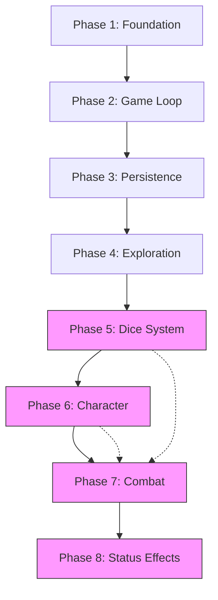
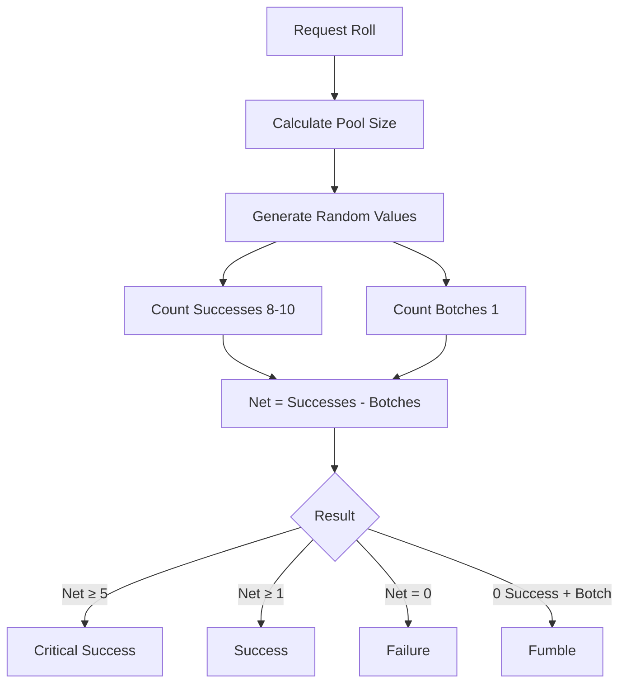
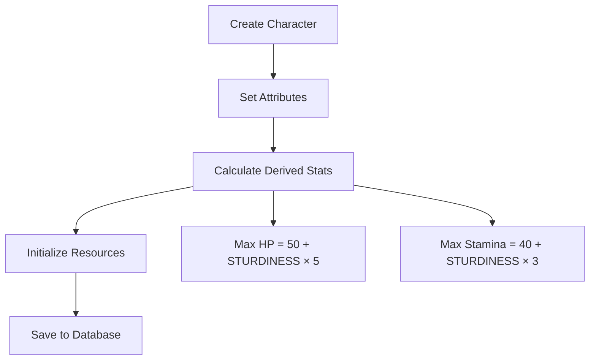
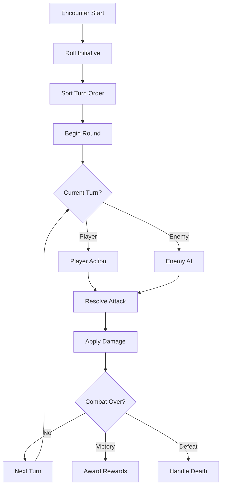
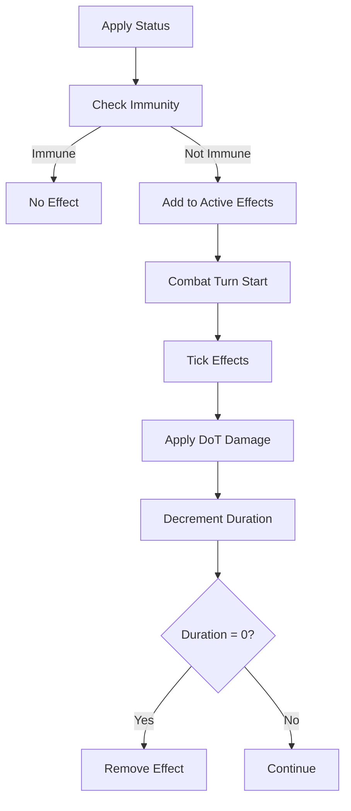

# v0.2 Implementation Specification

> *"The foundation is laid. Now we forge the blade."*

---

## 1. Version Overview

| Version | Scope | Status |
|---------|-------|--------|
| **v0.1** | Phases 1-4: Foundation → Exploration | In Progress |
| **v0.2** | Phases 5-8: Dice → Combat → Status | Planning |

**v0.2 Goal**: Transform the walking skeleton into a *playable combat demo*.

---

## 2. Phase Dependency Graph



---

## 3. Phase 5: Dice System

**Source Spec**: [dice-system.md](file:///Users/ryan/Documents/GitHub/r-r/docs/01-core/dice-system.md) (881 lines)

### 3.1 Objective
Implement the universal resolution mechanic: roll nd10, count successes (8-10), subtract botches (1).

### 3.2 Workflow



### 3.3 Decision Tree

| Decision | Recommendation | Rationale |
|----------|----------------|-----------|
| RNG implementation | `System.Random` with seed | Determinism for replay |
| Minimum pool | 1d10 | Never roll zero dice |
| Critical threshold | Net ≥ 5 | Per spec |
| Fumble condition | 0 success + ≥1 botch | Per spec |

### 3.4 Deliverables Checklist

**Core (`RuneAndRust.Core`)**:
- [ ] `Models/DiceResult.cs` — Record with successes, botches, net, flags
- [ ] `Interfaces/IDiceService.cs` — Roll(n) signature
- [ ] `Interfaces/IRandomProvider.cs` — Seeded RNG abstraction

**Engine (`RuneAndRust.Engine`)**:
- [ ] `Services/DiceService.cs` — Implementation
- [ ] `Services/RandomProvider.cs` — Seeded PRNG

**Tests (`RuneAndRust.Tests`)**:
- [ ] `DiceServiceTests.cs`:
  - [ ] Roll returns correct count
  - [ ] Successes counted for 8-10
  - [ ] Botches counted for 1
  - [ ] Net = Successes - Botches
  - [ ] Zero pool → rolls 1d10
  - [ ] Same seed → same sequence

### 3.5 Validation

| Test | Command | Expected |
|------|---------|----------|
| Unit tests | `dotnet test --filter "DiceService"` | Pass |
| Manual | Roll 10d10 repeatedly | Visible variance |

---

## 4. Phase 6: Character Foundation

**Source Spec**: [character-creation.md](file:///Users/ryan/Documents/GitHub/r-r/docs/01-core/character-creation.md) (684 lines)

### 4.1 Objective
Implement minimal character representation with attributes and resources.

### 4.2 Workflow



### 4.3 Decision Tree

| Decision | Recommendation | Rationale |
|----------|----------------|-----------|
| v0.2 character creation | Minimal/hardcoded | Full wizard in v0.3 |
| Attributes | 5 core (MIGHT, FINESSE, STURDINESS, WITS, WILL) | Per spec |
| Default values | All start at 3 | Balanced starting point |
| Archetype/Specialization | Skip for v0.2 | Reduce scope |

### 4.4 Deliverables Checklist

**Core (`RuneAndRust.Core`)**:
- [ ] `Entities/Character.cs`:
  - [ ] Guid Id
  - [ ] string Name
  - [ ] int Might, Finesse, Sturdiness, Wits, Will
  - [ ] int CurrentHp, MaxHp
  - [ ] int CurrentStamina, MaxStamina
- [ ] `Interfaces/ICharacterService.cs`

**Engine (`RuneAndRust.Engine`)**:
- [ ] `Services/CharacterService.cs`:
  - [ ] CreateCharacter(name, attributes)
  - [ ] GetById(id)
  - [ ] CalculateDerivedStats()

**Data (`RuneAndRust.Data`)**:
- [ ] `Configurations/CharacterConfiguration.cs`
- [ ] Migration: `AddCharacterTable`

**Tests**:
- [ ] `CharacterServiceTests.cs`:
  - [ ] HP calculated correctly
  - [ ] Stamina calculated correctly
  - [ ] Character persisted

### 4.5 Validation

| Test | Expected |
|------|----------|
| Create character | Saved to DB |
| Load character | Attributes match |
| HP formula | 50 + (STURDINESS × 5) |

---

## 5. Phase 7: Combat Core

**Source Spec**: [combat-resolution.md](file:///Users/ryan/Documents/GitHub/r-r/docs/03-combat/combat-resolution.md) (413 lines)

### 5.1 Objective
Implement turn-based combat loop with initiative, attacks, and damage.

### 5.2 Workflow



### 5.3 Decision Tree

| Decision | Recommendation | Rationale |
|----------|----------------|-----------|
| Initiative | FINESSE d10 pool | Per spec |
| Attack resolution | Opposed roll (Attack vs STURDINESS) | Per spec |
| Damage formula | Weapon base + MIGHT | Simplified for v0.2 |
| Enemy AI | Always attack player | Minimal viable AI |
| Weapons | Unarmed only (1d4 + MIGHT) | Scope control |

### 5.4 Deliverables Checklist

**Core (`RuneAndRust.Core`)**:
- [ ] `Entities/CombatState.cs`:
  - [ ] bool IsActive
  - [ ] List<CombatParticipant> InitiativeOrder
  - [ ] int CurrentTurnIndex
- [ ] `Entities/CombatParticipant.cs`:
  - [ ] Guid EntityId
  - [ ] int Initiative
  - [ ] bool IsPlayer
- [ ] `Enums/CombatAction.cs`: Attack, Defend, Flee
- [ ] `Models/AttackResult.cs`: Hit/Miss, Damage, IsCrit
- [ ] `Interfaces/ICombatEngine.cs`

**Engine (`RuneAndRust.Engine`)**:
- [ ] `Services/CombatEngine.cs`:
  - [ ] InitializeCombat(player, enemies)
  - [ ] ProcessPlayerAction(action)
  - [ ] ProcessEnemyTurn()
  - [ ] ResolveAttack(attacker, defender)
  - [ ] IsCombatOver()
- [ ] `Services/InitiativeService.cs`

**Data (`RuneAndRust.Data`)**:
- [ ] `Entities/Enemy.cs` (minimal)
- [ ] Seed data: TestDummy enemy

**UI (`RuneAndRust.UI.Terminal`)**:
- [ ] `CombatRenderer.cs`:
  - [ ] RenderCombatState()
  - [ ] RenderTurnOrder()
  - [ ] RenderAttackResult()

**Tests**:
- [ ] `CombatEngineTests.cs`:
  - [ ] Initiative sorts correctly
  - [ ] Turn cycles correctly
  - [ ] Attack hits reduce HP
  - [ ] Combat ends on HP ≤ 0

### 5.5 Validation

| Test | Expected |
|------|----------|
| Start combat | Initiative rolled, order shown |
| Player attacks | Dice rolled, damage applied |
| Enemy attacks | Player takes damage |
| Kill enemy | Victory state |
| Player dies | Defeat state |

---

## 6. Phase 8: Status Effects

**Source Spec**: [bleeding.md](file:///Users/ryan/Documents/GitHub/r-r/docs/04-systems/status-effects/bleeding.md) (405 lines)

### 6.1 Objective
Implement status effect framework with Bleeding as proof of concept.

### 6.2 Workflow



### 6.3 Decision Tree

| Decision | Recommendation | Rationale |
|----------|----------------|-----------|
| Starting effects | [Bleeding] only | Simplest DoT |
| Stacking | Per-stack damage | 1d4 per stack |
| Duration | 3 turns default | Per spec |
| Tick timing | Start of target's turn | Per spec |

### 6.4 Deliverables Checklist

**Core (`RuneAndRust.Core`)**:
- [ ] `Entities/StatusEffect.cs`:
  - [ ] string Id
  - [ ] int Duration
  - [ ] int Stacks
  - [ ] Guid TargetId
- [ ] `Enums/StatusEffectType.cs`: Bleeding
- [ ] `Interfaces/IStatusEffectService.cs`

**Engine (`RuneAndRust.Engine`)**:
- [ ] `Services/StatusEffectService.cs`:
  - [ ] ApplyEffect(target, type, stacks, duration)
  - [ ] TickEffects(target)
  - [ ] RemoveEffect(target, type)
  - [ ] GetActiveEffects(target)
- [ ] `StatusEffects/BleedingEffect.cs`:
  - [ ] OnApply()
  - [ ] OnTick() → deals Stacks × d4 damage
  - [ ] OnExpire()

**Integration**:
- [ ] Hook into CombatEngine end-of-turn

**Tests**:
- [ ] `StatusEffectTests.cs`:
  - [ ] Bleeding applies correctly
  - [ ] DoT damage calculated
  - [ ] Duration decrements
  - [ ] Effect removed at 0

### 6.5 Validation

| Test | Expected |
|------|----------|
| Apply 3-stack bleed | Target has [Bleeding] (3) |
| End turn | 3d4 damage dealt |
| After 3 turns | Effect removed |

---

## 7. Integration Test Plan

### 7.1 End-to-End Scenario

**"First Blood" Test**:
1. Create character (MIGHT 4, STURDINESS 3)
2. Enter room with TestDummy enemy
3. Combat begins → initiative rolled
4. Player attacks → dice rolled → damage applied
5. Enemy attacks → player takes damage
6. Player attack crits → apply [Bleeding]
7. Enemy's turn starts → bleed ticks
8. Player kills enemy → Victory
9. Save game → load game → verify state

### 7.2 Test Commands

```bash
# Phase 5
dotnet test --filter "DiceService"

# Phase 6
dotnet test --filter "CharacterService"

# Phase 7
dotnet test --filter "CombatEngine"

# Phase 8
dotnet test --filter "StatusEffect"

# Full v0.2
dotnet test
```

---

## 8. UI Progression

| Phase | UI Changes |
|-------|------------|
| 5 | None (backend only) |
| 6 | Character display in exploration |
| 7 | Combat screen, turn order, attack feedback |
| 8 | Status effect icons, DoT messages |

---

## 9. Timeline Estimate

| Phase | Effort | Dependencies |
|-------|--------|--------------|
| 5: Dice | ~2 hours | P4 complete |
| 6: Character | ~3 hours | P5 complete |
| 7: Combat | ~5 hours | P5, P6 complete |
| 8: Status | ~2 hours | P7 complete |

**Total v0.2**: ~12 hours implementation time

---

## 10. Success Criteria

**v0.2 is complete when**:
- [ ] Player can roll dice and see results
- [ ] Character has attributes and HP
- [ ] Player can enter combat with an enemy
- [ ] Turns alternate (player → enemy)
- [ ] Attacks deal damage
- [ ] Combat ends on victory/defeat
- [ ] [Bleeding] applies and ticks
- [ ] All tests pass
- [ ] Game state persists through save/load

---

## 11. Next Steps

1. **Immediate**: Complete Phase 3 (Persistence) and Phase 4 (Exploration)
2. **Phase 5**: Create `phase-5-spec.md` with detailed implementation
3. **Iterate**: Create individual phase specs as implementation proceeds
