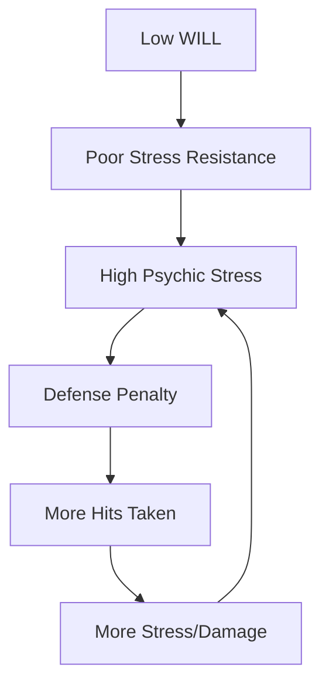

# FINESSE — The Agile Co-Processor

> *"Agility, reflexes, and precision. The speed of your hand and the certainty of your step. FINESSE governs your ability to evade attacks, your accuracy with ranged and light weapons, and your proficiency in the subtle arts of stealth, acrobatics, and disarming delicate mechanisms."*

---

## Document Control

| Version | Date | Changes |
|---------|------|---------|
| 1.0 | 2025-12-07 | Initial specification |

---

## 1. Overview

### 1.1 Identity Table

| Property | Value |
|----------|-------|
| Spec ID | `SPEC-CORE-ATTR-FINESSE` |
| Category | Core Attribute |
| Parent Spec | `SPEC-CORE-ATTRIBUTES` |
| Primary Archetypes | Skirmishers (Myrk-gengr, Veiðimaðr, Gantry-Runner, Hlekkr-master) |

### 1.2 Core Philosophy

FINESSE represents agility, reflexes, precision, and manual dexterity. It is the parameter for the **agile co-processor**—the ability to navigate the world's physical glitches with grace, exploit the "lag" in an enemy's corrupted combat script, and execute actions with speed and accuracy that seems to defy chaos.

A high-FINESSE character does not overpower a system error; they **avoid it**. They do not smash through a defense; they find the **single, hair-thin gap**.

---

## 2. Primary Functions

### 2.1 Defense Score (Primary Driver)

FINESSE is the **most important** contributor to passive evasion.

**Base Formula:**
```
Defense Score = 10 + (FINESSE − Psychic Stress Penalty) + Armor Modifiers
```

**Stress Penalty Calculation:**
```
Stress Penalty = floor(Psychic Stress / 20)
```

**Defense by FINESSE and Stress:**

| FINESSE | 0 Stress | 20 Stress | 40 Stress | 60 Stress | 80 Stress | 100 Stress |
|---------|----------|-----------|-----------|-----------|-----------|------------|
| 5 | 15 | 14 | 13 | 12 | 11 | 10 |
| 8 | 18 | 17 | 16 | 15 | 14 | 13 |
| 10 | 20 | 19 | 18 | 17 | 16 | 15 |
| 12 | 22 | 21 | 20 | 19 | 18 | 17 |
| 15 | 25 | 24 | 23 | 22 | 21 | 20 |

> [!IMPORTANT]
> **Stress Penalty is the Primary Counter to Dodge Tanks**
> 
> A FINESSE 15 character at 100 Stress has Defense 20 instead of 25—a 20% reduction that makes them hittable. This enforces the Trauma Economy as a universal threat.

### 2.2 Attack Accuracy

FINESSE governs accuracy for **all physical attacks** (melee and ranged).

**Formula:**
```
Accuracy Dice Pool = FINESSE + Weapon Skill Bonus + Situational Modifiers
```

**Accuracy Roll Interpretation:**
| Net Successes | Result |
|---------------|--------|
| 0 | Miss |
| 1 | Glancing hit (−2 damage dice) |
| 2 | Solid hit (full damage) |
| 3-4 | Strong hit (+1 damage die) |
| 5+ | Critical hit (double damage dice) |

**Examples:**

| Character | Pool | Expected Hits |
|-----------|------|---------------|
| FINESSE 6, no skill | 6d10 | ~65% chance for ≥1 net |
| FINESSE 8 + Skill 2 | 10d10 | ~85% chance, ~20% crit |
| FINESSE 12 + Skill 4 | 16d10 | ~98% chance, ~55% crit |

### 2.3 Light/Ranged Weapon Damage

FINESSE is the damage modifier for precision weapons.

**Applicable Weapons:**
- Daggers, rapiers, shortswords
- Bows, crossbows
- Thrown weapons (knives, javelins)
- Whips, chains

**Formula:**
```
Damage Dice Pool = Weapon Base Dice + FINESSE
```

**Examples:**

| Weapon | Base Dice | FINESSE | Total Pool |
|--------|-----------|---------|------------|
| Dagger | 2d10 | 10 | 12d10 |
| Rapier | 3d10 | 12 | 15d10 |
| Longbow | 4d10 | 10 | 14d10 |
| Throwing Knife | 1d10 | 10 | 11d10 |

### 2.4 Initiative (Vigilance)

FINESSE contributes to turn order determination.

**Formula:**
```
Vigilance = FINESSE + WITS
```

**Initiative Roll:**
```
Initiative = Vigilance + 1d10 roll
```

Higher initiative acts first each combat round.

**Examples:**

| Build | FINESSE | WITS | Vigilance | Turn Order |
|-------|---------|------|-----------|------------|
| Skirmisher | 12 | 8 | 20 | Typically first |
| Warrior | 7 | 5 | 12 | Middle |
| Mystic | 6 | 10 | 16 | Above average |

---

## 3. Derived Statistics

| Stat | Contribution | Formula |
|------|--------------|---------|
| Defense Score | **Primary** | `10 + FINESSE − StressPenalty + Armor` |
| Attack Accuracy | **Primary** | `FINESSE + Weapon Skill + Mods` |
| Light/Ranged Damage | **Primary** | `Weapon Base + FINESSE` |
| Vigilance | **Co-Primary** | `FINESSE + WITS` |
| Parry Pool | **Primary** | `FINESSE + Weapon Skill` |

---

## 4. Combat Integration

### 4.1 Attack Actions Using FINESSE

| Action | Accuracy Pool | Damage Pool | Notes |
|--------|---------------|-------------|-------|
| **Standard Attack** | `FINESSE + Skill` | `Weapon + FINESSE` | Basic attack |
| **Aimed Shot** | `FINESSE + Skill + 2` | `Weapon + FINESSE` | Costs extra action |
| **Quick Strike** | `FINESSE + Skill − 1` | `Weapon + FINESSE − 2` | Bonus action attack |
| **Dual Wield** | `FINESSE + Skill − 1` each | `Weapon + FINESSE` each | Two weapons |
| **Feint** | `WITS + Skill` vs `WITS` | — | Grants advantage on next attack |

### 4.2 Defensive Actions

| Action | Pool | Effect |
|--------|------|--------|
| **Passive Defense** | Defense Score | Attacker must roll ≥ Defense |
| **Parry** | `FINESSE + Weapon Skill` | Reduce incoming damage by net successes |
| **Dodge** | `FINESSE + Acrobatics` | Full evasion if net ≥ attack net |
| **Disengage** | `FINESSE + Acrobatics` | Move away without opportunity attack |

### 4.3 Ranged Combat

**Range Penalties:**

| Range | Accuracy Modifier |
|-------|-------------------|
| Point Blank (0-5m) | +1 die |
| Short (5-20m) | No modifier |
| Medium (20-50m) | −1 die |
| Long (50-100m) | −2 dice |
| Extreme (100m+) | −4 dice |

**Cover Modifiers (target's Defense bonus):**

| Cover | Defense Bonus |
|-------|---------------|
| Partial (25%) | +2 |
| Half (50%) | +4 |
| Three-quarters (75%) | +6 |
| Full (100%) | Cannot be targeted |

---

## 5. Skill Integration

### 5.1 FINESSE-Governed Skills

| Skill | Pool | Applications |
|-------|------|--------------|
| **Acrobatics** | `FINESSE + Acrobatics` | Climbing, balance, stealth, tumbling |
| **System Bypass (Precision)** | `FINESSE + System Bypass` | Lockpicking, trap disarming |
| **Sleight of Hand** | `FINESSE + Sleight` | Pickpocketing, item manipulation |
| **Stealth** | `FINESSE + Acrobatics` | Moving undetected |

### 5.2 Skill Check Examples

| Task | Pool | DC |
|------|------|----|
| Climb rough wall | `FINESSE + Acrobatics` | 1 |
| Balance on narrow beam | `FINESSE + Acrobatics` | 2 |
| Pick simple lock | `FINESSE + System Bypass` | 2 |
| Disarm pressure plate | `FINESSE + System Bypass` | 3 |
| Cross tripwire maze | `FINESSE + Acrobatics` | 4 |
| Pick master-level lock | `FINESSE + System Bypass` | 5 |

---

## 6. Trauma Economy Interaction

### 6.1 Defense Degradation

The Psychic Stress system **directly targets** high-FINESSE characters:

```
As Stress increases → Defense decreases → More hits taken → More Stress
```

This creates a **death spiral** for characters who neglect WILL:



### 6.2 Mitigation Strategies

High-FINESSE characters must address Stress via:
1. **Invest in WILL** (minimum 7 recommended)
2. **Party support** (Bone-Setter heals Stress)
3. **Gear with Stress resistance**
4. **Avoid psychic enemies** (tactical positioning)

---

## 7. Specialization Synergies

### 7.1 Primary FINESSE Specializations

| Specialization | FINESSE Role | Key Synergy |
|----------------|--------------|-------------|
| **Myrk-gengr** | Evasion + stealth | Vanish abilities key off FINESSE |
| **Veiðimaðr** | Ranged accuracy | Bow damage scales with FINESSE |
| **Gantry-Runner** | Mobility + position | Acrobatics for positioning bonuses |
| **Hlekkr-master** | Chain weapons | Unique whip/chain attacks |

### 7.2 Secondary FINESSE Uses

| Specialization | FINESSE Use |
|----------------|-------------|
| Hólmgangr | Parry reactions |
| Strandhögg | Mobile positioning |
| Scrap-Tinker | Delicate trap disarming |

---

## 8. Puzzle Integration

FINESSE enables **precision puzzle solutions**:

| Puzzle Type | FINESSE Solution | Trade-off |
|-------------|------------------|-----------|
| Tripwire maze | Navigate carefully | Time consuming |
| Lock mechanism | Pick lock | Quieter than MIGHT |
| Pressure plates | Step precisely | Requires multiple checks |
| Falling hazard | Tumble/grab | Saves from fall damage |

---

## 9. Balancing Considerations

### 9.1 Designed Limitations

| Limitation | Reasoning |
|------------|-----------|
| Stress directly reduces Defense | Cannot become unhittable |
| AoE attacks ignore Defense | Cannot dodge area effects |
| Psychic attacks bypass FINESSE | Must invest in WILL |
| Low HP without STURDINESS | Glass cannon risk |

### 9.2 Hard Counters

Enemies can defeat high-FINESSE characters via:
- **AoE attacks** (automatic hit, no evasion)
- **Psychic attacks** (target WILL, not Defense)
- **Environmental hazards** (no evasion possible)
- **Grappling** (negates Defense advantage)
- **Stress-inducing abilities** (reduce Defense over time)

---

## 10. Narrative Descriptions by Value

| FINESSE | Physical Description | Capabilities |
|---------|---------------------|--------------|
| 5 | Average reflexes | Standard reaction time |
| 6-7 | Agile, quick | Catches falling objects |
| 8-9 | Trained athlete | Impressive acrobatics |
| 10-11 | Elite duelist | Dodges arrows at short range |
| 12-14 | Master assassin | Blurs in motion |
| 15+ | Supernatural grace | Appears to teleport |

**Flavor Text Examples:**
- *"You slip between the attacks like water through fingers."*
- *"Your blade finds the gap before they even realize they're exposed."*
- *"The arrow passes through where you were a heartbeat ago."*

---

## 11. Phased Implementation Guide

### Phase 1: Core Logic
- [ ] **Defense Formula**: Implement `CalculateDefense(Finesse, Stress, Armor)`.
- [ ] **Accuracy**: Implement `CalculateAccuracy(Finesse, Skill)`.
- [ ] **Vigilance**: Implement `CalculateVigilance(Finesse, Wits)` and Initiative roll.

### Phase 2: Combat Integration
- [ ] **Dodge Action**: Implement `AttemptDodge` logic (Net Success comparison).
- [ ] **Range Penalties**: Implement Accuracy modifiers by range bands.
- [ ] **Cover**: Implement Cover Defense bonuses.

### Phase 3: Stress & Balance
- [ ] **Stress Penalty**: Hook Stress changes to trigger Defense recalculation.
- [ ] **Validation**: Verify Stress 100 results in -5 Defense.

### Phase 4: UI & Feedback
- [ ] **Character Sheet**: Show base Defense AND current effective Defense (e.g. "Defense: 20 (-3 Stress)").
- [ ] **Combat Log**: Show "Miss (Dodge)" vs "Miss (Armor)" if possible.

---

## 12. Testing Requirements

### 12.1 Unit Tests
- [ ] **Defense Calculation**: `10 + FINESSE - floor(Stress/20) + Armor`.
- [ ] **Stress Penalty**: Correct penalty at 0, 19, 20, 39, 40, etc.
- [ ] **Accuracy Pool**: `FINESSE + Skill + Mods`.
- [ ] **Vigilance**: `FINESSE + WITS`.

### 12.2 Integration Tests
- [ ] **Combat Defense**: Attack Character -> Verify Hit/Miss threshold changes as Stress increases.
- [ ] **Initiative**: Sort turn order based on Vigilance + d10.

### 12.3 Manual QA
- [ ] **Stress UI**: Increase Stress manually -> Watch Defense number drop on HUD.
- [ ] **Dodge**: Select Dodge action -> Verify text log output.

---

## 13. Logging Requirements

**Reference:** [logging.md](../logging.md)

### 13.1 Log Events

| Event | Level | Message Template | Properties |
|-------|-------|------------------|------------|
| Defense Calc | Verbose | "Defense recalculated for {Character}: {Value} (Stress Pen: {Penalty})" | `Character`, `Value`, `Penalty` |
| Dodge | Information | "{Character} dodged attack! (Net: {Net} vs {AttackNet})" | `Character`, `Net`, `AttackNet` |
| Initiative | Info | "{Character} rolled Initiative: {Total} (Vig {Vigilance} + Roll {Roll})" | `Character`, `Total`, `Vigilance`, `Roll` |

---

## 14. Related Specifications

| Spec ID | Relationship |
|---------|--------------|
| `SPEC-CORE-ATTRIBUTES` | Parent overview spec |
| `SPEC-CORE-DICE` | Uses dice pool system for all rolls |
| `SPEC-COMBAT-ACCURACY` | Accuracy mechanics detail |
| `SPEC-COMBAT-DEFENSE` | Defense system integration |
| `SPEC-CORE-RESOURCES` | Stress penalty integration |
