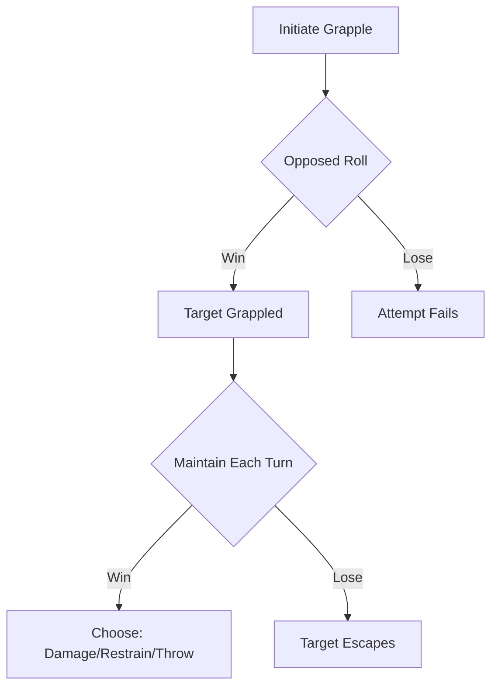

# MIGHT — The Brute-Force Processor

> *"Raw physical power. The strength of your arm and the force of your blows. MIGHT governs your effectiveness with heavy melee weapons, your ability to smash through obstacles, and your capacity to intimidate foes through sheer physical presence."*

---

## Document Control

| Version | Date | Changes |
|---------|------|---------|
| 1.0 | 2025-12-07 | Initial specification |

---

## 1. Overview

### 1.1 Identity Table

| Property | Value |
|----------|-------|
| Spec ID | `SPEC-CORE-ATTR-MIGHT` |
| Category | Core Attribute |
| Parent Spec | `SPEC-CORE-ATTRIBUTES` |
| Primary Archetypes | Warriors (Berserker, Atgeir-wielder, Gorge-Maw Ascetic, Vargr-Born) |

### 1.2 Core Philosophy

MIGHT represents raw physical power, muscular force, and the ability to impose one's will upon the physical world through brute strength. It is the parameter for the **brute-force solution**—applying a simpler, more direct, and brutally undeniable logic to a world of complex, paradoxical problems.

A high-MIGHT character does not debug a locked door; they **smash it**. They do not exploit a glitch in an enemy's code; they **shatter the hardware** it's running on.

---

## 2. Primary Functions

### 2.1 Heavy Weapon Damage

MIGHT is the primary damage modifier for heavy melee weapons.

**Applicable Weapons:**
- Two-handed weapons (greatswords, greataxes, mauls)
- Strength-based one-handed weapons (maces, flails)
- Improvised heavy weapons

**Formula:**
```
Damage Dice Pool = Weapon Base Dice + MIGHT
```

**Examples:**

| Weapon | Base Dice | MIGHT | Total Pool |
|--------|-----------|-------|------------|
| Great Axe | 4d10 | 8 | 12d10 |
| Warhammer | 3d10 | 10 | 13d10 |
| Maul | 5d10 | 12 | 17d10 |
| Improvised (Bench) | 2d10 | 8 | 10d10 |

### 2.2 Physical Force Checks

MIGHT governs all checks requiring raw physical power.

**Formula:**
```
Dice Pool = MIGHT + Relevant Skill Rank + Situational Modifiers
```

**Applications:**

| Task | DC Range | Notes |
|------|----------|-------|
| Smash wooden door | DC 1-2 | Noise alerts enemies |
| Force rusted mechanism | DC 2-3 | May break mechanism |
| Lift rubble off ally | DC 3-4 | Timed during combat |
| Break iron gate | DC 4-5 | Requires exceptional strength |
| Bend prison bars | DC 5+ | Legendary feat |

### 2.3 Intimidation Dialogue

MIGHT provides a high-risk social interaction option based on physical threat.

**Mechanic:**
```
Opposed Roll: Character's MIGHT vs Target's WILL
```

**Outcomes:**

| Result | Effect |
|--------|--------|
| Character wins by 3+ | Target complies fully; may gain fear-based loyalty |
| Character wins by 1-2 | Target complies reluctantly; may seek revenge later |
| Tie | Standoff; target neither complies nor attacks |
| Target wins by 1-2 | Target refuses; relationship damaged |
| Target wins by 3+ | Target becomes hostile; may trigger combat |

> [!CAUTION]
> Intimidation failures often result in **permanent faction reputation loss** and potential combat.

### 2.4 Equipment Requirements

Heavy weapons and armor may require minimum MIGHT to use effectively.

**Below Minimum Threshold Penalties:**

| Equipment Type | Penalty |
|----------------|---------|
| Heavy Weapon | +1 Botch range (Fumble on 1-2 instead of just 1) |
| Heavy Armor | -2 Defense, movement speed halved |
| Tower Shield | Cannot use active Block; passive bonus only |

**Example Requirements:**

| Equipment | Minimum MIGHT |
|-----------|---------------|
| Greatsword | 7 |
| Tower Shield | 8 |
| Plate Armor | 9 |
| Maul | 10 |

---

## 3. Derived Statistics

MIGHT contributes to the following derived stats:

| Stat | Contribution | Formula |
|------|--------------|---------|
| Heavy Weapon Damage | Primary | `Weapon Base + MIGHT` |
| Carry Capacity | Secondary | `25 + (STURDINESS × 5) + (MIGHT × 2)` kg |
| Grapple Pool | Primary | `MIGHT + Combat Skill` |

> [!NOTE]
> MIGHT does **not** contribute to accuracy (that's FINESSE), HP (that's STURDINESS), or mental resistance (that's WILL).

---

## 4. Combat Integration

### 4.1 Attack Actions Using MIGHT

| Action | Pool Formula | Effect |
|--------|--------------|--------|
| **Power Attack** | `Weapon Base + MIGHT + 2` | +2 damage dice, -1 accuracy die |
| **Cleave** | `Weapon Base + MIGHT` | Hit all adjacent enemies at -2 dice each |
| **Overhead Smash** | `Weapon Base + MIGHT + 3` | +3 damage, requires stance |
| **Grapple Initiate** | `MIGHT + Combat Skill` | Opposed vs target MIGHT/FINESSE |
| **Throw/Shove** | `MIGHT` | Opposed vs target MIGHT |

### 4.2 Grappling System

MIGHT is the primary attribute for grappling:



**Grapple Pools:**
- **Initiate**: `MIGHT + Combat Skill` vs `MIGHT or FINESSE` (target chooses)
- **Maintain**: `MIGHT` vs `MIGHT or FINESSE`
- **Damage While Grappling**: `MIGHT` (crushing damage)

### 4.3 Damage Type

MIGHT-based attacks typically deal:
- **Physical (Bludgeoning)**: Blunt weapons, fists, throws
- **Physical (Slashing)**: Axes, some swords
- **Physical (Piercing)**: Spears, picks (rare for MIGHT builds)

---

## 5. Skill Integration

### 5.1 MIGHT-Governed Skill Checks

| Skill/Check | Pool | Example |
|-------------|------|---------|
| Athletics (Lifting) | `MIGHT + Athletics` | Holding gate open |
| Athletics (Throwing) | `MIGHT + Athletics` | Throwing ally across gap |
| Breaking Objects | `MIGHT` | Destroying barricade |
| Restraining | `MIGHT` | Holding captive |

### 5.2 Physical Labor Tasks

Extended rolls for sustained effort:

| Task | Threshold | Roll Limit | Pool |
|------|-----------|------------|------|
| Mining ore vein | 8 | 10 rolls | `MIGHT` |
| Clearing rubble | 10 | 12 rolls | `MIGHT` |
| Forging (smithing assist) | 5 | 5 rolls | `MIGHT + Craft` |

---

## 6. Puzzle Integration

MIGHT enables **brute-force puzzle solutions**:

| Puzzle Type | MIGHT Solution | Trade-off |
|-------------|----------------|-----------|
| Locked door | Smash it | Noise, may destroy loot behind |
| Stuck mechanism | Force it | May break mechanism permanently |
| Weight puzzle | Move heavy objects | Time cost, stamina cost |
| Pressure plate | Hold it down physically | Ties up character |

> [!TIP]
> MIGHT solutions are fast but often have **collateral consequences**.

---

## 7. Specialization Synergies

### 7.1 Primary MIGHT Specializations

| Specialization | MIGHT Role | Key Synergy |
|----------------|------------|-------------|
| **Berserker** | Damage scaling | Rage abilities multiply MIGHT damage |
| **Atgeir-wielder** | Polearm damage | Reach attacks with MIGHT scaling |
| **Gorge-Maw Ascetic** | Unarmed damage | MIGHT replaces weapon base |
| **Vargr-Born** | Hybrid damage/tank | Transform abilities scale with MIGHT |

### 7.2 Secondary MIGHT Uses

| Specialization | MIGHT Use |
|----------------|-----------|
| Skjaldmær | Shield bash damage |
| Strandhögg | Charge attack damage |
| Hólmgangr | Disarm attempts |

---

## 8. Narrative Descriptions by Value

| MIGHT | Physical Description | Feats Possible |
|-------|---------------------|----------------|
| 5 | Average adult build | Carry normal gear |
| 6-7 | Fit, noticeable muscle | Lift heavy crates |
| 8-9 | Powerful, trained warrior | Bend metal rods |
| 10-11 | Imposing, feared in brawls | Throw armored foe |
| 12-14 | Legendary strongman | Break iron chains |
| 15+ | Mythic, inhuman power | Lift cart overhead |

**Flavor Text Examples:**
- *"Your blow lands with the force of a falling tree."*
- *"The door splinters as if made of kindling."*
- *"Your grip crushes their weapon arm."*

---

## 9. Balancing Considerations

### 9.1 Designed Limitations

MIGHT is **intentionally limited** to prevent one-stat dominance:

| Limitation | Reasoning |
|------------|-----------|
| No accuracy contribution | Must invest in FINESSE to hit |
| No HP contribution | Must invest in STURDINESS to survive |
| No mental defense | Must invest in WILL to resist Trauma |
| Short range | Melee only; no ranged options |

### 9.2 Counter-Play

Enemies can counter high-MIGHT characters via:
- Kiting (staying out of melee range)
- Psychic attacks (bypass physical power)
- Armor with high Soak (reduce damage)
- AoE (force spread, reduce focus fire advantage)

---

## 10. Phased Implementation Guide

### Phase 1: Core Logic
- [ ] **Formulas**: Implement `CalculateMeleeDamage` using MIGHT.
- [ ] **Checks**: Implement `ForceCheck` logic (MIGHT + Skill).
- [ ] **Validation**: Ensure negative MIGHT doesn't break damage calculations (min 1 die).

### Phase 2: Combat Integration
- [ ] **Attack Actions**: Hook MIGHT into Power Attack/Cleave formulas.
- [ ] **Grappling**: Implement `MIGHT` vs `MIGHT/FINESSE` opposed roll logic.
- [ ] **Restrictions**: Implement equipment requirements check Service.

### Phase 3: World Interaction
- [ ] **Destructibles**: Add `Breakable` component to doors/crates with MIGHT DC.
- [ ] **Dialog**: Add `Intimidate` options scaling with MIGHT.

### Phase 4: UI & Feedback
- [ ] **Tooltips**: Update Weapon tooltips to show "Scales with MIGHT".
- [ ] **Log**: ensure MIGHT contribution is visible in combat logs.

---

## 11. Testing Requirements

### 11.1 Unit Tests
- [ ] **Damage Calculation**: Verify `Base + MIGHT` formula.
- [ ] **Requirements**: Verify weapon penalty active when MIGHT < Requirement.
- [ ] **Grapple**: Verify MIGHT is used for Initiate and Maintain.
- [ ] **Intimidation**: Verify standard oppositional math.

### 11.2 Integration Tests
- [ ] **Combat**: Equip Greatsword -> Check Damage Log -> Verify MIGHT added.
- [ ] **World**: Interact with Heavy Door -> Check Success/Fail based on MIGHT.

### 11.3 Manual QA
- [ ] **Equip/Unequip**: Verify stats update when MIGHT boosts (drugs/spells) fade.
- [ ] **UI**: Hover over MIGHT in stat sheet -> Verify description matches spec.

---

## 12. Logging Requirements

**Reference:** [logging.md](../logging.md)

### 12.1 Log Events

| Event | Level | Message Template | Properties |
|-------|-------|------------------|------------|
| Might Check | Verbose | "{Character} performed MIGHT check (DC {DC}): {Result}" | `Character`, `DC`, `Result` |
| Intimidate | Information | "{Character} attempted Intimidation vs {Target}: {Outcome}" | `Character`, `Target`, `Outcome` |
| Force Open | Debug | "{Character} forced open {Object} (Roll: {Roll})" | `Character`, `Object`, `Roll` |

---

## 13. Related Specifications

| Spec ID | Relationship |
|---------|--------------|
| `SPEC-CORE-ATTRIBUTES` | Parent overview spec |
| `SPEC-CORE-DICE` | Uses dice pool system for all rolls |
| `SPEC-COMBAT-DAMAGE` | Damage calculation details |
| `SPEC-COMBAT-GRAPPLE` | Grappling subsystem |
