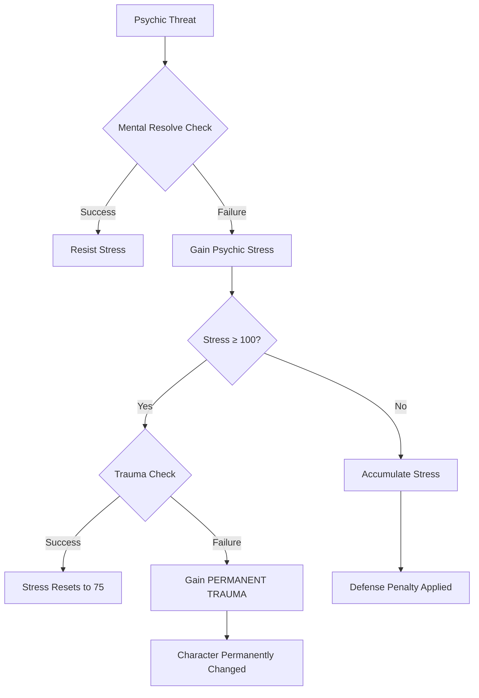

# WILL — The Psychic Firewall

> *"Mental fortitude, personal conviction, and spiritual resilience. The strength of your mind and the integrity of your soul. WILL governs your resistance to the Runic Blight's psychological effects, your capacity to wield mystical abilities, and your force of personality in social interactions."*

---

## Document Control

| Version | Date | Changes |
|---------|------|---------|
| 1.0 | 2025-12-07 | Initial specification |

---

## 1. Overview

### 1.1 Identity Table

| Property | Value |
|----------|-------|
| Spec ID | `SPEC-CORE-ATTR-WILL` |
| Category | Core Attribute |
| Parent Spec | `SPEC-CORE-ATTRIBUTES` |
| Primary Archetypes | Mystics (ALL mystic specializations) |

### 1.2 Core Philosophy

WILL represents mental fortitude, personal conviction, and spiritual resilience. It is the parameter for the **psychic firewall**—the measure of a character's ability to maintain coherent selfhood in a reality that actively corrodes coherence, to resist the psychological assaults of the Runic Blight, and to channel metaphysical power.

A high-WILL character does not merely survive psychic assault; they **remain themselves**. Their sense of self is an anchor in a sea of chaos, their conviction a firewall against corruption.

> [!CAUTION]
> **WILL is universally critical.** Every build, regardless of archetype, needs meaningful WILL investment or extensive support systems. The Trauma Economy **will break** low-WILL characters.

---

## 2. Primary Functions

### 2.1 Mental Resolve (Primary Defense)

WILL provides the dice pool for resisting psychological and metaphysical effects.

**Pool:**
```
Mental Resolve = WILL (dice)
```

**Resists:**

| Effect Type | Opposed Roll |
|-------------|--------------|
| Psychic Stress | `WILL` vs Stress Source DC |
| Fear Effects | `WILL` vs Fear DC |
| Charm/Compulsion | `WILL` vs Caster WILL |
| Corruption Gain | `WILL` vs Blight DC |
| Permanent Trauma | `WILL` vs Trauma DC (at 100 Stress) |

**Outcome Table:**

| Net Successes | Result |
|---------------|--------|
| 0 | Full effect applies |
| 1 | Partial resist (half Stress/duration) |
| 2-3 | Strong resist (minimal effect) |
| 4+ | Complete resist (negate entirely) |

### 2.2 Aether Pool (Mystic Resource)

WILL is the primary driver of mystical energy capacity.

**Formula:**
```
Max AP = Class Base + (WILL × 10) + Gear/Ability Bonuses − Corruption Penalty
```

**Corruption Penalty:**
```
Corruption Penalty = floor(Corruption / 10) × 5% of Base Max AP
```

**AP by WILL and Class:**

| Class | WILL 5 | WILL 8 | WILL 10 | WILL 12 | WILL 15 |
|-------|--------|--------|---------|---------|---------|
| Non-Mystic | 0 | 0 | 0 | 0 | 0 |
| Mystic (Base 50) | 100 | 130 | 150 | 170 | 200 |

> [!NOTE]
> Non-Mystic archetypes do **not** naturally have an Aether Pool. WILL still provides Mental Resolve for them.

### 2.3 Mystic Ability Potency

For Mystic characters, WILL scales all supernatural abilities.

**Mystic Damage Formula:**
```
Mystic Damage Pool = Ability Base + WILL
```

**Mystic DC Formula (for enemies to resist):**
```
Effect DC = 10 + WILL + Ability Rank
```

**Examples:**

| Ability | Base | WILL 10 | WILL 15 |
|---------|------|---------|---------|
| Flame Bolt (damage) | 3d10 | 13d10 | 18d10 |
| Mind Fog (DC) | — | DC 20 | DC 25 |
| Healing Touch (heal) | 2d10 | 12d10 | 17d10 |

### 2.4 Passive Psychic Perception

WILL enables sensing metaphysical phenomena.

**Formula:**
```
Passive Psychic Perception = 10 + WILL
```

**Automatic Detection:**

| WILL | Passive | Auto-Senses |
|------|---------|-------------|
| 5 | 15 | Obvious psychic presence |
| 8 | 18 | Active enchantments |
| 10 | 20 | Hidden magical effects |
| 12 | 22 | Latent corruption |
| 15 | 25 | Trace metaphysical signatures |

### 2.5 Rhetoric & Persuasion

WILL governs force of personality in social interactions.

**Formula:**
```
Rhetoric Pool = WILL + Rhetoric Skill Rank + Modifiers
```

**Applications:**

| Task | Pool | Notes |
|------|------|-------|
| Persuade NPC | `WILL + Rhetoric` | Change disposition |
| Negotiate | `WILL + Rhetoric` | Improve deal terms |
| Inspire allies | `WILL + Rhetoric` | Grant temporary buff |
| Deception | `WILL + Rhetoric` vs `WITS` | Opposed roll |
| Resist interrogation | `WILL` | Maintain secrets |

---

## 3. Trauma Economy Integration

### 3.1 The Central Mechanic

WILL is the **primary defense** against the Trauma Economy—the game's core psychological horror system.



### 3.2 Stress Accumulation

**Sources of Psychic Stress:**

| Source | Typical Stress | Resist Check |
|--------|----------------|--------------|
| Minor horror | 5-10 | `WILL` vs DC 1 |
| Moderate horror | 10-20 | `WILL` vs DC 2 |
| Major horror | 20-40 | `WILL` vs DC 3 |
| Eldritch encounter | 40-60 | `WILL` vs DC 4 |
| Forlorn manifestation | 60+ | `WILL` vs DC 5+ |

### 3.3 Stress Effects

| Stress Level | Effects |
|--------------|---------|
| 0-19 | No penalty |
| 20-39 | −1 Defense |
| 40-59 | −2 Defense |
| 60-79 | −3 Defense |
| 80-99 | −4 Defense, disadvantage on skill checks |
| 100 | **Trauma Check triggered** |

### 3.4 Permanent Trauma

When reaching 100 Stress, a **Trauma Check** occurs:

**Trauma Check:**
```
Roll: WILL vs Trauma DC (based on source)
```

| Result | Outcome |
|--------|---------|
| Success | Stress resets to 75, no lasting effect |
| Failure | Gain **Permanent Trauma**, Stress resets to 50 |

**Permanent Traumas** are irremovable (within normal gameplay) and include:
- Phobias (−2 dice when exposed to trigger)
- Compulsions (must pass WILL check to avoid behavior)
- Memory fragmentation (specific knowledge gaps)
- Perception distortions (false sensory input)

### 3.5 The Low-WILL Death Spiral

> [!WARNING]
> **Low WILL creates a death spiral.**

```
Low WILL → Fail Stress Checks → High Stress
         → Defense Penalty (via FINESSE link)
         → More Damage Taken → More Stress
         → Eventual Trauma Check Failure → Permanent Trauma
         → Character becomes unplayable or severely compromised
```

**Minimum Viable WILL:**
- WILL 5 (base): Extremely risky, requires heavy party support
- WILL 6-7: Viable with gear and party support
- WILL 8+: Self-sufficient against common threats

---

## 4. Combat Integration

### 4.1 Mystic Combat Actions

| Action | Pool | Effect |
|--------|------|--------|
| **Spell Attack** | `Ability + WILL` | Damage based on spell |
| **Psychic Assault** | `WILL` vs `WILL` | Direct Stress damage |
| **Aura Projection** | `WILL` | Buff/debuff radius |
| **Mental Shield** | `WILL` | Reduce incoming Stress |

### 4.2 Non-Mystic Uses

Even Warriors benefit from WILL in combat:

| Situation | Check | Purpose |
|-----------|-------|---------|
| Enemy fear aura | `WILL` vs DC | Avoid [Frightened] |
| Psychic damage | `WILL` vs DC | Reduce damage |
| Morale break | `WILL` vs DC | Avoid fleeing |
| Charm effect | `WILL` vs `WILL` | Resist control |

---

## 5. Skill Integration

### 5.1 WILL-Governed Skills

| Skill | Pool | Applications |
|-------|------|--------------|
| **Rhetoric** | `WILL + Rhetoric` | Persuasion, inspiring, negotiation |
| **Discipline** | `WILL + Discipline` | Resist fear, maintain composure |
| **Meditation** | `WILL + Meditation` | Stress recovery during rest |
| **Arcana (Mystics)** | `WILL + Arcana` | Spell identification, ritual casting |

### 5.2 Social Skill Checks

| Task | Pool | DC |
|------|------|----|
| Calm frightened NPC | `WILL + Rhetoric` | 2 |
| Negotiate better reward | `WILL + Rhetoric` | 3 |
| Inspire party (buff) | `WILL + Rhetoric` | 2-4 |
| Resist truth serum | `WILL + Discipline` | 4 |

---

## 6. Recovery Mechanics

### 6.1 Stress Recovery

High WILL aids stress recovery:

| Rest Type | Base Recovery | WILL Bonus |
|-----------|---------------|------------|
| Short Rest | 5 Stress | +WILL |
| Long Rest | 15 Stress | +WILL × 2 |
| Sanctuary Rest | Full Recovery | n/a |

**With WILL 10:**
- Short Rest: 15 Stress recovered
- Long Rest: 35 Stress recovered

### 6.2 Meditation

Special action available during rest:

**Meditation Check:**
```
Pool: WILL + Meditation Skill
Additional Stress Recovery: Net Successes × 5
```

---

## 7. Specialization Synergies

### 7.1 Primary WILL Specializations (ALL Mystics)

| Specialization | WILL Role | Key Synergy |
|----------------|-----------|-------------|
| **Galdr-caster** | Offensive magic | Spell damage scales WILL |
| **Seiðkona** | Fate manipulation | Ability DC scales WILL |
| **Grove-Warden** | Nature/healing | Healing potency scales WILL |
| **Rune-Carver** | Inscription magic | Effect duration scales WILL |
| **Skald/Thul** | Bardic powers | Inspiration strength scales WILL |

### 7.2 Secondary WILL Uses (Non-Mystics)

| Archetype | WILL Use |
|-----------|----------|
| **All Warriors** | Trauma defense (critical) |
| **All Skirmishers** | Fear resistance, stress management |
| **All Adepts** | Corruption resistance during crafting |

---

## 8. Balancing Considerations

### 8.1 The "WILL as God Stat" Problem

**Challenge:** WILL's universal importance risks mandatory investment.

**Mitigations:**

| Mitigation | How It Works |
|------------|--------------|
| **Mystic-only offense** | Only Mystics gain damage from WILL |
| **Gear alternatives** | `[Psychic Baffler]` mods provide Stress resistance |
| **Party support** | Bone-Setter heals Stress, Skald provides buffs |
| **Consumables** | Stabilizing Draughts reduce Stress |
| **Strategic play** | Low-WILL viable with careful threat avoidance |

### 8.2 Viable Low-WILL Builds

Low-WILL (5-6) is technically viable IF:
- Party has Bone-Setter or equivalent healer
- Character uses Stress resistance gear
- Player avoids psychic-heavy content
- Player accepts higher risk playstyle

> [!TIP]
> **Minimum Recommendation:** WILL 7 for non-Mystics, WILL 10 for Mystics.

---

## 9. Narrative Descriptions by Value

| WILL | Mental Description | Capabilities |
|------|-------------------|--------------|
| 5 | Average resolve | Vulnerable to fear |
| 6-7 | Steady nerves | Resists common horrors |
| 8-9 | Strong conviction | Faces eldritch threats |
| 10-11 | Iron will | Commands presence |
| 12-14 | Unshakeable | Immune to most fear |
| 15+ | Legendary fortitude | The Blight cannot touch them |

**Flavor Text Examples:**
- *"The horror that breaks minds washes over you like water off stone."*
- *"Your conviction burns bright. The darkness cannot find purchase."*
- *"You are the anchor. Others draw strength from your presence."*

---

## 10. Phased Implementation Guide

### Phase 1: Core Logic
- [ ] **Formulas**: Implement `CalculateMentalResolve`, `CalculateMaxAP`.
- [ ] **Penalty Logic**: Implement Corruption penalty to Max AP.

### Phase 2: Trauma Integration
- [ ] **Stress Checks**: Implement `AttemptMentalResolve` logic (Opposed vs DC).
- [ ] **Defense**: Hook Stress Penalty to Defense calc (via Finesse integration).
- [ ] **Trauma**: Implement `TraumaCheck` logic at 100 Stress.

### Phase 3: Magic Integration
- [ ] **Mystic Scaling**: Hook WILL into Spell Damage/DC formulas.
- [ ] **Perception**: Implement `CalculatePassivePsychicPerception`.

### Phase 4: UI & Feedback
- [ ] **HUD**: Add AP Bar (for Mystics only).
- [ ] **Notifications**: "Mental Resolve Failed" / "Trauma Acquired" toasts.

---

## 11. Testing Requirements

### 11.1 Unit Tests
- [ ] **Mental Resolve**: Pool equals WILL value.
- [ ] **Max AP**: `Base + (WILL * 10) - Corruption%`.
- [ ] **Passive Psychic**: `10 + WILL`.
- [ ] **Trauma Check**: Verify logic at 100 Stress (Reset to 75 vs 50).

### 11.2 Integration Tests
- [ ] **Stress Gain**: Trigger Horror Event -> Roll WILL -> Verify Stress reduction.
- [ ] **Magic**: Cast Spell -> Verify Damage scales with WILL.

### 11.3 Manual QA
- [ ] **Trauma UI**: Hit 100 Stress -> Verify Trauma Modal appears.
- [ ] **Mystic UI**: Verify AP bar appears for Mystic, hidden for Warrior.

---

## 12. Logging Requirements

**Reference:** [logging.md](../logging.md)

### 12.1 Log Events

| Event | Level | Message Template | Properties |
|-------|-------|------------------|------------|
| Mental Resolve | Info | "{Character} rolled Mental Resolve (DC {DC}): {Result} ({Net} net)" | `Character`, `DC`, `Result`, `Net` |
| Trauma Check | Warning | "{Character} TRAUMA CHECK: {Outcome} (Rolled {Roll})" | `Character`, `Outcome`, `Roll` |
| AP Update | Verbose | "AP updated for {Character}: {Current}/{Max}" | `Character`, `Current`, `Max` |

---

## 13. Related Specifications

| Spec ID | Relationship |
|---------|--------------|
| `SPEC-CORE-ATTRIBUTES` | Parent overview spec |
| `SPEC-CORE-RESOURCES` | AP resource mechanics |
| `SPEC-CORE-TRAUMA` | Trauma Economy details |
| `SPEC-COMBAT-PSYCHIC` | Psychic combat rules |
| `SPEC-MAGIC-CASTING` | Mystic ability details |
