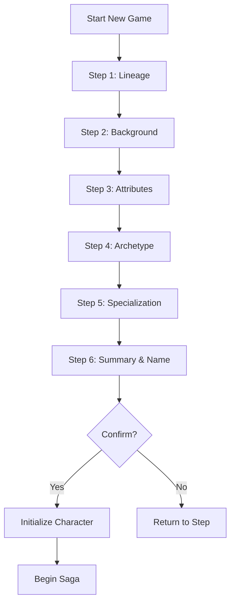

# Character Creation — The Survivor's Beginning

> *"Your saga has yet to be written. Who you are—your blood, your past, your will—determines how that saga will unfold. Choose wisely, Survivor."*

---

## Document Control

| Version | Date | Changes |
|---------|------|---------|
| 1.0 | 2025-12-07 | Initial specification |
| 1.1 | 2025-12-11 | Added Logging Requirements section with dual logging pattern |

---

## 1. Overview

### 1.1 Identity Table

| Property | Value |
|----------|-------|
| Spec ID | `SPEC-CORE-CHARACTER-CREATION` |
| Category | Core System |
| Type | Workflow / Process |
| Duration | 5-10 minutes (first time) |

### 1.2 Core Philosophy

Character creation is the **first meaningful decision point** in Aethelgard. Every choice has permanent consequences that shape the entire saga.

**Design Pillars:**

- **Permanent Choices**: Archetype and Lineage cannot be changed
- **Meaningful Differentiation**: Each combination creates distinct playstyle
- **Quick Start Option**: Simple mode for new players
- **Advanced Customization**: Point-buy for experienced players
- **Clear Consequences**: UI shows effects before confirming

### 1.3 Creation Workflow



---

## 2. Step 1: Lineage Selection

### 2.1 Purpose

**Lineage** represents inherited genetic/bloodline traits from before the Great Silence. It provides passive bonuses that influence the entire saga.

### 2.2 Available Lineages

| Lineage | Bonus | Description |
|---------|-------|-------------|
| **Clan-Born** | +5 Max HP, +1 Social | Traditional clan heritage, strong bonds |
| **Rune-Marked** | +5 Max AP, +1 Lore | Born with Aetheric sensitivity |
| **Iron-Blooded** | +2 Soak, +1 Craft | Descended from smiths and builders |
| **Vargr-Kin** | +1 Movement, +1 Survival | Wolf-blood, wilderness affinity |

### 2.3 Lineage UI

```
╔═══════════════════════════════════════════════════════════╗
║  STEP 1: CHOOSE YOUR LINEAGE                              ║
╠═══════════════════════════════════════════════════════════╣
║                                                           ║
║  Your bloodline carries echoes of the world before.       ║
║                                                           ║
║  [1] CLAN-BORN                                            ║
║      "Born of the great halls, bound by oath"            ║
║      +5 Maximum HP | +1 Social Skill                      ║
║                                                           ║
║  [2] RUNE-MARKED                                          ║
║      "The Aether sang in your blood from birth"          ║
║      +5 Maximum Aether Pool | +1 Lore Skill               ║
║                                                           ║
║  [3] IRON-BLOODED                                         ║
║      "Your ancestors forged the old world"               ║
║      +2 Soak | +1 Craft Skill                             ║
║                                                           ║
║  [4] VARGR-KIN                                            ║
║      "The wild runs in your veins"                       ║
║      +1 Movement | +1 Survival Skill                      ║
║                                                           ║
╚═══════════════════════════════════════════════════════════╝
```

---

## 3. Step 2: Background Selection

### 3.1 Purpose

**Background** represents the character's profession before the Great Silence. It provides starting skills and equipment.

### 3.2 Available Backgrounds

| Background | Starting Skills | Starting Equipment |
|------------|-----------------|-------------------|
| **Village Smith** | Craft +2, Might +1 | Smith's Hammer, Leather Apron |
| **Traveling Healer** | Medicine +2, Herbalism +1 | Healer's Kit, Bandages ×5 |
| **Ruin Delver** | Exploration +2, Traps +1 | Lantern, Rope, Lockpicks |
| **Clan Guard** | Combat +2, Vigilance +1 | Shield, Spear |
| **Wandering Skald** | Performance +2, Lore +1 | Instrument, Journal |
| **Outcast Scavenger** | Survival +2, Stealth +1 | Rations ×3, Cloak |

### 3.3 Background UI

```
╔═══════════════════════════════════════════════════════════╗
║  STEP 2: CHOOSE YOUR BACKGROUND                           ║
╠═══════════════════════════════════════════════════════════╣
║                                                           ║
║  What were you before the world broke?                    ║
║                                                           ║
║  [1] VILLAGE SMITH                                        ║
║      Craft +2, Might +1                                   ║
║      Starts with: Smith's Hammer, Leather Apron          ║
║                                                           ║
║  [2] TRAVELING HEALER                                     ║
║      Medicine +2, Herbalism +1                            ║
║      Starts with: Healer's Kit, Bandages ×5              ║
║                                                           ║
║  ... (more options)                                       ║
║                                                           ║
╚═══════════════════════════════════════════════════════════╝
```

---

## 4. Step 3: Attribute Allocation

### 4.1 Two Modes

| Mode | Description | For |
|------|-------------|-----|
| **Simple** | Archetype-recommended build | New players |
| **Advanced** | Point-buy customization | Experienced players |

### 4.2 Simple Mode

Archetype selection auto-applies optimal attribute distribution.

| Archetype | MIGHT | FINESSE | WITS | WILL | STURDINESS |
|-----------|-------|---------|------|------|------------|
| Warrior | 4 | 3 | 2 | 2 | 4 |
| Skirmisher | 3 | 4 | 3 | 2 | 3 |
| Mystic | 2 | 3 | 4 | 4 | 2 |
| Adept | 3 | 3 | 3 | 2 | 3 |

### 4.3 Advanced Mode: Point-Buy

```
Starting Pool: 15 Points (14 for Adept)
All Attributes Start at: 1

Point Costs:
  1 → 5: 1 point each
  5 → 8: 1 point each
  8 → 10: 2 points each

Maximum: 10 per attribute
Minimum: 1 per attribute
```

### 4.4 Point-Buy Cost Table

| Target Value | Cumulative Cost |
|--------------|-----------------|
| 2 | 1 |
| 3 | 2 |
| 4 | 3 |
| 5 | 4 |
| 6 | 5 |
| 7 | 6 |
| 8 | 7 |
| 9 | 9 |
| 10 | 11 |

### 4.5 Attribute UI (Advanced)

```
╔═══════════════════════════════════════════════════════════╗
║  STEP 3: ALLOCATE ATTRIBUTES           [Advanced Mode]    ║
╠═══════════════════════════════════════════════════════════╣
║                                                           ║
║  Points Remaining: 3 / 15                                 ║
║                                                           ║
║  MIGHT      [−]  5  [+]      Physical power              ║
║  FINESSE    [−]  4  [+]      Agility, precision          ║
║  WITS       [−]  3  [+]      Perception, knowledge       ║
║  WILL       [−]  2  [+]      Mental fortitude            ║
║  STURDINESS [−]  3  [+]      Endurance, resilience       ║
║                                                           ║
║  ─────────────────────────────────────────────────────── ║
║  Derived Stats Preview:                                   ║
║    Max HP:      80                                        ║
║    Max Stamina: 65                                        ║
║    Max AP:      35                                        ║
║                                                           ║
║  [Confirm Attributes] [Reset] [Switch to Simple Mode]    ║
╚═══════════════════════════════════════════════════════════╝
```

---

## 5. Step 4: Archetype Selection

### 5.1 The Four Archetypes

| Archetype | Role | Resource | Key Strength |
|-----------|------|----------|--------------|
| **Warrior** | Tank / Melee DPS | Stamina | Highest HP |
| **Skirmisher** | Mobile DPS | Stamina | Best Mobility |
| **Mystic** | Caster / Control | Aether Pool | Ranged Power |
| **Adept** | Support / Utility | Stamina | Versatility |

> [!IMPORTANT]
> Archetype choice is **permanent**. It cannot be changed after character creation.

### 5.2 Archetype Selection Effects

When an archetype is selected:
1. ✅ Starting abilities added (3 abilities)
2. ✅ Resource pools calculated
3. ✅ Available specializations filtered
4. ✅ Recommended attributes applied (Simple mode)

### 5.3 Archetype UI

```
╔═══════════════════════════════════════════════════════════╗
║  STEP 4: CHOOSE YOUR ARCHETYPE                            ║
╠═══════════════════════════════════════════════════════════╣
║                                                           ║
║  Your archetype is your fundamental approach to survival. ║
║  This choice is PERMANENT.                                ║
║                                                           ║
║  [1] WARRIOR — The Unyielding Bulwark                     ║
║      ⚔ 99 HP | 55 Stamina | Melee Focus                  ║
║      🎯 Strike, Defensive Stance, Warrior's Vigor         ║
║                                                           ║
║  [2] SKIRMISHER — Swift as Shadow                         ║
║      ⚔ 80 HP | 55 Stamina | +1 Movement                  ║
║      🎯 Quick Strike, Evasive Stance, Fleet Footed        ║
║                                                           ║
║  [3] MYSTIC — Wielder of Tainted Aether                   ║
║      ⚔ 70 HP | 70 AP | Ranged Aetheric                   ║
║      🎯 Aether Dart, Focus Aether, Aetheric Attunement   ║
║                                                           ║
║  [4] ADEPT — Master of Mundane Arts                       ║
║      ⚔ 80 HP | 50 Stamina | +20% Consumables             ║
║      🎯 Exploit Weakness, Scavenge, Resourceful           ║
║                                                           ║
╚═══════════════════════════════════════════════════════════╝
```

---

## 6. Step 5: Specialization Selection

### 6.1 Purpose

**Specialization** provides tactical identity and a unique ability tree. It costs **3 PP** to unlock, but the first specialization is **free at creation**.

### 6.2 Specializations by Archetype

| Archetype | Specializations |
|-----------|-----------------|
| **Warrior** | Berserkr, Iron-Bane, Skjaldmaer, Skar-Horde, Atgeir-Wielder, Gorge-Maw |
| **Skirmisher** | Veiðimaðr, Myrk-gengr, Strandhögg, Hlekkr-master |
| **Mystic** | Seiðkona, Echo-Caller |
| **Adept** | Bone-Setter, Jötun-Reader, Skald, Scrap-Tinker, Einbúi |

### 6.3 Specialization Selection Effects

When a specialization is selected:
1. ✅ Tier 1 abilities unlocked (3 abilities, free)
2. ✅ Specialization resource initialized (if applicable)
3. ✅ Path type noted (Coherent/Heretical)

### 6.4 Specialization UI

```
╔═══════════════════════════════════════════════════════════╗
║  STEP 5: CHOOSE YOUR SPECIALIZATION                       ║
╠═══════════════════════════════════════════════════════════╣
║                                                           ║
║  Archetype: WARRIOR                                       ║
║  Your first specialization is free.                       ║
║                                                           ║
║  [1] BERSERKR — Fury Unleashed                            ║
║      Path: Heretical | Resource: Rage                     ║
║      "Embrace the chaos within."                         ║
║                                                           ║
║  [2] SKJALDMAER — The Living Shield                       ║
║      Path: Coherent | Resource: Block Charges             ║
║      "None shall fall while I stand."                    ║
║                                                           ║
║  [3] IRON-BANE — Scourge of the Undying                   ║
║      Path: Coherent | Resource: Righteous Fervor          ║
║      "The abominations will fall."                       ║
║                                                           ║
║  ... (more options)                                       ║
║                                                           ║
╚═══════════════════════════════════════════════════════════╝
```

---

## 7. Step 6: Summary & Confirmation

### 7.1 Summary Screen

```
╔═══════════════════════════════════════════════════════════╗
║  STEP 6: CONFIRM YOUR SURVIVOR                            ║
╠═══════════════════════════════════════════════════════════╣
║                                                           ║
║  NAME: ______________________                             ║
║                                                           ║
║  ─────────────────────────────────────────────────────── ║
║  LINEAGE:        Clan-Born (+5 HP, +1 Social)             ║
║  BACKGROUND:     Village Smith (Craft +2)                 ║
║  ARCHETYPE:      Warrior                                  ║
║  SPECIALIZATION: Skjaldmaer                               ║
║  ─────────────────────────────────────────────────────── ║
║  ATTRIBUTES:                                              ║
║    MIGHT 4 | FINESSE 3 | WITS 2 | WILL 2 | STURDINESS 4  ║
║  ─────────────────────────────────────────────────────── ║
║  RESOURCES:                                               ║
║    HP: 104 (99 base + 5 Clan-Born)                        ║
║    Stamina: 55                                            ║
║    AP: 10                                                 ║
║  ─────────────────────────────────────────────────────── ║
║  ABILITIES:                                               ║
║    Strike, Defensive Stance, Warrior's Vigor              ║
║    + Skjaldmaer Tier 1: Shield Wall, Guard, Stalwart     ║
║  ─────────────────────────────────────────────────────── ║
║  STARTING EQUIPMENT:                                      ║
║    Smith's Hammer, Leather Apron                          ║
║  ─────────────────────────────────────────────────────── ║
║                                                           ║
║  [Confirm & Begin Saga]        [Go Back]        [Cancel]  ║
╚═══════════════════════════════════════════════════════════╝
```

### 7.2 Name Validation

| Rule | Requirement |
|------|-------------|
| Length | 2-20 characters |
| Characters | ASCII only (a-z, A-Z, spaces, hyphens) |
| Profanity | Filtered |
| Uniqueness | Not required (per-account) |

---

## 8. Character Initialization

### 8.1 On Confirmation

When the player confirms:

```csharp
// Saga System initialization
character.LegendPoints = 0;
character.ProgressionPoints = 0;
character.CurrentMilestone = 0;
character.LegendToNextMilestone = 500;

// Resources
character.CurrentHp = character.MaxHp;
character.CurrentStamina = character.MaxStamina;
character.CurrentAp = character.MaxAp;

// Trauma
character.PsychicStress = 0;
character.Corruption = 0;

// Location
character.CurrentSectorId = GenerateStartingSector();
character.CurrentRoomId = GetSectorEntrance();
```

### 8.2 Starting State

| Property | Value |
|----------|-------|
| Legend | 0 |
| PP | 0 |
| Milestone | 0 |
| HP | Full |
| Stamina | Full |
| AP | Full |
| Stress | 0 |
| Corruption | 0 |
| Traumas | None |
| Location | Sector entrance |

---

## 9. Technical Implementation

### 9.1 CharacterCreationController Interface

```csharp
public interface ICharacterCreationController
{
    // ... (same content as before, just renaming header)
    void Initialize(CharacterCreationViewModel viewModel);
    
    // Step navigation
    Task OnLineageSelectedAsync(string lineageId);
    Task OnBackgroundSelectedAsync(string backgroundId);
    Task OnAttributesConfirmedAsync();
    Task OnArchetypeSelectedAsync(string archetypeId);
    Task OnSpecializationSelectedAsync(string specializationId);
    Task OnConfirmCharacterAsync(string name);
    Task OnCancelAsync();
    
    // Attribute modes
    void OnAttributeAllocationModeChanged(bool advancedMode);
    void OnAttributeChanged(string attribute, int newValue);
    void ApplyRecommendedBuild(string archetypeId);
    
    // Validation
    ValidationResult ValidateCharacter();
    bool IsNameValid(string name);
}
```

### 9.2 CharacterCreationStep Enum

```csharp
public enum CharacterCreationStep
{
    Lineage,        // Step 1
    Background,     // Step 2
    Attributes,     // Step 3
    Archetype,      // Step 4
    Specialization, // Step 5
    Summary         // Step 6
}
```

### 9.3 ViewModel Properties

```csharp
public class CharacterCreationViewModel
{
    public CharacterCreationStep CurrentStep { get; set; }
    public bool AdvancedMode { get; set; }
    public int RemainingAttributePoints { get; set; }
    
    // Selections
    public string? SelectedLineage { get; set; }
    public string? SelectedBackground { get; set; }
    public string? SelectedArchetype { get; set; }
    public string? SelectedSpecialization { get; set; }
    public string? CharacterName { get; set; }
    
    // Attributes (Advanced mode)
    public int Might { get; set; }
    public int Finesse { get; set; }
    public int Wits { get; set; }
    public int Will { get; set; }
    public int Sturdiness { get; set; }
    
    // Derived (preview)
    public int PreviewMaxHp { get; set; }
    public int PreviewMaxStamina { get; set; }
    public int PreviewMaxAp { get; set; }
}
```

### 9.4 Database Schema

```sql
-- Characters table (creation fields)
CREATE TABLE characters (
    id UUID PRIMARY KEY DEFAULT gen_random_uuid(),
    account_id UUID NOT NULL REFERENCES accounts(id),
    name VARCHAR(20) NOT NULL,
    
    -- Creation choices
    lineage_id VARCHAR(50) NOT NULL,
    background_id VARCHAR(50) NOT NULL,
    archetype_id INT NOT NULL,
    
    -- Attributes
    might INT NOT NULL CHECK (might BETWEEN 1 AND 15),
    finesse INT NOT NULL CHECK (finesse BETWEEN 1 AND 15),
    wits INT NOT NULL CHECK (wits BETWEEN 1 AND 15),
    will INT NOT NULL CHECK (will BETWEEN 1 AND 15),
    sturdiness INT NOT NULL CHECK (sturdiness BETWEEN 1 AND 15),
    
    -- Saga progression
    legend_points INT NOT NULL DEFAULT 0,
    progression_points INT NOT NULL DEFAULT 0,
    current_milestone INT NOT NULL DEFAULT 0,
    legend_to_next_milestone INT NOT NULL DEFAULT 500,
    
    -- Timestamps
    created_at TIMESTAMP NOT NULL DEFAULT CURRENT_TIMESTAMP,
    last_played_at TIMESTAMP
);
```

---

## 10. Phased Implementation Guide

### Phase 1: Data & Persistence
- [ ] **Define Entities**: Create `Lineage`, `Background`, `Archetype`, `Specialization` data models.
- [ ] **Seed Data**: Populate `DataSeeder` with all options (4 Lineages, 6 Backgrounds, 4 Archetypes).
- [ ] **Database**: Run migration for `Characters` table with new columns.

### Phase 2: Core Logic (State Management)
- [ ] **ViewModel**: Implement `CharacterCreationViewModel` to track state.
- [ ] **Point-Buy Logic**: Implement `AttributeService` with cost validation (1-10 scale).
- [ ] **Validation**: Implement `ValidateCharacter()` (Name rules, Point limits).

### Phase 3: Systems Integration
- [ ] **Factory**: Implement `CharacterFactory.CreateAsync()` to persist final character.
- [ ] **Ability Granting**: Connect `Archetype` selection to `AbilityService` (grant starting abilities).
- [ ] **Equipment**: Connect `Background` selection to `InventoryService` (grant starting gear).

### Phase 4: UI & Feedback
- [ ] **Step Navigation**: Implement Next/Back flow in `CharacterCreationController`.
- [ ] **Live Preview**: Update `DerivedStats` when attributes change.
- [ ] **TUI**: Implement multi-screen wizard with ASCII art headers.

---

## 11. Testing Requirements

### 11.1 Unit Tests
- [ ] **Point Buy**: Verify 15 points max; 8->9 costs 2 points.
- [ ] **Lineage Modifiers**: Verify 'Clan-Born' adds HP correctly.
- [ ] **Archetype Defaults**: Verify 'Warrior' sets correct default attributes.
- [ ] **Name Validation**: Verify regex rejection of special chars.

### 11.2 Key Test Cases
- [ ] **Golden Path**: Create valid character -> Success.
- [ ] **Abandonment**: Cancel halfway -> No DB record created.
- [ ] **Validation**: Try to submit with 0 attributes -> Fail.

### 11.3 Manual QA
- [ ] **TUI Visuals**: Verify layout alignment on 80x24 terminal.
- [ ] **Input Handling**: Verify 'Back' button preserves previous choices.
- [ ] **Final Check**: Load created character into game world -> confirm stats match.

---

## 12. Logging Requirements

**Reference:** [logging.md](logging.md) | [logging-matrix.md](logging-matrix.md)

### 12.1 Log Events

| Event | Level | Message Template | Properties |
|-------|-------|------------------|------------|
| Creation started | Information | "Character creation started" | — |
| Lineage selected | Debug | "Lineage selected: {LineageId}" | `LineageId` |
| Background selected | Debug | "Background selected: {BackgroundId}" | `BackgroundId` |
| Attributes confirmed | Debug | "Attributes confirmed: MIGHT {Might}, FINESSE {Finesse}, WITS {Wits}, WILL {Will}, STURDINESS {Sturdiness}" | `Might`, `Finesse`, `Wits`, `Will`, `Sturdiness`, `Mode` |
| Archetype selected | Debug | "Archetype selected: {ArchetypeId}" | `ArchetypeId` |
| Specialization selected | Debug | "Specialization selected: {SpecializationId}" | `SpecializationId` |
| Character created | Information | "Character created: {CharacterName} ({ArchetypeId}/{SpecializationId})" | `CharacterId`, `CharacterName`, `ArchetypeId`, `SpecializationId` |
| Creation cancelled | Debug | "Character creation cancelled at step {Step}" | `Step` |
| Validation failed | Warning | "Character creation validation failed: {Reason}" | `Reason`, `Step` |
| Name rejected | Debug | "Character name rejected: {Name}, reason: {Reason}" | `Name`, `Reason` |

### 12.2 Log Levels

| Level | When to Use |
|-------|-------------|
| **Information** | Creation started, character created (significant events) |
| **Debug** | Step selections, navigation, validation details |
| **Warning** | Validation failures, rejected names |
| **Error** | Database save failures, initialization errors |

### 12.3 Context Enrichment

During character creation, push operation scope:

| Property | Source | Description |
|----------|--------|-------------|
| `CreationSessionId` | LogContext scope | Unique per creation flow |
| `CurrentStep` | LogContext | Current creation step |
| `AccountId` | GameStateEnricher | Player account |

### 12.4 Example Implementation

```csharp
public async Task<Character> OnConfirmCharacterAsync(string name)
{
    using (LogContext.PushProperty("CreationSessionId", _sessionId))
    {
        _logger.Information("Character creation started");
        
        try
        {
            // Log each step selection
            _logger.Debug("Lineage selected: {LineageId}", _viewModel.SelectedLineage);
            _logger.Debug("Background selected: {BackgroundId}", _viewModel.SelectedBackground);
            _logger.Debug(
                "Attributes confirmed: MIGHT {Might}, FINESSE {Finesse}, WITS {Wits}, WILL {Will}, STURDINESS {Sturdiness}",
                _viewModel.Might, _viewModel.Finesse, _viewModel.Wits, _viewModel.Will, _viewModel.Sturdiness);
            
            var character = await _characterFactory.CreateAsync(_viewModel);
            
            _logger.Information(
                "Character created: {CharacterName} ({ArchetypeId}/{SpecializationId})",
                character.Name,
                character.ArchetypeId,
                character.SpecializationId);
            
            return character;
        }
        catch (ValidationException ex)
        {
            _logger.Warning("Character creation validation failed: {Reason}", ex.Message);
            throw;
        }
        catch (Exception ex)
        {
            _logger.Error(ex, "Character creation failed");
            throw;
        }
    }
}
```

### 12.5 Player-Facing Activity Log

**Reference:** [../08-ui/tui-layout.md](../08-ui/tui-layout.md)

Character creation events appear in the Activity Log:

| Event | Activity Log Message | Type |
|-------|---------------------|------|
| Character created | `[System] {CharacterName} begins their saga` | System |

> [!NOTE]
> Character creation is mostly an offline flow. Only the final creation confirmation appears in the activity log.

---

## 13. Related Specifications

| Spec ID | Relationship |
|---------|--------------|
| `SPEC-CORE-ARCHETYPES` | Archetype selection |
| `SPEC-CORE-ATTRIBUTES` | Attribute allocation |
| `SPEC-CORE-SAGA` | Saga initialization |
| `SPEC-CORE-RESOURCES` | Resource pool calculation |
