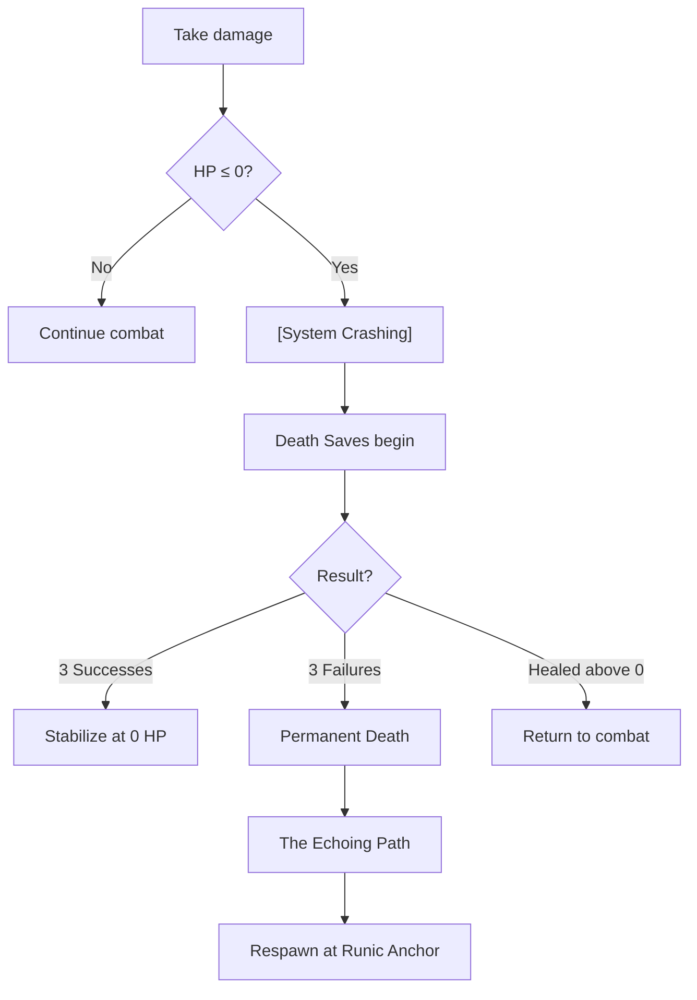
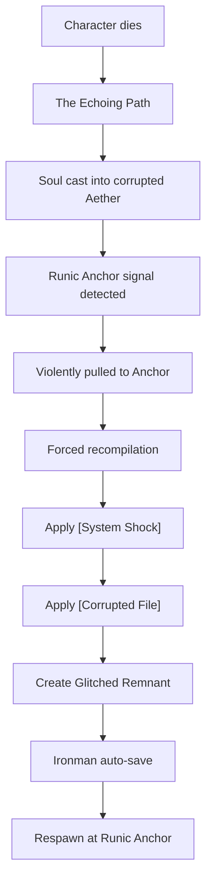
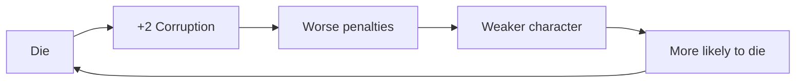
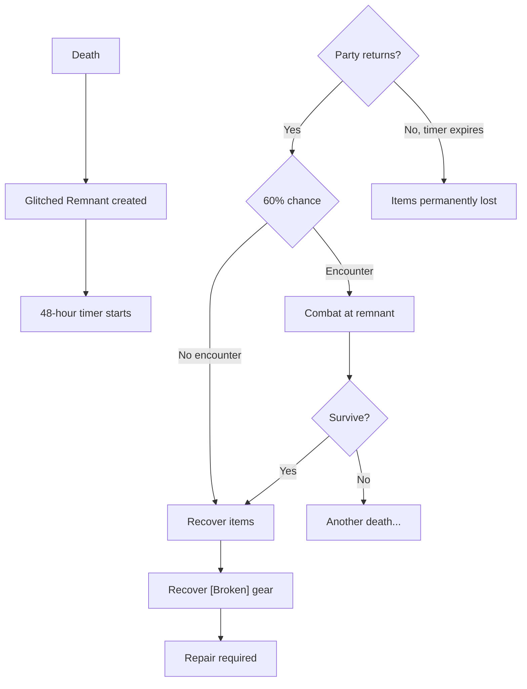

# Death & Resurrection System

> *"Death is not a reload button — it's a scar that never fully heals."*

---

## 1. Overview

### 1.1 Identity Table

| Property | Value |
|----------|-------|
| Spec ID | `SPEC-CORE-DEATH-RESURRECTION` |
| Category | Core System |
| Priority | Must-Have |
| Status | Implemented |

### 1.2 Core Philosophy

In Aethelgard, death is **catastrophic system crash** — a violent de-compilation of the soul. When HP reaches zero, the character's "silver cord" severs, echoing the original Ginnungagap Glitch. Resurrection is not respawn: it is **forced recompilation** at the last Runic Anchor, leaving permanent scars.

**Design Pillars:**
- **Death is Significant** — Not trivial, but a profound consequence
- **Resurrection is Traumatic** — Characters return damaged
- **Ironman Persistence** — Auto-save prevents save-scumming
- **Corpse Run Risk** — Recovering gear requires returning to death site
- **Corruption Accumulation** — Each death permanently increases Corruption

---

## 2. Death Sequence

### 2.1 System Crashing State



### 2.2 Trigger Conditions

| Trigger | Result |
|---------|--------|
| HP reaches 0 | [System Crashing] state |
| 3 Death Save successes | Stabilize (unconscious) |
| 3 Death Save failures | Permanent death → resurrection |
| Healed above 0 HP | Return to combat |
| Entire party defeated | Skip saves → resurrection |

---

## 3. Death Saves

### 3.1 Death Save Mechanics

Death Saves are **WILL-based Resolve Checks** made at the start of each turn while [System Crashing].

**Formula:**
```
HP Debt = |Current HP| (absolute value of negative HP)
Dice Pool = WILL - HP Debt (minimum 1d10)
DC = Based on HP Debt severity
```

### 3.2 HP Debt and DC

| HP Debt | Severity | DC |
|---------|----------|-----|
| 0 | Moderate | 3 |
| 1-5 | Serious | 6 |
| 6-10 | Critical | 9 |
| 11+ | Fatal | 12 |

### 3.3 Death Save Outcomes

| Roll Result | Outcome |
|-------------|---------|
| Meet/exceed DC | 1 Success |
| Below DC | 1 Failure |
| Below DC by 5+ | 2 Failures (Critical Failure) |

### 3.4 Example

> **Character:** WILL 7, takes 8 overkill damage (HP Debt = 8)
> - Dice Pool: 7 - 8 = -1 → **1d10 (minimum)**
> - Severity: "Critical" → **DC 9**
> - Rolling 1d10 vs DC 9 = 10% chance of success
>
> **Result:** Massive overkill makes stabilization nearly impossible.

---

## 4. The Echoing Path (Resurrection)

### 4.1 Resurrection Sequence



### 4.2 Resurrection Penalties

| Penalty | Type | Duration |
|---------|------|----------|
| [System Shock] | Temporary | 24 hours or Sanctuary Rest |
| [Corrupted File] | **PERMANENT** | Never (except rare quests) |

---

## 5. System Shock

### 5.1 System Shock Effects

| Effect | Penalty |
|--------|---------|
| All Attributes | -2 |
| Max HP | -25% |
| Max Stamina | -25% |
| Max AP (Mystics) | -25% |
| Regen Rates | -50% |

### 5.2 Duration

```
Duration = 24 in-game hours OR next Sanctuary Rest (whichever first)
```

> [!WARNING]
> **Design Intent:** System Shock prevents "zerg rushing" encounters. Players must retreat and recover, not immediately retry.

---

## 6. Corrupted File

### 6.1 Permanent Corruption

Each death **permanently** increases base Runic Blight Corruption:

| Death Circumstance | Corruption Gained |
|--------------------|-------------------|
| Standard death | +2 |
| Death in [Blighted] zone | +3 |
| Death to [Psychic Resonance] enemy | +3 |

### 6.2 Death Spiral



### 6.3 Corruption Thresholds

| Corruption | Effects |
|------------|---------|
| 20+ | Minor visual changes |
| 50+ | -25% Max HP/AP, -2d10 Resolve |
| 75+ | Severe mutations, NPC reactions |
| **100** | **Forlorn Transformation** (character lost) |

> [!CAUTION]
> At 100 Corruption, the character transforms into a [Forlorn] — an NPC enemy. The character is **permanently lost** to the player.

---

## 7. Glitched Remnant (Corpse Run)

### 7.1 Remnant Creation

When a character dies, a **Glitched Remnant** spawns at the death location containing:

- All inventory items
- All equipped gear (now [Broken])

### 7.2 Remnant Properties

| Property | Value |
|----------|-------|
| **Lifespan** | 48 in-game hours |
| **After expiration** | Items permanently lost |
| **Encounter chance** | 60% |

### 7.3 Remnant Encounters

| Roll | Encounter Type |
|------|----------------|
| 1-50% | Forlorn (party-level appropriate) |
| 51-80% | Draugr pack (2-4 units) |
| 81-100% | Environmental hazard |

### 7.4 Corpse Run Workflow



---

## 8. In-Combat Revival

### 8.1 Forced Reboot

Rare abilities can revive a [System Crashing] character without triggering full death:

| Ability | Specialization | Effect |
|---------|----------------|--------|
| Miracle Worker | Bone-Setter | Revive + heal + cleanse |
| Emergency Stabilization | — | Stabilize only |

### 8.2 Forced Reboot Penalties

| Penalty | Applied? |
|---------|----------|
| System Shock | **Yes** (reduced duration) |
| Corrupted File | **No** |
| Glitched Remnant | **No** |

---

## 9. Edge Cases

| Case | Resolution |
|------|------------|
| **Party Wipe** | All characters auto-resurrect (skip Death Saves) |
| **Death Save Interrupted** | Healing above 0 HP ends saves |
| **Overkill Damage** | Very high HP Debt = nearly impossible saves |
| **Multiple Remnants** | Each expires independently |
| **Combat with System Shock** | Intended to be very difficult |
| **100 Corruption** | Character becomes Forlorn NPC |

---

## 10. UI Requirements

### 10.1 System Crashing Display

```
═══════════════════════════════════
       SYSTEM CRASHING
═══════════════════════════════════

[Sigrid]'s HP reaches 0!
Her silver cord frays. The world's code fragments.
She is unconscious and dying.

Death Saves: ○ ○ ○  |  Failures: ○ ○ ○
             3 needed      3 = death
```

### 10.2 Death Save Display

```
═══════════════════════════════════
         DEATH SAVE
═══════════════════════════════════

WILL 7 - HP Debt 3 (Serious) = 4d10 vs DC 6

Rolling: [8, 4, 7, 2]

Result: SUCCESS ✓
Death Saves: ● ○ ○  |  Failures: ○ ○ ○
```

### 10.3 Resurrection Display

```
═══════════════════════════════════
       THE ECHOING PATH
═══════════════════════════════════

The world fragments.
You are cast into the void—the eternal scream of paradox.

A signal. Stable. Clean.
The Runic Anchor: your last system restore point.

You are PULLED toward it. Violently. Painfully.

═══════════════════════════════════
    RESURRECTION COMPLETE
═══════════════════════════════════

[PENALTIES APPLIED]
• System Shock (24 hours): All Attributes -2
• Corrupted File (PERMANENT): +2 Corruption

The Saga is saved. Death is permanent.
```

---

## 11. Implementation

### 11.1 Death Service Interface

```csharp
public interface IDeathService
{
    // State Management
    void OnHpReachesZero(Character character);
    DeathSaveResult MakeDeathSave(Character character);
    void Stabilize(Character character);
    
    // Resurrection
    void InitiateResurrection(Character character);
    ResurrectionResult ExecuteResurrection(Character character);
    
    // Penalties
    void ApplySystemShock(Character character);
    void RemoveSystemShock(Character character);
    void ApplyCorruptedFile(Character character);
    
    // Corpse Run
    GlitchedRemnant CreateRemnant(Character character, Location location);
    RecoveryResult RecoverRemnant(Character character, GlitchedRemnant remnant);
}
```

### 11.2 Database Tables

| Table | Purpose |
|-------|---------|
| `Death_History` | Tracks all character deaths |
| `Glitched_Remnants` | Active corpse locations |
| `System_Shock_Debuffs` | Active shock debuffs |

---

## 12. Phased Implementation Guide

### Phase 1: Data & Persistence
- [ ] **Define State**: Add `IsDead` and `DeathLocation` properties to `CharData`.
- [ ] **Remnant Entity**: Create `GlitchedRemnant` entity (Inventory, Location, DecayTimer).
- [ ] **Persistence**: Ensure `GameState` handles transient remnants correctly.

### Phase 2: Core Logic (Death Cycle)
- [ ] **Trigger**: Hook `OnDamageTaken` -> If HP <= 0, trigger Death Sequence.
- [ ] **Save Roll**: Implement `ResolveDeathSave()` logic (d10 vs DC 5).
- [ ] **Cleanup**: Implement `DeathService.KillCharacter()` (Unequip, Drop Remnant, Reset State).
- [ ] **Corruption**: Apply +10 Corruption and +1 Permanent Trauma on respawn.

### Phase 3: Systems Integration
- [ ] **Respawn**: Connect to `SanctuaryService` for safe location respawning.
- [ ] **Room Engine**: Spawn "Remnant Object" in the room where death occurred.
- [ ] **Loot**: Implement "Loot Remnant" interaction to reclaim lost gear.

### Phase 4: UI & Feedback
- [ ] **Death Screen**: "YOU ARE DEAD" TUI overlay with stats summary.
- [ ] **Remnant UI**: Distinct ASCII/Icon for the dropped remnant.
- [ ] **Logs**: "Character {Name} has died at {Location}." (Warning level).

---

## 13. Testing Requirements

### 13.1 Unit Tests
- [ ] **Trigger**: Verify HP 0 triggers IsDead = true.
- [ ] **Corruption**: Verify +10 Corruption applied on respawn.
- [ ] **Remnant**: Verify inventory items moved to Remnant object.
- [ ] **Decay**: Verify remnant disappears after 24h (simulation).

### 13.2 Key Test Cases
- [ ] **Solo Death**: Character dies -> Respawn at Sanctuary -> Walk back -> Loot body.
- [ ] **Party Wipe**: All 4 die -> Game Over state (or Sanctuary respawn if designated).
- [ ] **Glitch Chance**: Verify 10% chance of item corruption on pickup.

### 13.3 Manual QA
- [ ] **UI Flow**: Verify Death Screen appears and accepts input.
- [ ] **Persistence**: Save game while dead? (Design decision: Disable saving while dead?).
- [ ] **Visuals**: Verify Remnant looks different from normal loot pile.

---

## 14. Logging Requirements

**Reference:** [logging.md](logging.md) | [logging-matrix.md](logging-matrix.md)

### 14.1 Log Events

| Event | Level | Message Template | Properties |
|-------|-------|------------------|------------|
| HP reaches zero | Information | "{CharacterName} HP reached zero, entering [System Crashing]" | `CharacterId`, `CharacterName`, `HpDebt` |
| Death save attempt | Debug | "Death save: {PoolSize}d10 vs DC {DC}, result: {Result}" | `CharacterId`, `PoolSize`, `DC`, `Result`, `Successes`, `Failures` |
| Character stabilized | Information | "{CharacterName} stabilized (unconscious)" | `CharacterId`, `TotalSuccesses` |
| Character died | Information | "{CharacterName} died (Location: {RoomId})" | `CharacterId`, `RoomId`, `HpDebt` |
| Resurrection started | Information | "Beginning resurrection for {CharacterName}" | `CharacterId`, `AnchorId` |
| System Shock applied | Debug | "[System Shock] applied to {CharacterId}" | `CharacterId`, `Duration` |
| Corruption gained | Warning | "{CharacterName} gained {CorruptionGained} Corruption (now {TotalCorruption})" | `CharacterId`, `CorruptionGained`, `TotalCorruption` |
| Forlorn transformation | Error | "{CharacterName} reached 100 Corruption — transforming to Forlorn" | `CharacterId`, `CharacterName` |
| Resurrection complete | Information | "{CharacterName} resurrected at {AnchorId}" | `CharacterId`, `AnchorId` |
| Remnant created | Debug | "Glitched Remnant created at {RoomId} for {CharacterId}" | `CharacterId`, `RoomId`, `RemnantId`, `ItemCount` |
| Remnant expired | Debug | "Glitched Remnant {RemnantId} expired (items lost)" | `RemnantId`, `ItemCount` |
| Remnant recovered | Information | "{CharacterName} recovered Glitched Remnant" | `CharacterId`, `RemnantId`, `ItemsRecovered` |
| In-combat revival | Information | "{CharacterName} revived via {AbilityName}" | `CharacterId`, `AbilityName`, `HealerId` |

### 12.2 Log Levels

| Level | When to Use |
|-------|-------------|
| **Information** | Significant events: death, resurrection, recovery (player-visible) |
| **Debug** | Death saves, system shock, remnant lifecycle |
| **Warning** | Corruption gained (accumulating permanent penalty) |
| **Error** | Forlorn transformation (character lost), resurrection failures |

> [!IMPORTANT]
> Character death and resurrection are **significant narrative events**. Log at Information level to ensure visibility in production logs.

### 12.3 Context Enrichment

During death/resurrection sequence, push scope:

| Property | Source | Description |
|----------|--------|-------------|
| `CharacterId` | GameStateEnricher | Dying character |
| `DeathSequenceId` | LogContext scope | Unique per death sequence |
| `RoomId` | GameStateEnricher | Death location |
| `CombatId` | LogContext scope | Active combat (if any) |

### 12.4 Example Implementation

```csharp
public void OnHpReachesZero(Character character)
{
    var deathSequenceId = Guid.NewGuid();
    
    using (LogContext.PushProperty("DeathSequenceId", deathSequenceId))
    {
        var hpDebt = Math.Abs(character.CurrentHp);
        
        _logger.Information(
            "{CharacterName} HP reached zero, entering [System Crashing]",
            character.Name);
        
        character.Status = CharacterStatus.SystemCrashing;
        character.HpDebt = hpDebt;
    }
}

public DeathSaveResult MakeDeathSave(Character character)
{
    var poolSize = Math.Max(1, character.Will - character.HpDebt);
    var dc = GetDeathSaveDC(character.HpDebt);
    
    var result = _diceService.Roll(poolSize, "Combat:DeathSave", character.Id);
    
    _logger.Debug(
        "Death save: {PoolSize}d10 vs DC {DC}, result: {Result}",
        poolSize, dc, result.NetSuccesses >= dc ? "Success" : "Failure");
    
    return new DeathSaveResult(result, dc);
}

public void InitiateResurrection(Character character)
{
    _logger.Information(
        "Beginning resurrection for {CharacterName}",
        character.Name);
    
    // Apply penalties
    ApplySystemShock(character);
    
    var corruptionGained = GetCorruptionAmount(character);
    character.Corruption += corruptionGained;
    
    _logger.Warning(
        "{CharacterName} gained {CorruptionGained} Corruption (now {TotalCorruption})",
        character.Name, corruptionGained, character.Corruption);
    
    if (character.Corruption >= 100)
    {
        _logger.Error(
            "{CharacterName} reached 100 Corruption — transforming to Forlorn",
            character.Name);
        TransformToForlorn(character);
        return;
    }
    
    // Create remnant and complete resurrection
    CreateRemnant(character, character.CurrentRoomId);
    
    character.CurrentRoomId = character.LastAnchorId;
    
    _logger.Information(
        "{CharacterName} resurrected at {AnchorId}",
        character.Name, character.LastAnchorId);
}
```

### 12.5 Player-Facing Activity Log

**Reference:** [../08-ui/tui-layout.md](../08-ui/tui-layout.md)

Death and resurrection events are **significant narrative moments** and always appear in the Activity Log:

| Event | Activity Log Message | Type |
|-------|---------------------|------|
| HP reaches zero | `✗ {CharacterName} falls! [SYSTEM CRASHING]` | Death |
| Stabilized | `{CharacterName} stabilizes (unconscious)` | System |
| Death (3 failures) | `✗ {CharacterName} has died!` | Death |
| Resurrection start | `The Echoing Path calls {CharacterName}...` | System |
| Corruption gained | `[!] {CharacterName} gains +{amount} Corruption` | Warning |
| Resurrection complete | `{CharacterName} awakens at {AnchorName}` | System |
| In-combat revival | `+ {HealerName} revives {CharacterName}!` | Heal |
| Remnant created | `◆ Glitched Remnant left at {RoomName}` | Discovery |
| Remnant recovered | `◆ {CharacterName} recovers their belongings` | Discovery |
| Forlorn transformation | `✗ {CharacterName} succumbs to Corruption — LOST` | Death |

**Implementation:**

```csharp
// Player-facing death notification
_activityLog.AddEntry(new ActivityLogEntry(
    $"✗ {character.Name} falls! [SYSTEM CRASHING]",
    ActivityLogType.Death,
    TargetId: character.Id));

// Resurrection complete
_activityLog.AddEntry(new ActivityLogEntry(
    $"{character.Name} awakens at {GetAnchorName(character.LastAnchorId)}",
    ActivityLogType.GameLoaded, // Reusing as "significant system event"
    TargetId: character.Id));
```

---

---

## 13. Voice Guidance

### 13.1 Tone Profile

| Property | Value |
|----------|-------|
| **Theme** | The fragility of the soul-code. |
| **Tone** | Fatalistic, Systemic, Glitched. "The backup is corrupted, but it holds." |
| **Key Words** | Fragment, anchor, void, cold, static. |

### 13.2 Narrative Examples

| Context | Example Text |
|---------|--------------|
| **Death** | "The world freezes. Colors invert. You hear the terrible tearing sound of your own silver cord snapping." |
| **Resurrection** | "Pain is data. You are recompiled in the dark, screaming as the Runic Anchor forces your pattern back together." |
| **Corruption** | "A part of you didn't come back. The silence in your head is louder now." |

---

## 14. Balance Analysis

### 14.1 Design Intent

The death penalties are harsh by design to enforce "Survival Horror" rather than "Action RPG" pacing.

- **System Shock (-25% stats):** Prevents "zerg-rushing" bosses. If the party wipes or a key member dies, they cannot immediately retry effectively. They must retreat, rest, and rethink.
- **Corrupted File (+Corruption):** Creates a "soft permadeath" timer. You can only die ~40-50 times before a character is permanently lost (Forlorn). This adds weight to every life.

### 14.2 Economy Impact

- **Glitched Remnants:** Shifts value from "gold accumulation" to "gear retrieval." The risk of losing a +2 Sword is a stronger motivator than losing 100 gold.
- **Resurrection Cost:** The cost is *time* (Sanctuary rest) and *limit* (Corruption), not currency. This decouples death from the gold economy.

---

## 15. Related Specifications

| Spec | Relationship |
|------|--------------|
| [HP](./resources/hp.md) | Triggers at 0 HP |
| [Stress](./resources/stress.md) | Trauma integration |
| [Trauma Economy](./trauma-economy.md) | Corruption system |
| [Status Effects](../04-systems/status-effects/status-effects-overview.md) | System Shock debuff |
| [Bone-Setter](../03-character/specializations/bone-setter/bone-setter-overview.md) | Revival abilities |
