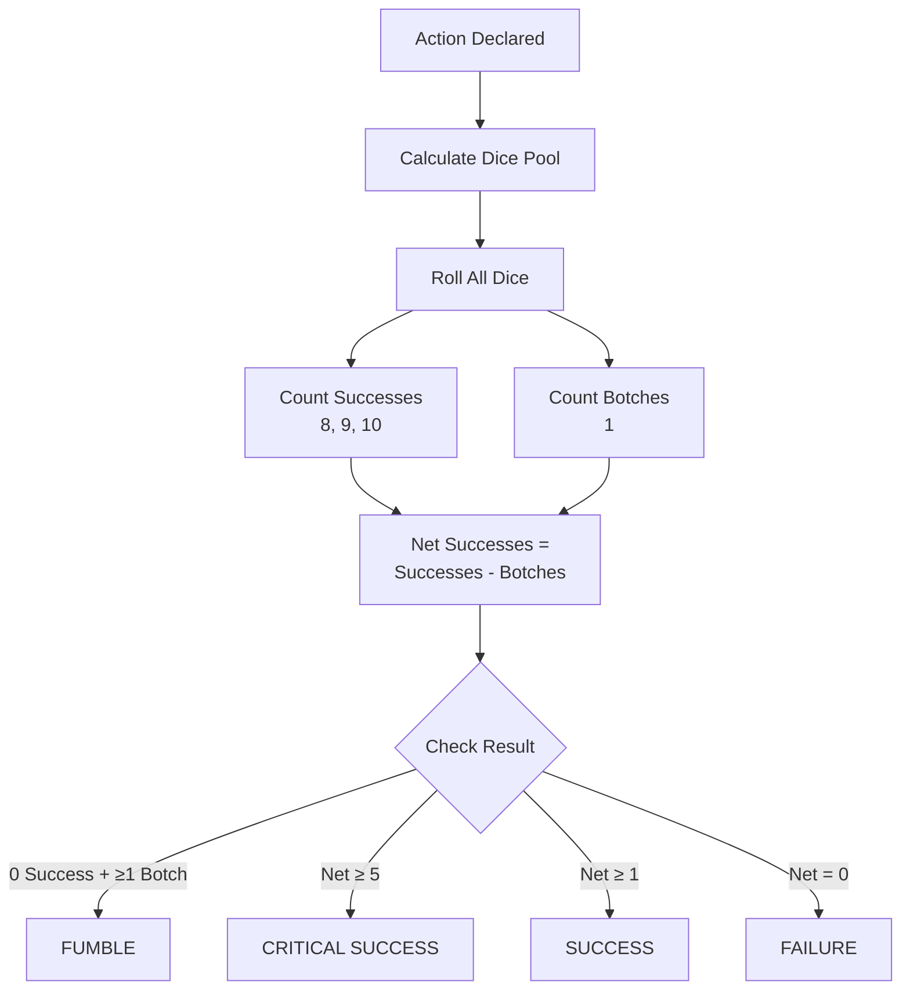
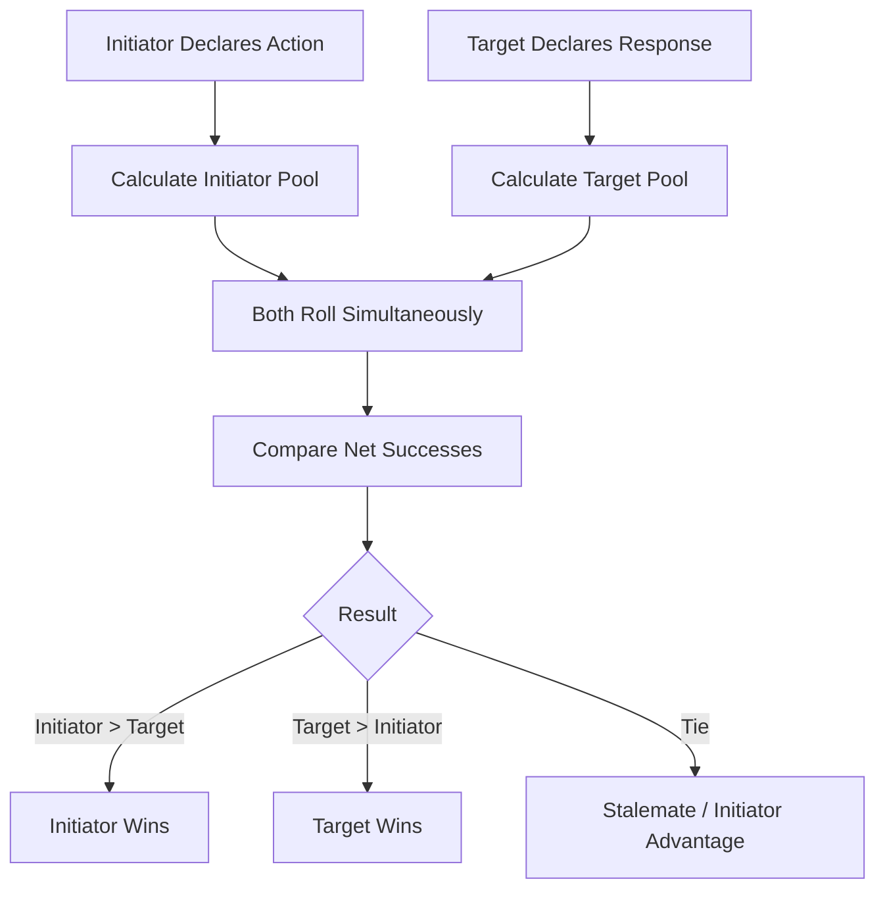
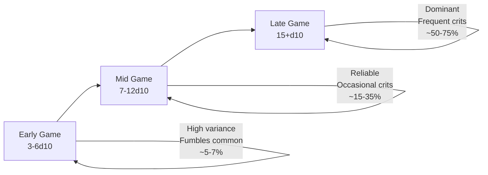

# Dice Pool System — Complete Specification

The foundational resolution mechanic for all uncertain actions in Rune & Rust.

---

## Document Control

| Version | Date | Changes |
|---------|------|---------|
| 1.1 | 2025-12-07 | Added: Degrees of Success, Opposed Rolls, Extended Rolls, Edge Cases, Probability Analysis, Randomness & Determinism |
| 1.0 | 2025-12-07 | Initial specification (migrated from legacy v5.0) |

---

## 1. Overview

### 1.1 Identity Table

| Property | Value |
|----------|-------|
| Spec ID | `SPEC-CORE-DICE` |
| Category | Core System |
| Dependencies | None (foundational) |
| Referenced By | Combat, Skills, Dialogue, Crafting, Trauma Economy |

### 1.2 Design Philosophy

The Dice Pool System is the **mathematical engine** driving every uncertain action in Aethelgard. It models the probability of a character successfully imposing a **coherent outcome upon chaotic reality**.

**Design Pillars:**

- **Granular Outcomes**: Degrees of success, not binary pass/fail
- **Bell Curve Distribution**: Natural probability feels organic
- **Universal Application**: Single consistent mechanic everywhere
- **Transparent Results**: Players see individual die results
- **Meaningful Progression**: More dice = higher probability

---

## 2. Core Mechanics

### 2.1 The Resolution Flow



### 2.2 Die Type & Pool Assembly

**Die Type**: All resolution uses **d10** exclusively.

**Pool Assembly Formula**:
```
Dice Pool = Governing Attribute + Skill Rank + Situational Modifiers
```

| Component | Description | Example |
|-----------|-------------|---------|
| **Governing Attribute** | Base capability (from `SPEC-CORE-ATTRIBUTES`) | FINESSE 8 |
| **Skill Rank** | Learned expertise (0-5) | System Bypass Rank 3 |
| **Situational Modifiers** | Buffs, debuffs, equipment, environment | Masterwork Tools +1 |

**Pool Size Examples**:

| Character Type | Pool Calculation | Total |
|----------------|------------------|-------|
| Early Game | WITS 6 + Skill 1 + Tools +1 | 8d10 |
| Mid Game | WITS 10 + Skill 3 + Passive +2 | 15d10 |
| Late Game | WITS 15 + Skill 5 + Passive +2 + Buff +1 | 23d10 |

### 2.3 Reading Results

**Success Threshold**: Die shows **8, 9, or 10** (30% chance per die)

**Botch Threshold**: Die shows **1** (10% chance per die)

**Neutral Values**: 2–7 have no effect (60% chance per die)

**Net Successes**:
```
Net Successes = Total Successes − Total Botches
```

> [!IMPORTANT]
> Net Successes cannot go below 0. When Fumble conditions are met, result floors at 0.

### 2.4 Special Results

| Result | Condition | Effect |
|--------|-----------|--------|
| **Critical Success** | Net Successes ≥ 5 | Powerful bonus (double damage, bonus quality, etc.) |
| **Fumble** | 0 Successes AND ≥1 Botch | Catastrophic failure with negative consequence |

**Fumble Narrative**: Represents Runic Blight interference—a cognitive glitch, reality warp, or paradox moment.

### 2.5 Degrees of Success

Net successes are not just pass/fail—they represent **how well** an action succeeds. Each system interprets degrees differently:

#### 2.5.1 Skill Checks vs Difficulty Class (DC)

| Net Successes vs DC | Result | Description |
|---------------------|--------|-------------|
| Net < DC | **Failure** | Action fails; may retry if permitted |
| Net = DC | **Marginal Success** | Barely succeeds; minor complications possible |
| Net = DC + 1-2 | **Full Success** | Clean success as intended |
| Net = DC + 3-4 | **Exceptional Success** | Bonus effect, hidden info, time saved |
| Net ≥ DC + 5 | **Critical Success** | Maximum benefit, narrative flourish |

**DC Examples**:
| Difficulty | DC | Example Task |
|------------|----|--------------| 
| Trivial | 0 | Climbing a ladder |
| Easy | 1 | Picking a simple lock |
| Moderate | 2 | Navigating a trapped corridor |
| Hard | 3 | Hacking a secure terminal |
| Very Hard | 4 | Disarming an ancient artifact trap |
| Legendary | 5+ | Deciphering a god-fragment inscription |

#### 2.5.2 Combat Hits

| Net Successes | Combat Effect |
|---------------|---------------|
| 0 | Miss — attack fails to connect |
| 1 | Glancing Hit — damage roll with −2 dice penalty |
| 2 | Solid Hit — full damage roll |
| 3-4 | Strong Hit — damage roll with +1 bonus die |
| 5+ | Critical Hit — double damage dice, bypass armor soak |

#### 2.5.3 Damage Rolls

| Net Successes | Damage Dealt |
|---------------|--------------|
| 0 | No damage (blocked, absorbed, or whiffed) |
| 1-2 | Light wound |
| 3-4 | Moderate wound |
| 5+ | Severe wound (may trigger status effects) |

> [!NOTE]
> Exact HP values are defined in `SPEC-COMBAT-DAMAGE`. This table shows qualitative outcomes.

### 2.6 Damage Dice System

While **resolution rolls use d10 exclusively**, damage rolls use a **tiered die system** (d4–d10) to create mechanical differentiation between weapons and abilities.

#### 2.6.1 Die Hierarchy

| Tier | Die | Avg | Variance | Use Case |
|------|-----|-----|----------|----------|
| **Minor** | d4 | 2.5 | Low | DoT ticks, trinkets, improvised |
| **Light** | d6 | 3.5 | Low | Daggers, unarmed, Tier 1 abilities |
| **Medium** | d8 | 4.5 | Medium | Swords, axes, polearms, Tier 2 |
| **Heavy** | d10 | 5.5 | High | Greatswords, Tier 3, elite abilities |

#### 2.6.2 Weapon Damage Examples

| Weapon | Die | Flat Bonus | Total Avg |
|--------|-----|------------|-----------|
| Unarmed | 1d4 | +0 | 2.5 |
| Improvised | 1d4 | +1 | 3.5 |
| Dagger | 2d6 | +2 | 9 |
| Shortsword | 2d6 | +3 | 10 |
| Longsword | 2d8 | +3 | 12 |
| Battleaxe | 2d8 | +4 | 13 |
| Atgeir | 2d8 | +5 | 14 |
| Greatsword | 2d10 | +5 | 16 |
| Greataxe | 2d10 | +6 | 17 |

#### 2.6.3 Ability Damage Scaling

| Tier | Base Die | Example |
|------|----------|---------|
| Archetype Tier 1 | 2d6 | Strike, Quick Strike |
| Specialization Tier 2 | 2d8 | Hook and Drag, Line Breaker |
| Specialization Tier 3 | 3d8 | Unstoppable Phalanx |
| Capstone | 2d10+ | Elite abilities |

#### 2.6.4 Critical Hit Rule

On a critical hit (Net Successes ≥ 5):

```
Critical Damage = Double the number of damage dice
```

| Normal | Critical |
|--------|----------|
| 2d6+3 | 4d6+3 |
| 2d8+4 | 4d8+4 |
| 3d10+5 | 6d10+5 |

> [!IMPORTANT]
> Flat bonuses are NOT doubled. Only dice count doubles.

#### 2.6.5 Damage over Time (DoT)

| Severity | Die | Examples |
|----------|-----|----------|
| Minor | d4 | [Poisoned], Corruption tick |
| Major | d6 | [Bleeding], [Burning] |

DoT ticks occur at the start of the affected character's turn.

#### 2.5.4 Resolve Checks (Resistance)

| Net Successes | Result |
|---------------|--------|
| 0 | **Full Effect** — status/damage applies completely |
| 1 | **Partial Resist** — effect at half duration or intensity |
| 2-3 | **Strong Resist** — minimal effect (1 round, minor penalty) |
| 4+ | **Complete Resist** — negate the effect entirely |

### 2.6 Opposed Rolls

When two characters act against each other, both roll and compare net successes.



#### 2.6.1 Resolution Rules

| Comparison | Outcome |
|------------|---------|
| **Initiator Net > Target Net** | Initiator succeeds; margin = bonus effect |
| **Target Net > Initiator Net** | Target counters/resists; initiator fails |
| **Tie (equal net)** | Stalemate; initiator gets minor advantage OR GM decides |

**Margin of Success**: The difference between winner and loser net successes determines intensity:
- Margin 1-2: Narrow victory
- Margin 3-4: Decisive victory  
- Margin 5+: Overwhelming victory

#### 2.6.2 Common Opposed Roll Scenarios

| Scenario | Initiator Pool | Target Pool |
|----------|----------------|-------------|
| **Intimidation** | `MIGHT + Mods` | `WILL` |
| **Deception** | `WILL + Rhetoric` | `WITS` |
| **Grapple** | `MIGHT + Combat Skill` | `MIGHT` or `FINESSE` |
| **Stealth vs Perception** | `FINESSE + Acrobatics` | `WITS + Perception` |
| **Feint in Combat** | `WITS + Weapon Skill` | `WITS` |
| **Disarm** | `FINESSE + Weapon Skill` | `MIGHT` or `FINESSE` |

#### 2.6.3 Opposed Roll Edge Cases

**Both Fumble**: If both parties fumble, **mutual failure** occurs. Neither achieves their goal; the situation may escalate unexpectedly.

**One Fumble**: The fumbling party automatically loses regardless of the other's net successes.

**Both Critical**: If both achieve 5+ net, compare margins. If equal, treat as dramatic stalemate requiring additional action.

### 2.7 Extended Rolls (Multi-Phase Tasks)

Some complex tasks require accumulating successes over multiple rolls.

**Mechanic**:
1. GM sets a **Success Threshold** (total net successes needed)
2. GM sets a **Roll Limit** (maximum attempts allowed)
3. Player rolls repeatedly, accumulating net successes
4. Botches during extended rolls may subtract from accumulated total

| Threshold | Example Task |
|-----------|--------------|
| 5 | Repairing a damaged automaton |
| 8 | Deciphering a corrupted data crystal |
| 12 | Performing complex ritual surgery |
| 15+ | Crafting a legendary artifact |

**Failure Conditions**:
- Roll limit reached before threshold: Partial failure
- Fumble during extended roll: Lose 1-2 accumulated successes
- Three consecutive fumbles: Catastrophic failure, task cannot be completed

### 2.8 Edge Cases & Rulings

#### 2.8.1 Zero-Dice Pools

If modifiers reduce a pool to 0 or negative dice:
- **Rule**: Always roll minimum 1d10
- **Fumble Risk**: Increases dramatically (10% at 1d10)
- **Narrative**: Character is severely impaired

#### 2.8.2 Automatic Success/Failure

| Condition | Result |
|-----------|--------|
| Pool ≥ 15d10 vs DC 1 | **Auto-Success** — GM may skip roll |
| Pool ≤ 2d10 vs DC 5+ | **Auto-Fail** — GM may skip roll |
| Critical narrative moment | **Always roll** — luck matters |

> [!CAUTION]
> Auto-success/fail is GM discretion. Combat and opposed rolls should ALWAYS be rolled.

#### 2.8.3 Stacking Modifiers

Multiple modifiers of the same type **stack additively**:
```
Example: 
  Base: WITS 8 = 8d10
  [Focused] buff: +1d10
  [Coherent] buff: +1d10
  Masterwork tool: +1d10
  Total: 11d10
```

**Exception**: Identical sources don't stack. Two `[Focused]` buffs = still +1d10.

#### 2.8.4 Rerolls (Special Abilities)

Some abilities grant reroll privileges:

| Reroll Type | Mechanic |
|-------------|----------|
| **Reroll Botches** | Replace all 1s and reroll those dice once |
| **Reroll Failures** | Replace all non-successes (1-7) and reroll once |
| **Add Reroll Die** | Roll one extra die, keep best result |

Rerolls are resolved **before** calculating net successes.

---

## 3. Modifiers

### 3.1 Bonus Dice

Add extra d10 to the pool **before** rolling.

**Sources**:
- Status Effects: `[Coherent]`, `[Focused]`
- Equipment: `[Masterwork]`, `[Legendary]` quality
- Environmental: Favorable conditions
- Party Support: Ally buff abilities
- Consumables: Enhancement items

### 3.2 Penalty Dice

Remove d10 from the pool **before** rolling.

**Sources**:
- Status Effects: `[Disoriented]`, `[Exhausted]`, `[Wounded]`
- Environmental: `[Dim Light]`, `[Difficult Terrain]`
- Equipment: Damaged or improvised tools
- Corruption: High Runic Blight Corruption
- Enemy Abilities: Debuffs

### 3.3 Minimum Pool

```
Final Pool = Base Pool + Bonus Dice − Penalty Dice
Minimum: 1d10 (cannot reduce below 1)
```

---

## 4. Probability Analysis

### 4.1 Core Probability Table

| Pool Size | Expected Net | Success ≥1 | Success ≥2 | Success ≥3 | Crit (≥5) | Fumble |
|-----------|--------------|------------|------------|------------|-----------|--------|
| 1d10 | 0.2 | 30% | 0% | 0% | 0% | 10% |
| 2d10 | 0.4 | 51% | 9% | 0% | 0% | 8.1% |
| 3d10 | 0.6 | 66% | 22% | 3% | <1% | 6.9% |
| 4d10 | 0.8 | 76% | 35% | 8% | <1% | 5.9% |
| 5d10 | 1.0 | 83% | 47% | 16% | 2% | 5.0% |
| 6d10 | 1.2 | 88% | 58% | 26% | 4% | 4.2% |
| 7d10 | 1.4 | 92% | 67% | 35% | 8% | 3.5% |
| 8d10 | 1.6 | 94% | 74% | 45% | 13% | 2.9% |
| 10d10 | 2.0 | 97% | 85% | 62% | 20% | 1.9% |
| 12d10 | 2.4 | 99% | 91% | 75% | 35% | 1.2% |
| 15d10 | 3.0 | 99.5% | 96% | 86% | 50% | 0.5% |
| 20d10 | 4.0 | 99.9% | 99% | 95% | 75% | <0.1% |

### 4.2 Mathematical Foundation

**Per-Die Probabilities**:
- P(Success) = 3/10 = 0.30 (values 8, 9, 10)
- P(Botch) = 1/10 = 0.10 (value 1)
- P(Neutral) = 6/10 = 0.60 (values 2-7)

**Expected Net Successes**:
```
E[Net] = n × (P(Success) - P(Botch)) = n × 0.20
```

**Variance**:
```
Var[Net] ≈ n × (P(Success) + P(Botch)) = n × 0.40
Std Dev ≈ √(n × 0.40)
```

**Fumble Probability** (exact formula):
```
P(Fumble) = P(0 successes) × P(≥1 botch)
          = (0.70)^n × (1 - (0.90)^n)
```

### 4.3 Success Probability by DC

Approximate probability of achieving at least DC net successes:

| Pool | DC 1 | DC 2 | DC 3 | DC 4 | DC 5 |
|------|------|------|------|------|------|
| 3d10 | 66% | 22% | 3% | <1% | <1% |
| 5d10 | 83% | 47% | 16% | 4% | 2% |
| 7d10 | 92% | 67% | 35% | 13% | 8% |
| 10d10 | 97% | 85% | 62% | 38% | 20% |
| 12d10 | 99% | 91% | 75% | 55% | 35% |
| 15d10 | 99.5% | 96% | 86% | 72% | 50% |

> [!TIP]
> **Design Guideline**: Set DC such that a competent character (pool 7-10d10) has 60-80% success chance for standard tasks.

### 4.4 Power Curve Summary



| Phase | Pool Range | Character Feel |
|-------|------------|----------------|
| **Early** | 3-6d10 | Uncertain survivor; every roll matters |
| **Mid** | 7-12d10 | Competent adventurer; reliable but not invincible |
| **Late** | 15+d10 | Legendary hero; rarely fails basic tasks |

### 4.5 Opposed Roll Probability

When two pools of equal size oppose each other:
- ~38% Initiator wins
- ~38% Target wins  
- ~24% Tie (resolved per 2.6.1)

**Advantage from pool difference**:
| Pool Advantage | Win Probability |
|----------------|-----------------|
| +1d10 | ~42% |
| +2d10 | ~48% |
| +3d10 | ~55% |
| +5d10 | ~68% |

---

## 5. Randomness & Determinism

### 5.1 Seeded RNG

All dice rolls use a **seeded pseudo-random number generator (PRNG)** to ensure:
- **Replay Capability**: Identical seed → identical sequence of rolls
- **Save Integrity**: Rolling back a save produces same combat outcomes
- **Testing**: Deterministic tests with known seeds

### 5.2 Seed Architecture

```csharp
public interface IRandomProvider
{
    int Next(int minInclusive, int maxExclusive);
    int[] NextMany(int count, int minInclusive, int maxExclusive);
    void SetSeed(int seed);
    int GetCurrentSeed();
}
```

**Seed Generation**:
- New game: `seed = DateTime.UtcNow.Ticks % int.MaxValue`
- Loaded save: Restore seed from save file
- Combat start: Branch seed from current state

### 5.3 Roll Logging

Every roll is logged for debugging, replay, and analytics:

```csharp
public record DiceRollLog
{
    public Guid RollId { get; init; }
    public DateTime Timestamp { get; init; }
    public int Seed { get; init; }
    public int PoolSize { get; init; }
    public IReadOnlyList<int> Results { get; init; }
    public string Context { get; init; }  // "Combat:Attack", "Skill:SystemBypass", etc.
    public Guid? ActorId { get; init; }
    public Guid? TargetId { get; init; }
}
```

### 5.4 Save/Load Randomness Policy

> [!IMPORTANT]
> **Selected Approach: Hybrid (Option C)**

The game uses a **hybrid approach** to balance determinism with replayability:

| Context | RNG Behavior | Rationale |
|---------|--------------|-----------|
| **Combat Encounters** | Deterministic — seed locked at encounter start | Prevents save-reload exploitation during battles |
| **Exploration/Skill Checks** | Fresh seed on load | Allows retrying failed non-combat checks without frustration |
| **Crafting** | Deterministic per crafting session | Prevents rerolling for perfect items |

**Implementation**:
```csharp
public enum RngContext
{
    Combat,       // Locked seed per encounter
    Exploration,  // Fresh seed on load
    Crafting,     // Locked seed per session
    Dialogue      // Fresh seed on load
}
```

**Player Settings** (optional accessibility feature):
- `FullDeterminism`: All rolls locked (hardcore mode)
- `FullFresh`: All rolls reseeded (casual mode)
- `Hybrid`: Default behavior above

---

## 6. System Integration

### 5.1 Combat (`SPEC-COMBAT-*`)

| Roll Type | Pool Formula |
|-----------|--------------|
| Accuracy | `FINESSE + Weapon Skill + Mods` |
| Damage | `Weapon Base + Attribute Bonus` |
| Block/Parry | `STURDINESS/FINESSE + Shield/Weapon` |
| Resolve | `WILL` or `STURDINESS` |

### 5.2 Skills

```
Pool = Governing Attribute + Skill Rank + Situational Mods
```

Net Successes compared against Difficulty Class (DC).

### 5.3 Dialogue

| Option Type | Pool |
|-------------|------|
| `[MIGHT]` Intimidation | `MIGHT + Mods` vs NPC's `WILL` |
| `[WITS]` Insight | `WITS + Mods` |
| `[WILL]` Persuasion | `WILL + Rhetoric Rank` |

### 5.4 Crafting

Net Successes determine quality tier:
- 0-1: Standard
- 2-4: Masterwork
- 5+: Legendary (Critical Success)

### 5.5 Trauma Economy (`SPEC-CORE-RESOURCES`)

- Psychic Stress may impose Penalty Dice (−1d per 20 Stress)
- Resolve Checks use `WILL` or `STURDINESS` dice pools

---

## 7. Technical Implementation

### 6.1 C# Interfaces

```csharp
public interface IDiceService
{
    DiceResult Roll(int numberOfDice);
    DiceResult RollWithModifiers(int baseDice, int bonusDice, int penaltyDice);
}
```

### 6.2 DiceResult Model

```csharp
public class DiceResult
{
    public IReadOnlyList<int> IndividualRolls { get; init; }
    public int TotalSuccesses { get; init; }      // Count of 8, 9, 10
    public int TotalBotches { get; init; }        // Count of 1
    public int NetSuccesses { get; init; }        // Successes - Botches
    public bool IsCriticalSuccess { get; init; }  // Net ≥ 5
    public bool IsFumble { get; init; }           // 0 Successes + ≥1 Botch
}
```

### 6.3 Roll Algorithm

```csharp
public DiceResult Roll(int numberOfDice)
{
    numberOfDice = Math.Max(1, numberOfDice); // Enforce minimum
    
    var rolls = Enumerable.Range(0, numberOfDice)
        .Select(_ => _random.Next(1, 11))
        .ToList();
    
    int successes = rolls.Count(r => r >= 8);
    int botches = rolls.Count(r => r == 1);
    int netSuccesses = successes - botches;
    bool isFumble = successes == 0 && botches > 0;
    
    if (isFumble) netSuccesses = 0;
    
    return new DiceResult
    {
        IndividualRolls = rolls,
        TotalSuccesses = successes,
        TotalBotches = botches,
        NetSuccesses = netSuccesses,
        IsCriticalSuccess = netSuccesses >= 5,
        IsFumble = isFumble
    };
}
```

---

## 8. UI Display

### 7.1 Standard Roll

```
> You attack the Corrupted Servitor (Accuracy: 5d10)...
  Roll: [9, 8, 5, 2, 1]
  → 2 Successes, 1 Botch
  Result: 1 Net Success
  The attack hits!
```

### 7.2 Critical Success

```
> You attack the Warden (Accuracy: 12d10)...
  Roll: [10, 10, 9, 9, 8, 8, 7, 6, 4, 3, 2, 1]
  → 6 Successes, 1 Botch
  Result: 5 Net Successes
  
  *** CRITICAL SUCCESS! ***
  Damage dice doubled!
```

### 7.3 Fumble

```
> You attempt to hack the terminal (System Bypass: 3d10)...
  Roll: [1, 1, 4]
  → 0 Successes, 2 Botches
  Result: FUMBLE
  
  [!] COGNITIVE GLITCH [!]
  The alarm triggers. Guards alerted.
```

---

## 9. Phased Implementation Guide

### Phase 1: Core Logic (The Math)
- [ ] **Dice Service**: Implement `DiceService` with `Roll(n)` and `RollWithModifiers`.
- [ ] **RNG Service**: Implement `RandomProvider` with seeded PRNG.
- [ ] **Data Model**: Create `DiceResult` class (Successes, Botches, Net, Crits).

### Phase 2: Systems Integration
- [ ] **Combat**: Connect `AttackService` to `DiceService` (Combat Pools).
- [ ] **Skills**: Connect `SkillCheck` to `DiceService` (Attribute + Skill + Mod).
- [ ] **Saving Throws**: Implement `ResolveCheck` logic.

### Phase 3: Persistence & Determinism
- [ ] **Seed State**: Add `CurrentSeed` to `GameState` and Save/Load logic.
- [ ] **Context Awareness**: Implement `RngContext` (Combat vs Exploration seeds).

### Phase 4: UI & Feedback
- [ ] **TUI Display**: Formatted output for rolls (showing all dice).
- [ ] **Log Integration**: Connect results to `ActivityLog` (Criticals/Fumbles).
- [ ] **Visuals**: ASCII charts for probability visualization (debug tool).

---

## 10. Testing Requirements

### 10.1 Unit Tests
- [ ] **Roll Accuracy**: Verify `Roll(10)` returns 10 results.
- [ ] **Success Counting**: Verify 8, 9, 10 count as successes.
- [ ] **Botch Counting**: Verify 1 counts as botch.
- [ ] **Net Calculation**: Verify Net = Success - Botch.
- [ ] **Input Safety**: Verify 0 dice input -> rolls 1d10 minimum.
- [ ] **Seeding**: Verify same seed produces identical sequence.

### 10.2 Integration Tests
- [ ] **Combat Flow**: Verify Attack Roll uses correct Attributes from Character.
- [ ] **Save/Load**: Verify combat roll sequence is identical after reload (Determinism).

### 10.3 Manual QA
- [ ] **TUI Formatting**: Check alignment of dice results in log window.
- [ ] **Feel Check**: Verify Crit/Fumble rates feel "fair" (not happening every turn).

---

## 11. Logging Requirements

**Reference:** [logging.md](logging.md) | [logging-matrix.md](logging-matrix.md)

### 11.1 Log Events

| Event | Level | Message Template | Properties |
|-------|-------|------------------|------------|
| Roll performed | Verbose | "Dice roll: {PoolSize}d10 = {NetSuccesses} net ({Context})" | `PoolSize`, `NetSuccesses`, `Context`, `ActorId` |
| Critical success | Debug | "Critical success! {PoolSize}d10 → {NetSuccesses} net ({Context})" | `PoolSize`, `NetSuccesses`, `Context` |
| Fumble | Debug | "Fumble! {PoolSize}d10 → 0 successes, {BotchCount} botches ({Context})" | `PoolSize`, `BotchCount`, `Context` |
| Zero pool | Warning | "Zero dice pool requested for {Context}, rolling minimum 1d10" | `Context`, `RequestedPool` |
| Seed changed | Debug | "RNG seed changed: {NewSeed} (Context: {RngContext})" | `NewSeed`, `RngContext` |

### 11.2 Log Levels

| Level | When to Use |
|-------|-------------|
| **Verbose** | Every dice roll (high frequency) |
| **Debug** | Criticals, fumbles, seed changes |
| **Warning** | Edge cases (zero pool, invalid input) |
| **Error** | Roll failures (should never happen) |

> [!IMPORTANT]
> Dice rolls happen frequently. Use **Verbose** for standard rolls to avoid log noise in production. Only enable Verbose logging when debugging dice-related issues.

### 11.3 Context Enrichment

All dice logs automatically include (via GameStateEnricher):

| Property | Source | Description |
|----------|--------|-------------|
| `CharacterId` | GameStateEnricher | Rolling character |
| `TurnNumber` | GameStateEnricher | Current turn |
| `CombatId` | LogContext scope | Active combat (if any) |

### 11.4 Roll Context Values

Use consistent context strings for filtering:

| Context | Usage |
|---------|-------|
| `Combat:Attack` | Attack accuracy rolls |
| `Combat:Damage` | Damage dice |
| `Combat:Resolve` | Resistance/resolve checks |
| `Skill:*` | Skill checks (e.g., `Skill:SystemBypass`) |
| `Dialogue:*` | Dialogue checks (e.g., `Dialogue:Intimidate`) |
| `Crafting:*` | Crafting quality rolls |

### 11.5 Example Implementation

```csharp
public DiceResult Roll(int numberOfDice, string context, Guid? actorId = null)
{
    numberOfDice = Math.Max(1, numberOfDice);
    
    if (numberOfDice != Math.Max(1, numberOfDice))
    {
        _logger.Warning(
            "Zero dice pool requested for {Context}, rolling minimum 1d10",
            context);
    }
    
    var result = RollInternal(numberOfDice);
    
    // Always log at Verbose (filtered out in production)
    _logger.Verbose(
        "Dice roll: {PoolSize}d10 = {NetSuccesses} net ({Context})",
        numberOfDice,
        result.NetSuccesses,
        context);
    
    // Log special results at Debug
    if (result.IsCriticalSuccess)
    {
        _logger.Debug(
            "Critical success! {PoolSize}d10 → {NetSuccesses} net ({Context})",
            numberOfDice,
            result.NetSuccesses,
            context);
    }
    else if (result.IsFumble)
    {
        _logger.Debug(
            "Fumble! {PoolSize}d10 → 0 successes, {BotchCount} botches ({Context})",
            numberOfDice,
            result.TotalBotches,
            context);
    }
    
    return result;
}
```

### 11.6 Dual Logging Pattern

Dice rolls use both Serilog (operational) and EventBus (game events):

```csharp
// Serilog - operational telemetry (Verbose, always logged)
_logger.Verbose("Dice roll: {PoolSize}d10 = {NetSuccesses} net", poolSize, net);

// EventBus - game event (only for significant rolls, persisted)
if (ShouldPersistRoll(context))
{
    _eventBus.Publish(new DiceRolledEvent
    {
        PoolSize = poolSize,
        NetSuccesses = net,
        Context = context
    });
}
```

### 11.7 Player-Facing Activity Log

**Reference:** [tui-layout.md](../08-ui/tui-layout.md)

Significant dice outcomes appear in the player's Activity Log:

| Event | Activity Log Message | Type |
|-------|---------------------|------|
| Critical | `★ CRITICAL! {Roll} successes` | Attack |
| Fumble | `✗ FUMBLE! Complete failure` | Miss |
| Skill check success | `✓ {Skill} check passed (DC {DC})` | System |
| Skill check failure | `✗ {Skill} check failed (DC {DC})` | System |

> [!NOTE]
> Standard rolls do NOT appear in the activity log to avoid spam. Only criticals, fumbles, and skill checks are player-visible.

---

## 10. Related Specifications

| Spec ID | Relationship |
|---------|--------------|
| `SPEC-CORE-ATTRIBUTES` | Provides base dice pool values |
| `SPEC-CORE-RESOURCES` | Trauma/Corruption affects pools |
| `SPEC-COMBAT-ENGINE` | Uses dice for all combat resolution |
| `SPEC-COMBAT-DAMAGE` | Net successes determine damage |
