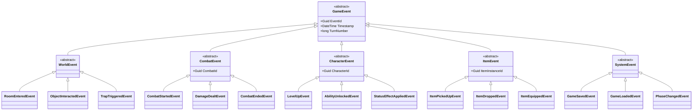

# Event System — Complete Specification

---

## Document Control

| Version | Date | Changes |
|---------|------|---------|
| 1.0 | 2025-12-07 | Initial specification |

---

## 1. Overview

### 1.1 Purpose

The event system provides loose coupling between game systems through a publish/subscribe pattern. It enables:
- **Decoupled Communication**: Systems react to events without direct dependencies
- **Extensibility**: New features subscribe to existing events
- **Audit Trail**: All significant game events logged for debugging/replay
- **UI Updates**: UI layers subscribe to state changes

### 1.2 Design Philosophy

**Tagline**: "Every action broadcasts, interested systems respond"

**Core Principles**:
1. **Immutable Events**: Events represent facts that occurred, cannot be modified
2. **Synchronous by Default**: Handlers execute in subscription order
3. **Optional Async**: Long-running handlers can opt into async processing
4. **Typed Events**: Strong typing prevents subscription mismatches
5. **Ordered Delivery**: Events processed in order raised

---

## 2. Event Architecture

### 2.1 Event Hierarchy



---

## 3. Event Bus Implementation

### 3.1 Interface

```csharp
public interface IEventBus
{
    /// <summary>Publish an event to all subscribers</summary>
    void Publish<T>(T gameEvent) where T : GameEvent;
    
    /// <summary>Publish with async handlers awaited</summary>
    Task PublishAsync<T>(T gameEvent) where T : GameEvent;
    
    /// <summary>Subscribe to an event type</summary>
    IDisposable Subscribe<T>(Action<T> handler) where T : GameEvent;
    
    /// <summary>Subscribe with async handler</summary>
    IDisposable Subscribe<T>(Func<T, Task> handler) where T : GameEvent;
    
    /// <summary>Subscribe with priority (lower = earlier)</summary>
    IDisposable Subscribe<T>(Action<T> handler, int priority) where T : GameEvent;
    
    /// <summary>Unsubscribe all handlers for a subscriber</summary>
    void UnsubscribeAll(object subscriber);
}
```

### 3.2 Implementation

```csharp
public class EventBus : IEventBus
{
    private readonly Dictionary<Type, List<Subscription>> _subscriptions = new();
    private readonly object _lock = new();
    private readonly ILogger<EventBus> _logger;
    
    public void Publish<T>(T gameEvent) where T : GameEvent
    {
        var eventType = typeof(T);
        List<Subscription> handlers;
        
        lock (_lock)
        {
            if (!_subscriptions.TryGetValue(eventType, out handlers!))
                return;
            handlers = handlers.ToList(); // Copy to avoid modification during iteration
        }
        
        foreach (var sub in handlers.OrderBy(s => s.Priority))
        {
            try
            {
                sub.Invoke(gameEvent);
            }
            catch (Exception ex)
            {
                _logger.LogError(ex, "Error in event handler for {EventType}", eventType.Name);
            }
        }
    }
    
    public async Task PublishAsync<T>(T gameEvent) where T : GameEvent
    {
        var eventType = typeof(T);
        List<Subscription> handlers;
        
        lock (_lock)
        {
            if (!_subscriptions.TryGetValue(eventType, out handlers!))
                return;
            handlers = handlers.ToList();
        }
        
        foreach (var sub in handlers.OrderBy(s => s.Priority))
        {
            try
            {
                await sub.InvokeAsync(gameEvent);
            }
            catch (Exception ex)
            {
                _logger.LogError(ex, "Error in async event handler for {EventType}", eventType.Name);
            }
        }
    }
    
    public IDisposable Subscribe<T>(Action<T> handler) where T : GameEvent
    {
        return Subscribe(handler, priority: 100);
    }
    
    public IDisposable Subscribe<T>(Action<T> handler, int priority) where T : GameEvent
    {
        var subscription = new Subscription(
            typeof(T),
            evt => handler((T)evt),
            priority
        );
        
        lock (_lock)
        {
            if (!_subscriptions.ContainsKey(typeof(T)))
                _subscriptions[typeof(T)] = new List<Subscription>();
            _subscriptions[typeof(T)].Add(subscription);
        }
        
        return new SubscriptionHandle(() => RemoveSubscription(subscription));
    }
    
    private void RemoveSubscription(Subscription sub)
    {
        lock (_lock)
        {
            if (_subscriptions.TryGetValue(sub.EventType, out var list))
                list.Remove(sub);
        }
    }
}

internal class Subscription
{
    public Type EventType { get; }
    public Action<object> Handler { get; }
    public Func<object, Task>? AsyncHandler { get; }
    public int Priority { get; }
    
    public Subscription(Type eventType, Action<object> handler, int priority)
    {
        EventType = eventType;
        Handler = handler;
        Priority = priority;
    }
    
    public void Invoke(object evt) => Handler(evt);
    
    public Task InvokeAsync(object evt)
    {
        if (AsyncHandler != null)
            return AsyncHandler(evt);
        Handler(evt);
        return Task.CompletedTask;
    }
}

internal class SubscriptionHandle : IDisposable
{
    private readonly Action _unsubscribe;
    private bool _disposed;
    
    public SubscriptionHandle(Action unsubscribe) => _unsubscribe = unsubscribe;
    
    public void Dispose()
    {
        if (!_disposed)
        {
            _unsubscribe();
            _disposed = true;
        }
    }
}
```

---

## 4. Event Categories

### 4.1 World Events

Events related to exploration and environment.

```csharp
public abstract class WorldEvent : GameEvent
{
    public Guid RoomId { get; init; }
}

public class RoomEnteredEvent : WorldEvent
{
    public Guid PreviousRoomId { get; init; }
    public string TransitionType { get; init; } = string.Empty;
    public bool IsFirstVisit { get; init; }
    public int VisitCount { get; init; }
}

public class RoomExitedEvent : WorldEvent
{
    public Guid DestinationRoomId { get; init; }
    public string ExitDirection { get; init; } = string.Empty;
}

public class ObjectInteractedEvent : WorldEvent
{
    public Guid ObjectInstanceId { get; init; }
    public string ObjectType { get; init; } = string.Empty;
    public string InteractionType { get; init; } = string.Empty;
    public string PreviousState { get; init; } = string.Empty;
    public string NewState { get; init; } = string.Empty;
    public bool WasSuccessful { get; init; }
}

public class TrapTriggeredEvent : WorldEvent
{
    public Guid TrapId { get; init; }
    public string TrapType { get; init; } = string.Empty;
    public int DamageDealt { get; init; }
    public IReadOnlyList<Guid> AffectedCharacterIds { get; init; } = Array.Empty<Guid>();
    public bool WasDisarmed { get; init; }
}

public class SecretDiscoveredEvent : WorldEvent
{
    public Guid SecretId { get; init; }
    public string SecretType { get; init; } = string.Empty;
    public int XpAwarded { get; init; }
}

public class PuzzleSolvedEvent : WorldEvent
{
    public Guid PuzzleId { get; init; }
    public string PuzzleType { get; init; } = string.Empty;
    public int AttemptsUsed { get; init; }
    public int XpAwarded { get; init; }
}
```

### 4.2 Combat Events

Events during combat encounters.

```csharp
public abstract class CombatEvent : GameEvent
{
    public Guid CombatId { get; init; }
    public int RoundNumber { get; init; }
}

public class CombatStartedEvent : CombatEvent
{
    public IReadOnlyList<CombatantInfo> Participants { get; init; } = Array.Empty<CombatantInfo>();
    public bool WasAmbush { get; init; }
    public Guid? AmbusherId { get; init; }
}

public class TurnStartedEvent : CombatEvent
{
    public Guid CombatantId { get; init; }
    public int TurnNumber { get; init; }
}

public class ActionPerformedEvent : CombatEvent
{
    public Guid ActorId { get; init; }
    public string ActionType { get; init; } = string.Empty;
    public Guid? TargetId { get; init; }
    public Guid? AbilityId { get; init; }
    public bool WasSuccessful { get; init; }
}

public class DamageDealtEvent : CombatEvent
{
    public Guid AttackerId { get; init; }
    public Guid TargetId { get; init; }
    public int RawDamage { get; init; }
    public int SoakApplied { get; init; }
    public int FinalDamage { get; init; }
    public string DamageType { get; init; } = string.Empty;
    public bool WasCritical { get; init; }
    public Guid? SourceAbilityId { get; init; }
}

public class HealingReceivedEvent : CombatEvent
{
    public Guid HealerId { get; init; }
    public Guid TargetId { get; init; }
    public int AmountHealed { get; init; }
    public Guid? SourceAbilityId { get; init; }
}

public class CombatantDefeatedEvent : CombatEvent
{
    public Guid DefeatedId { get; init; }
    public Guid? KillerId { get; init; }
    public bool WasPlayer { get; init; }
    public int XpAwarded { get; init; }
}

public class CombatEndedEvent : CombatEvent
{
    public CombatOutcome Outcome { get; init; }
    public int TotalRounds { get; init; }
    public int TotalXpAwarded { get; init; }
    public IReadOnlyList<Guid> DroppedItemIds { get; init; } = Array.Empty<Guid>();
}

public enum CombatOutcome
{
    Victory,        // All enemies defeated
    Defeat,         // Party wiped
    Fled,           // Party escaped
    Negotiated,     // Combat ended via dialogue
    Environmental   // All combatants killed by environment
}

public record CombatantInfo(
    Guid Id,
    string Name,
    bool IsPlayer,
    int CurrentHp,
    int MaxHp
);
```

### 4.3 Character Events

Events related to character state changes.

```csharp
public abstract class CharacterEvent : GameEvent
{
    public Guid CharacterId { get; init; }
}

public class LevelUpEvent : CharacterEvent
{
    public int PreviousLegend { get; init; }
    public int NewLegend { get; init; }
    public int PpAwarded { get; init; }
    public IReadOnlyDictionary<string, int> AttributeIncreases { get; init; } 
        = new Dictionary<string, int>();
}

public class AbilityUnlockedEvent : CharacterEvent
{
    public Guid AbilityId { get; init; }
    public string AbilityName { get; init; } = string.Empty;
    public int PpCost { get; init; }
    public int InitialRank { get; init; }
}

public class AbilityRankUpEvent : CharacterEvent
{
    public Guid AbilityId { get; init; }
    public string AbilityName { get; init; } = string.Empty;
    public int PreviousRank { get; init; }
    public int NewRank { get; init; }
}

public class StatusEffectAppliedEvent : CharacterEvent
{
    public string StatusEffectName { get; init; } = string.Empty;
    public Guid? SourceId { get; init; }
    public int Duration { get; init; }
    public int Stacks { get; init; }
}

public class StatusEffectRemovedEvent : CharacterEvent
{
    public string StatusEffectName { get; init; } = string.Empty;
    public string RemovalReason { get; init; } = string.Empty; // expired, cleansed, replaced
}

public class ResourceChangedEvent : CharacterEvent
{
    public string ResourceType { get; init; } = string.Empty; // HP, Stamina, Mana
    public int PreviousValue { get; init; }
    public int NewValue { get; init; }
    public int MaxValue { get; init; }
    public string ChangeReason { get; init; } = string.Empty;
}
```

### 4.4 Item Events

Events for inventory and equipment.

```csharp
public abstract class ItemEvent : GameEvent
{
    public Guid ItemInstanceId { get; init; }
    public Guid ItemDefinitionId { get; init; }
    public string ItemName { get; init; } = string.Empty;
}

public class ItemPickedUpEvent : ItemEvent
{
    public int Quantity { get; init; }
    public Guid FromRoomId { get; init; }
    public Guid CharacterId { get; init; }
}

public class ItemDroppedEvent : ItemEvent
{
    public int Quantity { get; init; }
    public Guid ToRoomId { get; init; }
    public Guid CharacterId { get; init; }
}

public class ItemEquippedEvent : ItemEvent
{
    public string EquipmentSlot { get; init; } = string.Empty;
    public Guid? PreviousItemId { get; init; }
    public Guid CharacterId { get; init; }
}

public class ItemUnequippedEvent : ItemEvent
{
    public string EquipmentSlot { get; init; } = string.Empty;
    public Guid CharacterId { get; init; }
}

public class ItemUsedEvent : ItemEvent
{
    public Guid CharacterId { get; init; }
    public Guid? TargetId { get; init; }
    public IReadOnlyList<string> Effects { get; init; } = Array.Empty<string>();
    public int? ChargesRemaining { get; init; }
}

public class ItemDestroyedEvent : ItemEvent
{
    public string DestructionReason { get; init; } = string.Empty;
}

public class ItemIdentifiedEvent : ItemEvent
{
    public string RevealedProperties { get; init; } = string.Empty;
}
```

### 4.5 System Events

Events for game system operations.

```csharp
public abstract class SystemEvent : GameEvent { }

public class PhaseChangedEvent : SystemEvent
{
    public GamePhase PreviousPhase { get; init; }
    public GamePhase NewPhase { get; init; }
}

public class GameSavedEvent : SystemEvent
{
    public Guid SaveId { get; init; }
    public int SlotNumber { get; init; }
    public string SaveName { get; init; } = string.Empty;
    public bool IsAutosave { get; init; }
    public TimeSpan SaveDuration { get; init; }
}

public class GameLoadedEvent : SystemEvent
{
    public Guid SaveId { get; init; }
    public TimeSpan LoadDuration { get; init; }
}

public class ErrorOccurredEvent : SystemEvent
{
    public string ErrorType { get; init; } = string.Empty;
    public string Message { get; init; } = string.Empty;
    public string? StackTrace { get; init; }
    public bool IsFatal { get; init; }
}

public class AchievementUnlockedEvent : SystemEvent
{
    public Guid AchievementId { get; init; }
    public string AchievementName { get; init; } = string.Empty;
    public string Description { get; init; } = string.Empty;
}
```

---

## 5. Subscription Patterns

### 5.1 Standard Subscription

```csharp
public class CombatLogSubscriber : IDisposable
{
    private readonly IEventBus _eventBus;
    private readonly List<IDisposable> _subscriptions = new();
    
    public CombatLogSubscriber(IEventBus eventBus)
    {
        _eventBus = eventBus;
        
        _subscriptions.Add(_eventBus.Subscribe<DamageDealtEvent>(OnDamageDealt));
        _subscriptions.Add(_eventBus.Subscribe<CombatantDefeatedEvent>(OnCombatantDefeated));
    }
    
    private void OnDamageDealt(DamageDealtEvent evt)
    {
        Console.WriteLine($"[Combat] {evt.FinalDamage} {evt.DamageType} damage dealt");
    }
    
    private void OnCombatantDefeated(CombatantDefeatedEvent evt)
    {
        Console.WriteLine($"[Combat] Combatant defeated!");
    }
    
    public void Dispose()
    {
        foreach (var sub in _subscriptions)
            sub.Dispose();
    }
}
```

### 5.2 Priority Subscription

```csharp
// UI should update AFTER game logic
_eventBus.Subscribe<DamageDealtEvent>(UpdateHealthBar, priority: 200);

// Logging should happen FIRST for debugging
_eventBus.Subscribe<DamageDealtEvent>(LogDamage, priority: 1);

// Game logic at default priority
_eventBus.Subscribe<DamageDealtEvent>(ProcessDamage, priority: 100);
```

### 5.3 Filtered Subscription

```csharp
// Subscribe but filter to specific character
_eventBus.Subscribe<StatusEffectAppliedEvent>(evt =>
{
    if (evt.CharacterId == _playerId)
        UpdateStatusIcons(evt);
});
```

---

## 6. Event Logging

### 6.1 Event Log Storage

```sql
CREATE TABLE core.event_log (
    id uuid PRIMARY KEY DEFAULT gen_random_uuid(),
    save_game_id uuid REFERENCES core.save_games(id) ON DELETE CASCADE,
    event_type varchar(100) NOT NULL,
    turn_number bigint NOT NULL,
    event_data jsonb NOT NULL,
    created_at timestamptz NOT NULL DEFAULT now()
);

CREATE INDEX idx_event_log_save_turn 
    ON core.event_log(save_game_id, turn_number DESC);
CREATE INDEX idx_event_log_type 
    ON core.event_log(event_type);
```

### 6.2 Event Logger

```csharp
public class EventLogger : IDisposable
{
    private readonly IEventBus _eventBus;
    private readonly IEventLogRepository _repository;
    private readonly IDisposable _subscription;
    private readonly HashSet<Type> _loggedEventTypes;
    
    public EventLogger(IEventBus eventBus, IEventLogRepository repository)
    {
        _eventBus = eventBus;
        _repository = repository;
        
        // Configure which events to log
        _loggedEventTypes = new HashSet<Type>
        {
            typeof(CombatStartedEvent),
            typeof(CombatEndedEvent),
            typeof(LevelUpEvent),
            typeof(ItemPickedUpEvent),
            typeof(SecretDiscoveredEvent),
            typeof(GameSavedEvent)
        };
        
        // Subscribe to base type to catch all
        _subscription = _eventBus.Subscribe<GameEvent>(OnAnyEvent, priority: 0);
    }
    
    private void OnAnyEvent(GameEvent evt)
    {
        if (_loggedEventTypes.Contains(evt.GetType()))
        {
            _ = LogEventAsync(evt);  // Fire and forget
        }
    }
    
    private async Task LogEventAsync(GameEvent evt)
    {
        await _repository.LogAsync(new EventLogEntry
        {
            EventType = evt.GetType().Name,
            TurnNumber = evt.TurnNumber,
            EventData = JsonSerializer.Serialize(evt)
        });
    }
    
    public void Dispose() => _subscription.Dispose();
}
```

---

## 7. Phased Implementation Guide

### Phase 1: Core Infrastructure
- [ ] **Interfaces**: Define `IEventBus` and `GameEvent` abstract base class.
- [ ] **Implementation**: Create thread-safe `EventBus` with priority support.
- [ ] **Unit Tests**: Verify Publish/Subscribe mechanics and exception isolation.

### Phase 2: Domain Events
- [ ] **Definitions**: Implement all event classes (World, Combat, Character, Item).
- [ ] **Serialization**: Ensure all events are JSON-serializable (no circular refs).
- [ ] **Typed Hubs**: Create `WorldEvents`, `CombatEvents` standard collections.

### Phase 3: Systems Integration
- [ ] **Logger**: Implement `EventLogger` to persist events to PostgreSQL.
- [ ] **Game Loop**: Connect `TurnManager` to publish `TurnStarted`/`TurnEnded`.
- [ ] **Save System**: Publish `GameSaved`/`GameLoaded` for UI notification.

### Phase 4: UI & Feedback
- [ ] **Activity Log**: Create subscriber to route `Information` level events to TUI.
- [ ] **Visual Debugger**: Create admin panel to view realtime event stream.

---

## 8. Testing Requirements

### 8.1 Unit Tests
- [ ] **Routing**: Verify event T goes to Subscriber<T>.
- [ ] **Priority**: Verify Priority 1 runs before Priority 100.
- [ ] **Isolation**: Verify one handler crashing doesn't stop others.
- [ ] **Unsubscribe**: Verify disposed subscription stops receiving.
- [ ] **Async**: Verify `PublishAsync` awaits all handlers.

### 8.2 Integration Tests
- [ ] **Persistence**: Publish 1000 events -> Verify 1000 rows in DB.
- [ ] **Serialization**: Deserialize DB JSON -> Verify matches original object.
- [ ] **Game Loop**: Run 10 turns -> Verify 10 TurnStarted events logged.

### 8.3 Manual QA
- [ ] **Event Flood**: Spam events via debug command -> Verify no UI stutter.
- [ ] **Save/Load**: Save game -> Verify GameSavedEvent appears in log.

---

## 9. Logging Requirements

**Reference:** [logging.md](logging.md)

### 9.1 Operational Logs (Bus Diagnostics)

These logs track the *health* of the Event Bus itself, not the game events passing through it.

| Event | Level | Message Template | Properties |
|-------|-------|------------------|------------|
| Handler Error | Error | "Event handler failed for {EventType}" | `EventType`, `Subscriber`, `Exception` |
| Slow Handler | Warning | "Slow event handler detected ({Duration}ms) for {EventType}" | `Duration`, `EventType` |
| Bus Saturation | Warning | "Event queue depth exceeded {Depth}" | `Depth` |

### 9.2 Example Implementation

```csharp
catch (Exception ex)
{
    _logger.LogError(ex, "Event handler failed for {EventType}", eventType.Name);
}
```

---

## 10. Related Specifications

| Spec ID | Relationship |
|---------|--------------|
| `SPEC-CORE-LOGGING` | Defines persistence schema for events |
| `SPEC-CORE-PERSISTENCE` | Events trigger saves/loads |
| `SPEC-UI-ACTIVITY` | Consumes events for player feedback |

