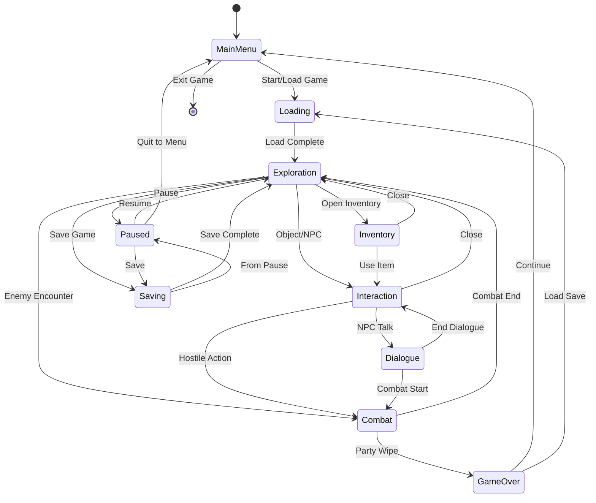
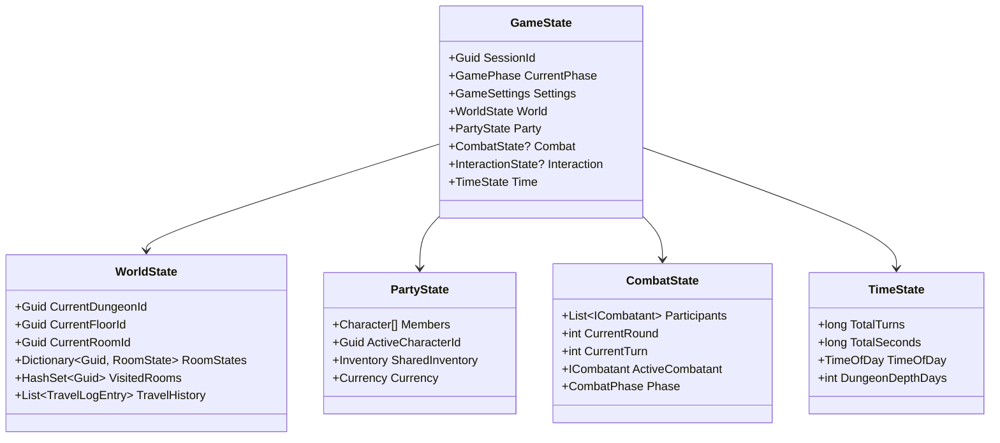
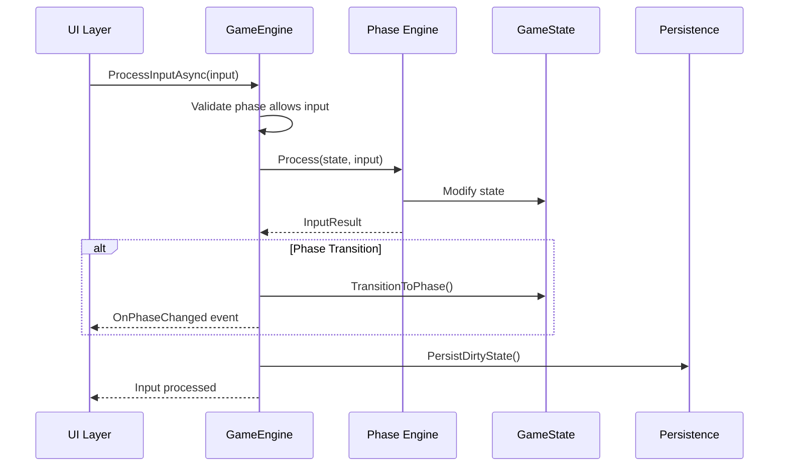

# Game Loop & State Management — Complete Specification

---

## Document Control

| Version | Date | Changes |
|---------|------|---------|
| 1.0 | 2025-12-07 | Initial specification |

---

## 1. Overview

### 1.1 Purpose

The game loop orchestrates all game systems, manages state transitions, and coordinates the flow of gameplay. It serves as the central nervous system connecting:
- **Persistence** — Save/Load operations
- **Exploration** — Room navigation, discovery
- **Combat** — Battle execution
- **Interaction** — Object/NPC interaction
- **UI** — Terminal and Avalonia interfaces

### 1.2 Design Philosophy

**Tagline**: "Turn-based precision, state-driven clarity"

**Core Principles**:
1. **State Machine**: Discrete, well-defined game phases
2. **Event-Driven**: Loose coupling through message passing
3. **Deterministic**: Same inputs produce same outputs (seeded RNG)
4. **Undoable**: Action history for potential undo/replay
5. **Testable**: All state transitions unit-testable

---

## 2. Game Phases

### 2.1 Phase State Machine



### 2.2 Phase Definitions

```csharp
public enum GamePhase
{
    /// <summary>Main menu, no active game session</summary>
    MainMenu,
    
    /// <summary>Loading a save or starting new game</summary>
    Loading,
    
    /// <summary>Free exploration, movement between rooms</summary>
    Exploration,
    
    /// <summary>Active combat encounter</summary>
    Combat,
    
    /// <summary>Interacting with object or NPC</summary>
    Interaction,
    
    /// <summary>In dialogue with NPC</summary>
    Dialogue,
    
    /// <summary>Inventory/character management</summary>
    Inventory,
    
    /// <summary>Game paused</summary>
    Paused,
    
    /// <summary>Save operation in progress</summary>
    Saving,
    
    /// <summary>Party defeated</summary>
    GameOver
}
```

### 2.3 Phase Transition Rules

| From | To | Trigger | Conditions |
|------|----|---------|------------|
| MainMenu | Loading | Player selects save | Valid save exists |
| MainMenu | Loading | Player starts new game | — |
| Loading | Exploration | Load complete | State valid |
| Exploration | Combat | Enemy encounter | Enemies in room, not fled |
| Exploration | Interaction | Player interacts | Object/NPC in range |
| Exploration | Inventory | Player opens inventory | — |
| Exploration | Paused | Player pauses | — |
| Exploration | Saving | Quicksave/Autosave | Not in combat |
| Combat | Exploration | All enemies defeated | — |
| Combat | Exploration | Combat fled | Flee succeeded |
| Combat | GameOver | Party wiped | All party HP ≤ 0 |
| Interaction | Exploration | Player closes | — |
| Interaction | Combat | Hostile action | NPC turns hostile |
| Inventory | Exploration | Player closes | — |
| Paused | MainMenu | Player quits | Confirm dialog |
| GameOver | Loading | Player loads save | Valid save |

---

## 3. Game State Architecture

### 3.1 State Hierarchy



### 3.2 GameState Class

```csharp
public class GameState
{
    public Guid SessionId { get; init; }
    public GamePhase CurrentPhase { get; private set; }
    public GamePhase PreviousPhase { get; private set; }
    
    public GameSettings Settings { get; init; } = null!;
    public WorldState World { get; init; } = null!;
    public PartyState Party { get; init; } = null!;
    public TimeState Time { get; init; } = null!;
    
    // Optional states (only present in specific phases)
    public CombatState? Combat { get; private set; }
    public InteractionState? Interaction { get; private set; }
    public DialogueState? Dialogue { get; private set; }
    
    // State transition
    public void TransitionTo(GamePhase newPhase)
    {
        ValidateTransition(CurrentPhase, newPhase);
        PreviousPhase = CurrentPhase;
        CurrentPhase = newPhase;
        OnPhaseChanged?.Invoke(this, new PhaseChangedEventArgs(PreviousPhase, CurrentPhase));
    }
    
    public event EventHandler<PhaseChangedEventArgs>? OnPhaseChanged;
    
    private void ValidateTransition(GamePhase from, GamePhase to)
    {
        // Enforce valid transitions from state machine
        if (!IsValidTransition(from, to))
            throw new InvalidStateTransitionException(from, to);
    }
}
```

### 3.3 WorldState

```csharp
public class WorldState
{
    public Guid CurrentDungeonId { get; set; }
    public Guid CurrentFloorId { get; set; }
    public Guid CurrentRoomId { get; set; }
    
    // Room state cache (loaded from DB, modified in memory)
    private readonly Dictionary<Guid, RoomRuntimeState> _roomStates = new();
    
    // Visited rooms (persisted)
    public IReadOnlySet<Guid> VisitedRoomIds => _visitedRooms;
    private readonly HashSet<Guid> _visitedRooms = new();
    
    // Travel history (last N entries, full history in DB)
    public IReadOnlyList<TravelLogEntry> RecentTravelHistory => _travelHistory;
    private readonly List<TravelLogEntry> _travelHistory = new();
    private const int MaxTravelHistoryInMemory = 50;
    
    public void EnterRoom(Guid roomId, string transitionType)
    {
        var entry = new TravelLogEntry(
            FromRoomId: CurrentRoomId,
            ToRoomId: roomId,
            TransitionType: transitionType,
            Timestamp: DateTime.UtcNow
        );
        
        _travelHistory.Add(entry);
        if (_travelHistory.Count > MaxTravelHistoryInMemory)
            _travelHistory.RemoveAt(0);
        
        _visitedRooms.Add(roomId);
        CurrentRoomId = roomId;
        
        OnRoomEntered?.Invoke(this, new RoomEnteredEventArgs(entry));
    }
    
    public RoomRuntimeState GetRoomState(Guid roomId)
    {
        if (!_roomStates.TryGetValue(roomId, out var state))
        {
            state = new RoomRuntimeState(roomId);
            _roomStates[roomId] = state;
        }
        return state;
    }
    
    public event EventHandler<RoomEnteredEventArgs>? OnRoomEntered;
}

public record TravelLogEntry(
    Guid FromRoomId,
    Guid ToRoomId,
    string TransitionType,
    DateTime Timestamp
);
```

### 3.4 RoomRuntimeState

```csharp
public class RoomRuntimeState
{
    public Guid RoomId { get; }
    public bool IsLoaded { get; private set; }
    
    // Object states (chests, doors, traps, etc.)
    private readonly Dictionary<Guid, ObjectRuntimeState> _objectStates = new();
    
    // Enemies currently in room (spawned, not yet defeated)
    private readonly List<Guid> _activeEnemyIds = new();
    
    // Items on ground
    private readonly List<Guid> _groundItemIds = new();
    
    // Environmental effects
    public LightingLevel Lighting { get; set; } = LightingLevel.Normal;
    public bool IsFogged { get; set; }
    public bool IsFlooded { get; set; }
    public int FloodLevel { get; set; }
    
    // Flags
    public bool IsCleared { get; set; }  // All enemies defeated
    public bool IsFullyLooted { get; set; }  // All containers opened
    
    public RoomRuntimeState(Guid roomId)
    {
        RoomId = roomId;
    }
    
    public void SetObjectState(Guid objectInstanceId, string state, object? data = null)
    {
        if (!_objectStates.TryGetValue(objectInstanceId, out var objState))
        {
            objState = new ObjectRuntimeState(objectInstanceId);
            _objectStates[objectInstanceId] = objState;
        }
        
        objState.State = state;
        objState.StateData = data;
        objState.LastModified = DateTime.UtcNow;
        objState.IsDirty = true;
    }
    
    public ObjectRuntimeState? GetObjectState(Guid objectInstanceId)
    {
        return _objectStates.GetValueOrDefault(objectInstanceId);
    }
    
    public IEnumerable<ObjectRuntimeState> GetDirtyObjectStates()
    {
        return _objectStates.Values.Where(o => o.IsDirty);
    }
}

public class ObjectRuntimeState
{
    public Guid ObjectInstanceId { get; }
    public string State { get; set; } = "default";
    public object? StateData { get; set; }
    public DateTime LastModified { get; set; }
    public bool IsDirty { get; set; }
    
    public ObjectRuntimeState(Guid objectInstanceId)
    {
        ObjectInstanceId = objectInstanceId;
    }
}

public enum LightingLevel
{
    Pitch,      // Total darkness
    Dim,        // Reduced visibility
    Normal,     // Standard lighting
    Bright      // Enhanced visibility
}
```

---

## 4. Game Engine

### 4.1 Engine Interface

```csharp
public interface IGameEngine
{
    // State access
    GameState State { get; }
    GamePhase CurrentPhase { get; }
    
    // Lifecycle
    Task InitializeAsync();
    Task<LoadResult> LoadGameAsync(Guid saveId);
    Task<LoadResult> NewGameAsync(NewGameOptions options);
    Task<SaveResult> SaveGameAsync(int slot, string name);
    void Shutdown();
    
    // Main loop
    Task ProcessInputAsync(IGameInput input);
    void Update(float deltaTime);
    
    // Phase management
    void TransitionToPhase(GamePhase phase);
    
    // Events
    event EventHandler<PhaseChangedEventArgs> OnPhaseChanged;
    event EventHandler<TurnCompletedEventArgs> OnTurnCompleted;
    event EventHandler<RoomChangedEventArgs> OnRoomChanged;
}
```

### 4.2 Engine Implementation

```csharp
public class GameEngine : IGameEngine, IDisposable
{
    private readonly IUnitOfWork _unitOfWork;
    private readonly ISaveService _saveService;
    private readonly ILoadService _loadService;
    private readonly ICombatEngine _combatEngine;
    private readonly IExplorationEngine _explorationEngine;
    private readonly IInteractionEngine _interactionEngine;
    private readonly IEventBus _eventBus;
    
    public GameState State { get; private set; } = null!;
    public GamePhase CurrentPhase => State?.CurrentPhase ?? GamePhase.MainMenu;
    
    public GameEngine(
        IUnitOfWork unitOfWork,
        ISaveService saveService,
        ILoadService loadService,
        ICombatEngine combatEngine,
        IExplorationEngine explorationEngine,
        IInteractionEngine interactionEngine,
        IEventBus eventBus)
    {
        _unitOfWork = unitOfWork;
        _saveService = saveService;
        _loadService = loadService;
        _combatEngine = combatEngine;
        _explorationEngine = explorationEngine;
        _interactionEngine = interactionEngine;
        _eventBus = eventBus;
        
        SubscribeToEvents();
    }
    
    public async Task ProcessInputAsync(IGameInput input)
    {
        // Route input to appropriate sub-engine based on phase
        var result = CurrentPhase switch
        {
            GamePhase.Exploration => await _explorationEngine.ProcessAsync(State, input),
            GamePhase.Combat => await _combatEngine.ProcessAsync(State, input),
            GamePhase.Interaction => await _interactionEngine.ProcessAsync(State, input),
            GamePhase.Inventory => await ProcessInventoryInputAsync(input),
            GamePhase.Paused => ProcessPausedInput(input),
            _ => InputResult.Ignored
        };
        
        // Handle result
        if (result.PhaseTransition.HasValue)
        {
            TransitionToPhase(result.PhaseTransition.Value);
        }
        
        // Persist dirty state
        await PersistDirtyStateAsync();
    }
    
    public void Update(float deltaTime)
    {
        // Time-based updates (animations, effects, autosave timer)
        State.Time.AddRealTime(deltaTime);
        
        // Check autosave
        if (ShouldAutosave())
        {
            _ = AutosaveAsync();  // Fire and forget
        }
    }
    
    private async Task PersistDirtyStateAsync()
    {
        // Persist any modified room states
        foreach (var roomState in State.World.GetDirtyRoomStates())
        {
            await _unitOfWork.RoomStates.UpsertAsync(roomState.ToEntity());
        }
        
        // Persist item movements
        foreach (var itemMove in State.Party.Inventory.GetPendingMoves())
        {
            await _unitOfWork.ItemInstances.MoveAsync(
                itemMove.ItemId, 
                itemMove.NewLocationType, 
                itemMove.NewLocationId);
        }
        
        await _unitOfWork.SaveChangesAsync();
    }
    
    public event EventHandler<PhaseChangedEventArgs>? OnPhaseChanged;
    public event EventHandler<TurnCompletedEventArgs>? OnTurnCompleted;
    public event EventHandler<RoomChangedEventArgs>? OnRoomChanged;
}
```

---

## 5. Input System

### 5.1 Input Interface

```csharp
public interface IGameInput
{
    InputType Type { get; }
    object? Data { get; }
}

public enum InputType
{
    // Movement
    MoveNorth, MoveSouth, MoveEast, MoveWest,
    MoveUp, MoveDown,  // Stairs, ladders
    
    // Interaction
    Interact, Examine, Search,
    
    // Combat
    Attack, Defend, UseAbility, UseItem, Flee,
    SelectTarget, ConfirmAction, CancelAction,
    
    // Inventory
    OpenInventory, CloseInventory,
    SelectItem, UseSelectedItem, DropItem, EquipItem,
    
    // System
    Pause, Resume, Save, QuickSave, QuickLoad,
    OpenMap, OpenCharacter, OpenJournal,
    
    // Dialogue
    SelectDialogueOption, SkipDialogue,
    
    // Debug (dev only)
    DebugTeleport, DebugSpawnItem, DebugGodMode
}
```

### 5.2 Input Processing Flow



---

## 6. Turn System

### 6.1 Turn Structure

The game uses a turn-based system for both exploration and combat.

**Exploration Turn**:
```csharp
public class ExplorationTurn
{
    public long TurnNumber { get; }
    public Guid ActingCharacterId { get; }
    public IGameInput Input { get; }
    public ExplorationAction Action { get; }
    public TurnResult Result { get; }
    public IReadOnlyList<GameEvent> Events { get; }
}

public enum ExplorationAction
{
    Move,
    Interact,
    Search,
    Rest,
    UseItem,
    Wait
}
```

**Combat Turn** (See [combat spec](../03-combat/)):
```csharp
public class CombatTurn
{
    public int RoundNumber { get; }
    public int TurnNumber { get; }
    public ICombatant Actor { get; }
    public IReadOnlyList<CombatAction> Actions { get; }
    public TurnResult Result { get; }
}
```

### 6.2 Turn Processing

```csharp
public class TurnProcessor
{
    public async Task<TurnResult> ProcessExplorationTurnAsync(
        GameState state, 
        IGameInput input)
    {
        var turn = new ExplorationTurn(state.Time.TotalTurns + 1);
        var events = new List<GameEvent>();
        
        // 1. Pre-turn effects (status ticks, environmental)
        events.AddRange(ProcessPreTurnEffects(state));
        
        // 2. Process player action
        var actionResult = await ProcessActionAsync(state, input);
        events.AddRange(actionResult.Events);
        
        // 3. World response (enemy actions, trap triggers)
        events.AddRange(ProcessWorldResponse(state));
        
        // 4. Post-turn cleanup
        events.AddRange(ProcessPostTurnEffects(state));
        
        // 5. Advance time
        state.Time.AdvanceTurn();
        
        return new TurnResult(turn, events, actionResult.PhaseTransition);
    }
}
```

---

## 7. Event System

### 7.1 Event Bus

```csharp
public interface IEventBus
{
    void Publish<T>(T gameEvent) where T : GameEvent;
    void Subscribe<T>(Action<T> handler) where T : GameEvent;
    void Unsubscribe<T>(Action<T> handler) where T : GameEvent;
}

public abstract class GameEvent
{
    public Guid EventId { get; } = Guid.NewGuid();
    public DateTime Timestamp { get; } = DateTime.UtcNow;
    public long TurnNumber { get; init; }
}
```

### 7.2 Core Events

```csharp
// Phase events
public class PhaseChangedEvent : GameEvent
{
    public GamePhase PreviousPhase { get; init; }
    public GamePhase NewPhase { get; init; }
}

// World events
public class RoomEnteredEvent : GameEvent
{
    public Guid PreviousRoomId { get; init; }
    public Guid NewRoomId { get; init; }
    public string TransitionType { get; init; } = string.Empty;
    public bool FirstVisit { get; init; }
}

public class ObjectInteractedEvent : GameEvent
{
    public Guid RoomId { get; init; }
    public Guid ObjectInstanceId { get; init; }
    public string ObjectType { get; init; } = string.Empty;
    public string PreviousState { get; init; } = string.Empty;
    public string NewState { get; init; } = string.Empty;
}

public class ItemPickedUpEvent : GameEvent
{
    public Guid ItemInstanceId { get; init; }
    public Guid ItemDefinitionId { get; init; }
    public string ItemName { get; init; } = string.Empty;
    public int Quantity { get; init; }
    public Guid FromRoomId { get; init; }
}

public class ItemDroppedEvent : GameEvent
{
    public Guid ItemInstanceId { get; init; }
    public Guid ToRoomId { get; init; }
}

// Combat events
public class CombatStartedEvent : GameEvent
{
    public Guid CombatId { get; init; }
    public IReadOnlyList<Guid> ParticipantIds { get; init; } = Array.Empty<Guid>();
}

public class CombatEndedEvent : GameEvent
{
    public Guid CombatId { get; init; }
    public CombatOutcome Outcome { get; init; }
}

// Save events
public class GameSavedEvent : GameEvent
{
    public Guid SaveId { get; init; }
    public int Slot { get; init; }
    public bool IsAutosave { get; init; }
}

public class GameLoadedEvent : GameEvent
{
    public Guid SaveId { get; init; }
}
```

### 7.3 Event Subscribers

```csharp
// Example: Autosave on room change
public class AutosaveSubscriber
{
    private readonly ISaveService _saveService;
    private readonly IEventBus _eventBus;
    private int _roomsSinceLastSave = 0;
    
    public AutosaveSubscriber(ISaveService saveService, IEventBus eventBus)
    {
        _saveService = saveService;
        _eventBus = eventBus;
        _eventBus.Subscribe<RoomEnteredEvent>(OnRoomEntered);
    }
    
    private async void OnRoomEntered(RoomEnteredEvent evt)
    {
        _roomsSinceLastSave++;
        if (_roomsSinceLastSave >= 5)  // Autosave every 5 rooms
        {
            await _saveService.AutoSaveAsync();
            _roomsSinceLastSave = 0;
        }
    }
}
```

---

## 8. Time Management

### 8.1 Time State

```csharp
public class TimeState
{
    // Game time (advances with turns)
    public long TotalTurns { get; private set; }
    public long TotalGameSeconds { get; private set; }
    
    // Real time (session tracking)
    public TimeSpan TotalPlaytime { get; private set; }
    public DateTime SessionStarted { get; init; }
    
    // Time of day simulation
    public TimeOfDay CurrentTimeOfDay { get; private set; }
    public int DungeonDepthDays { get; private set; }  // Days spent at current depth
    
    public void AdvanceTurn(int turnsToAdvance = 1)
    {
        TotalTurns += turnsToAdvance;
        TotalGameSeconds += turnsToAdvance * SecondsPerTurn;
        UpdateTimeOfDay();
    }
    
    public void AddRealTime(float deltaSeconds)
    {
        TotalPlaytime += TimeSpan.FromSeconds(deltaSeconds);
    }
    
    private void UpdateTimeOfDay()
    {
        // 24-hour cycle = 2400 game seconds = 400 turns
        var hourOfDay = (TotalGameSeconds % 2400) / 100;
        CurrentTimeOfDay = hourOfDay switch
        {
            >= 0 and < 6 => TimeOfDay.Night,
            >= 6 and < 12 => TimeOfDay.Morning,
            >= 12 and < 18 => TimeOfDay.Afternoon,
            >= 18 and < 22 => TimeOfDay.Evening,
            _ => TimeOfDay.Night
        };
    }
    
    private const int SecondsPerTurn = 6;  // 6 seconds per exploration turn
}

public enum TimeOfDay
{
    Night,
    Morning,
    Afternoon,
    Evening
}
```

---

## 9. Phased Implementation Guide

### Phase 1: Core State
- [ ] **State Models**: Implement `GameState`, `WorldState`, `RoomRuntimeState`.
- [ ] **Time State**: Implement `TimeState` with turn/time tracking logic.
- [ ] **Enums**: Define `GamePhase` and `InputType` enums.

### Phase 2: Engine Foundation
- [ ] **Interface**: Define `IGameEngine` interface.
- [ ] **Implementation**: Create `GameEngine` class with minimal `Update()` loop.
- [ ] **Input Pipeline**: Implement `ProcessInputAsync` routing structure.

### Phase 3: Event System Integration
- [ ] **Event Bus**: Connect `IEventBus` to Engine (Dependency Injection).
- [ ] **Publishing**: Trigger `PhaseChanged` and `TurnCompleted` events.
- [ ] **Subscription**: Hook up internal subscribers (e.g. Autosave).

### Phase 4: Persistence & UI
- [ ] **Persistence**: Connect `SaveService`/`LoadService` to `GameEngine`.
- [ ] **Dirty Tracking**: Implement `PersistDirtyStateAsync` logic.
- [ ] **Feedback**: Ensure state changes trigger UI events (TUI updates).

---

## 10. Testing Requirements

### 10.1 Unit Tests
- [ ] **Phase Transitions**: Verify invalid transitions throw exception.
- [ ] **Time Tracking**: Verify `AdvanceTurn(1)` adds correct seconds.
- [ ] **Input Routing**: Verify `Inventory` input only works in Inventory phase.
- [ ] **Room State**: Verify `EnterRoom` updates `VisitedRooms` list.

### 10.2 Integration Tests
- [ ] **Turn Cycle**: Input -> Action -> Event -> Time Advance.
- [ ] **Save/Load**: Save game -> Load -> State is identical.
- [ ] **Long Play**: Simulate 1000 turns -> Verify no memory leak/state drift.

### 10.3 Manual QA
- [ ] **Responsiveness**: Rapid input doesn't desync state.
- [ ] **Phase UI**: Verify UI layout changes correctly on phase switch.
- [ ] **Autosave**: Verify autosave works invisibly without stutter.

---

## 11. Logging Requirements

**Reference:** [logging.md](logging.md)

### 11.1 Log Events

| Event | Level | Message Template | Properties |
|-------|-------|------------------|------------|
| Engine Init | Information | "Game Engine initialized (Session: {SessionId})" | `SessionId` |
| Phase Change | Information | "Phase transition: {FromPhase} -> {ToPhase}" | `FromPhase`, `ToPhase` |
| Turn Complete | Verbose | "Turn {TurnNumber} completed (Character: {ActorId})" | `TurnNumber`, `ActorId` |
| Room Change | Debug | "Entered room {RoomId} via {Transition}" | `RoomId`, `Transition` |
| Save/Load | Information | "{Operation} game '{SaveName}' detected" | `Operation`, `SaveName` |

### 11.2 Context Enrichment

During game loop execution:

| Property | Source | Description |
|----------|--------|-------------|
| `Phase` | LogContext | Current GamePhase |
| `Turn` | LogContext | Current Turn Number |
| `Room` | LogContext | Current Room ID |

---

## 12. Related Documents

- [persistence.md](./persistence.md) — Persistence layer configuration
- [events.md](./events.md) — Event system specification
- [../03-combat/combat-overview.md](../03-combat/combat-overview.md) — Combat loop integration
