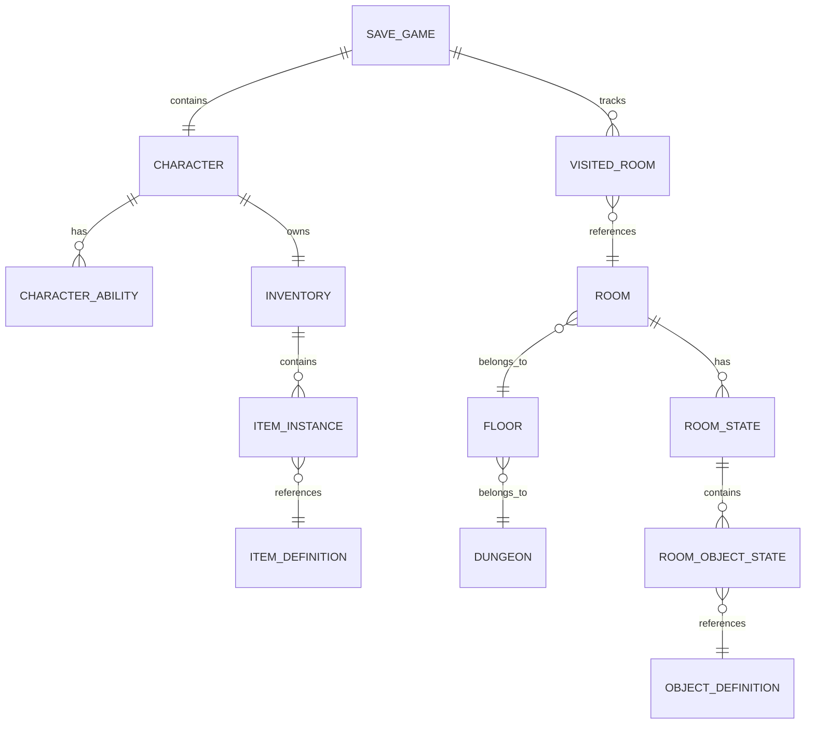
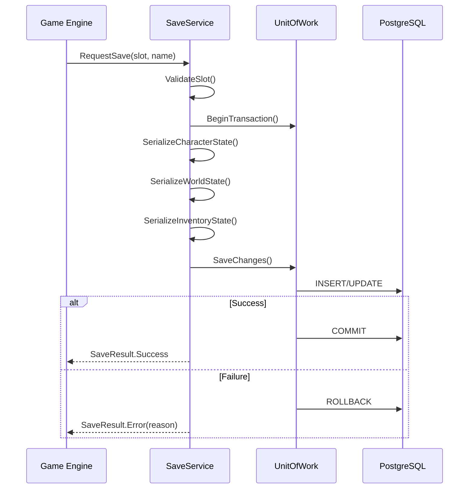
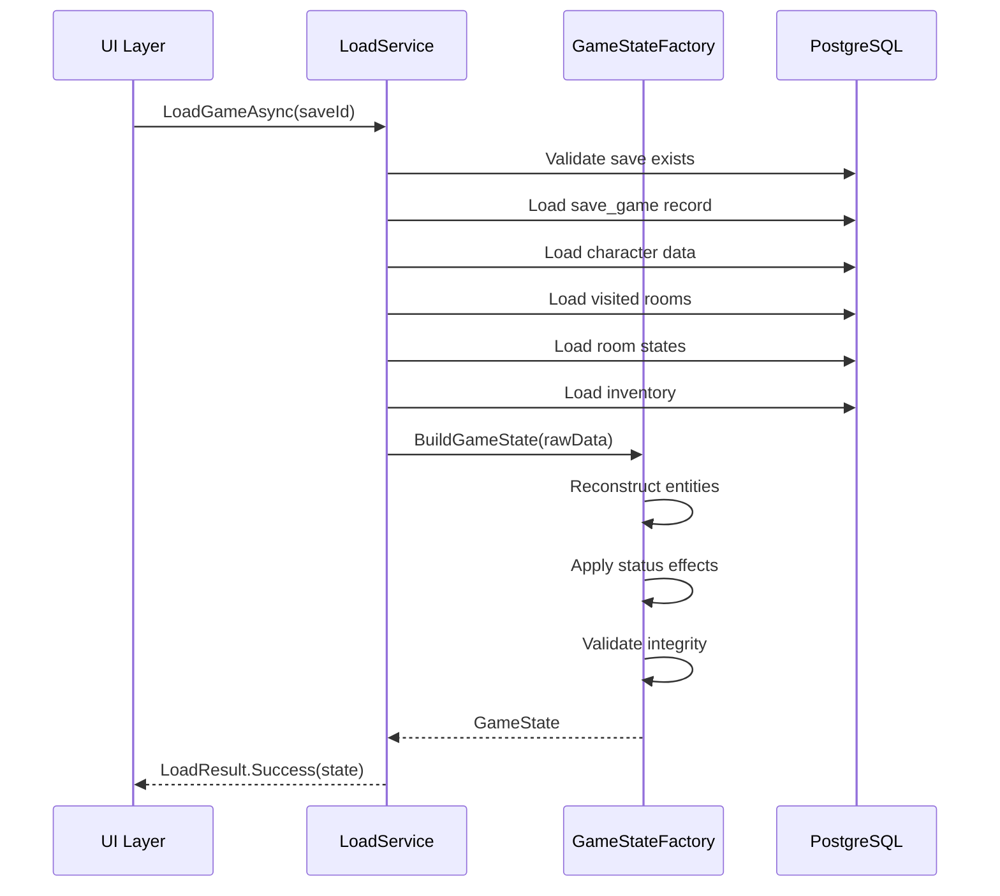

# Core Persistence System — Complete Specification

---

## Document Control

| Version | Date | Changes |
|---------|------|---------|
| 1.0 | 2025-12-07 | Initial specification |

---

## 1. Overview

### 1.1 Purpose

The persistence system provides complete state preservation for Rune & Rust, enabling:
- **Save/Load**: Full game state serialization and restoration
- **Location History**: Tracking of all visited rooms and floors
- **Room States**: Persistence of room modifications (looted chests, triggered traps, solved puzzles)
- **Item Tracking**: Item locations, ownership, and state changes
- **Character Progress**: All character data, abilities, equipment, and progression

### 1.2 Design Philosophy

**Tagline**: "Every action remembered, every state preserved"

**Core Principles**:
1. **Data-Driven**: All game content defined in database, not hardcoded
2. **Incremental Saves**: Efficient delta-based persistence, not full snapshots
3. **Integrity First**: ACID compliance, foreign key constraints, validation
4. **Query Optimized**: Indexed for common read patterns (room lookup, inventory access)
5. **Audit Trail**: Optional logging of significant state changes

### 1.3 Technology Stack

| Component | Technology |
|-----------|------------|
| Database | PostgreSQL 15+ |
| ORM | Entity Framework Core 8 |
| Migrations | EF Core Migrations |
| Connection Pooling | Npgsql |

---

## 2. Database Architecture

### 2.1 Schema Namespaces

The database is organized into logical schema namespaces:

| Schema | Purpose | Tables |
|--------|---------|--------|
| `core` | Fundamental game data | `save_games`, `game_settings` |
| `character` | Character data | `characters`, `character_abilities`, `character_stats` |
| `world` | World state | `dungeons`, `floors`, `rooms`, `room_states` |
| `inventory` | Items & equipment | `items`, `item_instances`, `inventories` |
| `combat` | Combat state | `combats`, `combat_participants` |
| `progression` | Advancement | `experience_logs`, `achievements` |

### 2.2 Entity Relationship Diagram



---

## 3. Core Tables

### 3.1 Save Game Management

#### `core.save_games`

Primary save game record containing metadata and references.

| Column | Type | Constraints | Description |
|--------|------|-------------|-------------|
| `id` | `uuid` | PK, DEFAULT gen_random_uuid() | Unique save identifier |
| `slot_number` | `int` | NOT NULL, CHECK (1-10) | Save slot (1-10) |
| `save_name` | `varchar(100)` | NOT NULL | Player-defined name |
| `character_id` | `uuid` | FK → characters.id | Active character |
| `current_room_id` | `uuid` | FK → rooms.id | Current location |
| `playtime_seconds` | `bigint` | NOT NULL DEFAULT 0 | Total playtime |
| `game_version` | `varchar(20)` | NOT NULL | Game version at save |
| `created_at` | `timestamptz` | NOT NULL DEFAULT now() | Creation timestamp |
| `updated_at` | `timestamptz` | NOT NULL DEFAULT now() | Last save timestamp |
| `is_autosave` | `boolean` | NOT NULL DEFAULT false | Autosave flag |
| `is_deleted` | `boolean` | NOT NULL DEFAULT false | Soft delete flag |

**Indexes**:
```sql
CREATE INDEX idx_save_games_slot ON core.save_games(slot_number) WHERE NOT is_deleted;
CREATE INDEX idx_save_games_updated ON core.save_games(updated_at DESC);
```

#### `core.game_settings`

Per-save game settings and preferences.

| Column | Type | Constraints | Description |
|--------|------|-------------|-------------|
| `save_game_id` | `uuid` | PK, FK → save_games.id | Parent save |
| `difficulty` | `varchar(20)` | NOT NULL DEFAULT 'normal' | Difficulty level |
| `auto_save_interval` | `int` | NOT NULL DEFAULT 300 | Autosave interval (seconds) |
| `combat_speed` | `varchar(20)` | NOT NULL DEFAULT 'normal' | Combat animation speed |
| `settings_json` | `jsonb` | | Additional settings |

---

### 3.2 Location Tracking

#### `world.visited_rooms`

Tracks every room the player has discovered and entered.

| Column | Type | Constraints | Description |
|--------|------|-------------|-------------|
| `id` | `uuid` | PK | Unique record ID |
| `save_game_id` | `uuid` | FK → save_games.id, NOT NULL | Parent save |
| `room_id` | `uuid` | FK → rooms.id, NOT NULL | Room reference |
| `first_visited_at` | `timestamptz` | NOT NULL DEFAULT now() | First discovery |
| `last_visited_at` | `timestamptz` | NOT NULL DEFAULT now() | Most recent visit |
| `visit_count` | `int` | NOT NULL DEFAULT 1 | Total visits |
| `discovered_secrets` | `int` | NOT NULL DEFAULT 0 | Secrets found in room |
| `is_mapped` | `boolean` | NOT NULL DEFAULT true | Shown on map |

**Indexes**:
```sql
CREATE UNIQUE INDEX idx_visited_rooms_save_room 
    ON world.visited_rooms(save_game_id, room_id);
CREATE INDEX idx_visited_rooms_last_visited 
    ON world.visited_rooms(save_game_id, last_visited_at DESC);
```

#### `world.travel_log`

Sequential log of room transitions for history/backtracking.

| Column | Type | Constraints | Description |
|--------|------|-------------|-------------|
| `id` | `uuid` | PK | Unique record ID |
| `save_game_id` | `uuid` | FK → save_games.id | Parent save |
| `from_room_id` | `uuid` | FK → rooms.id, NULL | Origin room (NULL = game start) |
| `to_room_id` | `uuid` | FK → rooms.id, NOT NULL | Destination room |
| `transition_type` | `varchar(20)` | NOT NULL | 'walk', 'stairs', 'teleport', 'fall' |
| `traveled_at` | `timestamptz` | NOT NULL DEFAULT now() | When traveled |
| `sequence_number` | `bigint` | NOT NULL | Order in travel history |

**Indexes**:
```sql
CREATE INDEX idx_travel_log_sequence 
    ON world.travel_log(save_game_id, sequence_number DESC);
```

---

### 3.3 Room State Persistence

#### `world.room_states`

Persistent modifications to room state.

| Column | Type | Constraints | Description |
|--------|------|-------------|-------------|
| `id` | `uuid` | PK | Unique record ID |
| `save_game_id` | `uuid` | FK → save_games.id | Parent save |
| `room_id` | `uuid` | FK → rooms.id | Room reference |
| `state_type` | `varchar(50)` | NOT NULL | State category |
| `state_data` | `jsonb` | NOT NULL | Flexible state storage |
| `modified_at` | `timestamptz` | NOT NULL DEFAULT now() | Last modification |

**State Types**:
| Type | Description | Example `state_data` |
|------|-------------|---------------------|
| `lighting` | Room lighting changes | `{"level": "dark", "sources": []}` |
| `environmental` | Environmental effects | `{"flooded": true, "water_level": 2}` |
| `structural` | Structural changes | `{"collapsed_ceiling": true}` |
| `atmosphere` | Ambient conditions | `{"fog": true, "temperature": "cold"}` |

**Indexes**:
```sql
CREATE UNIQUE INDEX idx_room_states_save_room_type 
    ON world.room_states(save_game_id, room_id, state_type);
```

#### `world.room_object_states`

Individual object states within rooms.

| Column | Type | Constraints | Description |
|--------|------|-------------|-------------|
| `id` | `uuid` | PK | Unique record ID |
| `save_game_id` | `uuid` | FK → save_games.id | Parent save |
| `room_id` | `uuid` | FK → rooms.id | Room reference |
| `object_id` | `uuid` | FK → object_definitions.id | Object definition |
| `object_instance_id` | `uuid` | NOT NULL | Instance within room |
| `state` | `varchar(50)` | NOT NULL | Current state |
| `interaction_count` | `int` | NOT NULL DEFAULT 0 | Times interacted |
| `last_interaction` | `timestamptz` | | Last interaction time |
| `state_data` | `jsonb` | | Additional state data |

**Object States**:
| Object Type | Possible States |
|-------------|-----------------|
| Chest | `locked`, `unlocked`, `open`, `looted`, `empty` |
| Door | `locked`, `unlocked`, `open`, `closed`, `destroyed` |
| Trap | `armed`, `triggered`, `disabled`, `destroyed` |
| Lever | `default`, `activated`, `broken` |
| Puzzle | `unsolved`, `in_progress`, `solved` |
| Corpse | `fresh`, `looted`, `decayed`, `gone` |
| Light Source | `lit`, `unlit`, `destroyed` |

**Indexes**:
```sql
CREATE UNIQUE INDEX idx_room_object_states_instance 
    ON world.room_object_states(save_game_id, room_id, object_instance_id);
CREATE INDEX idx_room_object_states_room 
    ON world.room_object_states(save_game_id, room_id);
```

---

### 3.4 Item Persistence

#### `inventory.item_instances`

Individual item instances in the game world.

| Column | Type | Constraints | Description |
|--------|------|-------------|-------------|
| `id` | `uuid` | PK | Unique instance ID |
| `save_game_id` | `uuid` | FK → save_games.id | Parent save |
| `item_definition_id` | `uuid` | FK → item_definitions.id | Base item type |
| `location_type` | `varchar(20)` | NOT NULL | 'inventory', 'room', 'equipped', 'container' |
| `location_id` | `uuid` | NOT NULL | Reference to location |
| `quantity` | `int` | NOT NULL DEFAULT 1, CHECK > 0 | Stack quantity |
| `durability_current` | `int` | | Current durability |
| `durability_max` | `int` | | Maximum durability |
| `is_identified` | `boolean` | NOT NULL DEFAULT true | Identification status |
| `charges_remaining` | `int` | | Remaining charges |
| `custom_name` | `varchar(100)` | | Player-assigned name |
| `enchantments` | `jsonb` | | Applied enchantments |
| `created_at` | `timestamptz` | NOT NULL DEFAULT now() | When created/found |

**Location Types**:
| Type | `location_id` References |
|------|--------------------------|
| `inventory` | `inventories.id` |
| `room` | `rooms.id` |
| `equipped` | `character_equipment.id` |
| `container` | `item_instances.id` (container item) |

**Indexes**:
```sql
CREATE INDEX idx_item_instances_location 
    ON inventory.item_instances(save_game_id, location_type, location_id);
CREATE INDEX idx_item_instances_definition 
    ON inventory.item_instances(item_definition_id);
```

#### `inventory.item_history`

Track item ownership/location changes (optional audit trail).

| Column | Type | Constraints | Description |
|--------|------|-------------|-------------|
| `id` | `uuid` | PK | Unique record ID |
| `item_instance_id` | `uuid` | FK → item_instances.id | Item reference |
| `event_type` | `varchar(30)` | NOT NULL | Event type |
| `from_location_type` | `varchar(20)` | | Previous location type |
| `from_location_id` | `uuid` | | Previous location |
| `to_location_type` | `varchar(20)` | | New location type |
| `to_location_id` | `uuid` | | New location |
| `event_data` | `jsonb` | | Additional event info |
| `occurred_at` | `timestamptz` | NOT NULL DEFAULT now() | When occurred |

**Event Types**: `created`, `picked_up`, `dropped`, `equipped`, `unequipped`, `transferred`, `destroyed`, `consumed`, `sold`, `bought`

---

## 4. Save/Load Operations

### 4.1 Save Game Flow



### 4.2 Save Operations

#### Manual Save

```csharp
public interface ISaveService
{
    Task<SaveResult> SaveGameAsync(int slot, string saveName);
    Task<SaveResult> QuickSaveAsync();
    Task<SaveResult> AutoSaveAsync();
}

public record SaveResult(
    bool Success,
    Guid? SaveId,
    string? Error,
    TimeSpan Duration
);
```

**Save Behavior**:
| Save Type | Slot | Overwrites | Triggers |
|-----------|------|------------|----------|
| Manual | 1-10 | Yes, with confirm | Player action |
| Quick Save | Dedicated | Yes, no confirm | Hotkey (F5) |
| Auto Save | Rotating (3) | Oldest | Timer, zone change |

#### Save Data Collected

1. **Character State**:
   - Current HP, Stamina, Mana
   - Active status effects with remaining duration
   - Ability cooldowns
   - Current stance

2. **World State**:
   - Current room position
   - All room object states
   - Active environmental effects
   - Spawned enemies (if persistent)

3. **Inventory State**:
   - All item instances
   - Equipment loadout
   - Currency amounts

4. **Progression State**:
   - XP, Legend level
   - PP spent and available
   - Unlocked abilities and ranks
   - Discovered recipes
   - Achievements

### 4.3 Load Operations

```csharp
public interface ILoadService
{
    Task<IReadOnlyList<SaveGameSummary>> GetSaveSummariesAsync();
    Task<LoadResult> LoadGameAsync(Guid saveId);
    Task<bool> DeleteSaveAsync(Guid saveId);
}

public record SaveGameSummary(
    Guid Id,
    int Slot,
    string Name,
    string CharacterName,
    int CharacterLegend,
    string CurrentLocation,
    TimeSpan Playtime,
    DateTime SavedAt,
    bool IsAutosave
);

public record LoadResult(
    bool Success,
    GameState? State,
    string? Error
);
```

### 4.4 Load Flow



---

## 5. Data Integrity

### 5.1 Foreign Key Constraints

All references are enforced at the database level:

```sql
-- Example: Room states must reference valid save and room
ALTER TABLE world.room_states
    ADD CONSTRAINT fk_room_states_save 
        FOREIGN KEY (save_game_id) 
        REFERENCES core.save_games(id) 
        ON DELETE CASCADE,
    ADD CONSTRAINT fk_room_states_room 
        FOREIGN KEY (room_id) 
        REFERENCES world.rooms(id) 
        ON DELETE RESTRICT;
```

### 5.2 Cascade Behavior

| Parent Table | Child Tables | On Delete |
|--------------|--------------|-----------|
| `save_games` | All save-specific tables | CASCADE |
| `rooms` | `room_states`, `room_object_states` | RESTRICT |
| `item_definitions` | `item_instances` | RESTRICT |
| `characters` | `character_abilities`, `inventories` | CASCADE |

### 5.3 Validation Triggers

```sql
-- Ensure item quantity is valid
CREATE OR REPLACE FUNCTION validate_item_quantity()
RETURNS TRIGGER AS $$
BEGIN
    IF NEW.quantity <= 0 THEN
        RAISE EXCEPTION 'Item quantity must be positive';
    END IF;
    RETURN NEW;
END;
$$ LANGUAGE plpgsql;

CREATE TRIGGER trg_validate_item_quantity
    BEFORE INSERT OR UPDATE ON inventory.item_instances
    FOR EACH ROW EXECUTE FUNCTION validate_item_quantity();
```

---

## 6. Performance Optimization

### 6.1 Query Patterns

| Operation | Expected Frequency | Target Latency |
|-----------|-------------------|----------------|
| Load room state | Very High (every room enter) | < 10ms |
| Save game | Low (player action) | < 500ms |
| Load game | Very Low (session start) | < 2s |
| Inventory query | High | < 20ms |
| Update item location | Medium | < 50ms |

### 6.2 Indexing Strategy

**Clustered Indexes** (order on disk):
- `visited_rooms` by `(save_game_id, last_visited_at DESC)`
- `travel_log` by `(save_game_id, sequence_number DESC)`

**Composite Indexes** (multi-column lookups):
- `room_object_states(save_game_id, room_id)` — Load all objects in room
- `item_instances(save_game_id, location_type, location_id)` — Load inventory

### 6.3 Connection Pooling

```json
{
  "ConnectionStrings": {
    "DefaultConnection": "Host=localhost;Database=runeandrust;Pooling=true;MinPoolSize=5;MaxPoolSize=100;"
  }
}
```

---

## 7. C# Interfaces

### 7.1 Repository Interfaces

```csharp
public interface ISaveGameRepository
{
    Task<SaveGame?> GetByIdAsync(Guid id);
    Task<SaveGame?> GetBySlotAsync(int slot);
    Task<IReadOnlyList<SaveGame>> GetAllAsync();
    Task<SaveGame> CreateAsync(SaveGame saveGame);
    Task UpdateAsync(SaveGame saveGame);
    Task DeleteAsync(Guid id);
}

public interface IVisitedRoomRepository
{
    Task<VisitedRoom?> GetAsync(Guid saveGameId, Guid roomId);
    Task<IReadOnlyList<VisitedRoom>> GetAllForSaveAsync(Guid saveGameId);
    Task<IReadOnlyList<VisitedRoom>> GetRecentAsync(Guid saveGameId, int count);
    Task RecordVisitAsync(Guid saveGameId, Guid roomId);
}

public interface IRoomStateRepository
{
    Task<RoomState?> GetAsync(Guid saveGameId, Guid roomId, string stateType);
    Task<IReadOnlyList<RoomState>> GetAllForRoomAsync(Guid saveGameId, Guid roomId);
    Task UpsertAsync(RoomState state);
}

public interface IRoomObjectStateRepository
{
    Task<RoomObjectState?> GetAsync(Guid saveGameId, Guid objectInstanceId);
    Task<IReadOnlyList<RoomObjectState>> GetAllForRoomAsync(Guid saveGameId, Guid roomId);
    Task UpdateStateAsync(Guid saveGameId, Guid objectInstanceId, string newState);
    Task IncrementInteractionAsync(Guid saveGameId, Guid objectInstanceId);
}

public interface IItemInstanceRepository
{
    Task<ItemInstance?> GetByIdAsync(Guid id);
    Task<IReadOnlyList<ItemInstance>> GetByLocationAsync(
        Guid saveGameId, 
        LocationType locationType, 
        Guid locationId);
    Task<ItemInstance> CreateAsync(ItemInstance item);
    Task MoveAsync(Guid itemId, LocationType newType, Guid newLocationId);
    Task UpdateQuantityAsync(Guid itemId, int newQuantity);
    Task DeleteAsync(Guid id);
}
```

### 7.2 Unit of Work

```csharp
public interface IUnitOfWork : IDisposable
{
    ISaveGameRepository SaveGames { get; }
    IVisitedRoomRepository VisitedRooms { get; }
    IRoomStateRepository RoomStates { get; }
    IRoomObjectStateRepository RoomObjectStates { get; }
    IItemInstanceRepository ItemInstances { get; }
    
    Task<int> SaveChangesAsync();
    Task BeginTransactionAsync();
    Task CommitAsync();
    Task RollbackAsync();
}
```

---

## 8. Entity Classes

### 8.1 Core Entities

```csharp
public class SaveGame
{
    public Guid Id { get; set; }
    public int SlotNumber { get; set; }
    public string SaveName { get; set; } = string.Empty;
    public Guid CharacterId { get; set; }
    public Guid CurrentRoomId { get; set; }
    public long PlaytimeSeconds { get; set; }
    public string GameVersion { get; set; } = string.Empty;
    public DateTime CreatedAt { get; set; }
    public DateTime UpdatedAt { get; set; }
    public bool IsAutosave { get; set; }
    public bool IsDeleted { get; set; }
    
    // Navigation
    public Character Character { get; set; } = null!;
    public Room CurrentRoom { get; set; } = null!;
    public ICollection<VisitedRoom> VisitedRooms { get; set; } = new List<VisitedRoom>();
}

public class VisitedRoom
{
    public Guid Id { get; set; }
    public Guid SaveGameId { get; set; }
    public Guid RoomId { get; set; }
    public DateTime FirstVisitedAt { get; set; }
    public DateTime LastVisitedAt { get; set; }
    public int VisitCount { get; set; }
    public int DiscoveredSecrets { get; set; }
    public bool IsMapped { get; set; }
    
    // Navigation
    public SaveGame SaveGame { get; set; } = null!;
    public Room Room { get; set; } = null!;
}

public class RoomObjectState
{
    public Guid Id { get; set; }
    public Guid SaveGameId { get; set; }
    public Guid RoomId { get; set; }
    public Guid ObjectDefinitionId { get; set; }
    public Guid ObjectInstanceId { get; set; }
    public string State { get; set; } = string.Empty;
    public int InteractionCount { get; set; }
    public DateTime? LastInteraction { get; set; }
    public JsonDocument? StateData { get; set; }
}

public class ItemInstance
{
    public Guid Id { get; set; }
    public Guid SaveGameId { get; set; }
    public Guid ItemDefinitionId { get; set; }
    public LocationType LocationType { get; set; }
    public Guid LocationId { get; set; }
    public int Quantity { get; set; }
    public int? DurabilityCurrent { get; set; }
    public int? DurabilityMax { get; set; }
    public bool IsIdentified { get; set; }
    public int? ChargesRemaining { get; set; }
    public string? CustomName { get; set; }
    public JsonDocument? Enchantments { get; set; }
    public DateTime CreatedAt { get; set; }
}

public enum LocationType
{
    Inventory,
    Room,
    Equipped,
    Container
}
```

---

## 9. Phased Implementation Guide

### Phase 1: Foundation
- [ ] **Database**: Create PostgreSQL schemas (`core`, `world`, `inventory`).
- [ ] **EF Core**: Define `RuneAndRustDbContext` and entity configurations.
- [ ] **Migrations**: Generate and apply initial migration (Base Schema).
- [ ] **Interfaces**: Implement base generic repository pattern.

### Phase 2: Core Persistence
- [ ] **Save Games**: Implement `SaveGameRepository` (Slots, Metadata).
- [ ] **World Data**: Implement `VisitedRoomRepository` and `RoomStateRepository`.
- [ ] **Inventory**: Implement `ItemInstanceRepository` and `InventoryRepository`.
- [ ] **Unit of Work**: Implement `IUnitOfWork` wrapping all repositories.

### Phase 3: Services
- [ ] **Save Service**: Implement `SaveService` with ACID transaction handling.
- [ ] **Load Service**: Implement `LoadService` with object graph reconstruction.
- [ ] **Autosave**: Implement background service for periodic saving.
- [ ] **Quicksave**: Add F5 hotkey support for dedicated slot.

### Phase 4: Optimization
- [ ] **Pooling**: Configure Npgsql connection pooling.
- [ ] **Performance**: Add DB indexes and composite keys.
- [ ] **Caching**: Implement L1 cache for frequently accessed RoomStates.

---

## 10. Testing Requirements

### 10.1 Unit Tests
- [ ] **Entities**: Verify validation constraints (e.g., negative item quantity).
- [ ] **Repositories**: Mock DbContext and verify LINQ translation.
- [ ] **Serialization**: Verify JSON serialization of complex `RoomState` data.
- [ ] **Enums**: Verify mapping of `LocationType` to string/int.

### 10.2 Integration Tests
- [ ] **Full Cycle**: Create -> Save -> Load -> Verify Equality.
- [ ] **Cascade Delete**: Delete SaveGame -> Verify World/Inventory data removed.
- [ ] **Transactions**: Throw exception mid-save -> Verify Rollback (No partial data).
- [ ] **Concurrency**: Attempt double save -> Verify optimistic concurrency failure.

### 10.3 Performance Tests
- [ ] **Load Time**: Load save with 1000+ visited rooms < 2s.
- [ ] **Query Speed**: `GetRoomState` < 10ms under load.
- [ ] **Inventory**: Load 100 items < 20ms.

---

## 11. Logging Requirements

**Reference:** [logging.md](logging.md)

### 11.1 Log Events

| Event | Level | Message Template | Properties |
|-------|-------|------------------|------------|
| Save Started | Information | "Starting save to slot {Slot} ('{SaveName}')" | `Slot`, `SaveName` |
| Save Complete | Information | "Save completed in {Duration}ms (ID: {SaveId})" | `Duration`, `SaveId` |
| Save Failed | Error | "Save failed: {Error}" | `Error` |
| Load Started | Information | "Loading save {SaveId}" | `SaveId` |
| Load Complete | Information | "Load completed in {Duration}ms" | `Duration` |
| Query Slow | Warning | "Slow DB query: {QueryType} took {Duration}ms" | `QueryType`, `Duration` |

### 11.2 Context Enrichment

| Property | Source | Description |
|----------|--------|-------------|
| `SaveId` | LogContext | Current active save GUID |
| `Slot` | LogContext | Save slot number |

---

## 12. Related Documents

- [game-loop.md](./game-loop.md) — Game loop integration
- [../09-data/schema.md](../09-data/schema.md) — Full database schema
- [../02-entities/](../02-entities/) — Entity definitions
