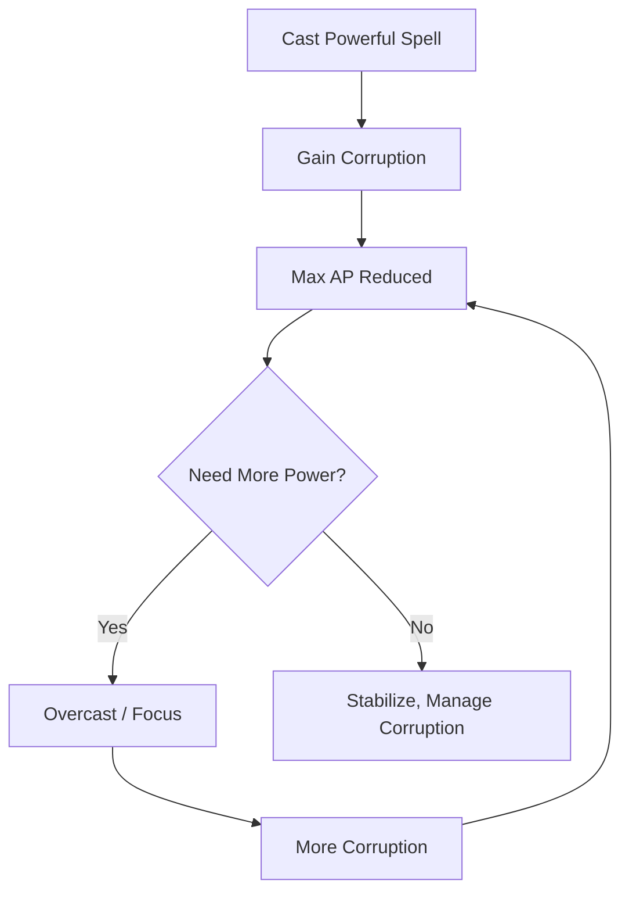
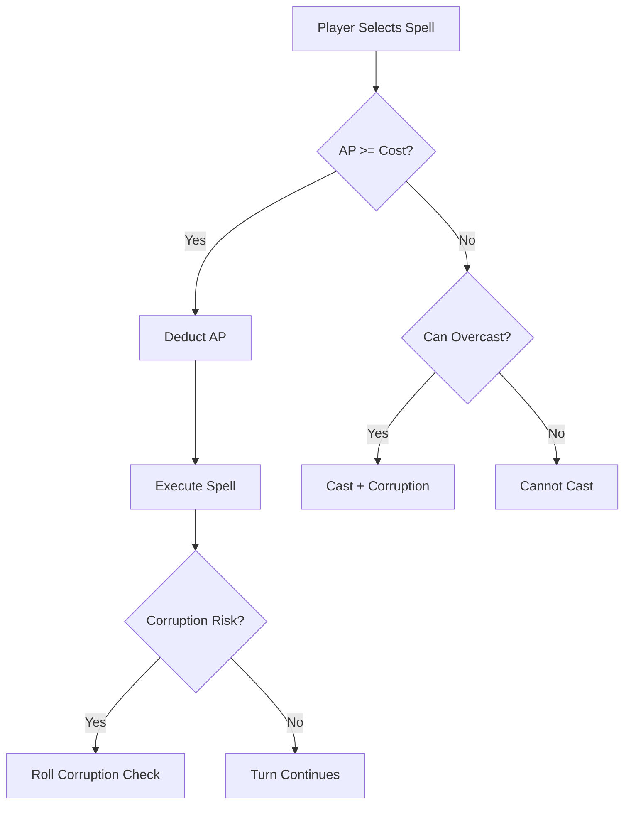

# Aether Pool (AP) — Mystic Power Cache

> *"Your Aether Pool is the capacity of your mind to hold raw, tainted Aether without losing yourself to it. Each spell draws from this cache—and each draw risks corruption."*

---

## Document Control

| Version | Date | Changes |
|---------|------|---------|
| 1.0 | 2025-12-07 | Initial specification |

---

## 1. Overview

### 1.1 Identity Table

| Property | Value |
|----------|-------|
| Spec ID | `SPEC-CORE-RES-AETHER` |
| Category | Core Resource |
| Parent Spec | `SPEC-CORE-RESOURCES` |
| Availability | **Mystic archetypes only** |
| Primary Attribute | WILL |

### 1.2 Core Philosophy

Aether Pool measures **Aetheric Cache Capacity**—a Mystic's ability to temporarily hold the tainted, reality-warping Aether that flows through Aethelgard without suffering corruption.

**Key Properties:**
- **Mystic-Exclusive**: Non-Mystic archetypes have 0 base AP
- **Very Slow Regeneration**: Spells are precious; cannot spam
- **Corruption Penalized**: High Corruption reduces max AP
- **Corruption Source**: Casting spells can *cause* Corruption

This creates a **death spiral by design**: Mystics who overuse their power become corrupted, reducing their capacity, tempting further overuse.

---

## 2. Calculation

### 2.1 Base Formula

```
Max AP = (Base AP + [WILL × 10] + Gear/Ability Bonuses) × (1 − Corruption Penalty)
```

### 2.2 Base AP by Archetype

| Archetype | Base AP | Notes |
|-----------|---------|-------|
| **Mystic** | 50 | Full access to Aetheric casting |
| **Warrior** | 0 | No spellcasting |
| **Skirmisher** | 0 | No spellcasting |
| **Adept** | 0 | May gain limited AP via specialization |

### 2.3 Component Breakdown

| Component | Source | Typical Values |
|-----------|--------|----------------|
| Base AP | Archetype | 0 or 50 |
| WILL Bonus | `WILL × 10` | +50 to +200 |
| Gear Bonus | Mystic equipment | +10 to +40 |
| Corruption Penalty | `−5% per 10 Corruption` | 0% to −50% |

### 2.4 Calculation Examples

**Starting Mystic (WILL 10):**
```
Base:           50
WILL:           100 (10 × 10)
Gear:           0
Corruption:     0%
───────────────────────
Max AP:         150
```

**Mid Game Mystic (WILL 12, some Corruption):**
```
Base:           50
WILL:           120 (12 × 10)
Gear:           +20
Subtotal:       190
Corruption:     −10% (20 Corruption)
───────────────────────
Max AP:         171
```

**Late Game Mystic (WILL 15, high Corruption):**
```
Base:           50
WILL:           150 (15 × 10)
Gear:           +40
Subtotal:       240
Corruption:     −25% (50 Corruption)
───────────────────────
Max AP:         180
```

> [!WARNING]
> Notice how the late-game Mystic with high Corruption has *less* effective AP than a mid-game Mystic with low Corruption. This is the intended death spiral.

---

## 3. AP Costs

### 3.1 Spell Cost Tiers

| Tier | Cost Range | Spell Type |
|------|------------|------------|
| **Cantrip** | 5-10 | Minor effects, utility |
| **Standard** | 15-25 | Most combat spells |
| **Powerful** | 30-45 | Major effects |
| **Ultimate** | 50-80 | Capstone abilities |

### 3.2 Cost Examples

| Spell | Cost | Effect |
|-------|------|--------|
| Aetheric Bolt | 10 | 3d10 damage |
| Mind Fog | 15 | AoE confusion |
| Flame Burst | 25 | 5d10 AoE damage |
| Healing Touch | 20 | 4d10 healing |
| Reality Anchor | 40 | Party-wide buff |
| Communion of the Lost | 80 | Capstone |

### 3.3 AP Economy Analysis

**At 150 Max AP:**
- 10 AP spells: 15 casts before empty
- 25 AP spells: 6 casts before empty
- 40 AP spells: 3-4 casts before empty
- With minimal regen: Must be extremely conservative

---

## 4. Regeneration

### 4.1 Combat Regeneration

**Default**: AP does **not** regenerate during combat.

**Exceptions:**
| Source | Regen Amount |
|--------|--------------|
| Focus ability | 15-25 AP (costs action) |
| Aether Siphon | Drains enemy for AP |
| Kill restoration | Some specs regain on kill |

### 4.2 Out-of-Combat Recovery

| Rest Type | AP Recovery |
|-----------|-------------|
| **Exploration** | None |
| **Short Rest** | `WILL × 2` |
| **Long Rest** | Full restoration |
| **Sanctuary** | Full restoration |

### 4.3 Focus Ability

Mystics can use an action to actively regenerate AP:

```
Focus (Standard Action):
Cost: 0 AP
Effect: Regain (WILL) AP
Risk: Roll 1d10; on 1, gain 5 Corruption
```

> [!CAUTION]
> Focus is risky. Overusing Focus to sustain casting can slowly corrupt the Mystic.

---

## 5. Corruption Interaction

### 5.1 Corruption Penalty

Corruption directly reduces maximum AP:

```
Corruption Penalty = floor(Corruption / 10) × 5%
```

| Corruption | Penalty | At 200 Base AP |
|------------|---------|----------------|
| 0-9 | 0% | 200 |
| 10-19 | 5% | 190 |
| 20-29 | 10% | 180 |
| 50-59 | 25% | 150 |
| 100 | 50% | 100 |

### 5.2 Corruption from Casting

Certain high-powered spells risk Corruption gain:

| Spell Category | Corruption Risk |
|----------------|-----------------|
| Standard spells | None |
| High-power spells | 1-3 Corruption on use |
| Forbidden spells | 5-10 Corruption on use |
| Overcasting (at 0 AP) | 10+ Corruption |

### 5.3 The Mystic Death Spiral



This is **intentional design**: Mystics must choose between raw power and long-term viability.

---

## 6. Combat Integration

### 6.1 Spell Casting Flow



### 6.2 Overcasting

When AP is insufficient but Mystic must cast:

```
Overcasting:
Requirement: Some AP remaining (at least 1)
Effect: Spell succeeds
Cost: Remaining AP + (Deficit × 2) in Corruption
Example: Casting 30 AP spell with 10 AP costs 10 AP + 40 Corruption
```

> [!WARNING]
> Overcasting is desperate and dangerous. A single overcast can push Corruption to Trauma Check territory.

### 6.3 UI Display

```
┌─────────────────────────────────────────┐
│  AETHER: █████████░░░░░░░░  72/171      │
│                                         │
│  [Aetheric Bolt - 10 AP]  ✓ Available   │
│  [Flame Burst - 25 AP]    ✓ Available   │
│  [Reality Anchor - 40 AP] ✓ Available   │
│  [Communion - 80 AP]      ✗ Need 80     │
│                         [OVERCAST]       │
└─────────────────────────────────────────┘
```

---

## 7. Specialization Mechanics

### 7.1 Mystic Specializations

| Specialization | AP Mechanic |
|----------------|-------------|
| **Galdr-caster** | Reduced cost for damage spells |
| **Seiðkona** | Regain AP when fate manipulation succeeds |
| **Grove-Warden** | Nature spells cost less in natural areas |
| **Rust-Witch** | Gain AP from destroying items |
| **God-Sleeper Cultist** | Massive AP, massive Corruption risk |

### 7.2 Non-Mystic AP Access

Some non-Mystic specializations grant limited AP:

| Specialization | AP Granted | Limitation |
|----------------|-----------|------------|
| Thul (Adept) | 30 base | Rune-based only |
| Skald (Adept) | 25 base | Song-based only |

---

## 8. Technical Implementation

### 8.1 Aether Service

```csharp
public interface IAetherService
{
    int CalculateMaxAp(Character character);
    bool CanCastSpell(Character character, Spell spell);
    CastResult CastSpell(Character character, Spell spell);
    int FocusRegenerate(Character character);  // Returns AP gained + corruption risk
    void RestoreAp(Character character, RestType restType);
}

public record CastResult(
    bool Success,
    int ApSpent,
    int CorruptionGained,
    bool WasOvercast
);
```

### 8.2 Max AP Calculation

```csharp
public int CalculateMaxAp(Character character)
{
    // Non-Mystics have no AP
    if (!character.Archetype.IsMystic && !character.HasLimitedApAccess)
        return 0;
    
    int baseAp = character.Archetype.BaseAp;  // 50 for Mystic, 0 or special for others
    int willBonus = character.Attributes.Will * 10;
    int gearBonus = _equipmentService.GetTotalApBonus(character);
    
    int subtotal = baseAp + willBonus + gearBonus;
    
    // Apply corruption penalty
    float corruptionMultiplier = 1.0f - (character.Corruption / 10 * 0.05f);
    corruptionMultiplier = Math.Max(0.5f, corruptionMultiplier);  // Floor at 50% reduction
    
    return (int)(subtotal * corruptionMultiplier);
}
```

---

## 9. Phased Implementation Guide

### Phase 1: Core Logic
- [ ] **Data**: Add `CurrentAp` and `MaxAp` to `CharacterResources`.
- [ ] **Calculator**: Implement `CalculateMaxAp` (Mystic check + formulas).
- [ ] **Service**: Implement `DeductAp` and `FocusRegenerate`.

### Phase 2: Magic Integration
- [ ] **Spells**: Integrate AP cost check into Spell Casting logic.
- [ ] **Overcast**: Implement "Overcast" mechanics (Corruption cost if AP insufficient).
- [ ] **Focus**: Implement the `Focus` action for in-combat regen.

### Phase 3: Corruption Loop
- [ ] **Penalty**: Hook Corruption changes to `RecalculateMaxAp`.
- [ ] **Cost**: Ensure Overcasting and Focus failures add Corruption to character.

### Phase 4: UI & Feedback
- [ ] **HUD**: Display AP bar (Blue/Purple) for Mystics ONLY.
- [ ] **Warnings**: Show "Overcast Risk!" warning if casting with insufficient AP.
- [ ] **Logs**: Clearly log "Gained 5 Corruption from Overcasting".

---

## 10. Testing Requirements

### 10.1 Unit Tests
- [ ] **Mystic Calculation**: `50 + (WILL*10) - Corruption`.
- [ ] **Non-Mystic**: Base AP is 0.
- [ ] **Overcast**: Spell succeeds but Corruption increases by `Deficit * 2`.
- [ ] **Penalty Floor**: Corruption cannot reduce Max AP below 50% of cap.

### 10.2 Integration Tests
- [ ] **Casting**: Cast spell -> AP drops.
- [ ] **Focus**: Use Focus -> AP increases -> 10% chance of Corruption.
- [ ] **Death Spiral**: Add Corruption -> Verify Max AP drops.

### 10.3 Manual QA
- [ ] **HUD**: Switch between Warrior and Mystic -> Verify AP bar appears/hides.
- [ ] **Overcast**: Drain AP to 0 -> Cast spell -> Verify large Corruption gain.

---

## 11. Logging Requirements

**Reference:** [logging.md](../logging.md)

### 11.1 Log Events

| Event | Level | Message Template | Properties |
|-------|-------|------------------|------------|
| Spell Cast | Info | "{Character} cast {Spell} ({Cost} AP). AP: {Old} -> {New}" | `Character`, `Spell`, `Cost`, `Old`, `New` |
| Overcast | Warning | "{Character} OVERCAST {Spell}! Gain {Corruption} Corruption." | `Character`, `Spell`, `Corruption` |
| Focus | Info | "{Character} focused. Gained {Regen} AP. (Risk Roll: {Roll})" | `Character`, `Regen`, `Roll` |

---

## 12. Related Specifications

| Spec ID | Relationship |
|---------|--------------|
| `SPEC-CORE-RESOURCES` | Parent overview spec |
| `SPEC-CORE-ATTR-WILL` | Primary scaling attribute |
| `SPEC-CORE-TRAUMA` | Corruption mechanics |
| `SPEC-MAGIC-CASTING` | Spell system integration |
