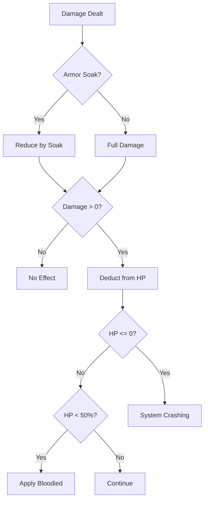

# Health Pool (HP) — System Integrity

> *"Your HP represents the coherence of your physical form against the data-loss of Aethelgard. When it reaches zero, your pattern dissolves. You cease to exist."*

---

## Document Control

| Version | Date | Changes |
|---------|------|---------|
| 1.0 | 2025-12-07 | Initial specification |

---

## 1. Overview

### 1.1 Identity Table

| Property | Value |
|----------|-------|
| Spec ID | `SPEC-CORE-RES-HP` |
| Category | Core Resource |
| Parent Spec | `SPEC-CORE-RESOURCES` |
| Availability | Universal (all characters) |
| Primary Attribute | STURDINESS |

### 1.2 Core Philosophy

HP measures **System Integrity**—the coherence of a character's physical form against the entropic forces of the Runic Blight. Unlike traditional hit points representing "meat," HP in Aethelgard represents the stability of a character's existence pattern.

When HP reaches 0, the character doesn't just die—they **dissolve**, their pattern lost to the chaos.

---

## 2. Calculation

### 2.1 Base Formula

```
Max HP = (Base HP + [STURDINESS × 10] + Gear/Ability Bonuses) × (1 − Corruption Penalty)
```

### 2.2 Component Breakdown

| Component | Source | Typical Values |
|-----------|--------|----------------|
| Base HP | Universal | 50 |
| STURDINESS Bonus | `STURDINESS × 10` | +50 to +200 |
| Gear Bonus | Armor, accessories | +10 to +50 |
| Ability Bonus | Passives, buffs | +10% to +25% |
| Corruption Penalty | `−5% per 10 Corruption` | 0% to −50% |

### 2.3 Calculation Examples

**Early Game Warrior (STURDINESS 8):**
```
Base:           50
STURDINESS:     80 (8 × 10)
Gear:           +15 (Medium Armor)
Corruption:     0%
───────────────────────
Max HP:         145
```

**Mid Game Tank (STURDINESS 12, some Corruption):**
```
Base:           50
STURDINESS:     120 (12 × 10)
Gear:           +30 (Heavy Armor)
Subtotal:       200
Corruption:     −10% (20 Corruption)
───────────────────────
Max HP:         180
```

**Late Game Hero (STURDINESS 15):**
```
Base:           50
STURDINESS:     150 (15 × 10)
Gear:           +50 (Legendary Armor)
Ability:        +10% (Warrior's Vigor)
Subtotal:       275
Corruption:     −15% (30 Corruption)
───────────────────────
Max HP:         234
```

### 2.4 Value Ranges

| Phase | Typical Max HP | STURDINESS |
|-------|----------------|------------|
| Character Creation | 100-120 | 5-7 |
| Early Game | 130-170 | 7-9 |
| Mid Game | 170-220 | 10-12 |
| Late Game | 220-300+ | 13-15+ |

---

## 3. HP Status Thresholds

### 3.1 Status Conditions

| HP Level | Status | Effect |
|----------|--------|--------|
| 100% | `[Healthy]` | Normal operation |
| 50-99% | `[Wounded]` | No mechanical effect |
| 25-49% | `[Bloodied]` | Some enemy abilities trigger |
| 1-24% | `[Critical]` | Death save on further damage |
| 0 | `[System Crashing]` | Incapacitated, death timer |

### 3.2 Bloodied Effects

When a character becomes `[Bloodied]`:
- **Visual Indicator**: HP bar pulses red
- **Enemy Triggers**: Some enemies gain bonuses vs bloodied targets
- **Player Triggers**: Some abilities only usable while bloodied
- **Narrative**: Character shows visible damage

### 3.3 Critical State

When a character enters `[Critical]`:
- **Death Save**: On further damage, roll `STURDINESS` vs DC 3
  - Success: Survive with 1 HP
  - Failure: Drop to 0 HP
- **Bleedout Risk**: Bleeding effects deal double damage

### 3.4 System Crashing (0 HP)

When HP reaches 0:
- Character is **incapacitated** (cannot act)
- **Death Timer**: 3 rounds to receive healing
- If timer expires or character takes further damage: **Permanent Death**
- Successful stabilization: Character at 1 HP, `[Unconscious]`

---

## 4. HP Loss Sources

### 4.1 Damage Types

| Source | Typical Damage | Notes |
|--------|----------------|-------|
| Combat (Physical) | 5-50+ | Most common |
| Combat (Psychic) | 3-30 | Bypasses armor |
| Environmental | 5-20 | Traps, hazards |
| Self-Inflicted | Variable | Blood magic, overexertion |
| Corruption | Max HP penalty | Reduces capacity |

### 4.2 Damage Reduction

| Mitigation | Effect |
|------------|--------|
| Armor Soak | Flat reduction per hit |
| Block (Active) | Dice-based reduction |
| Resistance | % reduction by type |

---

## 5. HP Recovery

### 5.1 Recovery Methods

| Method | Amount | Availability |
|--------|--------|--------------|
| **Healing Abilities** | Variable (dice) | In combat |
| **Consumables** | 2d10 to 4d10 | Limited quantity |
| **Short Rest** | `STURDINESS × 2` | Out of combat |
| **Long Rest** | `STURDINESS × 5` | Safe location |
| **Sanctuary** | Full restoration | Safe zones |
| **Milestone** | Full restoration | Progression |

### 5.2 Healing Ability Examples

| Ability | Healer | Dice Pool | Cost |
|---------|--------|-----------|------|
| Mend Wound | Bone-Setter | 3d10 | 15 Stamina |
| Grove-Warden's Touch | Grove-Warden | 4d10 | 20 AP |
| Basic Salve | Any | 2d10 | Consumable |
| Emergency Stim | Any | 1d10 | Consumable |

### 5.3 Over-Healing

**Rule**: HP cannot exceed Max HP.
- Excess healing is **wasted**
- No "temporary HP" in base system (special abilities may grant shields)

---

## 6. Combat Integration

### 6.1 Damage Application Flow



### 6.2 HP in Combat Display

```
┌─────────────────────────────────────────┐
│  WARRIOR SKJALDMÆR                      │
│  HP: ████████████░░░░░░░░  125/180      │
│      [BLOODIED]                         │
│                                         │
│  Actions: Attack | Block | Heal | Flee  │
└─────────────────────────────────────────┘
```

### 6.3 Damage Feedback

| Damage Level | Descriptor | Example Output |
|--------------|------------|----------------|
| 1-10 | Glancing | "A glancing blow for 8 damage." |
| 11-25 | Solid | "A solid hit for 18 damage!" |
| 26-40 | Heavy | "A heavy strike for 32 damage!!" |
| 40+ | Devastating | "A DEVASTATING blow for 52 damage!!!" |

---

## 7. Corruption Interaction

### 7.1 Max HP Reduction

Corruption directly reduces maximum HP:

```
Corruption Penalty = floor(Corruption / 10) × 5%
```

| Corruption | Penalty | At 200 Base HP |
|------------|---------|----------------|
| 0-9 | 0% | 200 |
| 10-19 | 5% | 190 |
| 20-29 | 10% | 180 |
| 30-39 | 15% | 170 |
| 50+ | 25%+ | 150 or less |
| 100 | 50% | 100 |

### 7.2 Current HP Adjustment

When Max HP decreases:
- If Current HP > New Max HP, Current HP is clamped to New Max HP
- If Current HP ≤ New Max HP, no change

> [!CAUTION]
> High Corruption can cause instant death if Max HP drops below Current HP damage thresholds.

---

## 8. Technical Implementation

### 8.1 HP Service

```csharp
public interface IHealthService
{
    int CalculateMaxHp(Character character);
    DamageResult ApplyDamage(Character character, int damage, DamageType type);
    HealResult ApplyHealing(Character character, int amount);
    void RecalculateMaxHp(Character character);  // After gear/corruption changes
    bool IsAlive(Character character);
    HpStatus GetStatus(Character character);
}

public enum HpStatus { Healthy, Wounded, Bloodied, Critical, SystemCrashing }

public record DamageResult(
    int DamageDealt,
    int OldHp,
    int NewHp,
    bool NowBloodied,
    bool NowCritical,
    bool NowDown
);
```

### 8.2 Max HP Calculation

```csharp
public int CalculateMaxHp(Character character)
{
    int baseHp = 50;
    int sturdinessBonus = character.Attributes.Sturdiness * 10;
    int gearBonus = _equipmentService.GetTotalHpBonus(character);
    
    int subtotal = baseHp + sturdinessBonus + gearBonus;
    
    // Apply percentage bonuses
    foreach (var passive in character.ActivePassives.Where(p => p.AffectsMaxHp))
    {
        subtotal = (int)(subtotal * passive.Multiplier);
    }
    
    // Apply corruption penalty
    float corruptionMultiplier = 1.0f - (character.Corruption / 10 * 0.05f);
    
    return (int)(subtotal * corruptionMultiplier);
}
```

---

## 9. Phased Implementation Guide

### Phase 1: Core Logic
- [ ] **Data**: Verify `CharacterResources` has HP fields.
- [ ] **Calculator**: Implement `CalculateMaxHp` per formula.
- [ ] **Service**: Implement `ApplyDamage` and `ApplyHealing` basic math.

### Phase 2: Status Logic
- [ ] **Thresholds**: Implement logic to enforce MaxHP cap and MinHP floor (0).
- [ ] **State**: Implement `GetStatus()` to return Bloodied/Critical based on %.
- [ ] **Persistence**: Ensure current HP persists correctly.

### Phase 3: Integration
- [ ] **Corruption**: Hook Corruption changes to trigger `RecalculateMaxHp`.
- [ ] **Attribute**: Hook Sturdiness changes to trigger `RecalculateMaxHp`.
- [ ] **Combat**: Integrate Armor Soak before Damage Application.

### Phase 4: UI & Feedback
- [ ] **HUD**: Display HP bar with threshold colors.
- [ ] **Warnings**: Toast notification when becoming Bloodied/Critical.
- [ ] **Death**: Implement "System Crashing" modal/timer.

---

## 10. Testing Requirements

### 10.1 Unit Tests
- [ ] **MaxHP**: `50 + (STURDINESS * 10) + Gear`.
- [ ] **Corruption**: Verify high corruption reduces max HP significantly.
- [ ] **Damage**: Verify HP reduction, clamping at 0.
- [ ] **Healing**: Verify HP increase, clamping at Max.

### 10.2 Integration Tests
- [ ] **Soak**: Equip Armor -> Take Damage -> Verify Soak reduces damage before HP.
- [ ] **State**: Reduce HP to 10% -> Verify Status is Critical.

### 10.3 Manual QA
- [ ] **HUD**: Take 50% damage -> Bar pulse red.
- [ ] **Death**: Take lethal damage -> Verify Incapacitated state.

---

## 11. Logging Requirements

**Reference:** [logging.md](../logging.md)

### 11.1 Log Events

| Event | Level | Message Template | Properties |
|-------|-------|------------------|------------|
| Damage | Info | "{Character} took {Damage} damage ({Type}). HP: {Old} -> {New}" | `Character`, `Damage`, `Type`, `Old`, `New` |
| Heal | Info | "{Character} healed {Amount}. HP: {Old} -> {New}" | `Character`, `Amount`, `Old`, `New` |
| Status | Warning | "{Character} is now {Status}!" | `Character`, `Status` |
| Death | Error | "{Character} SYSTEM CRASH caused by {Source}" | `Character`, `Source` |

---

## 12. Related Specifications

| Spec ID | Relationship |
|---------|--------------|
| `SPEC-CORE-RESOURCES` | Parent overview spec |
| `SPEC-CORE-ATTR-STURDINESS` | Primary scaling attribute |
| `SPEC-COMBAT-DAMAGE` | Damage calculation details |
| `SPEC-CORE-TRAUMA` | Corruption penalty source |
