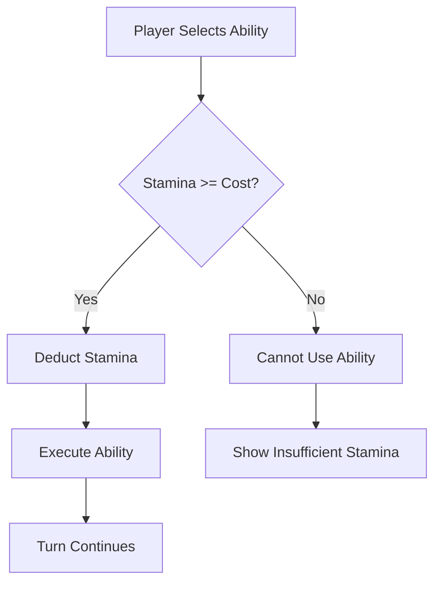

# Stamina — Action Readiness

> *"Your Stamina is the fuel that powers coherent action in a world of chaos. Without it, you cannot execute precise strikes, calculated dodges, or complex maneuvers. You can only react."*

---

## Document Control

| Version | Date | Changes |
|---------|------|---------|
| 1.0 | 2025-12-07 | Initial specification |

---

## 1. Overview

### 1.1 Identity Table

| Property | Value |
|----------|-------|
| Spec ID | `SPEC-CORE-RES-STAMINA` |
| Category | Core Resource |
| Parent Spec | `SPEC-CORE-RESOURCES` |
| Availability | Universal (all characters) |
| Primary Attributes | STURDINESS, FINESSE |

### 1.2 Core Philosophy

Stamina measures **Action Readiness**—the energy required for coherent physical and mental exertion. Every ability, special attack, and complex maneuver drains Stamina.

Unlike HP (which can deplete fatally) or AP (Mystic-only), Stamina is the **universal action currency** that creates moment-to-moment tactical decisions in combat.

**Key Properties:**
- **Rapid Regeneration**: 25% of Max per turn (no "whiff turns")
- **Not Corrupted**: Stamina is not penalized by Runic Blight
- **Prevents Spam**: Forces ability rotation, not repetition

---

## 2. Calculation

### 2.1 Base Formula

```
Max Stamina = Base + (STURDINESS × 5) + (FINESSE × 2) + Gear/Ability Bonuses
```

### 2.2 Component Breakdown

| Component | Source | Typical Values |
|-----------|--------|----------------|
| Base | Universal | 50 |
| STURDINESS Bonus | `STURDINESS × 5` | +25 to +75 |
| FINESSE Bonus | `FINESSE × 2` | +10 to +30 |
| Gear Bonus | Accessories | +5 to +20 |

> [!NOTE]
> Stamina is **not penalized by Corruption**. This prevents unwinnable combat states.

### 2.3 Calculation Examples

**Warrior (STURDINESS 10, FINESSE 6):**
```
Base:           50
STURDINESS:     50 (10 × 5)
FINESSE:        12 (6 × 2)
───────────────────────
Max Stamina:    112
```

**Skirmisher (STURDINESS 7, FINESSE 12):**
```
Base:           50
STURDINESS:     35 (7 × 5)
FINESSE:        24 (12 × 2)
───────────────────────
Max Stamina:    109
```

**Mystic (STURDINESS 6, FINESSE 6):**
```
Base:           50
STURDINESS:     30 (6 × 5)
FINESSE:        12 (6 × 2)
───────────────────────
Max Stamina:    92
```

### 2.4 Value Ranges

| Phase | Typical Max Stamina |
|-------|---------------------|
| Character Creation | 85-110 |
| Mid Game | 100-130 |
| Late Game | 120-160 |

---

## 3. Stamina Costs

### 3.1 Cost Tiers

| Tier | Cost Range | Usage |
|------|------------|-------|
| **Free** | 0 | Passives, reactions |
| **Light** | 5-10 | Basic attacks, simple actions |
| **Standard** | 11-20 | Most abilities |
| **Heavy** | 21-35 | Powerful abilities |
| **Ultimate** | 40-60 | Capstone abilities |

### 3.2 Cost Examples by Type

| Action Type | Typical Cost | Examples |
|-------------|--------------|----------|
| Basic Attack | 10-15 | Power Strike, Improvised Strike |
| Defensive | 10-15 | Shield Wall, Quick Dodge |
| Utility | 5-25 | Exploit Weakness, Analyze |
| Control | 12-20 | Disrupt, Song of Silence |
| AoE | 25-50 | Chain Lightning, Corruption Nova |

### 3.3 Stamina Economy Analysis

**At 100 Max Stamina:**
- 10 Stamina abilities: 10 uses before empty, ~2.5 turns
- 15 Stamina abilities: 6 uses before empty, ~1.5 turns
- 25 Stamina abilities: 4 uses before empty, ~1 turn
- With 25% regen: Sustainable ~1 ability per turn indefinitely

---

## 4. Regeneration

### 4.1 Combat Regeneration

**Per-Turn Regeneration:**
```
Regen Amount = floor(Max Stamina × 0.25)
```

| Max Stamina | Regen per Turn |
|-------------|----------------|
| 80 | 20 |
| 100 | 25 |
| 120 | 30 |
| 140 | 35 |

**Timing**: Regeneration occurs at the **start** of the character's turn.

### 4.2 Regeneration Modifiers

| Modifier | Effect |
|----------|--------|
| `[Exhausted]` status | −50% regeneration |
| `[Second Wind]` ability | Double regen this turn |
| `[Adrenaline]` buff | +10 flat regen |
| Endurance gear | +5-15% regen rate |

### 4.3 Out-of-Combat Recovery

| Context | Recovery |
|---------|----------|
| Exploration | Full restoration between encounters |
| Short Rest | Full restoration |
| Long Rest | Full restoration |
| Sanctuary | Full restoration |

---

## 5. Stamina Thresholds

### 5.1 Status Effects

| Stamina Level | Effect |
|---------------|--------|
| > 50% | Normal operation |
| 25-50% | Some high-cost abilities unavailable |
| 1-24% | Only light abilities available |
| 0 | **Stamina Depleted** — special state |

### 5.2 Stamina Depleted (0 Stamina)

When Stamina reaches 0:
- Cannot use any Stamina-costing abilities
- **Can still use**: Basic Attack (0 cost), Defend (0 cost), Move, Items
- Regeneration still occurs normally next turn
- **No persistent penalty** — stamina refills, problem solved

---

## 6. Combat Integration

### 6.1 Ability Usage Flow



### 6.2 Tactical Implications

**Stamina Management Creates:**
- **Rotation**: Can't spam best ability; must vary attacks
- **Burst vs. Sustain**: Big opening salvo vs. steady damage
- **Recovery Turns**: Sometimes optimal to defend and regenerate
- **Resource Racing**: Exhaust enemy Stamina faster than yours

### 6.3 UI Display

```
┌─────────────────────────────────────────┐
│  STAMINA: ███████████░░░░░░░  68/110    │
│                                         │
│  [Power Strike - 15]  ✓ Available       │
│  [Whirlwind - 35]     ✓ Available       │
│  [Desperate Gambit - 55] ✗ Need 55      │
└─────────────────────────────────────────┘
```

---

## 7. Specialization Interactions

### 7.1 Stamina-Focused Builds

| Specialization | Stamina Mechanic |
|----------------|------------------|
| **Einbúi** | Reduced ability costs |
| **Strandhögg** | Refund on kill |
| **Hólmgangr** | Parry costs reduced |

### 7.2 Stamina-to-Damage Conversion

Some abilities scale with remaining Stamina:

```
Example: "Desperate Gambit"
Damage Pool = Base + (Remaining Stamina / 10)
Cost: All remaining Stamina
```

---

## 8. Relationship to Other Resources

### 8.1 Stamina vs. HP

| Aspect | Stamina | HP |
|--------|---------|-----|
| Regeneration | Rapid (25%/turn) | Slow (healing only) |
| Combat loss | Usually voluntary | Involuntary (damage) |
| Zero state | Inconvenient | Death |
| Corruption | No penalty | Reduced max |

### 8.2 Stamina vs. AP

| Aspect | Stamina | AP |
|--------|---------|-----|
| Availability | Universal | Mystic only |
| Regeneration | Every turn | Very slow |
| Primary use | Physical abilities | Spells |
| Corruption | No penalty | Reduced max |

---

## 9. Technical Implementation

### 9.1 Stamina Service

```csharp
public interface IStaminaService
{
    int CalculateMaxStamina(Character character);
    bool CanUseAbility(Character character, Ability ability);
    StaminaResult DeductStamina(Character character, int cost);
    int RegenerateStamina(Character character);  // Returns amount regenerated
    void RestoreStamina(Character character);    // Full restore
}

public record StaminaResult(
    bool Success,
    int OldStamina,
    int NewStamina,
    int Cost
);
```

### 9.2 Max Stamina Calculation

```csharp
public int CalculateMaxStamina(Character character)
{
    int baseStamina = 50;
    int sturdinessBonus = character.Attributes.Sturdiness * 5;
    int finesseBonus = character.Attributes.Finesse * 2;
    int gearBonus = _equipmentService.GetTotalStaminaBonus(character);
    
    return baseStamina + sturdinessBonus + finesseBonus + gearBonus;
    // Note: No corruption penalty for Stamina
}
```

### 9.3 Regeneration Logic

```csharp
public int RegenerateStamina(Character character)
{
    int maxStamina = CalculateMaxStamina(character);
    int regenRate = character.HasStatus(StatusType.Exhausted) ? 12 : 25; // Percentage
    int regenAmount = (int)(maxStamina * (regenRate / 100.0));
    
    int oldStamina = character.CurrentStamina;
    character.CurrentStamina = Math.Min(character.CurrentStamina + regenAmount, maxStamina);
    
    return character.CurrentStamina - oldStamina; // Actual amount regenerated
}
```

---

## 10. Phased Implementation Guide

### Phase 1: Core Logic
- [ ] **Data**: Update `CharacterResources` with Stamina fields.
- [ ] **Calculator**: Implement `CalculateMaxStamina`.
- [ ] **Service**: Implement `DeductStamina` and `Regenerate` logic.

### Phase 2: Combat Integration
- [ ] **Costs**: Implement attribute check `CanUseAbility`.
- [ ] **Turn Loop**: Call `RegenerateStamina` at start of turn.
- [ ] **Action**: Block actions if `DeductStamina` returns false.

### Phase 3: Status Logic
- [ ] **Exhaustion**: Implement 50% regen penalty.
- [ ] **Thresholds**: Logic for 25% "low stamina" state (disable Heavy abilities).

### Phase 4: UI & Feedback
- [ ] **HUD**: Display Stamina bar (Cyan).
- [ ] **Previews**: Show "Not enough Stamina" on ability buttons.
- [ ] **Notifications**: Toast for "Stamina Depleted!"

---

## 11. Testing Requirements

### 11.1 Unit Tests
- [ ] **Max Calculation**: `Base + (Sturdiness*5) + (Finesse*2)`.
- [ ] **Deduction**: Verify values drop correctly.
- [ ] **Insufficiency**: Verify deduction fails if cost > current.
- [ ] **Regen**: Verify 25% regen.
- [ ] **Exhaustion**: Verify regen is halved.

### 11.2 Integration Tests
- [ ] **Turn Loop**: End Turn -> Start Turn -> Verify Regen occurred.
- [ ] **Combat**: Spam abilities until empty -> Verify actions blocked.

### 11.3 Manual QA
- [ ] **HUD**: Use ability -> Watch bar drop.
- [ ] **Regen**: Pass turn -> Watch bar fill.

---

## 12. Logging Requirements

**Reference:** [logging.md](../logging.md)

### 12.1 Log Events

| Event | Level | Message Template | Properties |
|-------|-------|------------------|------------|
| Stamina Use | Info | "{Character} used {Ability} ({Cost} STA). STA: {Old} -> {New}" | `Character`, `Ability`, `Cost`, `Old`, `New` |
| Stamina Regen | Info | "{Character} recovered {Amount} STA." | `Character`, `Amount` |
| Depleted | Warning | "{Character} is EXHAUSTED (0 Stamina)!" | `Character` |

---

## 13. Related Specifications

| Spec ID | Relationship |
|---------|--------------|
| `SPEC-CORE-RESOURCES` | Parent overview spec |
| `SPEC-CORE-ATTR-STURDINESS` | Primary scaling attribute |
| `SPEC-CORE-ATTR-FINESSE` | Secondary scaling attribute |
| `SPEC-COMBAT-ACTIONS` | Action cost definitions |
