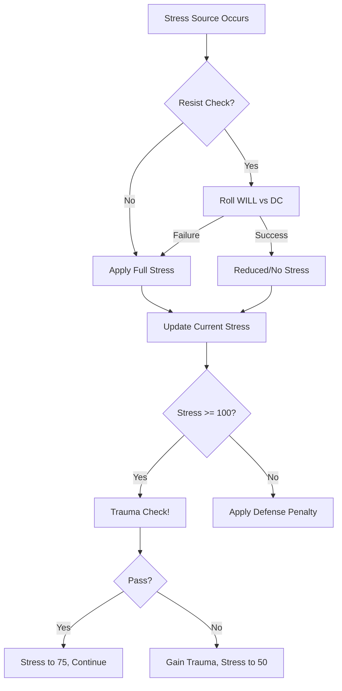

# Psychic Stress — Trauma Accumulator

> *"Stress is the measure of your mind's coherence under assault. The horrors of Aethelgard—the paradoxes, the Forlorn, the truth of the broken world—accumulate until your pattern cracks. Then comes Trauma."*

---

## Document Control

| Version | Date | Changes |
|---------|------|---------|
| 1.0 | 2025-12-07 | Initial specification |

---

## 1. Overview

### 1.1 Identity Table

| Property | Value |
|----------|-------|
| Spec ID | `SPEC-CORE-RES-STRESS` |
| Category | Core Resource (Negative) |
| Parent Spec | `SPEC-CORE-RESOURCES` |
| Availability | Universal (all characters) |
| Primary Attribute | WILL (resistance) |
| Range | 0-100 |

### 1.2 Core Philosophy

Psychic Stress is a **negative resource**—it accumulates rather than depletes. It represents the psychological damage inflicted by Aethelgard's horrors on a character's coherent sense of self.

**Key Properties:**
- **Accumulates to 100**: Reaching 100 triggers a Trauma Check
- **Penalizes Defense**: High Stress reduces evasion (via FINESSE link)
- **Slow Recovery**: Only Sanctuary fully clears Stress
- **Permanent Consequences**: Failed Trauma Checks cause irremovable Traumas

This system is the **Trauma Economy**—the central horror mechanic that ensures even powerful characters feel dread.

---

## 2. Stress Mechanics

### 2.1 Stress Range

| Value | State | Description |
|-------|-------|-------------|
| 0 | Calm | Mental baseline |
| 1-19 | Uneasy | Slight discomfort |
| 20-39 | Stressed | Noticeable tension |
| 40-59 | Anxious | Significant distress |
| 60-79 | Panicked | Near breaking point |
| 80-99 | Breaking | One step from Trauma |
| 100 | **Trauma Check** | Check triggered |

### 2.2 Defense Penalty

Stress directly reduces Defense (evasion):

```
Defense Penalty = floor(Psychic Stress / 20)
```

| Stress | Penalty | Effect on Defense 20 |
|--------|---------|---------------------|
| 0-19 | 0 | 20 |
| 20-39 | −1 | 19 |
| 40-59 | −2 | 18 |
| 60-79 | −3 | 17 |
| 80-99 | −4 | 16 |
| 100 | −5 | 15 |

> [!IMPORTANT]
> This creates the core death spiral: Stress → Lower Defense → More Hits → More Damage → More Stress.

### 2.3 Skill Check Penalty

At high Stress, skill checks suffer:

| Stress | Skill Penalty |
|--------|---------------|
| 0-79 | None |
| 80-99 | Disadvantage on non-combat checks |
| 100 | Disadvantage on all checks until Trauma resolves |

---

## 3. Stress Sources

### 3.1 Combat Sources

| Source | Stress Gained | Resist Check |
|--------|---------------|--------------|
| Enemy fear aura | 10-20 | `WILL` vs DC 2 |
| Psychic attack | 15-30 | `WILL` vs DC 3 |
| Ally drops to 0 HP | 10 | `WILL` vs DC 2 |
| Witnessing death | 15 | `WILL` vs DC 2 |
| Forlorn presence | 20-40 | `WILL` vs DC 4+ |

### 3.2 Exploration Sources

| Source | Stress Gained | Resist Check |
|--------|---------------|--------------|
| Disturbing discovery | 5-10 | `WILL` vs DC 1 |
| Corpse room | 5 | `WILL` vs DC 1 |
| Paradox encounter | 10-20 | `WILL` vs DC 3 |
| Failed Corruption check | 10 | None |
| Reading forbidden text | 10-25 | `WILL` vs DC 3 |

### 3.3 Narrative Sources

| Source | Stress Gained | Notes |
|--------|---------------|-------|
| Traumatic revelation | 20-40 | Story-driven |
| Betrayal | 15-30 | NPC-related |
| Moral compromise | 10-20 | Player choice |

---

## 4. Stress Resistance

### 4.1 Mental Resolve Check

When exposed to a Stress source, characters roll:

```
Mental Resolve = WILL dice vs Stress DC
```

**Outcome:**

| Net Successes | Result |
|---------------|--------|
| 0 | Full Stress applied |
| 1 | Half Stress applied |
| 2-3 | Minimal Stress (25%) |
| 4+ | No Stress gained |
| Fumble | Double Stress applied |

### 4.2 Resistances and Vulnerabilities

| Modifier | Effect |
|----------|--------|
| `[Psychic Baffler]` gear | −5 to −15 Stress from all sources |
| `[Iron-Hearted]` trait | +2 dice to Resist checks |
| `[Coherent]` status | +1 die to Resist checks |
| `[Shaken]` status | −2 dice to Resist checks |
| Low WILL | Higher failure rate |

---

## 5. Trauma Check

### 5.1 Trigger

When Stress reaches **100**, a **Trauma Check** is immediately triggered.

### 5.2 Trauma Check Mechanics

```
Trauma Check: WILL vs Trauma DC (varies by source)
```

**Default DC**: 3

**Outcome:**

| Result | Effect |
|--------|--------|
| Success (Net ≥ DC) | Stress resets to 75; no permanent effect |
| Failure (Net < DC) | Gain **Permanent Trauma**; Stress resets to 50 |
| Critical Success | Stress resets to 50; gain temporary resolve buff |
| Fumble | Gain Trauma + additional Stress effect |

### 5.3 Permanent Traumas

Permanent Traumas are **irremovable** (within normal gameplay) and include:

| Trauma Type | Effect |
|-------------|--------|
| **Phobia** | −2 dice when exposed to trigger |
| **Compulsion** | Must pass `WILL` DC 2 to avoid behavior |
| **Memory Fragmentation** | Specific knowledge gaps |
| **Perception Distortion** | False sensory input |
| **Nightmares** | Long Rest may not fully restore |
| **Paranoia** | Cannot benefit from ally adjacency bonuses |

### 5.4 Trauma Limit

A character can accumulate **up to 5 Permanent Traumas**. On the 6th failed Trauma Check:
- Character becomes **Unplayable** (retired, lost to madness)
- Game Over for that character (roguelike endings)

---

## 6. Stress Recovery

### 6.1 Combat Recovery

Stress does **not** naturally decrease during combat.

**Exceptions:**
| Source | Recovery |
|--------|----------|
| Bone-Setter ability | 10-20 Stress healed |
| Skald inspiration | 5-15 Stress reduction |
| Consumable (Stabilizing Draught) | 15 Stress |

### 6.2 Out-of-Combat Recovery

| Rest Type | Stress Recovery |
|-----------|-----------------|
| **Exploration** | None |
| **Short Rest** | `WILL × 2` |
| **Long Rest** | `WILL × 5` |
| **Sanctuary** | Full restoration to 0 |

### 6.3 Meditation

Special action during rest:

```
Meditation Check: WILL + Meditation Skill
Recovery: Net Successes × 5 additional Stress cleared
```

---

## 7. Combat Integration

### 7.1 Stress in Combat Flow



### 7.2 UI Display

```
┌─────────────────────────────────────────┐
│  PSYCHIC STRESS                         │
│  ψ: ████████████████░░░░  82/100        │
│     [BREAKING] Defense: -4              │
│                                         │
│  ⚠ One more Stress event triggers       │
│    TRAUMA CHECK                         │
└─────────────────────────────────────────┘
```

### 7.3 Status Bar Colors

| Stress Level | Color |
|--------------|-------|
| 0-19 | Gray |
| 20-39 | Light Yellow |
| 40-59 | Yellow |
| 60-79 | Orange |
| 80-99 | Red (pulsing) |
| 100 | Bright Red (flashing) |

---

---

## 8. Low WILL Death Spiral

### 8.1 The Problem

Characters with low WILL (5-6) face compounding disadvantage:

```
Low WILL → Fail Stress Checks → High Stress
         → Defense Penalty → More Hits Taken
         → More Damage + Stress → Trauma Check
         → Low WILL → Likely Fail → Permanent Trauma
```

### 8.2 Mitigation Options

| Strategy | Effect |
|----------|--------|
| Party Bone-Setter | Heals Stress mid-combat |
| `[Psychic Baffler]` gear | Reduces incoming Stress |
| Avoid psychic enemies | Tactical play |
| Aggressive playstyle | Kill threats before Stress accumulates |

### 8.3 Minimum Viable WILL

| WILL | Viability | Notes |
|------|-----------|-------|
| 5 | Extremely risky | Requires heavy party support |
| 6-7 | Viable with support | Gear + party healing |
| 8+ | Self-sufficient | Can handle most threats solo |

---

## 9. Phased Implementation Guide

### Phase 1: Data & Persistence
- [ ] **Define Resource**: Add `Stress` property (0-100) to `CharData` entity.
- [ ] **Trauma Data**: Create `Trauma` record (ID, Name, Effect).
- [ ] **Seed Traumas**: Add all 10 traumas to `TraumaRegistry`.

### Phase 2: Core Logic (Accumulation)
- [ ] **AddStress**: Implement method with `Min(100)` clamping.
- [ ] **Check Service**: Hook `CalculateResult` to trigger stress on failure (if mechanic exists).
- [ ] **Trauma Check**: Implement logic: if Stress == 100, roll d10 on Trauma Table.

### Phase 3: Systems Integration
- [ ] **Rest**: Implement Long Rest = -50 Stress, Short Rest = -10 (limit 1/day).
- [ ] **Skills**: Link `WastelandSurvival` to stress reduction actions.
- [ ] **Sanity**: Connect to `SanityService` (if distinct from Stress).

### Phase 4: UI & Feedback
- [ ] **HUD**: Add Stress Bar (Purple/Black).
- [ ] **VFX**: Add screen shake/vignette at >80 Stress.
- [ ] **Logs**: "Stress critical! (90/100)" warning logs.

---

## 10. Testing Requirements

### 10.1 Unit Tests
- [ ] **Clamping**: Verify Stress never exceeds 100.
- [ ] **Trauma Trigger**: Verify hitting 100 triggers Trauma Check event.
- [ ] **Reset**: Verify Trauma Check resets Stress to 50 (or specified amount).
- [ ] **Reduction**: Verify Rest reduces correct amount.

### 10.2 Key Test Cases
- [ ] **Accumulation**: Take 5 stress -> Total increases by 5.
- [ ] **Threshold**: At 99 stress, take 2 stress -> Stress = 100, Event Fired.
- [ ] **Save/Load**: Stress value persists.

### 10.3 Manual QA
- [ ] **UI**: Verify bar fills up correctly.
- [ ] **Vignette**: Verify visual distortion appears at high stress.
- [ ] **Trauma**: Force stress to 100, verify Trauma is added to character sheet.

---

## 11. Voice Guidance

### 9.1 Tone Profile

| Property | Value |
|----------|-------|
| **Theme** | The fraying of reality and the mind. |
| **Tone** | Paranoid, oppressively heavy, frantic (at high stress). |
| **Key Words** | Shadows, whispers, cracking, weight, staring. |

### 9.2 Narrative Examples

| Stress Level | Sensory Description |
|--------------|---------------------|
| **Uneasy (1-19)** | "The air tastes of ozone and old dust. The shadows stretch longer than they should." |
| **Anxious (40-59)** | "You hear a rhythm in the silence. A heartbeat that isn't yours." |
| **Breaking (80-99)** | "The geometry of the room is wrong. Angles don't meet. Something is watching from the cracks." |
| **Trauma (100)** | "SNAP. The world lurches. Coherence fails." |

---

## 12. Logging Requirements

**Reference:** [../../01-core/logging.md](../../01-core/logging.md)

### 12.1 Log Events

| Event | Level | Message Template | Properties |
|-------|-------|------------------|------------|
| Stress Gain | Verbose | "Stress gain: {Value} (Source: {Source})" | `Value`, `Source` |
| Limit Reached | Warning | "STRESS LIMIT REACHED! Trauma Check triggered for {CharacterId}" | `CharacterId` |
| Trauma Applied | Info | "Trauma acquired: {TraumaName}" | `TraumaName`, `CharacterId` |
| Recovery | Debug | "Stress recovered: -{Value} ({Source})" | `Value`, `Source` |

### 12.2 Example Implementation

```csharp
public void AddStress(int amount, string source)
{
    _stress = Math.Min(_stress + amount, 100);
    _logger.Verbose("Stress gain: {Value} (Source: {Source})", amount, source);
    
    if (_stress == 100)
    {
        _logger.Warning("STRESS LIMIT REACHED! Trauma Check triggered for {CharacterId}", Id);
        TriggerTraumaCheck();
    }
}
```

---

## 13. Related Documentation

| Document | Purpose |
|----------|---------|
| [Trauma Economy](../trauma-economy.md) | Full system mechanics |
| [WILL Attribute](../attributes/will.md) | Resistance stat |
| [Sanctuary](../systems/sanctuary.md) | Recovery location |

---

## 14. Changelog

| Version | Date | Changes |
|---------|------|---------|
| 1.0 | 2025-12-07 | Initial specification |
| 1.1 | 2025-12-08 | Added Voice Guidance and Changelog (golden standard) |
| 1.2 | 2025-12-11 | Added Logging Requirements section |
| 1.3 | 2025-12-13 | Added Phased Implementation Guide and Testing Requirements |

---

## 15. Implementation

### 15.1 Stress Service

```csharp
public interface IStressService
{
    int GetCurrentStress(Character character);
    StressResult ApplyStress(Character character, int amount, StressSource source);
    int ResistStress(Character character, int baseAmount, int dc);
    TraumaCheckResult TriggerTraumaCheck(Character character, int dc);
    int RecoverStress(Character character, int amount);
    int GetDefensePenalty(Character character);
}

public record StressResult(
    int StressGained,
    int NewTotal,
    bool TraumaTriggered
);

public record TraumaCheckResult(
    bool Passed,
    int NewStress,
    Trauma? TraumaGained
);
```

### 9.2 Defense Penalty Calculation

```csharp
public int GetDefensePenalty(Character character)
{
    return character.PsychicStress / 20;
}

public int CalculateDefense(Character character)
{
    int baseDefense = 10 + character.Attributes.Finesse;
    int armorBonus = _equipmentService.GetArmorBonus(character);
    int stressPenalty = GetDefensePenalty(character);
    
    return baseDefense + armorBonus - stressPenalty;
}
```

---

---

## 12. Testing Requirements

### 12.1 Unit Tests

| Test Case | Assertion |
|-----------|-----------|
| Stress accumulation | Adds correctly to current Stress |
| Defense penalty | `floor(Stress/20)` applied |
| Trauma Check trigger | Fires at exactly 100 Stress |
| Trauma Check success | Stress resets to 75 |
| Trauma Check failure | Trauma gained, Stress resets to 50 |

### 12.2 Balance Validation

| Scenario | Expected Outcome |
|----------|------------------|
| WILL 5 vs. Forlorn | Near-certain Trauma in 2-3 turns |
| WILL 10 vs. Forlorn | Can endure 4-5 turns |
| WILL 15 | Rarely fails Trauma Checks |

---

## 13. Related Specifications

| Spec ID | Relationship |
|---------|--------------|
| `SPEC-CORE-RESOURCES` | Parent overview spec |
| `SPEC-CORE-ATTR-WILL` | Primary resistance attribute |
| `SPEC-CORE-ATTR-FINESSE` | Affected by Defense penalty |
| `SPEC-CORE-TRAUMA` | Full Trauma Economy details |
