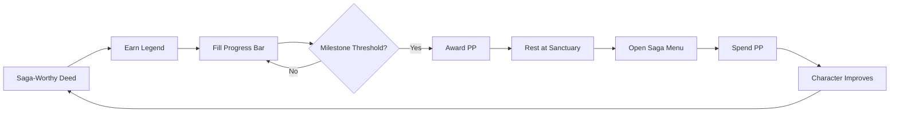
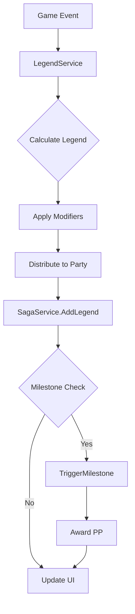

# Saga System — The Living Chronicle

> *"Your Legend is the measure of your saga—the sum of your heroic deeds, traumatic discoveries, and victories against chaos. It is not abstract experience; it is the narrative weight of your story in Aethelgard."*

---

## Document Control

| Version | Date | Changes |
|---------|------|---------|
| 1.0 | 2025-12-07 | Initial specification (combined from legacy Legend + Saga specs) |

---

## 1. Overview

### 1.1 Identity Table

| Property | Value |
|----------|-------|
| Spec ID | `SPEC-CORE-SAGA` |
| Category | Core System |
| Dependencies | `SPEC-CORE-DICE`, `SPEC-CORE-ATTRIBUTES` |
| Priority | Must-Have |

### 1.2 Core Philosophy

The Saga System is the **mechanical and narrative framework** governing all character progression. A character's growth is not simple power accumulation—it is the **writing of a living chronicle**.

**Design Pillars:**

- **Narrative Diegesis**: Legend is understood in-world as saga-worthiness
- **Deliberate Growth**: Progression through reflection, not constant gain
- **Player Agency**: Every upgrade is a deliberate choice
- **Anti-Grinding**: Trivial encounters award zero Legend
- **Thematic Integration**: Sanctuary Rest requirement reinforces coherence theme

### 1.3 The Progression Loop



### 1.4 Two-Currency Model

| Currency | Type | Earned By | Spent At |
|----------|------|-----------|----------|
| **Legend** | Passive | Performing deeds | Never (fills bar) |
| **Progression Points (PP)** | Active | Reaching Milestones | Saga Menu during Sanctuary Rest |

---

## 2. Legend System (Passive Accumulation)

### 2.1 The Universal Legend Formula

```
Legend Awarded = (Base Legend Value × Difficulty Modifier) × Trauma Modifier
```

**Components:**

| Component | Purpose | Range |
|-----------|---------|-------|
| **Base Legend Value (BLV)** | Inherent narrative weight | 10-500+ |
| **Difficulty Modifier (DM)** | Challenge relative to party | 0× - 2.0× |
| **Trauma Modifier (TM)** | Psychic/spiritual risk taken | 1.0× - 2.0× |

### 2.2 Base Legend Values (BLV)

#### Minor Acts (BLV: 10-25)

| Deed | BLV |
|------|-----|
| Critical hit in combat | 10 |
| Successful skill check | 15 |
| Discovering hidden cache | 15 |
| Simple puzzle solved | 20 |
| Minor enemy defeated | 25 |

#### Significant Acts (BLV: 50-150)

| Deed | BLV |
|------|-----|
| Champion enemy defeated | 75 |
| Minor faction quest complete | 100 |
| Masterwork item crafted | 75 |
| Complex puzzle solved | 100 |
| Diplomatic resolution | 100 |

#### Major Deeds (BLV: 200-500+)

| Deed | BLV |
|------|-----|
| Boss enemy defeated | 300 |
| Saga Quest complete | 500 |
| Major location discovered | 250 |
| Legendary artifact crafted | 400 |
| Blight incursion prevented | 500 |

### 2.3 Difficulty Modifier (DM)

Based on Target Difficulty Rating (TDR) vs. Party Power Score:

| Challenge Level | DM | When Applied |
|-----------------|-----|--------------|
| **Trivial** | 0× | TDR << Party (no Legend) |
| **Standard** | 1.0× | TDR ≈ Party |
| **Difficult** | 1.25× | TDR > Party |
| **Overwhelming** | 1.5×-2.0× | TDR >> Party |

> [!IMPORTANT]
> **Trivial encounters award ZERO Legend.** This is the anti-grinding mechanic.

### 2.4 Trauma Modifier (TM)

Rewards engagement with the Trauma Economy:

| Context | TM | Description |
|---------|-----|-------------|
| **Coherent** | 1.0× | No Blight interface |
| **Taxing** | 1.25× | Minor psychic risk |
| **Traumatic** | 1.5× | Significant spiritual danger |
| **Heretical** | 2.0× | Permanent corruption/trauma risk |

### 2.5 Legend Examples

**Standard Boss Fight:**
```
BLV: 300 (Boss)
DM:  1.0× (Standard)
TM:  1.25× (Taxing - Psychic Resonance zone)
────────────────────────────────
Legend: 300 × 1.0 × 1.25 = 375
```

**Overwhelming Heretical Quest:**
```
BLV: 500 (Saga Quest)
DM:  1.5× (Overwhelming)
TM:  2.0× (Heretical - permanent corruption)
────────────────────────────────
Legend: 500 × 1.5 × 2.0 = 1,500
```

**Trivial Grinding Attempt:**
```
BLV: 75 (Champion)
DM:  0× (Trivial - party overpowered)
TM:  1.0×
────────────────────────────────
Legend: 75 × 0 × 1.0 = 0 (NO REWARD)
```

---

## 3. Milestone System (Threshold Progression)

### 3.1 Milestone Formula

```
Legend to Next Milestone = (Current Milestone × 100) + 500
```

### 3.2 Milestone Progression Table

| Current → Next | Legend Required | Cumulative Total |
|----------------|-----------------|------------------|
| 0 → 1 | 500 | 500 |
| 1 → 2 | 600 | 1,100 |
| 2 → 3 | 700 | 1,800 |
| 5 → 6 | 1,000 | 4,000 |
| 10 → 11 | 1,500 | 10,500 |
| 20 → 21 | 2,500 | 35,500 |
| 50 → 51 | 5,500 | — |

**Design Intent:**
- **Early game** feels fast (500 Legend for first milestone)
- **Mid game** smoothly increases effort
- **Late game** becomes long-term goal

### 3.3 Milestone Event

When Legend ≥ threshold:

1. ✅ Award **1 Progression Point (PP)**
2. ✅ Subtract threshold from current Legend (preserve overflow)
3. ✅ Increment Milestone level
4. ✅ Recalculate next threshold
5. ✅ Trigger UI celebration

**Critical: Overflow Handling**

```csharp
while (character.LegendPoints >= character.LegendToNextMilestone)
{
    int overflow = character.LegendPoints - character.LegendToNextMilestone;
    character.LegendPoints = overflow;  // Preserve excess
    character.ProgressionPoints += 1;
    character.CurrentMilestone += 1;
    character.LegendToNextMilestone = CalculateThreshold(character.CurrentMilestone);
}
```

> [!CAUTION]
> Never set `LegendPoints = 0` — excess Legend must carry forward.

### 3.4 Milestone Rewards

In addition to PP, each Milestone grants:

| Reward | Amount |
|--------|--------|
| Progression Points | +1 PP |
| Max HP | +10 |
| Max Stamina | +5 |
| Full HP Restore | Yes |
| Full Stamina Restore | Yes |

---

## 4. Progression Points (Active Currency)

### 4.1 PP Spending Costs

#### Attributes

```
PP Cost = New Attribute Level × 2
```

| Upgrade | PP Cost |
|---------|---------|
| 8 → 9 | 18 PP |
| 9 → 10 | 20 PP |
| 10 → 11 | 22 PP |
| 15 → 16 | 32 PP |

#### Skills

| Skill Rank | PP Cost |
|------------|---------|
| 0 → 1 | 3 PP |
| 1 → 2 | 5 PP |
| 2 → 3 | 8 PP |
| 3 → 4 | 12 PP |
| 4 → 5 | 18 PP |

#### Specialization Abilities

**Unlocking Abilities:**

| Ability Tier | PP Cost (Rank 1) |
|--------------|------------------|
| Tier 1 | 3 PP |
| Tier 2 | 4 PP |
| Tier 3 | 5 PP |
| Capstone | 6 PP |

**Upgrading Ability Ranks:**

| Upgrade | PP Cost | Prerequisite |
|---------|---------|--------------|
| Rank 1 → Rank 2 | +2 PP | Ability unlocked |
| Rank 2 → Rank 3 | +3 PP | Rank 2 purchased |

> [!NOTE]
> **Maximum Investment Example:** Upgrading a Tier 1 ability to Rank 3 costs 3 + 2 + 3 = **8 PP** total.

### 4.2 Ability Rank Progression

Abilities have three ranks that represent mastery of the technique:

| Rank | Description | Effect |
|------|-------------|--------|
| **Rank 1** | Base ability | Core functionality |
| **Rank 2** | Improved form | Enhanced effects, reduced costs |
| **Rank 3** | Mastered form | Maximum power, bonus effects |

**Rules:**
- All abilities start at **Rank 1** when unlocked
- Rank upgrades are **optional** — players choose which abilities to invest in
- Rank upgrades can be purchased at any time during Sanctuary Rest
- There are **no tree prerequisites** for rank upgrades (buying Tier 2 abilities does not affect Tier 1 ranks)

### 4.3 PP Spending Restrictions

> [!WARNING]
> **The Golden Rule:** PP can ONLY be spent during **Sanctuary Rest**.

**Rationale:**
- Narrative: Mind must be coherent to reflect on growth
- Gameplay: Creates natural pacing and preparation phases
- Design: Deliberate progression, not constant micro-upgrades

### 4.4 PP Economy Analysis

| Milestone | Total PP Earned | Typical Allocation |
|-----------|-----------------|-------------------|
| 5 | 5 | 1-2 abilities |
| 10 | 10 | Primary attribute boost |
| 20 | 20 | Specialization tree complete |
| 50 | 50 | Near-maxed character |

---

## 5. Saga Menu (UI Interface)

### 5.1 Menu Structure

```
╔═══════════════════════════════════════════════════════════╗
║  SAGA OF THORVALD                    PP Available: 12     ║
╠═══════════════════════════════════════════════════════════╣
║  [1] ATTRIBUTES                                           ║
║  [2] SKILLS                                               ║
║  [3] SPECIALIZATIONS                                      ║
║  [4] VIEW SAGA HISTORY                                    ║
║                                                           ║
║  Legend: ████████████░░░░░░░░  1,250 / 1,500             ║
║  Milestone: 10                                            ║
╚═══════════════════════════════════════════════════════════╝
```

### 5.2 Attributes Tab

```
╔═══════════════════════════════════════════════════════════╗
║  ATTRIBUTES                          PP Available: 12     ║
╠═══════════════════════════════════════════════════════════╣
║                                                           ║
║  MIGHT:       10  [+] 22 PP                              ║
║  FINESSE:      8  [+] 18 PP                              ║
║  STURDINESS:  12  [+] 26 PP                              ║
║  WITS:         7  [+] 16 PP                              ║
║  WILL:         9  [+] 20 PP                              ║
║                                                           ║
║  [B] Back                                                 ║
╚═══════════════════════════════════════════════════════════╝
```

### 5.3 Specializations Tab

```
╔═══════════════════════════════════════════════════════════╗
║  BERSERKR ABILITIES                  PP Available: 12     ║
╠═══════════════════════════════════════════════════════════╣
║                                                           ║
║  TIER 1                                                   ║
║  [✓] Primal Vigor I      [Rank 2]  +2 PP                 ║
║  [✓] Wild Swing ★★       [Rank 3]  +3 PP                 ║
║  [ ] Reckless Assault     3 PP                            ║
║                                                           ║
║  TIER 2                                                   ║
║  [✓] Unleashed Roar ★    [Rank 2]  +2 PP                 ║
║  [ ] Whirlwind            4 PP                            ║
║  [ ] Blood-Fueled         4 PP                            ║
║                                                           ║
║  Legend: ★ = Rank 1, ★★ = Rank 2, ★★★ = Rank 3           ║
║  [B] Back                                                 ║
╚═══════════════════════════════════════════════════════════╝
```

---

## 6. Party Distribution

### 6.1 Shared Legend Philosophy

**Core Rule:** For group activities, **every present party member receives full Legend**.

| Activity Type | Distribution |
|---------------|--------------|
| Party combat | Full to each member |
| Group quest | Full to each member |
| Collaborative puzzle | Full to each member |
| Solo skill check | Individual only |
| Individual crafting | Individual only |

### 6.2 Party Award Example

```
Party defeats Boss (375 Legend reward):

- Thorvald: +375 Legend
- Sigrun:   +375 Legend  
- Bjorn:    +375 Legend
- Astrid:   +375 Legend

Total distributed: 1,500 Legend (no splitting)
```

### 6.3 Presence Rules

| Scenario | Legend Received |
|----------|-----------------|
| Present for deed | Full amount |
| Absent (elsewhere) | None |
| Dead during deed | Full amount |
| Dead before deed | None |

---

## 7. Special Modifiers

### 7.1 Legend Penalties

| Condition | Modifier | Duration |
|-----------|----------|----------|
| `[Frayed Echo]` (post-resurrection) | −50% | 24 hours in-game |
| `[Systemic Apathy]` (Trauma) | −25% | Permanent |
| Stacking | Multiplicative | — |

**Example with penalties:**
```
Boss: 375 Legend base
Frayed Echo: × 0.5 = 187
Systemic Apathy: × 0.75 = 140 Legend final
```

### 7.2 Legend Bonuses

| Source | Modifier |
|--------|----------|
| `[Saga-Touched]` blessing | +10% |
| Skald party buff | +15% |
| First clear bonus | +25% |

---

## 8. Technical Implementation

### 8.1 Service Architecture



### 8.2 LegendService Interface

```csharp
public interface ILegendService
{
    int CalculateLegend(ERewardType type, EDifficulty difficulty, ETraumaContext trauma);
    void AwardLegend(Party party, int amount);
    void AwardIndividualLegend(Character character, int amount);
    float GetLegendModifier(Character character);  // Penalties/bonuses
}

public enum ERewardType
{
    CombatMinor, CombatChampion, CombatBoss,
    QuestMinor, QuestSaga,
    CraftingMasterwork, CraftingLegendary,
    ExplorationDiscovery, SocialResolution, PuzzleComplex
}

public enum EDifficulty { Trivial, Standard, Difficult, Overwhelming }
public enum ETraumaContext { Coherent, Taxing, Traumatic, Heretical }
```

### 8.3 SagaService Interface

```csharp
public interface ISagaService
{
    void AddLegend(Character character, int amount);
    bool CheckMilestone(Character character);
    MilestoneResult TriggerMilestone(Character character);
    int CalculateNextThreshold(int currentMilestone);
    
    // PP Spending
    bool CanSpendPP(Character character, UpgradeType type, string target);
    SpendResult SpendPP(Character character, UpgradeType type, string target, int cost);
}

public record MilestoneResult(int NewMilestone, int PPAwarded, int OverflowLegend);
public record SpendResult(bool Success, int RemainingPP, string? Error);
```

### 8.4 Database Schema

```sql
-- Character progression fields
ALTER TABLE characters ADD COLUMN (
    legend_points INT NOT NULL DEFAULT 0,
    progression_points INT NOT NULL DEFAULT 0,
    current_milestone INT NOT NULL DEFAULT 0,
    legend_to_next_milestone INT NOT NULL DEFAULT 500
);

-- Legend values configuration
CREATE TABLE legend_values (
    reward_type VARCHAR(50) PRIMARY KEY,
    base_legend_value INT NOT NULL,
    description TEXT
);

-- Legend award history (analytics)
CREATE TABLE legend_awards (
    id SERIAL PRIMARY KEY,
    character_id UUID NOT NULL REFERENCES characters(id),
    reward_type VARCHAR(50) NOT NULL,
    base_value INT NOT NULL,
    difficulty_modifier DECIMAL(3,2) NOT NULL,
    trauma_modifier DECIMAL(3,2) NOT NULL,
    final_legend INT NOT NULL,
    awarded_at TIMESTAMP NOT NULL DEFAULT CURRENT_TIMESTAMP
);

-- PP spending history
CREATE TABLE saga_upgrades (
    id SERIAL PRIMARY KEY,
    character_id UUID NOT NULL REFERENCES characters(id),
    upgrade_type VARCHAR(50) NOT NULL,
    upgrade_target VARCHAR(100) NOT NULL,
    pp_cost INT NOT NULL,
    milestone_at_purchase INT NOT NULL,
    purchased_at TIMESTAMP NOT NULL DEFAULT CURRENT_TIMESTAMP
);
```

---

## 9. Phased Implementation Guide

### Phase 1: Core Logic
- [ ] **Formulas**: Implement `CalculateLegend` and `CalculateNextThreshold`.
- [ ] **Interfaces**: Define `ILegendService` and `ISagaService`.
- [ ] **Enums**: Define `RewardType`, `Difficulty`, `TraumaContext`.

### Phase 2: Persistence
- [ ] **Schema**: Apply `characters` schema updates and create `legend_*` tables.
- [ ] **Repositories**: Update `CharacterRepository` to load/save Legend fields.
- [ ] **Unit Tests**: Verify persistence round-trip for Legend/PP.

### Phase 3: Services
- [ ] **Legend Service**: Implement calculator and distribution logic.
- [ ] **Saga Service**: Implement milestone checking and overflow logic.
- [ ] **Event Listeners**: Subscribe to `CombatEnded` to trigger awards.

### Phase 4: UI & Integration
- [ ] **Saga Menu**: Implement TUI tabs for Attributes/Skills spending.
- [ ] **HUD**: Add Legend Bar to main UI.
- [ ] **Notifications**: Implement "Milestone Reached!" toast.

---

## 10. Testing Requirements

### 10.1 Unit Tests
- [ ] **Formula**: `(BLV × DM) × TM` returns correct values.
- [ ] **Thresholds**: Verify thresholds [500, 1100, 1800...] match table.
- [ ] **Overflow**: Verify excess Legend carries over (Start 490 + 20 Award = 0 Milestone + 500 New Threshold + 10 points).
- [ ] **Triviality**: Verify DM 0x results in 0 Legend.

### 10.2 Integration Tests
- [ ] **Persistence**: Save character with 5 PP/1000 Legend -> Load -> Verify values.
- [ ] **Spending**: Verify spending PP reduces total and unlocks Upgrade.
- [ ] **Party Split**: Verify 4-person party gets 4x total Legend (1x each).

### 10.3 Manual QA
- [ ] **UI Flow**: Rest at Sanctuary -> Open Saga -> Spend PP -> Verify Stats increase.
- [ ] **Notification**: Kill boss -> Verify "Legend Awarded" log appears.

---

## 11. Logging Requirements

**Reference:** [logging.md](logging.md)

### 11.1 Log Events

| Event | Level | Message Template | Properties |
|-------|-------|------------------|------------|
| Legend Awarded | Information | "Awarded {Amount} Legend to {Character} (Reason: {Reason})" | `Amount`, `Character`, `Reason` |
| Milestone | Information | "{Character} reached Milestone {Level}! (+1 PP)" | `Character`, `Level` |
| Spend PP | Information | "{Character} spent {Cost} PP on {Upgrade} ({Remaining} left)" | `Character`, `Cost`, `Upgrade`, `Remaining` |
| Trivial Skip | Debug | "Skipped Legend award (Trivial difficulty) for {Character}" | `Character` |

### 11.2 Context Enrichment

| Property | Source | Description |
|----------|--------|-------------|
| `Milestone` | LogContext | Current Milestone Level |
| `LegendTotal` | LogContext | Total accumulated Legend |

---

## 12. Related Specifications

| Spec ID | Relationship |
|---------|--------------|
| `SPEC-CORE-ATTRIBUTES` | PP spent on attribute increases |
| `SPEC-CORE-RESOURCES` | Milestone restores HP/Stamina |
| `SPEC-CORE-TRAUMA` | TM based on Trauma Economy engagement |
| `SPEC-COMBAT-ENGINE` | Provides TDR for DM calculation |
