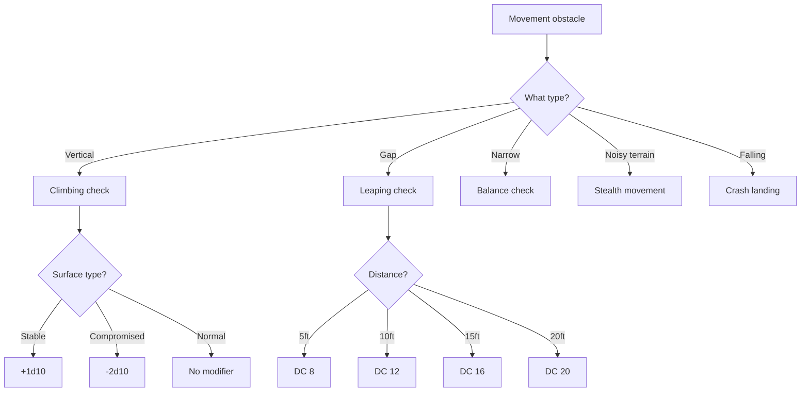
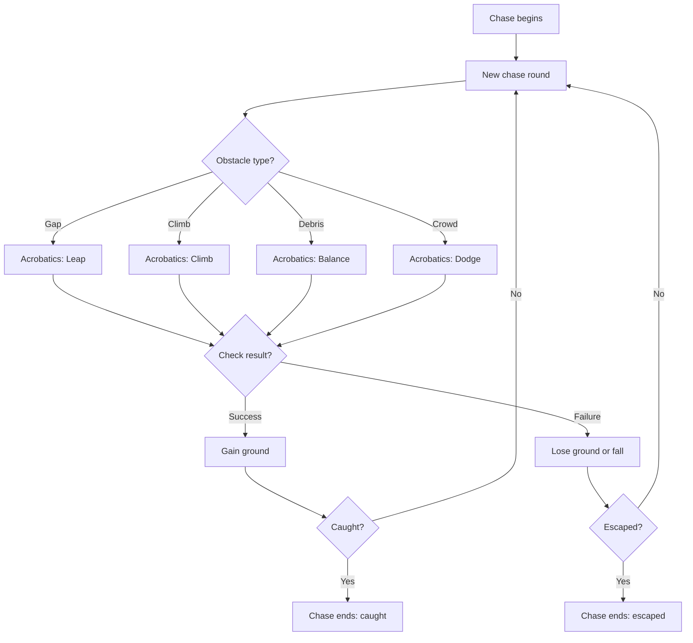
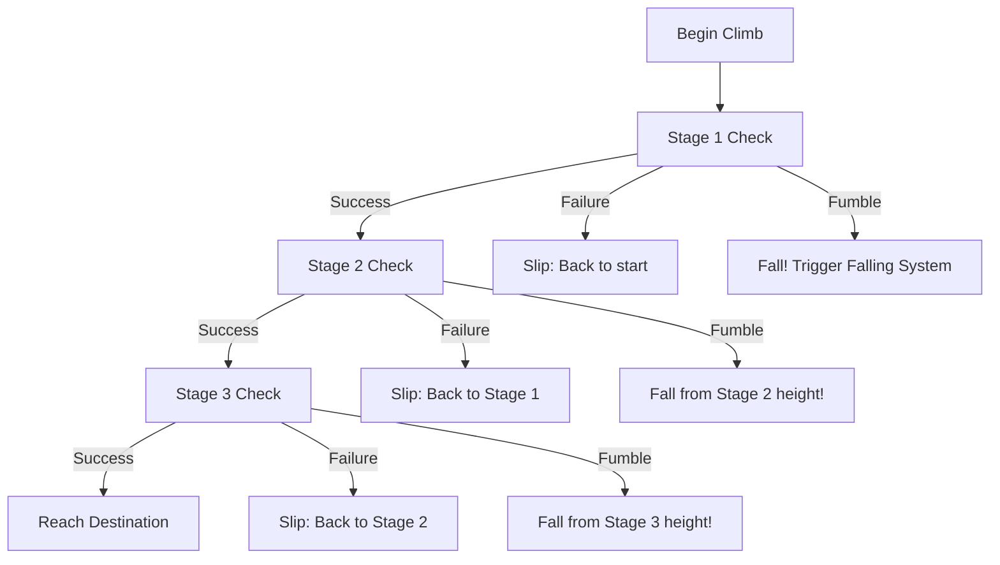

# Acrobatics

**Governing Attribute:** FINESSE

---

## 1. Core Philosophy: The Art of the Glitch-Runner

> *"The safest path is always the most obvious. The fastest path defies gravity. The surest path requires you to trust a rusted girder that may not exist in the next breath."*

Acrobatics resolves: *Can this character safely traverse the vertical, hazardous geometry of Aethelgard's broken infrastructure?*

This is the art of the **Glitch-Runner**—a character who has mastered movement through the unstable, fractured, and physically glitching ruins of the Old World. It represents not just physical grace, but an intuitive understanding of how to exploit the world's broken geometry. To invest in Acrobatics is to choose the path of the agile navigator, believing that the surest path forward is often the one that defies gravity.

### 1.1 The Navigator's Creed

> [!IMPORTANT]
> **Verticality is power.** The 3D Textual Labyrinth rewards those who can climb, leap, and move unseen. The ground-bound path is the slowest, most dangerous, and least rewarding.

**What Acrobatics Represents:**
- Climbing rusted girders that crumble with each handhold
- Leaping across chasms where reality flickers
- Moving silently over debris that creaks with every step
- Balancing on precarious ledges above fatal drops
- Trusting your body to surfaces that may not exist tomorrow

**Armor and Movement:**
| Armor Type | Acrobatics Penalty | Justification |
|------------|-------------------|---------------|
| Light/None | +0 | Full freedom of movement |
| Medium | -1d10 | Restricts flexibility |
| Heavy | -4d10 | Massive weight, limited mobility |

**Primary Users:** Strandhöggs, Myrk-gengr, Gantry-Runners, Skirmisher archetypes

---

## 2. Trigger Events

### 2.1 When to Use Acrobatics

| Trigger | Description | Alternative |
|---------|-------------|-------------|
| **Climbing** | Scaling vertical surfaces | Find stairs/ladders |
| **Leaping** | Jumping across gaps | Find a bridge |
| **Balancing** | Traversing narrow/unstable surfaces | Go around |
| **Stealth Movement** | Moving silently through noisy terrain | Distract enemies |
| **Crash Landing** | Reducing fall damage | Take full damage |

### 2.2 Movement Decision Tree



---

## 3. DC Tables

### 3.1 Climbing

| Difficulty | DC | Example |
|------------|-----|---------|
| Easy | 8 | Intact ladder, rubble pile |
| Moderate | 12 | Brick wall, scaffolding |
| Challenging | 16 | Rusted girder, smooth metal |
| Difficult | 20 | Crumbling server tower |
| Extreme | 24 | Collapsing gantry, sheer ice |

### 3.2 Leaping

| Distance | DC | Notes |
|----------|-----|-------|
| Short (5 ft) | 8 | Standard gap |
| Medium (10 ft) | 12 | Requires run-up |
| Long (15 ft) | 16 | Risky, failure = fall |
| Extreme (20 ft) | 20 | Near impossible |

**Running Jump Bonus:** +5 ft to distance if moving full speed

### 3.3 Stealth Movement

| Surface | DC | Sound Level |
|---------|-----|-------------|
| Silent (carpet, moss) | 10 | Whisper quiet |
| Normal (concrete, dirt) | 14 | Footsteps audible |
| Noisy (loose rubble) | 18 | Crunching sounds |
| Very Noisy (scrap metal) | 22 | Clanging echoes |

### 3.4 Balancing

| Surface | DC | Width |
|---------|-----|-------|
| Wide beam (2+ ft) | 8 | Stable |
| Narrow beam (1 ft) | 12 | Careful movement |
| Cable/pipe (6 in) | 16 | Slow movement |
| Razor edge (< 6 in) | 20 | Extreme caution |

---

## 4. Fall Damage

### 4.1 Damage Calculation

```
Fall Damage = (Height in 10-ft increments) × 1d10
Maximum: 10d10 (100+ feet)
```

| Fall Height | Damage |
|-------------|--------|
| 10 ft | 1d10 |
| 20 ft | 2d10 |
| 30 ft | 3d10 |
| 50 ft | 5d10 |
| 100+ ft | 10d10 (max) |

### 4.2 Crash Landing Check

**DC:** 12 + (Height in 10-ft increments)

**Success:** Reduce damage by 1d10 per success above threshold

**Example:**
> Falling 30 ft (3d10 damage, DC 15)
> Roll 4 successes → DC 15 requires 3 → 1 excess
> Damage reduced by 1d10 → take 2d10 instead

---

## 5. Dice Pool Calculation

```
Pool = FINESSE + Rank + Equipment Mod + Surface Mod + Situation
```

### 5.1 Equipment Modifiers

| Equipment | Modifier |
|-----------|----------|
| Climbing Gear | +1d10 |
| Grappling Hook | +2d10 to vertical surfaces |
| Heavy Armor | -1d10 |
| Light/No Armor | +0 |

### 5.2 Surface Modifiers

| Surface | Modifier |
|---------|----------|
| Stable | +1d10 |
| Normal | +0 |
| Wet/Slippery | -1d10 |
| Structurally Compromised | -2d10 |
| Actively Collapsing | -3d10 |

---

## 6. Master Rank Benefits (Rank 5)

| Ability | Effect |
|---------|--------|
| **Spider Climb** | Auto-succeed DC ≤ 12, climb at full speed |
| **Cat's Grace** | Fall up to 30 ft with no damage, always land on feet |
| **Ghost Walk** | Auto-succeed stealth DC ≤ 14, even in heavy armor |
| **Death-Defying Leap** | +10 ft to maximum leap distance |
| **Perfect Balance** | Auto-succeed balance DC ≤ 16 |

---

## 7. Example Scenarios

### Scenario A: Climbing a Rusted Gantry

> **Situation:** Torsten needs to climb a 40-ft rusted gantry to reach the observation deck.
>
> **Character:**
> - FINESSE: 6
> - Acrobatics: Rank 3 (Journeyman)
> - Equipment: Climbing gear (+1d10)
> - Surface: Rusted (Compromised, -2d10)
>
> **Pool:** 6 + 3 + 1 - 2 = 8d10
>
> **DC:** 16 (Challenging)
>
> **Roll:** 8d10 → [7, 9, 4, 8, 3, 7, 2, 10] = 5 successes
>
> **Result:** 5 ≥ 3 (DC 16 threshold) → SUCCESS!
>
> **Outcome:** Torsten reaches the top, hands aching from the corroded metal.

### Scenario B: Leaping a Gap Under Fire

> **Situation:** Helga must leap a 15-ft gap while under fire from enemy snipers.
>
> **Character:**
> - FINESSE: 7
> - Acrobatics: Rank 2 (Apprentice)
> - Running start: Yes (+5 ft effective → easier DC)
>
> **DC:** 16 (15 ft gap) → 12 with running start
>
> **Pool:** 7 + 2 = 9d10
>
> **Roll:** 9d10 → [8, 3, 7, 9, 2, 4, 8, 7, 6] = 5 successes
>
> **Result:** 5 ≥ 2 → SUCCESS!
>
> **Outcome:** Helga sails across the gap, bullets pinging off the metal behind her.

### Scenario C: Stealth Through Scrap Field

> **Situation:** Sigrid attempts to sneak through a scrap metal field to avoid Rust-Horror sentries.
>
> **Setup:**
> - FINESSE: 5
> - Acrobatics: Rank 4 (Expert)
> - Surface: Very Noisy (scrap metal)
>
> **DC:** 22
>
> **Pool:** 5 + 4 = 9d10
>
> **Roll:** 9d10 → [7, 8, 9, 3, 4, 7, 10, 2, 8] = 6 successes
>
> **Result:** 6 ≥ 5 (DC 22 threshold) → SUCCESS!
>
> **Outcome:** Sigrid moves like a ghost, weight distributed perfectly across the debris.

---

## 8. Chase Sequences

### 8.1 Chase Workflow



### 8.2 Chase Distance Track

| Position | Status |
|----------|--------|
| Close (0-1) | Can attempt capture |
| Near (2-3) | Within striking distance |
| Far (4-5) | Safe for now |
| Lost (6+) | Escaped pursuit |

Each success = +1 position, each failure = -1 position

---

## 9. Technical Implementation

### 9.1 Data Model

```csharp
public enum AcrobaticsTrigger { Climb, Leap, Balance, Stealth, Fall }
public enum SurfaceType { Stable, Normal, Wet, Compromised, Collapsing }

public class AcrobaticsContext
{
    public AcrobaticsTrigger Trigger { get; set; }
    public SurfaceType Surface { get; set; }
    public int DistanceFt { get; set; }
    public int HeightFt { get; set; }
    public bool HasRunningStart { get; set; }
}
```

### 9.2 Service Interface

```csharp
public interface IAcrobaticsService
{
    SkillCheckResult CheckMovement(Character character, AcrobaticsContext context);
    int CalculateReflexDc(Character character); // For dodging falling debris
    FallDamageResult CalculateFallDamage(int heightFt, int successCount);
    ChaseState UpdateChase(ChaseContext context, Character fleeing, Character pursuer);
}
```

---

## 10. Phased Implementation Guide

### Phase 1: Core Logic
- [ ] **Calculator**: Implement DC calculation based on distance/surface.
- [ ] **Service**: Implement `CheckMovement` wrapping internal `SkillService`.
- [ ] **Fall**: Implement `CalculateFallDamage` logic.

### Phase 2: Traverse
- [ ] **Climb**: Implement pathing logic for vertical surfaces.
- [ ] **Leap**: Integrate with Grid Movement system (allow jumping over holes).
- [ ] **Stealth**: Integrate with Enemy Perception AI.

### Phase 3: Chase System
- [ ] **Loop**: Implement the Chase Round state machine.
- [ ] **Track**: Implement the abstract "Distance Track" Logic.
- [ ] **Obstacles**: Random obstacle generator for chases.

### Phase 4: UI & Feedback
- [ ] **Cursor**: Show leap trajectory/range indicator.
- [ ] **Grid**: Highlight valid climbable surfaces.
- [ ] **Chase**: Specific "Chase Bar" UI showing Pursuer/Prey distance.

---

## 11. Testing Requirements

### 11.1 Unit Tests
- [ ] **Leap DC**: 5ft -> 8, 10ft -> 12, etc.
- [ ] **Run Bonus**: Running Start improves reach/lowers DC.
- [ ] **Fall Damage**: 30ft -> 3d10. Reduced by successes.
- [ ] **Surface Mod**: Verify -2d10 for Compromised surface.

### 11.2 Integration Tests
- [ ] **Movement**: Select Jump -> Click target -> Verify check rolled -> Character moves.
- [ ] **Stealth**: Toggle Stealth -> Move near enemy -> Verify Perception check logic.
- [ ] **Chase**: Simulate 3 successes -> Verify Distance Track increases.

### 11.3 Manual QA
- [ ] **Visuals**: Verify falling animation triggers at proper height.
- [ ] **Rubble**: Move over noisy rubble -> Verify enemy turns to sound.

---

## 12. Logging Requirements

**Reference:** [logging.md](../logging.md)

### 12.1 Log Events

| Event | Level | Message Template | Properties |
|-------|-------|------------------|------------|
| Acrobatics Check | Info | "{Character} attempted {Trigger} (DC {DC}): {Result}" | `Character`, `Trigger`, `DC`, `Result` |
| Fall | Warning | "{Character} fell {Height}ft! Taken {Damage} damage." | `Character`, `Height`, `Damage` |
| Chase Update | Info | "{Pursuer} chased {Prey}. Distance: {Old} -> {New}" | `Pursuer`, `Prey`, `Old`, `New` |

---

## 13. Related Specifications

| Document | Purpose |
|----------|---------|
| [Skills Overview](overview.md) | Core skill mechanics |
| [Combat System](../../03-combat/) | Movement in combat |
| [Stealth System](../../04-systems/stealth.md) | Standardized stealth rules |
| [Grid Movement](../../07-environment/grid_movement.md) | Map movement logic |
| [Skills UI](../../08-ui/skills-ui.md) | Interface specification |
| [Skill Outcomes](../../07-environment/descriptors/skill-outcomes.md) | Outcome descriptors |

---

## 14. Expanded Application: Climbing

### 14.1 The Ascent Against Decay

Climbing is a direct, physical struggle against the world's decay. The character is not using stable, pre-crash infrastructure—they are finding purchase on crumbling, treacherous surfaces, defying gravity through sheer grit and physical grace.

> *"The ladder ends halfway up. Beyond that, it's rust and prayer. Your fingers find holds the Old World never intended. Your weight tests surfaces that have waited centuries to fail."*

### 14.2 Multi-Stage Climbing

A significant climb (traversing one or more Z-levels) is not a single check but a **multi-stage process**:



**Stage Breakdown:**
| Climb Height | Stages Required | DC per Stage |
|--------------|-----------------|---------------|
| 10-20 ft | 1 | Surface DC |
| 30-40 ft | 2 | Surface DC |
| 50+ ft | 3 | Surface DC |

### 14.3 Surface Classification

| Surface Type | Description | DC |
|--------------|-------------|-----|
| **Knotted Rope / Intact Ladder** | Designed for climbing | 2 |
| **Broken Ladder / Thick Ivy** | Damaged but usable | 4 |
| **Crumbling Rock Face** | Minimal handholds | 6 |
| **Sheer Metal Wall** | Near-impossible without gear | 8 |
| **[Glitched] Surface** | Handholds flicker in/out | +2 modifier |

### 14.4 Degrees of Success

| Degree | Condition | Effect |
|--------|-----------|--------|
| **Standard Failure** | Successes < DC | Slip down one stage. Lose progress, no fall damage. |
| **Success** | Successes ≥ DC | Advance to next stage. |
| **Critical Success** | Successes ≥ DC + 2 | Advance two stages, or reach top instantly. |
| **Fumble** | 0 successes | **[The Slip]** — Fall from current height. Trigger Falling System. |

### 14.5 Fumble Consequence: [The Slip]

When a climber fumbles:
- **Fall Distance:** Calculated from current stage height
- **Damage:** Per Falling System (1d10 per 10 ft)
- **Psychic Stress:** +3 from terror of fall
- **Gear Risk:** Chance to drop held items

---

## 15. Expanded Application: Leaping & Jumping

### 15.1 Defying the Glitch

Leaping is a character's attempt to impose their physical will upon the broken, fragmented geometry of the world. It is not a simple hop—it is a calculated, high-risk maneuver across chasms where reality itself is often thinnest.

> *"The gap is not far. But the far edge flickers. In this place, distance is a suggestion. You push off, trusting that the platform will be there when you land."*

### 15.2 Leap Classification

| Leap Type | Description | DC |
|-----------|-------------|-----|
| **Standard Leap** | One-tile gap, stable surfaces | 3 |
| **Long Leap** | Wide gap, requires running start | 5 |
| **Precision Leap** | Small or narrow landing zone | +1 modifier |
| **[Glitched] Leap** | Flickering platform | +2 modifier |
| **Heroic Leap** | Two-tile gap (Master only) | 8+ |

### 15.3 Running Start Bonus

| Condition | Effect |
|-----------|--------|
| Running Start | -2 DC (minimum DC 3) |
| Standing Jump | Standard DC |
| Encumbered | +2 DC |
| [Low Gravity] | -2 DC |

### 15.4 Degrees of Success

| Degree | Condition | Effect |
|--------|-----------|--------|
| **Failure** | Successes < DC | Fall into chasm. Trigger Falling System. |
| **Success** | Successes ≥ DC | Land safely on far side. |
| **Critical Success** | Successes ≥ DC + 2 | Perfect landing. **Stamina cost halved.** |
| **Fumble** | 0 successes | **[The Long Fall]** — Catastrophic failure. Additional Psychic Stress. |

### 15.5 Fumble Consequence: [The Long Fall]

A fumbled leap is not just a fall—it is a violent, disorienting plunge:

- **Fall Damage:** Per Falling System + 1d10 bonus damage
- **Psychic Stress:** +5 from terror and disorientation
- **[Glitched] Leaps:** Reality desynchronization adds +3 more Stress
- **Flavor:** *"You lunge forward, but a flicker in reality desynchronizes your movement. You don't just fall—you are violently thrown downwards into the abyss."*

### 15.6 Combat Leaping

Leaping can be used as a **combat movement action**:
- **Cost:** Standard movement + Acrobatics check
- **Benefit:** Cross hazardous terrain, reposition dramatically
- **Risk:** Fumble during combat is devastating (lost action + damage)

---

## 16. Expanded Application: Stealth Movement

### 16.1 The Ghost in the Static

Stealth in Rune & Rust is not just hiding in shadows—it is becoming a **ghost in the static**. In a world saturated with the psychic noise of the Great Silence, true concealment means masking both physical and metaphysical presence.

> *"You are not invisible. You are background noise. Another creak in the ruins, another shadow in the dark. The moment they notice you, you become real—and real things can be killed."*

### 16.2 Passive Stealth (Party Movement)

When the party moves through an area with unaware enemies:

**The Weakest Link Rule:**
> The party is only as quiet as its loudest member. The character with the **lowest Acrobatics dice pool** makes the check.

**Opposed Roll:**
| Party Roll | vs. | Enemy Roll |
|------------|-----|------------|
| Lowest party member's FINESSE + Acrobatics + Armor Penalty | vs. | Highest enemy's Passive Perception |

**Results:**
| Outcome | Effect |
|---------|--------|
| Party ≥ Enemy | Undetected. Pass through safely. |
| Party < Enemy | **Detected.** Combat initiated. Enemies may get surprise round. |
| Fumble | **[System-Wide Alert]** — All enemies in current AND adjacent rooms converge. |

### 16.3 Active Stealth: The [Hidden] Status

A character can actively attempt to vanish from sight:

**Command:** `hide` or specialization ability

**Base DC:** 5

**Modifiers:**
| Condition | DC Modifier |
|-----------|-------------|
| [Dim Light] / [Obscuring Terrain] | -2 |
| [Illuminated] Area | +3 |
| Enemy [Alerted] or in combat | +2 |
| [Psychic Resonance] zone | -3 (ultimate camouflage) |

**[Hidden] Status Effects:**
- Cannot be directly targeted by single-target attacks
- Can still be hit by AoE abilities
- **Broken** by: Attacking, loud action, or enemy critical Perception

### 16.4 Fumble Consequence: [System-Wide Alert]

A fumbled stealth check causes catastrophic noise:

- **Immediate Combat:** Enemies in current room engage
- **Alert Propagation:** All enemies in adjacent rooms become [Alerted]
- **Convergence:** Adjacent enemies will move toward party location
- **Psychic Stress:** +3 for entire party from sudden exposure

### 16.5 Party Composition Impact

| Party Member | Impact on Stealth |
|--------------|-------------------|
| Heavy Armor wearer | -4d10 to group check |
| Low-FINESSE character | Likely to be "weakest link" |
| Myrk-gengr specialist | Can use abilities to mask others |
| Large party (5+) | +2 DC (harder to coordinate) |

---

## 17. Specialization Integration

### 17.1 The Gantry-Runner's Domain

Acrobatics is the soul of the **Gantry-Runner** specialization:

| Ability | Effect |
|---------|--------|
| `[Roof-Runner]` | Reduce climbing stages by 1 |
| `[Death-Defying Leap]` | +10 ft to maximum leap distance |
| `[Wall-Run]` | Run vertically for short distance (combat action) |
| `[Double Jump]` | Once per day, correct a failed leap mid-air |
| `[Featherfall]` | Auto-succeed Crash Landing DC ≤ 14 |

### 17.2 The Myrk-gengr's Domain

Stealth is the core of the **Myrk-gengr** specialization:

| Ability | Effect |
|---------|--------|
| `[Slip into Shadow]` | Enter [Hidden] without action |
| `[Ghostly Form]` | Stay [Hidden] after attacking (once per encounter) |
| `[Cloak the Party]` | Grant party +2d10 on Passive Stealth |
| `[One with the Static]` | Auto-enter [Hidden] in [Psychic Resonance] zones |

---

## 18. Voice Guidance

### 18.1 Tone Profile

| Property | Value |
|----------|-------|
| **Theme** | Physical mastery over a broken, vertical world |
| **Tone** | Tense, athletic, defiant of gravity and decay |
| **Key Words** | Grip, ledge, momentum, silence, shadow, void |

### 18.2 Narrative Examples

| Result | Example Text |
|--------|--------------|
| **Success (Climb)** | "Your fingers find holds the Old World never intended. Hand over hand, you ascend into the rust-stained darkness above." |
| **Success (Leap)** | "With a powerful surge, you sail across the void, landing with a solid thud on the far side. The chasm yawns beneath you, disappointed." |
| **Success (Stealth)** | "You move like a ghost, weight distributed perfectly across the debris. The sentries never hear you pass." |
| **Critical (Leap)** | "Your movement is a work of art. You clear the chasm with room to spare, landing in a perfect crouch." |
| **Fumble (Climb)** | "A handhold you thought was stable crumbles to dust! You lose your purchase entirely and plummet back to the floor below!" |
| **Fumble (Leap)** | "A flicker in reality desynchronizes your movement. You don't just fall—you are violently thrown downwards into the abyss." |
| **Fumble (Stealth)** | "Your boot strikes a loose pipe! The clang echoes through the ruins like a bell. Every eye turns toward you." |

---

## 19. Changelog

| Version | Date | Changes |
|---------|------|---------|
| 1.0 | 2025-12-07 | Initial specification |
| 1.1 | 2025-12-14 | Added Glitch-Runner philosophy, expanded climbing/leaping/stealth sections, multi-stage climbing, [Hidden] status, voice guidance |
