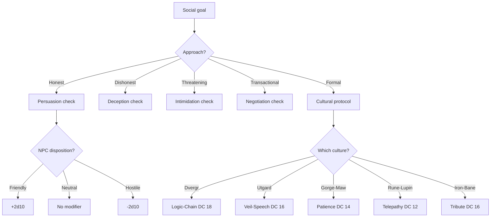
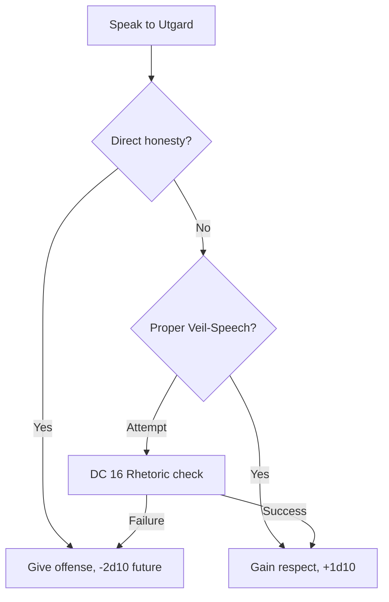
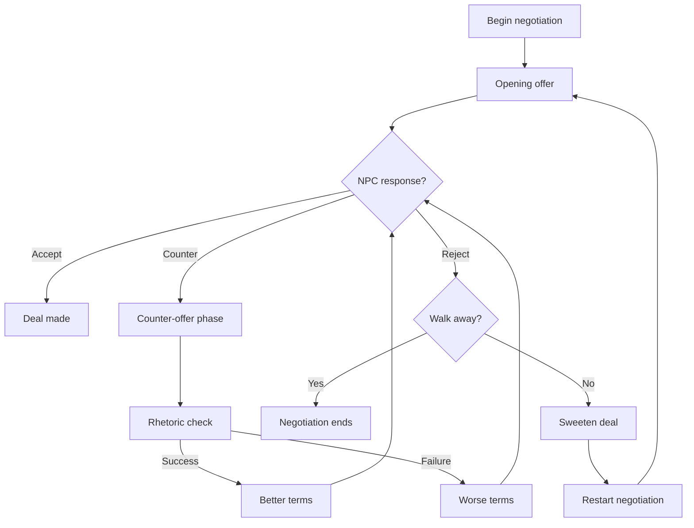
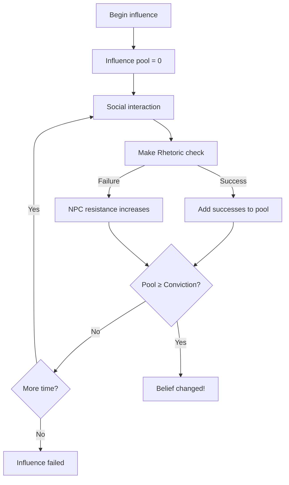
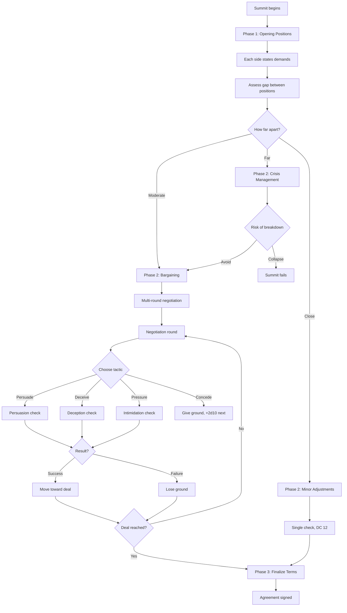
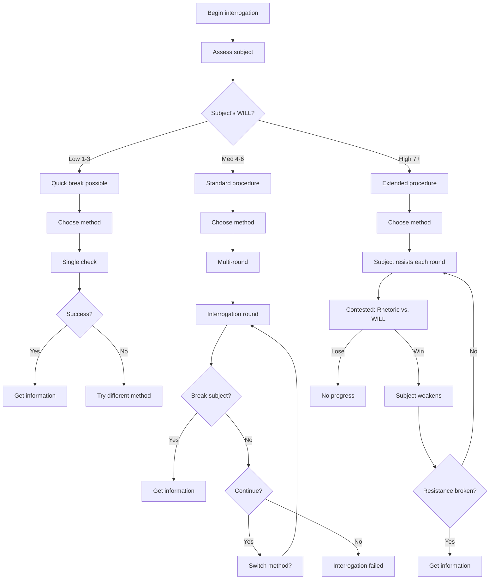
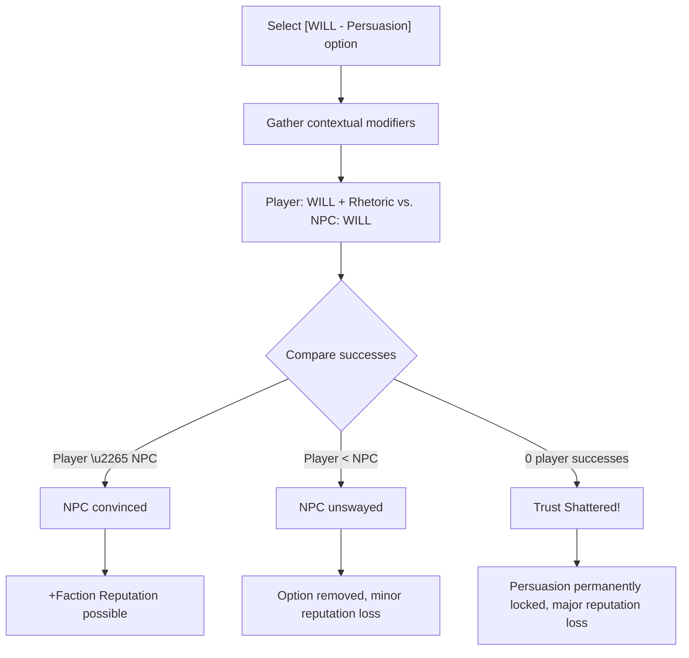
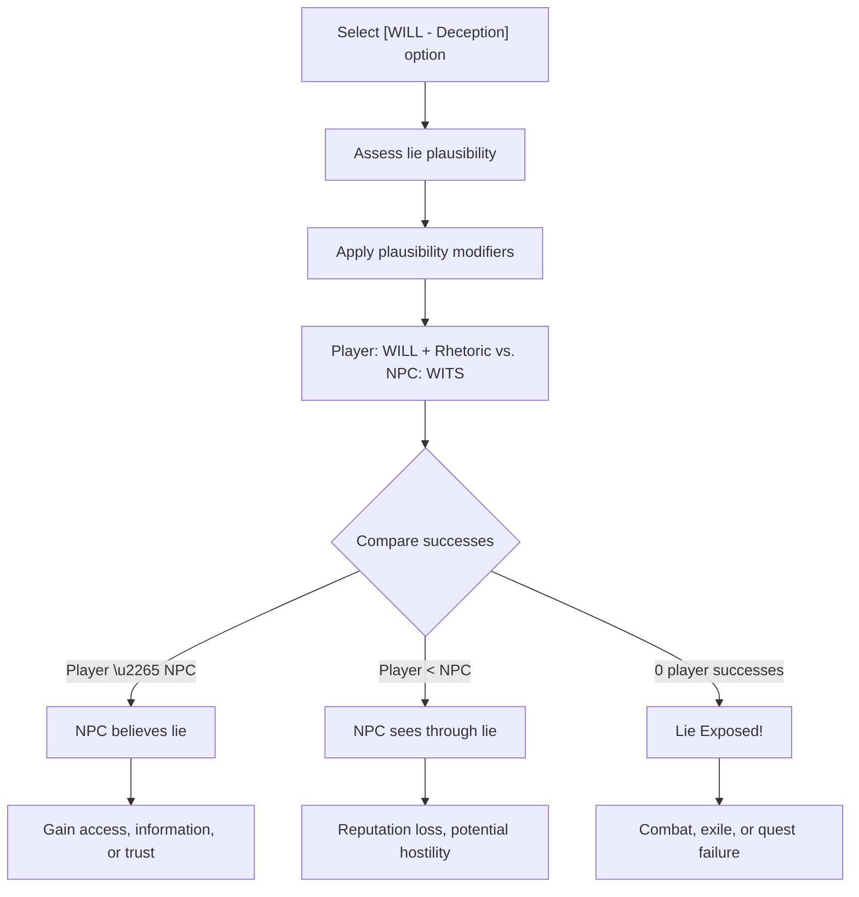
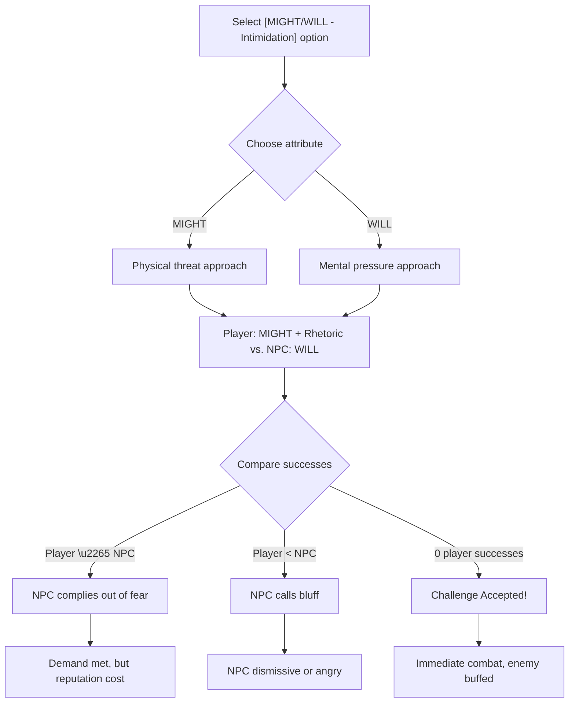

# Rhetoric

**Governing Attribute:** WILL

---

## 1. Core Philosophy: The Coherent Narrative

> *"In a world of static and madness, a well-formed argument is a weapon. A convincing lie is a key. An inspiring saga is a shield. Your words can change the course of history—or end your life when you say the wrong one."*

Rhetoric resolves: *Can this character navigate the complex social landscape of Aethelgard's fractured cultures and impose their own coherent narrative upon the fear-addled minds of others?*

This is survival through **social engineering** in a world where every faction has different rules of speech, and a wrong phrase can mean death. The silver-tongued orator wields language, logic, and emotion as weapons, projecting a stable, coherent narrative so powerfully that it temporarily overwrites the target's fear, greed, or doubt.

### 1.1 The Orator's Creed

> [!IMPORTANT]
> **Words are weapons.** In the fractured, paranoid world of Aethelgard, a skilled speaker can bypass combat entirely, unlock secrets that violence could never reveal, and forge alliances that change the course of the Saga.

**What Rhetoric Represents:**
- Convincing a paranoid guard you belong here
- Telling a lie so well-crafted the truth seems implausible
- Projecting such menace that enemies flee without fighting
- Navigating the complex protocols of alien cultures
- Building the trust needed to learn the deepest secrets

**The Opposed Roll Principle:**
| Check Type | Player Attribute | vs. | NPC Resistance |
|------------|------------------|-----|----------------|
| Persuasion | WILL + Rhetoric | vs. | NPC's WILL |
| Deception | WILL + Rhetoric | vs. | NPC's WITS |
| Intimidation | MIGHT/WILL + Rhetoric | vs. | NPC's WILL |

**Primary Users:** Skalds, Kupmaðr (Merchants), Thuls (Scholars)

---

## 2. Trigger Events

### 2.1 When to Use Rhetoric

| Trigger | Description | Alternative |
|---------|-------------|-------------|
| **Persuasion** | Convincing NPCs to take action | Threaten/bribe |
| **Deception** | Lying, misleading, concealing truth | Tell the truth |
| **Intimidation** | Coercing through threat or display | Physical force |
| **Negotiation** | Brokering deals or truces | Walk away |
| **Cultural Protocol** | Navigating formal interactions | Give offense |

### 2.2 Social Interaction Decision Tree



---

## 3. DC Tables

### 3.1 Persuasion

| Request | DC | Example |
|---------|-----|---------|
| Trivial | 8 | "Tell me the time" |
| Simple | 12 | "Share your rations" |
| Moderate | 16 | "Help me fight" |
| Major | 20 | "Attack your faction's enemies" |
| Extreme | 24 | "Betray your clan leader" |

### 3.2 Deception

| Lie Complexity | DC | Example |
|----------------|-----|---------|
| White lie | 10 | "I was here the whole time" |
| Plausible lie | 14 | "I'm with the Combine" |
| Unlikely lie | 18 | "The Warden sent me" |
| Outrageous lie | 22 | "I am the Warden" |

**Detection Modifiers:**
| Factor | Modifier |
|--------|----------|
| NPC suspicious | +4 DC |
| NPC trusting | -4 DC |
| Evidence contradicts | +6 DC |
| Excellent cover story | -2 DC |

### 3.3 Intimidation

| Target | DC | Notes |
|--------|-----|-------|
| Coward | 8 | Easily cowed |
| Common NPC | 12 | Standard resistance |
| Veteran | 16 | Seen worse |
| Elite | 20 | Hardened resolve |
| Faction Leader | 24 | Reputation at stake |

### 3.4 Cultural Protocols

| Culture | DC | Required Protocol |
|---------|-----|-------------------|
| Dvergr Logic-Chain | 18 | Precise, non-contradictory sequences |
| Utgard Veil-Speech | 16 | Layer truth in deception |
| Gorge-Maw Patience | 14 | Listen to full 10+ minute rumble |
| Rune-Lupin Telepathy | 12 | Open mind, suppress hostility |
| Iron-Bane Tribute | 16 | Offer martial tribute first |

---

## 4. Utgard Veil-Speech

In Utgard culture, **honesty is an insult** — it implies the target is too stupid to understand complexity.

### 4.1 Veil-Speech Rules

- Direct truth-telling offends (-2d10 on future checks)
- All communication should include layers of misdirection
- The more elaborate the deception structure, the more respect
- Deception DC against Utgard is **reduced by 4**
- Persuasion must use indirect, metaphorical language

### 4.2 Veil-Speech Workflow



---

## 5. Dice Pool Calculation

```
Pool = WILL + Rank + Cultural Mod + Situational + Cant Mod
```

### 5.1 Cultural Modifiers

| Familiarity | Modifier |
|-------------|----------|
| Native culture | +2d10 |
| Familiar culture | +1d10 |
| Unknown culture | +0 |
| Alien/hostile culture | -2d10 |

### 5.2 Cant Modifier

**Cant:** Faction-specific dialects and jargon

| Cant Knowledge | Modifier |
|----------------|----------|
| Fluent in target's cant | +1d10 |
| Basic understanding | +0 |
| No knowledge | -1d10 |

### 5.3 Disposition Modifiers

| NPC Disposition | Modifier |
|-----------------|----------|
| Friendly (≥50) | +2d10 |
| Neutral-Positive (10-49) | +1d10 |
| Neutral (-9 to +9) | +0 |
| Unfriendly (-49 to -10) | -1d10 |
| Hostile (≤-50) | -2d10 |

---

## 6. Negotiation Workflow

### 6.1 Negotiation Phases



### 6.2 Negotiation DC Table

| What You're Asking For | DC |
|------------------------|-----|
| Fair trade | 10 |
| Slight advantage | 14 |
| Noticeable advantage | 18 |
| Major advantage | 22 |
| One-sided deal | 26 |

### 6.3 Concession Effects

| Concession | DC Reduction |
|------------|--------------|
| Offer item of value | -2 |
| Promise future favor | -2 |
| Information trade | -4 |
| Take personal risk | -4 |
| Faction reputation on line | -6 |

---

## 7. Master Rank Benefits (Rank 5)

| Ability | Effect |
|---------|--------|
| **Polyglot** | Know all common cants (DC ≤ 14 checks auto-succeed) |
| **Cultural Diplomat** | Auto-succeed protocol checks DC ≤ 14 |
| **Master Negotiator** | Re-roll one failed check per conversation |
| **Silver Tongue** | Auto-succeed persuasion DC ≤ 12 |
| **Fearsome Reputation** | +2d10 to all intimidation |

---

## 8. Example Scenarios

### Scenario A: Persuading a Guard

> **Situation:** Kira needs to convince a Midgard Combine guard to let her pass.
>
> **Character:**
> - WILL: 6
> - Rhetoric: Rank 2 (Apprentice)
> - Combine cant: Fluent (+1d10)
> - Guard disposition: Neutral (+0)
>
> **DC:** 12 (Simple request)
>
> **Pool:** 6 + 2 + 1 = 9d10
>
> **Roll:** 9d10 → [7, 4, 8, 9, 2, 7, 3, 8, 6] = 5 successes
>
> **Result:** 5 ≥ 2 (DC 12 threshold) → SUCCESS!
>
> **Outcome:** "Fine, but don't cause any trouble."

### Scenario B: Lying to a Suspicious Merchant

> **Situation:** Bjorn claims to be a Combine representative to get a discount.
>
> **Character:**
> - WILL: 5
> - Rhetoric: Rank 3 (Journeyman)
> - Merchant is suspicious: +4 DC
>
> **DC:** 14 (Plausible lie) + 4 = 18
>
> **Pool:** 5 + 3 = 8d10
>
> **Roll:** 8d10 → [9, 7, 3, 4, 2, 8, 7, 1] = 4 successes
>
> **Result:** 4 < 4 (DC 18 threshold) → FAILURE
>
> **Outcome:** "Nice try. Get out of my shop."
>
> **Consequence:** -5 reputation with merchant, future checks at -1d10

### Scenario C: Utgard Veil-Speech Negotiation

> **Situation:** Sigrid negotiates passage through Utgard territory.
>
> **Character:**
> - WILL: 7
> - Rhetoric: Rank 4 (Expert)
> - Utgard Veil-Speech: DC reduced by 4
> - Proper veil-speech used: +1d10
>
> **DC:** 20 (Major request) - 4 = 16
>
> **Pool:** 7 + 4 + 1 = 12d10
>
> **Roll:** 12d10 → 7 successes
>
> **Result:** 7 ≥ 3 (DC 16 threshold) → SUCCESS!
>
> **Outcome:** The Utgard raiders, impressed by her mastery of indirect speech, grant safe passage.

---

## 9. Social Combat

### 9.1 Extended Influence

When attempting to change deeply-held beliefs or faction loyalty:



### 9.2 NPC Conviction Levels

| Conviction | Pool Required |
|------------|---------------|
| Weak opinion | 5 |
| Moderate belief | 10 |
| Strong conviction | 15 |
| Core belief | 20 |
| Fanatical | 25+ |

---

## 10. Diplomatic Summit Procedure

When negotiating treaties, alliances, or major faction agreements:

### 10.1 Summit Phases



### 10.2 Summit Round Structure

Each negotiation round:

| Step | Action | Time |
|------|--------|------|
| 1. Assess | Review current positions | 1 min |
| 2. Strategize | Choose tactic | Internal |
| 3. Execute | Make Rhetoric check | 1 check |
| 4. Respond | NPC reacts | Automatic |
| 5. Adjust | Positions shift | Update |

### 10.3 Position Track

Both parties start at their **Opening Position** and move toward **Compromise**.

```
PC Position Track:
[Maximum Demand] ← ← ← [Strong] ← ← ← [Favorable] ← ← ← [Compromise]
        ↑                                                      ↑
    Start here                                            Goal zone
                                                               ↓
[Compromise] → → → [Unfavorable] → → → [Weak] → → → [Walk Away]
        ↑                                                      ↑
    Goal zone                                          NPC's goal
```

**Movement per check:**
| Result | Track Movement |
|--------|----------------|
| Critical success (5+ over) | Move opponent 2 steps toward you |
| Success | Move opponent 1 step toward you |
| Failure | Move yourself 1 step toward opponent |
| Critical failure (5+ under) | Move yourself 2 steps toward opponent |

### 10.4 Diplomatic Summit Example

> **Scenario:** Sigrid negotiates a non-aggression pact between Midgard Combine and Iron-Bane clan.
>
> **Setup:**
> - WILL: 7, Rank 4 (Expert)
> - Pool: 11d10
> - Gap: Moderate (multi-round required)
> - Rounds available: 5 (patience of both sides)
>
> ---
>
> **Opening Positions:**
> - Midgard: Wants trade rights + territory
> - Iron-Bane: Wants weapons + apology
> - Gap: 4 steps apart
>
> ---
>
> **Round 1 - Persuasion (trade benefits):**
> - DC: 16
> - Roll: 11d10 → 5 successes ✓
> - Result: Iron-Bane moves 1 step (gap now 3)
>
> ---
>
> **Round 2 - Concession (offer limited weapons):**
> - Action: Give ground
> - Result: Sigrid moves 1 step toward Iron-Bane
> - Bonus: +2d10 on next check
>
> ---
>
> **Round 3 - Persuasion (mutual defense offer):**
> - DC: 14 (reduced, goodwill established)
> - Pool: 11 + 2 = 13d10
> - Roll: 13d10 → 7 successes ✓ (Critical!)
> - Result: Iron-Bane moves 2 steps (gap now 0!)
>
> ---
>
> **Phase 3 - Finalize Terms:**
> - Trade rights: Granted
> - Limited weapons: Exchanged
> - Territory: Shared patrol zone
> - Apology: Symbolic gesture accepted
>
> **Total Rounds:** 3 of 5
> **Final Position:** Favorable compromise

---

## 11. Interrogation Procedure

When extracting information from unwilling subjects:

### 11.1 Interrogation Methods

| Method | Skill Check | Time | Side Effects |
|--------|-------------|------|--------------|
| Good Cop | Persuasion DC 14 | 30 min | None |
| Bad Cop | Intimidation DC 12 | 15 min | -5 disposition |
| Deception | Deception DC 16 | 20 min | Unreliable info |
| Bribery | Persuasion DC 10 | 10 min | Costs resources |
| Torture | — | Varies | Trauma, unreliable, -30 rep |

### 11.2 Interrogation Workflow



### 11.3 Subject Resistance Track

| Resistance | Checks to Break |
|------------|-----------------|
| Minimal (frightened civilian) | 1 |
| Low (hired muscle) | 2-3 |
| Moderate (loyal soldier) | 4-5 |
| High (trained operative) | 6-8 |
| Extreme (fanatical believer) | 10+ |

### 11.4 Information Reliability

| Method Used | Reliability |
|-------------|-------------|
| Good Cop | 95% accurate |
| Bad Cop | 80% accurate |
| Deception | 70% (subject may lie back) |
| Bribery | 90% accurate |
| Torture | 50% (will say anything) |

### 11.5 Interrogation Example

> **Scenario:** Kira interrogates a captured Iron-Bane scout.
>
> **Subject:** WILL 5 (Medium), Resistance: Moderate (4 checks)
>
> **Setup:**
> - Kira: WILL 6, Rhetoric Rank 3
> - Pool: 9d10
>
> ---
>
> **Round 1 - Good Cop (build rapport):**
> - DC: 14
> - Roll: 9d10 → 4 successes ✓
> - Result: Resistance -1 (now 3 remaining)
>
> ---
>
> **Round 2 - Good Cop (offer water, comfort):**
> - DC: 14
> - Roll: 9d10 → 3 successes ✓
> - Result: Resistance -1 (now 2 remaining)
>
> ---
>
> **Round 3 - Switch to Bad Cop (time pressure):**
> - DC: 12
> - Roll: 9d10 → 5 successes ✓
> - Result: Resistance -1 (now 1 remaining)
> - Side effect: -5 disposition with subject
>
> ---
>
> **Round 4 - Bad Cop (final push):**
> - DC: 12
> - Roll: 9d10 → 4 successes ✓
> - Result: RESISTANCE BROKEN
>
> **Information Gained:**
> - Iron-Bane patrol routes
> - Supply cache locations
> - Commander's name
>
> **Reliability:** 80% (Bad Cop method)
> **Time Spent:** 45 minutes
> **Consequences:** Scout will not cooperate in future

---

## 12. Technical Implementation

### 12.1 Data Model

```csharp
public enum SocialInteractionType { Persuasion, Deception, Intimidation, Negotiation, Protocol }
public enum NpcDisposition { Hostile, Unfriendly, Neutral, Friendly, Ally }

public class SocialContext
{
    public SocialInteractionType Type { get; set; }
    public Character Target { get; set; }
    public Faction TargetFaction { get; set; }
    public NpcDisposition Disposition { get; set; }
    public Culture Culture { get; set; }
    public int BaseDc { get; set; }
}
```

### 12.2 Service Interface

```csharp
public interface ISocialService
{
    SkillCheckResult AttemptInteraction(Character speaker, SocialContext context);
    int CalculateDispositionModifier(NpcDisposition disposition);
    int CalculateCulturalModifier(Character speaker, Culture targetCulture);
    SummitState UpdateSummit(SummitContext context, DiplomacyAction action);
    InterrogationResult ProcessInterrogationRound(InterrogationContext context, InterrogationMethod method);
}
```

---

## 13. Phased Implementation Guide

### Phase 1: Core Logic
- [ ] **Calculator**: Implement modifiers for Disposition and Culture.
- [ ] **Service**: Implement `AttemptInteraction` wrapping internal `SkillService`.
- [ ] **Tables**: Implement static DC tables for Persuasion/Deception.

### Phase 2: Advanced Interaction
- [ ] **Negotiation**: Implement the "Position Track" logic for Summits.
- [ ] **Interrogation**: Implement the "Resistance Track" and Method logic.
- [ ] **Protocols**: Implement specific Cultural Protocol checks (Veil-Speech logic).

### Phase 3: Integration
- [ ] **Faction**: Hook Disposition to Faction Reputation.
- [ ] **Dialogue**: Integrate checks into the Dialogue Tree system.
- [ ] **Cant**: Hook "Polyglot" feat to Cant modifiers.

### Phase 4: UI & Feedback
- [ ] **Wheel**: "Conversation Wheel" showing available approaches and success %.
- [ ] **Feedback**: "NPC is offended (-5 Disposition)" toast.
- [ ] **Visuals**: Disposition bar above NPC head.

---

## 14. Testing Requirements

### 14.1 Unit Tests
- [ ] **Disposition**: Friendly -> +2d10. Hostile -> -2d10.
- [ ] **Deception**: Suspicious Target -> +4 DC.
- [ ] **Summit**: Critical Success moves opponent 2 steps.
- [ ] **Interrogation**: "Bad Cop" reliability is 80%.

### 14.2 Integration Tests
- [ ] **Dialogue**: Select Persuade -> Roll -> Success -> Dialogue advances to Success node.
- [ ] **Protocol**: Utgard Interaction -> Use Honesty -> Disposition drops.
- [ ] **Summit**: Run full summit flow -> Verify outcome matches position track.

### 14.3 Manual QA
- [ ] **UI**: Verify Disposition bar changes color.
- [ ] **Dialogue**: Verify "Lie" option shows % chance of success.

---

## 15. Logging Requirements

**Reference:** [logging.md](../logging.md)

### 15.1 Log Events

| Event | Level | Message Template | Properties |
|-------|-------|------------------|------------|
| Social Check | Info | "{Character} used {Type} on {Target} (DC {DC}): {Result}" | `Character`, `Type`, `Target`, `DC`, `Result` |
| Summit Update | Info | "Summit Round {Round}: {Side} moved to {Position}." | `Round`, `Side`, `Position` |
| Interrogation | Warning | "Subject RESISTANCE BROKEN! Revealed: {Info}" | `Info` |

---

## 16. Related Specifications

| Document | Purpose |
|----------|---------|
| [Skills Overview](overview.md) | Core skill mechanics |
| [Dialogue System](../../02-entities/dialogue-system.md) | Conversation integration |
| [Faction Reputation](../../02-entities/faction-reputation.md) | Disposition effects |
| [Quest System](../../04-systems/quest-system.md) | Negotiation rewards |
| [Skills UI](../../08-ui/skills-ui.md) | Interface specification |
| [Skill Outcomes](../../07-environment/descriptors/skill-outcomes.md) | Outcome descriptors |

---

## 17. Expanded Application: Persuasion

### 17.1 The Art of the Coherent Argument

Persuasion is achieving consensus through coherent argument. It is convincing another being to agree with you, help you, or change their mind through empathy, shared values, and superior logic—not through threats or lies.

> *"Your narrative must become their narrative. When you speak, they should feel that your truth was always their truth—they simply hadn't found the words for it yet."*

### 17.2 Persuasion Workflow



### 17.3 Situational Modifiers

| Factor | Modifier |
|--------|----------|
| NPC from [Friendly] faction | Player +1d10 |
| NPC from [Unfriendly] faction | NPC +1d10 |
| Argument aligns with NPC values | Player +1d10 |
| Argument contradicts NPC values | NPC +1d10 |
| NPC is [Stressed] or [Feared] | NPC +1d10 |
| Evidence supports argument | Player +2d10 |

### 17.4 Degrees of Success

| Degree | Condition | Effect |
|--------|-----------|--------|
| **Failure** | Player < NPC | Unswayed. Option removed. Minor reputation loss. |
| **Success** | Player ≥ NPC | Convinced. Request granted. Often +Reputation. |
| **Critical Success** | Player ≥ NPC + 3 | Deep conviction. Unlocks additional options or information. |
| **Fumble** | 0 player successes | **[Trust Shattered]** — All persuasion options locked with this NPC. Major reputation loss. |

### 17.5 Fumble Consequence: [Trust Shattered]

A fumbled persuasion is an argument so flawed or accidentally insulting that it permanently damages the relationship:

- **Locked Options:** All persuasive dialogue with this NPC permanently unavailable
- **Reputation Loss:** -15 to -25 with NPC's faction
- **Recovery:** Impossible through further dialogue; requires quest completion or major favor
- **Flavor:** *"Your attempt at diplomacy comes across as a condescending lecture. The Chieftain's face hardens. 'Do not presume to counsel me again.'"*

---

## 18. Expanded Application: Deception

### 18.1 The Art of the Corrupted Narrative

Deception is crafting and projecting a **false but coherent narrative** so effectively that it temporarily overwrites the target's perception of reality. The character creates a pocket of personal fiction and passes it off as truth.

> *"A good lie is a house built on sand—but if you build it well enough, no one will notice the foundation until they're already inside."*

### 18.2 Deception Workflow



### 18.3 Lie Plausibility Modifiers

| Lie Type | NPC's WITS Modifier |
|----------|---------------------|
| Simple lie ("I was here the whole time") | NPC -1d10 |
| Standard lie ("I'm the new recruit") | +0 |
| Outrageous lie ("I am the prophet") | NPC +2d10 |
| Evidence supports lie (forged papers) | Player +2d10 |
| Evidence contradicts lie | NPC +3d10 |

### 18.4 Degrees of Success

| Degree | Condition | Effect |
|--------|-----------|--------|
| **Failure** | Player < NPC | Seen through. Reputation loss. Path closed. |
| **Success** | Player ≥ NPC | Believed. Access/information granted. |
| **Critical Success** | Player ≥ NPC + 3 | Completely trusted. Additional opportunities. |
| **Fumble** | 0 player successes | **[Lie Exposed]** — Catastrophic failure. |

### 18.5 Fumble Consequence: [Lie Exposed]

A fumbled deception is so transparently false it provokes extreme reaction:

- **Immediate Combat:** 50% chance NPC attacks
- **Exile:** Possible permanent ban from settlement
- **Quest Failure:** Critical quests may become permanently failed
- **Stress:** +5 Psychic Stress from social disaster
- **[Untrustworthy] Flag:** Future deception checks against this faction at +3 DC
- **Flavor:** *"Your attempt to imitate the cult's secret handshake is a clumsy insult. The cultist's face contorts with rage. 'Blasphemer!'"*

### 18.6 The Liar's Burden

All deception attempts carry mental cost:

| Result | Stress Cost |
|--------|-------------|
| Success | +1 Psychic Stress |
| Failure | +3 Psychic Stress |
| Fumble | +8 Psychic Stress |

---

## 19. Expanded Application: Intimidation

### 19.1 The Brute-Force Narrative

Intimidation forces compliance through overwhelming projection of a single, undeniable story: *"I am a greater threat to you than the consequences of defying me."* This can be physical menace, imposing presence, or terrifying reputation.

> *"You're not negotiating. You're informing them of what happens if they refuse. Make sure they believe it."*

### 19.2 Attribute Choice: MIGHT vs. WILL

Intimidation is the only Rhetoric check that allows attribute choice:

| Attribute | Narrative | Visual |
|-----------|-----------|--------|
| **MIGHT** | Physical threat | Hand on weapon, flexing, looming |
| **WILL** | Mental pressure | Cold stare, chilling certainty, implied doom |

**Player chooses** which attribute to use when selecting the dialogue option.

### 19.3 Intimidation Workflow



### 19.4 Contextual Modifiers

| Factor | Modifier |
|--------|----------|
| Intimidating weaker target | Player +1d10 |
| Intimidating stronger target | NPC +1d10 |
| [Honored] or [Feared] reputation | Player +1d10 |
| Wielding visible [Artifact] | Player +1d10 |
| Accompanied by intimidating ally | Player +1d10 |
| NPC has backup nearby | NPC +1d10 |

### 19.5 Degrees of Success

| Degree | Condition | Effect |
|--------|-----------|--------|
| **Failure** | Player < NPC | Bluff called. Dismissed. -5 to -10 Reputation. |
| **Success** | Player ≥ NPC | Cowed. Complies out of fear. **Always costs -5 Reputation.** |
| **Critical Success** | Player ≥ NPC + 3 | Terrified. May flee or provide additional information. |
| **Fumble** | 0 player successes | **[Challenge Accepted]** — Combat initiated, enemy buffed. |

### 19.6 Fumble Consequence: [Challenge Accepted]

A fumbled intimidation is perceived as weakness or direct challenge:

- **Immediate Combat:** NPC attacks without hesitation
- **[Furious] Buff:** NPC gains +2d10 damage for duration of combat
- **No Retreat:** NPC will not accept surrender
- **Stress:** +5 Psychic Stress from unexpected violence
- **Flavor:** *"Your threat comes out as a squeak. The raider throws back his head and laughs. 'You want a shallow grave? I'll dig one!' he roars, drawing his axe."*

### 19.7 The Cost of Fear

Successful intimidation always damages relationships:

| Result | Reputation Cost |
|--------|-----------------|
| Success | -5 Faction Reputation |
| Critical Success | -3 Faction Reputation |
| Failure | -10 Faction Reputation |

---

## 20. Specialization Integration

### 20.1 The Orator's Domain

Rhetoric is the soul of several specializations:

| Specialization | Focus | Unique Abilities |
|----------------|-------|------------------|
| **Thul** | Scholarly persuasion | Unlock hidden knowledge options, no rep loss on failed persuasion |
| **Skald** | Inspiring oratory | Rally allies, boost party morale, resist [Despair] |
| **Kupmaðr** | Mercantile negotiation | Better prices, bonus dice on trade, detect lies |
| **Myrk-gengr** | Deceptive infiltration | Maintain lies under pressure, forge documents |

### 20.2 Unique Specialization Abilities

**Thul:**
- `[Voice of Reason]` — Failed persuasion doesn't lock options
- `[Scholarly Authority]` — +2d10 when discussing lore or history

**Skald:**
- `[Inspiring Words]` — Grant allies bonus dice through oratory
- `[Saga of Heroes]` — Reduce party Stress through storytelling

**Kupmaðr:**
- `[Silver Tongue]` — Auto-succeed negotiation DC ≤ 12
- `[Sniff Out Lies]` — Bonus dice to detect NPC deception

---

## 21. Voice Guidance

### 21.1 Tone Profile

| Property | Value |
|----------|-------|
| **Theme** | Social combat, narrative as weapon |
| **Tone** | Strategic, tense, high-stakes |
| **Key Words** | Convince, believe, trust, fear, truth, narrative |

### 21.2 Narrative Examples

| Result | Example Text |
|--------|--------------|
| **Success (Persuasion)** | "The Chieftain considers your words, stroking his beard. '...Your logic is sound. You speak with the wisdom of a true leader. Very well.'" |
| **Success (Deception)** | "The cultist's eyes go wide. 'The prophet! At last!' He immediately kneels, granting you passage." |
| **Success (Intimidation)** | "The scavenger's eyes widen as you place your hand on your axe. 'Alright, alright! The cache is in the old pumping station!'" |
| **Critical Success** | "Your words land with the force of a saga. They don't just agree—they *believe*. Something fundamental has shifted in how they see you." |
| **Fumble (Persuasion)** | "Your attempt at diplomacy comes across as condescending. The Chieftain's face hardens. 'Do not presume to counsel me again.'" |
| **Fumble (Deception)** | "Your lie unravels mid-sentence. The guard's hand moves to his weapon. 'You're no recruit. You're a spy.'" |
| **Fumble (Intimidation)** | "Your threat falls flat. The raider grins. 'You want to play tough? Let's play.' He reaches for his blade." |

---

## 22. The Trauma Economy

Social interaction with traumatized individuals carries mental cost:

| Interaction Type | Stress Cost |
|------------------|-------------|
| Persuade [Stressed] NPC | +2 Psychic Stress |
| Deceive any NPC | +1-3 Psychic Stress |
| Intimidate [Vulnerable] target | +3 Psychic Stress |
| Fumble into violence | +5 Psychic Stress |
| Cause permanent relationship damage | +3 Psychic Stress |

---

## 23. Changelog

| Version | Date | Changes |
|---------|------|---------|
| 1.0 | 2025-12-07 | Initial specification |
| 1.1 | 2025-12-14 | Added Coherent Narrative philosophy, expanded persuasion/deception/intimidation with fumble consequences, specialization abilities, voice guidance, trauma economy |
