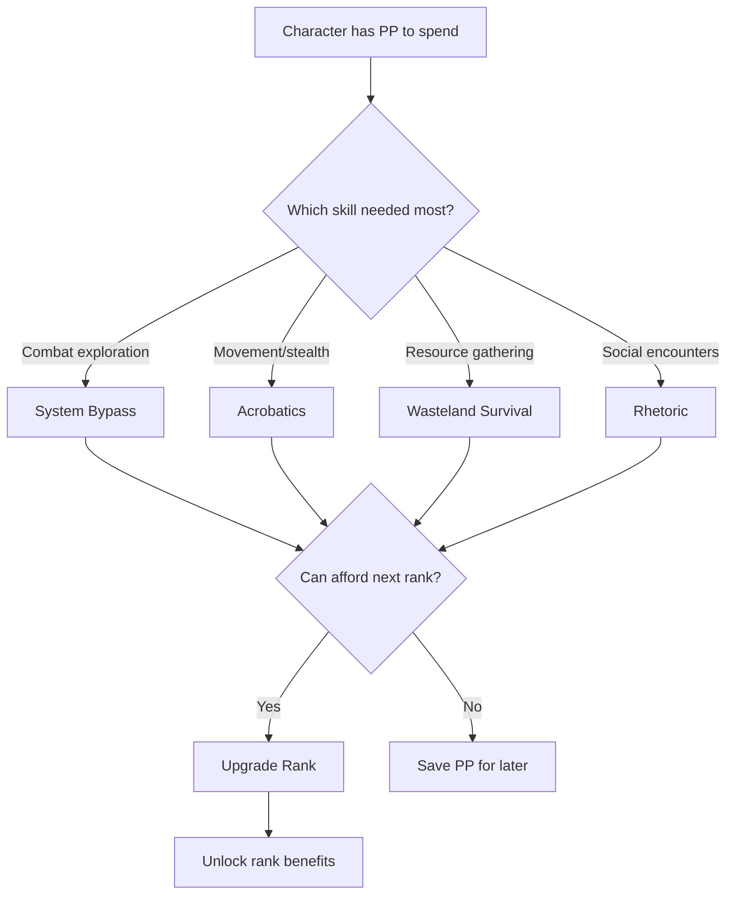
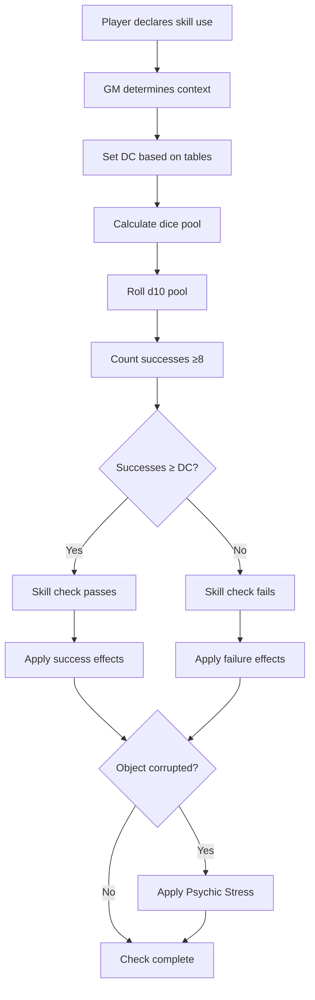
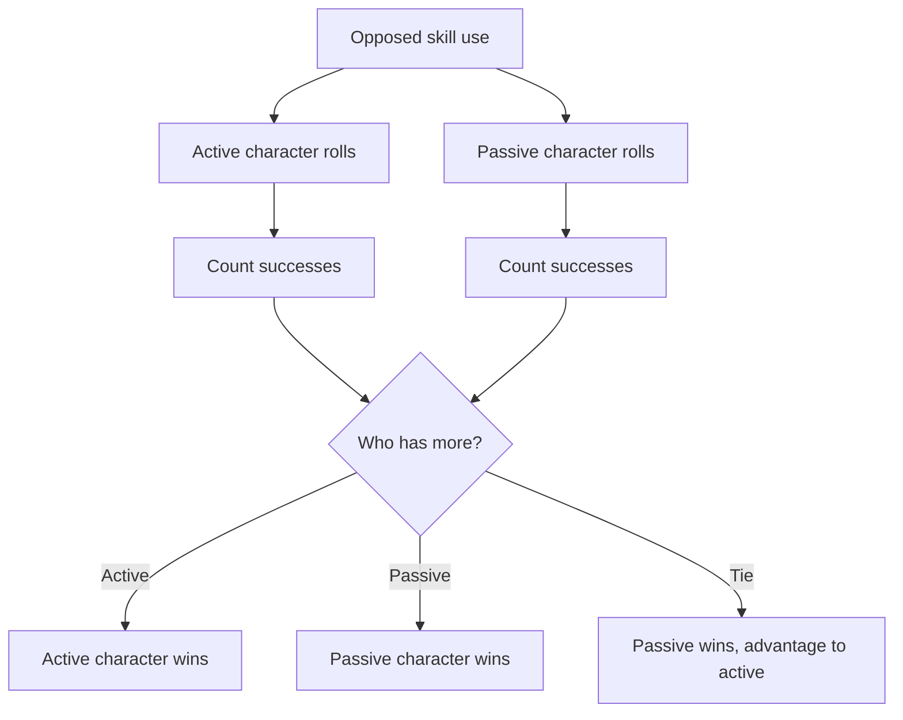
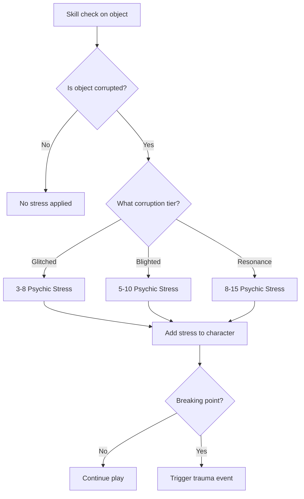

# Skills System — Overview

---

## 1. Design Philosophy

Skills represent the **non-combat subroutines** a survivor learns to navigate Aethelgard's catastrophically broken reality. While Archetypes define a character's foundational "operating system" and Specializations represent combat expertise, Skills are the quiet, essential arts that keep survivors alive outside of battle.

**Design Pillars:**
- **Focused Toolkit** — Only 4 core skills, ensuring each is meaningful
- **Attribute + Expertise** — Dice Pool = Governing Attribute + Skill Rank
- **Five-Rank Progression** — Novice → Apprentice → Journeyman → Expert → Master
- **Trauma Economy Integration** — Using skills on corrupted objects inflicts Psychic Stress
- **Universal Access** — Any character can invest in any skill
- **Adept's Kingdom** — Adepts excel at skill-based gameplay

---

## 2. The Four Core Skills

| Skill | Attribute | Primary Applications |
|-------|-----------|----------------------|
| [System Bypass](system-bypass.md) | WITS | Lockpicking, hacking, traps |
| [Acrobatics](acrobatics.md) | FINESSE | Climbing, leaping, stealth |
| [Wasteland Survival](wasteland-survival.md) | WITS | Tracking, foraging, navigation |
| [Rhetoric](rhetoric.md) | WILL | Persuasion, deception, protocols |

---

## 3. Dice Pool Formula

```
Dice Pool = Governing Attribute + Skill Rank + Situational Modifiers
```

**Example Calculation:**
```
Kira wants to pick a Security Gate lock (DC 14)
- WITS: 6
- System Bypass Rank: 2 (Apprentice)
- Proper Lockpicks: +1d10
- Total Pool: 6 + 2 + 1 = 9d10
```

**Value Ranges:**
| Range | Pool Size | Description |
|-------|-----------|-------------|
| Minimum | 1d10 | Untrained, no attribute |
| Typical | 5-10d10 | Mid-game character |
| Maximum | 18d10 | Maxed attribute + Master + gear |

---

## 4. Skill Rank Progression

### 4.1 Rank Table

| Rank | Title | PP Cost | Cumulative PP |
|------|-------|---------|---------------|
| 0 | Untrained | — | 0 |
| 1 | Novice | 2 | 2 |
| 2 | Apprentice | 3 | 5 |
| 3 | Journeyman | 4 | 9 |
| 4 | Expert | 5 | 14 |
| 5 | Master | 6 | 20 |

### 4.2 Progression Decision Tree



---

## 5. Skill Check Workflow

### 5.1 Standard Check Flow



### 5.2 Contested Check Flow



---

## 6. Trauma Economy Integration

### 6.1 Stress Costs by Object Type

| Object Corruption | Stress Range | Example |
|-------------------|--------------|---------|
| [Normal] | 0 | Standard lock |
| [Glitched] | 3-8 | Malfunctioning terminal |
| [Blighted] | 5-10 | Corrupted door mechanism |
| [Psychic Resonance] | 8-15 | Echo-touched artifact |

### 6.2 Stress Decision Tree



---

## 7. Example Scenarios

### Scenario 1: Lockpicking Under Pressure

> **Situation:** Kira needs to bypass a [Glitched] security door (DC 16) while Rust-Horrors approach.
>
> **Setup:**
> - WITS: 6, System Bypass Rank 3 (Journeyman)
> - Proper lockpicks: +1d10
> - Under pressure: -1d10 (situational)
> - Pool: 6 + 3 + 1 - 1 = 9d10
>
> **Roll:** 9d10 → [2, 4, 7, 8, 9, 3, 10, 6, 7] = 5 successes
>
> **Result:** DC 16 requires 3+ successes (Success Threshold). She succeeds!
>
> **Trauma:** [Glitched] object → 5 Psychic Stress applied

### Scenario 2: Tracking a Wounded Enemy

> **Situation:** Bjorn tracks a fleeing Skar-beast through [Blighted] terrain.
>
> **Setup:**
> - WITS: 5, Wasteland Survival Rank 2
> - Fresh blood trail: +1d10
> - Pool: 5 + 2 + 1 = 8d10
> - DC: 14 (Standard Trail, modified for fresh blood → 12)
>
> **Roll:** 8d10 → [7, 8, 3, 9, 1, 7, 4, 8] = 5 successes
>
> **Result:** Success! Bjorn follows the trail to the beast's lair.

### Scenario 3: Negotiating with Hostile NPCs

> **Situation:** Sigrid attempts to defuse a standoff with Utgard raiders.
>
> **Setup:**
> - WILL: 7, Rhetoric Rank 4 (Expert)
> - Utgard Veil-Speech: -4 DC (must deceive, direct honesty offends)
> - Pool: 7 + 4 = 11d10
> - DC: 20 (Major request) → 16 after cultural modifier
>
> **Roll:** 11d10 → [9, 7, 2, 8, 10, 4, 7, 3, 8, 6, 7] = 7 successes
>
> **Result:** The raiders lower their weapons, impressed by her mastery of Veil-Speech.

---

## 8. Technical Implementation

### 8.1 Database Schema

```sql
CREATE TABLE Skills (
    skill_id INT PRIMARY KEY,
    skill_name VARCHAR(50) NOT NULL UNIQUE,
    governing_attribute ENUM('WITS', 'FINESSE', 'WILL') NOT NULL,
    description TEXT NOT NULL
);

-- Seed data
INSERT INTO Skills VALUES
(1, 'System Bypass', 'WITS', 'Manipulate Old World technology'),
(2, 'Acrobatics', 'FINESSE', 'Traverse broken infrastructure'),
(3, 'Wasteland Survival', 'WITS', 'Navigate and scavenge ruins'),
(4, 'Rhetoric', 'WILL', 'Navigate social landscapes');

CREATE TABLE Character_Skills (
    character_skill_id INT PRIMARY KEY AUTO_INCREMENT,
    character_id INT NOT NULL,
    skill_id INT NOT NULL,
    skill_rank INT NOT NULL DEFAULT 0,
    pp_invested INT NOT NULL DEFAULT 0,
    
    UNIQUE KEY uk_character_skill (character_id, skill_id),
    CONSTRAINT chk_skill_rank CHECK (skill_rank >= 0 AND skill_rank <= 5),
    FOREIGN KEY (skill_id) REFERENCES Skills(skill_id)
);
```

### 8.2 Service Interface

```csharp
public interface ISkillService
{
    // Skill Checks
    SkillCheckResult MakeSkillCheck(
        int characterId, 
        string skillName, 
        int dc, 
        SkillCheckContext context);
    
    SkillCheckResult MakeContestedCheck(
        int activeCharacterId,
        int passiveCharacterId,
        string skillName);
    
    // Character Skills
    List<CharacterSkill> GetCharacterSkills(int characterId);
    int GetSkillRank(int characterId, string skillName);
    int CalculateDicePool(int characterId, string skillName, List<Modifier> modifiers);
    
    // Progression
    UpgradeResult UpgradeSkillRank(int characterId, string skillName);
    int GetUpgradeCost(int currentRank);
    bool CanAffordUpgrade(int characterId, string skillName);
}
```

---

## 9. Phased Implementation Guide

### Phase 1: Core Logic
- [ ] **Data Model**: Tables `Skills`, `Character_Skills`.
- [ ] **Service**: Implement `CalculateDicePool` (Attr + Rank + Mods).
- [ ] **Checks**: Implement `MakeSkillCheck` basic resolution (success counting).

### Phase 2: Trauma Integration
- [ ] **Context**: Add `ObjectCorruption` to check context.
- [ ] **Stress**: Implement logic to apply Psychic Stress on corrupted objects (Pass or Fail!).
- [ ] **Events**: Trigger `OnTraumaCheck` if limit reached.

### Phase 3: Progression
- [ ] **Purchase**: Implement `UpgradeSkillRank` with PP costs.
- [ ] **Validation**: Ensure ranks cap at 5 and character has PP.

### Phase 4: UI & Feedback
- [ ] **Prompt**: UI for rolling skills (showing pool breakdown).
- [ ] **Result**: "SUCCESS (3)" or "FAIL" feedback.
- [ ] **Trauma**: Visual glitch effect when rolling on corrupted objects.

---

## 10. Testing Requirements

### 10.1 Unit Tests
- [ ] **Pool Calc**: `Base 6 + Rank 2 + Item 1 = 9`.
- [ ] **Resolution**: 3 successes vs DC 3 = Success.
- [ ] **Trauma**: Rolling on Blight object adds Stress regardless of outcome.
- [ ] **Upgrade**: Cost calculation matches table (Rank 1=2, Rank 2=3).

### 10.2 Integration Tests
- [ ] **Flow**: Skill Check -> Update DB -> Return Result.
- [ ] **Contest**: Character A vs B -> Higher success count wins.

### 10.3 Manual QA
- [ ] **UI**: Select lock -> See "9d10" -> Roll -> Verify result.
- [ ] **Corruption**: Hack Blighted terminal -> Verify HP/Stress takes hit.

---

## 11. Logging Requirements

**Reference:** [logging.md](../logging.md)

### 11.1 Log Events

| Event | Level | Message Template | Properties |
|-------|-------|------------------|------------|
| Skill Check | Info | "{Character} rolled {Skill} (DC {DC}): {Result} ({Successes} successes)" | `Character`, `Skill`, `DC`, `Result`, `Successes` |
| Skill Trauma | Warning | "{Character} suffered {Stress} Stress from {Source} interaction." | `Character`, `Stress`, `Source` |
| Skill Upgrade | Info | "{Character} upgraded {Skill} to Rank {Rank} (-{Cost} PP)." | `Character`, `Skill`, `Rank`, `Cost` |

---

## 12. Related Specifications

| Document | Purpose |
|----------|---------|
| [System Bypass](system-bypass.md) | WITS-based tech manipulation |
| [Acrobatics](acrobatics.md) | FINESSE-based movement |
| [Wasteland Survival](wasteland-survival.md) | WITS-based exploration |
| [Rhetoric](rhetoric.md) | WILL-based social skills |
| [Dice System](../dice-system.md) | Core d10 pool mechanics |
| [Trauma Economy](../trauma-economy.md) | Psychic Stress system |
