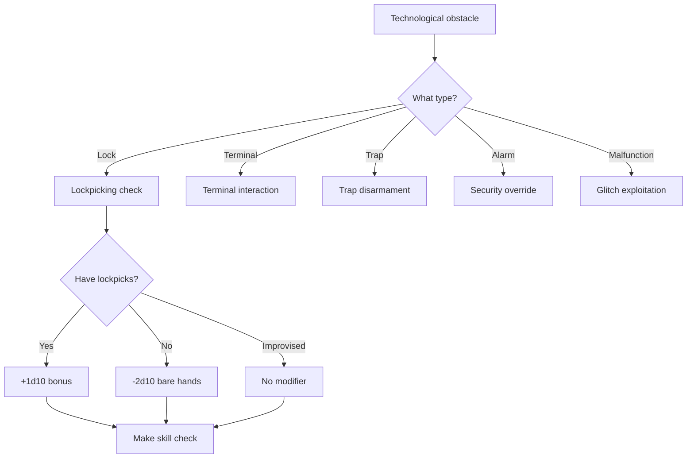
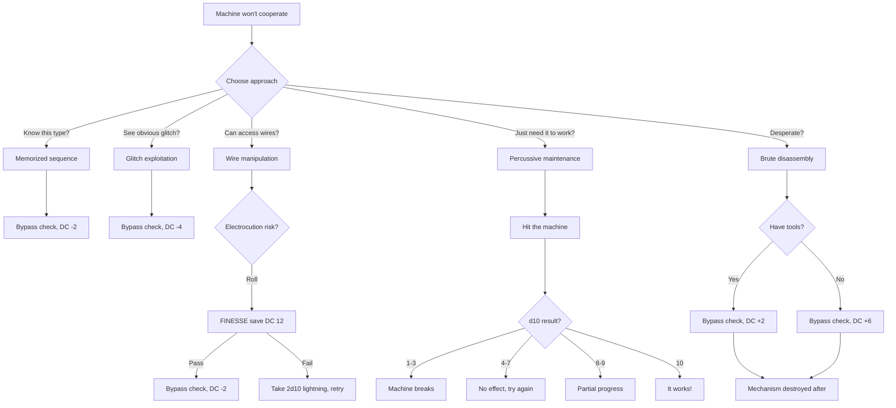
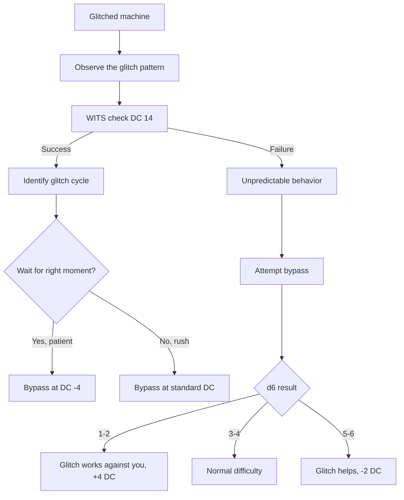
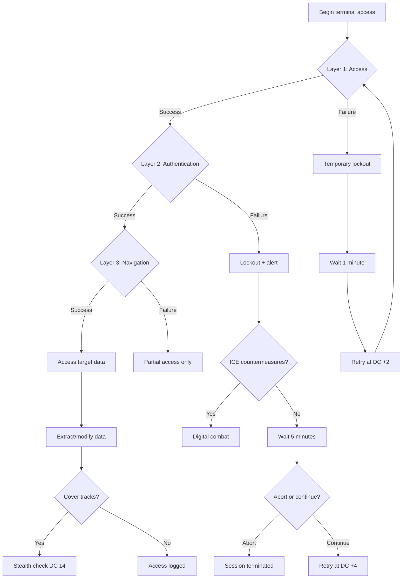
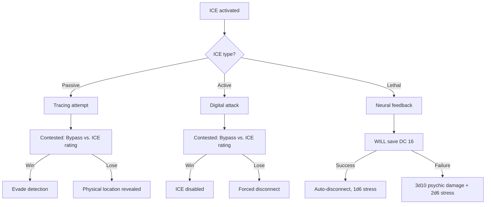
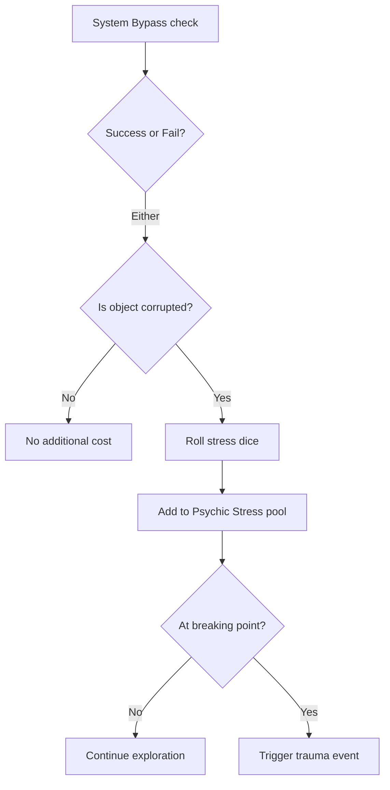
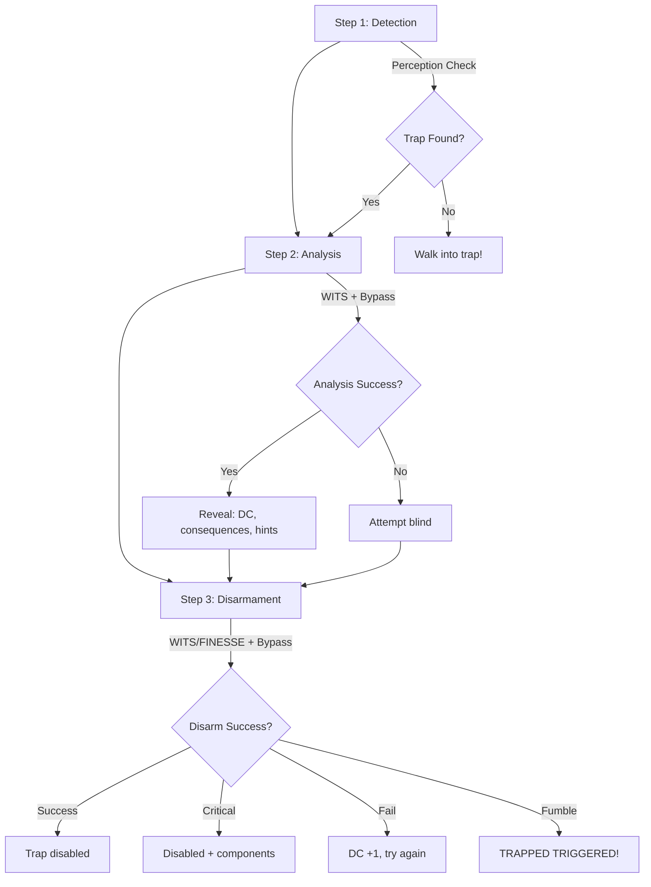

# System Bypass

**Governing Attribute:** WITS

---

## 1. Core Philosophy: The Art of the Debugger

> *"You don't understand it. You never will. But you've seen the blue wire touch the scratched node before, and the door opened. That's enough."*

System Bypass resolves: *Can this character manipulate, jury-rig, or exploit corrupted Old World technology?*

This is not elegant programming—it is the **desperate craft of the Cargo Cult**. The people of Aethelgard dwell in the vestiges of a ruined society whose technology no one knows how to replicate, reprogram, or truly understand. A character with System Bypass is a **debugger of dead systems**, a master of physical manipulation and pattern recognition who has learned, through trial-and-error and handed-down rituals, that certain actions produce certain results.

### 1.1 The Cargo Cult Principle

> [!IMPORTANT]
> **Nobody in Aethelgard understands technology.** Even Jötun-Readers work through intuition, pattern recognition, and learned sequences of physical actions—not comprehension.

**What System Bypass IS:**
- Hitting a terminal until it responds
- Recognizing that "blue wire to red node" made it work before
- Exploiting a glitch that makes the door open when you kick it
- Memorized sequences of lever-pulls passed down through generations
- Analyzing a lock's physical mechanism through touch and sound

**What System Bypass is NOT:**
- Programming or coding in any modern sense
- Understanding *why* the machine works
- Logical debugging of software
- Accessing system architecture meaningfully
- Creating new technology from first principles

### 1.2 Thematic Context

To the inhabitants of Aethelgard, Old World technology is **magic**. They know certain rituals produce effects—a specific sequence of button presses opens a door, a certain wire configuration disables a trap. But they have no conceptual framework for *why*. The Jötun-Reader who "hacks" a terminal is really performing a complex cargo cult ritual, hitting keys in patterns their master taught them, watching for the "ghost" in the machine to respond.

| Inhabitant Perception | Technical Reality |
|-----------------------|-------------------|
| "Waking the Machine-Spirit" | Booting up a dormant system |
| "Appeasing the Oracle-Box" | Resetting corrupted memory |
| "Reading the Ghost's Marks" | Interpreting error codes |
| "The Pattern of Opening" | Correct access sequence |
| "Angering the Warden" | Triggering ICE countermeasures |

**Primary Users:** Scrap-Tinkers, Gantry-Runners, Jötun-Readers, Ruin-Stalkers

---

## 2. Trigger Events

### 2.1 When to Use System Bypass

| Trigger | Description | Alternative |
|---------|-------------|-------------|
| **Lockpicking** | Opening mechanical/electronic locks | Force (combat, may damage) |
| **Terminal Interaction** | Coaxing Old World terminals | Find access codes |
| **Trap Disarmament** | Disabling physical/electronic traps | Trigger intentionally |
| **Security Override** | Bypassing alarms, gates, controls | Find another path |
| **Glitch Exploitation** | Exploiting system malfunctions | Wait for reset |

### 2.2 Trigger Decision Tree



---

## 3. DC Tables

### 3.1 Lockpicking

| Type | Base DC | Example |
|------|---------|---------|
| Improvised Latch | 6 | Scrap metal bar |
| Simple Lock | 10 | Residential door |
| Standard Lock | 14 | Security gate |
| Complex Lock | 18 | High-security bunker |
| Master Lock | 22 | Jötun-Forged vault |

**Corruption Modifiers:**
| Corruption | DC Modifier |
|------------|-------------|
| [Glitched] | +2 DC |
| [Blighted] | +4 DC |

### 3.2 Terminal Interaction

| Type | DC | Example |
|------|-----|---------|
| Unprotected | 8 | Emergency panel |
| Basic | 12 | Storage manifest |
| Secured | 16 | Research lab |
| Encrypted | 20 | Military console |
| Jötun-Archive | 24 | Ancient data core |

### 3.3 Trap Disarmament

| Trap Type | DC | Failure Consequence |
|-----------|-----|---------------------|
| Tripwire | 8 | Triggers alarm |
| Pressure Plate | 12 | 2d10 damage |
| Electrified | 16 | 3d10 lightning damage |
| Laser Grid | 20 | Alarm + lockdown |
| Jötun Defense | 24 | Catastrophic (5d10 + alert) |

---

## 4. Jury-Rigging Procedure

Nobody in Aethelgard truly *understands* Old World technology. Even Jötun-Readers work through intuition, pattern recognition, and learned sequences of physical actions—not comprehension. System Bypass is fundamentally **physical manipulation** of incomprehensible machines.

### 4.1 Core Principles

> **What This Is:**
> - Hitting a terminal until it responds
> - Recognizing that "blue wire to red node" made it work before
> - Exploiting a glitch that makes the door open when you kick it
> - Memorized sequences of lever-pulls passed down through generations
>
> **What This Is NOT:**
> - Programming or coding
> - Understanding how the machine works
> - Logical debugging
> - Accessing system architecture

### 4.2 Physical Bypass Methods

| Method | Description | DC Modifier | Risk |
|--------|-------------|-------------|------|
| **Percussive Maintenance** | Hit it until it works | +0 (standard) | May break permanently |
| **Wire Manipulation** | Reroute physical connections | -2 DC | Electrocution (2d10) |
| **Glitch Exploitation** | Trigger known malfunction | -4 DC | Unpredictable side effects |
| **Memorized Sequence** | Repeat learned pattern | -2 DC | Only works on familiar types |
| **Brute Disassembly** | Take it apart to bypass | +2 DC | Destroys mechanism |
| **Power Cycling** | Force restart via power | +0 | Resets all progress |

### 4.3 Jury-Rigging Workflow



### 4.4 Trial-and-Error Procedure

When encountering unfamiliar technology:

| Step | Action | Check | Outcome |
|------|--------|-------|---------|
| 1. Observe | Study the machine visually | WITS DC 10 | Identify obvious inputs |
| 2. Probe | Try obvious buttons/levers | Auto | Machine reacts or doesn't |
| 3. Pattern | Look for familiar elements | WITS DC 12 | Recognize type (+2d10) |
| 4. Experiment | Try different combinations | Bypass DC | Success or complication |
| 5. Iterate | Learn from failure | Auto | DC -1 on next attempt |

**Complication Table (on failure):**
| d10 | What Happens |
|-----|--------------|
| 1 | Machine locks permanently |
| 2-3 | Alarm triggers |
| 4-5 | Sparks fly (1d6 damage) |
| 6-7 | Nothing, try again |
| 8-9 | Partial success (one function works) |
| 10 | Machine glitches in your favor |

### 4.5 Scrap-Tinkering

Creating bypass tools from salvaged parts:

**Improvised Tool Crafting:**
| Tool | Components Needed | Craft DC | Bonus When Used |
|------|-------------------|----------|-----------------|
| Shim picks | Scrap metal × 3 | 10 | +1d10 to locks |
| Wire probe | Copper wire × 2, handle | 12 | +1d10 to terminals |
| Glitch trigger | Capacitor × 1, wire × 4 | 14 | Force glitch state |
| Bypass clamps | Metal clips × 4 | 12 | Skip one layer |

### 4.6 Glitch Exploitation

When a machine is [Glitched], it behaves unpredictably—but predictably unpredictable:



### 4.7 Jury-Rigging Example

> **Scenario:** Bjorn needs to open a [Glitched] security door that nobody in his crew has seen before.
>
> **Setup:**
> - WITS: 5, Rank 2 (Apprentice)
> - Pool: 7d10
> - Unfamiliar mechanism, visibly sparking
>
> ---
>
> **Step 1 - Observe:**
> - Check: WITS DC 10
> - Roll: 7d10 → 3 successes ✓
> - Result: Sees control panel, keypad, and exposed wires
>
> ---
>
> **Step 2 - Probe:**
> - Action: Press random buttons
> - Result: Panel flickers, displays symbols he doesn't recognize
>
> ---
>
> **Step 3 - Pattern Recognition:**
> - Check: WITS DC 12
> - Roll: 7d10 → 2 successes ✗
> - Result: Can't identify the type, no bonus
>
> ---
>
> **Step 4 - Wire Manipulation Attempt:**
> - Approach: Access exposed wires
> - Electrocution Risk: FINESSE DC 12
> - Roll: 6d10 → 4 successes ✓ (avoided shock)
>
> ---
>
> **Step 5 - Glitch Observation:**
> - Check: WITS DC 14 (identify glitch cycle)
> - Roll: 7d10 → 2 successes ✗
> - Result: Can't predict the glitch
>
> ---
>
> **Step 6 - Bypass Attempt (random glitch state):**
> - Chaos roll: d6 → 5 (glitch helps!)
> - DC: 14 (Standard) + 2 ([Glitched]) - 2 (glitch helps) - 2 (wires) = 12
> - Roll: 7d10 → 3 successes ✓
>
> **Result:** The door sparks, groans, and slides open.
>
> **What Bjorn Understands:** Nothing. The blue wire touching the scratched node made it work. He'll remember that for next time.

## 5. Complex Terminal Infiltration

High-security terminals require **multi-stage infiltration** rather than single checks. This procedure applies to DC 16+ terminals.

### 4.1 Infiltration Phases



### 4.2 Layer Breakdown

#### Layer 1: Initial Access
**Purpose:** Establish connection and bypass initial security

| Terminal Type | Layer 1 DC | Time Required |
|---------------|------------|---------------|
| Basic | 12 | 1 round |
| Secured | 14 | 2 rounds |
| Encrypted | 16 | 3 rounds |
| Jötun-Archive | 18 | 5 rounds |

**On Failure:**
- Terminal locks for 1 minute
- Second attempt at DC +2
- Third failure triggers permanent lockout (need alternate access method)

#### Layer 2: Authentication Bypass
**Purpose:** Circumvent identity verification

| Security Level | Layer 2 DC | Method |
|----------------|------------|--------|
| Password only | +0 | Brute force / pattern recognition |
| Biometric | +2 | Spoof or bypass hardware |
| Multi-factor | +4 | Multiple simultaneous bypasses |
| Jötun-Locked | +6 | Requires Jötun-Reader knowledge |

**On Failure:**
- Triggers security alert
- May activate ICE countermeasures (50% chance on high-security)
- All future checks at DC +4

#### Layer 3: Data Navigation
**Purpose:** Locate and access target information

| Data Type | Layer 3 DC | Access Gained |
|-----------|------------|---------------|
| Public records | 10 | Manifest, schedules |
| Internal docs | 14 | Research, personnel |
| Classified | 18 | Military, faction secrets |
| Archived/Hidden | 22 | Pre-Glitch data, hidden logs |

**Partial Success (within 2 of DC):**
- Access some but not all data
- May miss critical information
- Cannot modify, only read

### 4.3 ICE Countermeasures

When ICE (Intrusion Countermeasure Electronics) activates:



**ICE Ratings:**
| Terminal Security | ICE Rating | ICE Type |
|-------------------|------------|----------|
| Basic | — | No ICE |
| Secured | 12 | Passive (Trace) |
| Encrypted | 16 | Active (Attack) |
| Military | 20 | Active + Lethal |
| Jötun-Archive | 24 | Lethal (Neural) |

### 4.4 Extended Hacking Example

> **Scenario:** Kira infiltrates a Secured research terminal to find evacuation records.
>
> **Setup:**
> - WITS: 6, Rank 3 (Journeyman)
> - Pool: 9d10
> - Terminal: Secured (DC 16, 3 layers)
> - ICE: Passive (Rating 12)
>
> ---
>
> **Layer 1 - Initial Access:**
> - DC: 14
> - Time: 2 rounds
> - Roll: 9d10 → 4 successes ✓
> - Result: Connection established
>
> ---
>
> **Layer 2 - Authentication (Password + Biometric):**
> - DC: 14 + 2 (biometric) = 16
> - Roll: 9d10 → 3 successes ✗ (needed 3 for DC 16)
> - Result: AUTHENTICATION FAILED
>
> **Consequence:** Alert triggered, ICE activating
>
> ---
>
> **ICE Encounter (Passive Trace):**
> - Contested check: 9d10 vs. ICE 12
> - Kira roll: 4 successes
> - ICE roll: 2 successes
> - Result: Kira evades trace, continues at DC +4
>
> ---
>
> **Layer 2 - Retry:**
> - DC: 16 + 4 = 20
> - Roll: 9d10 → 5 successes ✓
> - Result: Authentication bypassed
>
> ---
>
> **Layer 3 - Data Navigation (Internal docs):**
> - DC: 14
> - Roll: 9d10 → 6 successes ✓
> - Result: Evacuation records located
>
> ---
>
> **Cover Tracks:**
> - DC: 14
> - Roll: 9d10 → 3 successes ✓
> - Result: Access logs wiped
>
> **Total Time:** 8 rounds (~1 minute)
> **Checks Made:** 6 (4 infiltration + 1 ICE + 1 stealth)
> **Information Gained:** Evacuation route to hidden bunker

### 4.5 Quick Reference: Hacking Procedure

| Step | Action | Default DC | Failure |
|------|--------|------------|---------|
| 1. Connect | Layer 1 access | By terminal type | 1 min lockout |
| 2. Authenticate | Layer 2 bypass | +0 to +6 | Alert + ICE |
| 3. Navigate | Layer 3 search | By data type | Partial access |
| 4. Extract | Copy/modify | Automatic | — |
| 5. Cover tracks | Optional stealth | 14 | Access logged |

---

## 6. Dice Pool Calculation

```
Pool = WITS + Rank + Tool Modifier + Situational
```

### 4.1 Tool Modifiers

| Equipment | Modifier |
|-----------|----------|
| Proper Lockpicks | +1d10 |
| Improvised Tools | +0 |
| Bare Hands | -2d10 |
| Masterwork Tools | +2d10 |

### 4.2 Situational Modifiers

| Situation | Modifier |
|-----------|----------|
| Adequate lighting | +0 |
| Dim lighting | -1d10 |
| Complete darkness | -3d10 |
| Under time pressure | -1d10 |
| Previously studied lock type | +1d10 |

---

## 7. Trauma Economy Costs

| Object Corruption | Stress | Example |
|-------------------|--------|---------|
| [Normal] | 0 | Standard lock |
| [Glitched] | 3-8 | Malfunctioning terminal |
| [Blighted] | 5-10 | Corrupted door mechanism |
| [Psychic Resonance] | 8-15 | Echo-touched console |

### Stress Workflow



---

## 8. Master Rank Benefits (Rank 5)

| Ability | Effect |
|---------|--------|
| **Auto-Bypass** | Automatically succeed on DC ≤ 10 checks |
| **Salvage Expertise** | Always recover components from disabled traps |
| **Silent Bypass** | All successful checks produce no noise |
| **Glitch Reader** | Reduce [Glitched] DC penalty by 2 |

---

## 9. Example Scenarios

### Scenario A: Simple Lock Under Time Pressure

> **Situation:** Kira needs to pick a storage room lock (DC 14) while Rust-Horrors approach.
>
> **Character:**
> - WITS: 6
> - System Bypass: Rank 2 (Apprentice)
> - Equipment: Lockpicks (+1d10)
> - Situation: Under pressure (-1d10)
>
> **Pool Calculation:**
> ```
> 6 (WITS) + 2 (Rank) + 1 (Picks) - 1 (Pressure) = 8d10
> ```
>
> **Roll:** 8d10 → [7, 3, 8, 9, 2, 7, 4, 8] = 5 successes
>
> **Result:** 5 ≥ 3 (DC 14 threshold) → SUCCESS!
>
> **Outcome:** Lock opens. Kira slips inside before the horrors arrive.

### Scenario B: Encrypted Terminal (Glitched)

> **Situation:** Bjorn attempts to access a [Glitched] military console.
>
> **Character:**
> - WITS: 5
> - System Bypass: Rank 3 (Journeyman)
> - Equipment: Terminal interface (+0)
>
> **DC Calculation:**
> - Base: 20 (Encrypted)
> - [Glitched]: +2
> - **Final DC: 22**
>
> **Pool:** 5 + 3 = 8d10
>
> **Roll:** 8d10 → [9, 7, 3, 8, 2, 6, 10, 4] = 4 successes
>
> **Result:** 4 < 5 (DC 22 threshold) → FAILURE
>
> **Consequences:**
> - Terminal remains locked
> - [Glitched] stress: 1d6 → 4 Psychic Stress

### Scenario C: Jötun Vault (Master Rank)

> **Situation:** Sigrid (Master System Bypass) attempts a Jötun-Forged vault.
>
> **Character:**
> - WITS: 7
> - System Bypass: Rank 5 (Master)
> - Equipment: Masterwork tools (+2d10)
>
> **DC:** 22 (Master Lock)
>
> **Pool:** 7 + 5 + 2 = 14d10
>
> **Master Ability:** Can auto-succeed DC ≤ 10, so she still rolls.
>
> **Roll:** 14d10 → 8 successes
>
> **Result:** 8 ≥ 5 → SUCCESS!
>
> **Outcome:** The ancient vault hisses open, revealing pre-Glitch artifacts.

---

## 10. Technical Implementation

### 10.1 Data Model

```csharp
public enum DeviceType { Lock, Terminal, Trap, Security, Malfunction }
public enum BypassQuality { Improvised, Standard, Masterwork }

public class BypassContext
{
    public DeviceType Type { get; set; }
    public int Dc { get; set; }
    public bool IsGlitched { get; set; }
    public BypassQuality ToolsUsed { get; set; }
}
```

### 10.2 Service Interface

```csharp
public interface IBypassService
{
    SkillCheckResult AttemptBypass(Character character, BypassContext context);
    void TriggerTrap(Character character, TrapType trap);
    InfiltrationState ProcessTerminalLayer(TerminalContext context, int layer);
    void ApplyGlitchEffect(Character character, GlitchType glitch);
}
```

---

## 11. Phased Implementation Guide

### Phase 1: Core Logic
- [ ] **Data Model**: Enum definitions for DeviceType, TrapType.
- [ ] **Service**: Implement `AttemptBypass` wrapping internal `SkillService`.
- [ ] **Calculator**: Implement tool modifier logic.

### Phase 2: Terminal Hacking
- [ ] **Layers**: Implement "Layered Access" logic (Success advances layer).
- [ ] **Lockout**: Implement "Lockout" state on failure.
- [ ] **ICE**: Implement ICE resistance checks.

### Phase 3: Hardware Interaction
- [ ] **Traps**: Implement Trap Trigger logic (Damage/Alarm).
- [ ] **Glitches**: Implement random Glitch Table logic.
- [ ] **Craft**: Implement Improvised Tool crafting recipes.

### Phase 4: UI & Feedback
- [ ] **Minigame**: (Optional) Visual lockpicking/hacking minigame.
- [ ] **Feedback**: "ACCESS GRANTED" / "ACCESS DENIED" overlays.
- [ ] **Sparks**: Particle effects on failure.

---

## 12. Testing Requirements

### 12.1 Unit Tests
- [ ] **Tools**: No Tools -> -2d10 to pool.
- [ ] **Glitch**: Glitched Device -> +2 DC.
- [ ] **Terminal**: Layer 1 Success -> Unlock Layer 2.
- [ ] **Trap**: Disarm Fail -> Trigger Effect.

### 12.2 Integration Tests
- [ ] **Lock**: Use Picks -> Success -> Door Opens.
- [ ] **Hacking**: Fail Layer 2 -> Trigger Alert -> ICE Activates.
- [ ] **Crafting**: Combine Scrap -> Receive Shim Pick.

### 12.3 Manual QA
- [ ] **UI**: Verify DC display updates with modifiers.
- [ ] **Visual**: Fail check -> Verify spark particles.

---

## 13. Logging Requirements

**Reference:** [logging.md](../logging.md)

### 13.1 Log Events

| Event | Level | Message Template | Properties |
|-------|-------|------------------|------------|
| Bypass Check | Info | "{Character} attempted {Type} (DC {DC}): {Result}" | `Character`, `Type`, `DC`, `Result` |
| Trap Trigger | Warning | "{Character} TRIGGERED {Trap}! Effect: {Effect}" | `Character`, `Trap`, `Effect` |
| Terminal Access | Info | "{Character} accessed {Terminal} Layer {Layer}." | `Character`, `Terminal`, `Layer` |

---

## 14. Related Specifications

| Document | Purpose |
|----------|---------|
| [Skills Overview](overview.md) | Core skill mechanics |
| [Dice System](../dice-system.md) | d10 pool resolution |
| [Trauma Economy](../trauma-economy.md) | Psychic Stress costs |
| [Loot System](../../04-systems/loot.md) | Locked containers |
| [Skills UI](../../08-ui/skills-ui.md) | Interface specification |
| [Skill Outcomes](../../07-environment/descriptors/skill-outcomes.md) | Outcome descriptors |

---

## 15. Expanded Application: Lockpicking

### 15.1 The Art of the Debugger

A lock is a small, self-contained "program" designed to return a `FALSE` state ("Locked") to any unauthorized input. The lockpicker is the skilled operator who analyzes this program, finds its exploits—be they mechanical or digital—and injects the precise *physical input* needed to force a `TRUE` state ("Unlocked").

> [!NOTE]
> The lockpicker does not understand torque physics or pin-tumbler mechanics. They have learned through repetition that a certain pattern of pressure produces a click. That's enough.

### 15.2 Lock Type Classification

| Lock Type | Description | DC Range | Common On |
|-----------|-------------|----------|-----------|
| **Simple Mechanical** | Standard, rusted pin-tumbler lock | DC 2-3 | Scavenger footlockers |
| **Complex Mechanical** | Well-made pre-crash lock | DC 4-5 | Clan strongboxes, armories |
| **Standard Electronic** | Old World mag-lock | DC 5-6 | Laboratories, secure doors |
| **Hardened Electronic** | Military-grade encryption | DC 7-8 | Jötun-Reader archives |
| **[Glitched] Lock** | Blight-infected logic | DC 9+ | Artifact vaults |

### 15.3 Degrees of Success

| Degree | Condition | Effect |
|--------|-----------|--------|
| **Failure** | Successes < DC | Lock remains locked. May retry. |
| **Success** | Successes ≥ DC | Lock opens. Door/container now [Unlocked]. |
| **Critical Success** | Successes ≥ DC + 2 | Lock opens + salvage component (Mechanical Part or Electronic Component). |
| **Fumble** | 0 successes | **[Mechanism Jammed]** — DC +2 permanently, key no longer works. |

### 15.4 Fumble Consequence: [Mechanism Jammed]

When a lockpicker fumbles, the lock is permanently damaged:

- **DC Increase:** All future pick attempts at +2 DC
- **Key Useless:** The lock's original key no longer functions
- **Options Remaining:**
  1. Brute force (MIGHT check, may damage contents)
  2. Metaphysical bypass (Rúnasmiðr `unmake` rune)
  3. Alternate route (find another path)

### 15.5 Required Tools

| Tool | Modifier | Notes |
|------|----------|-------|
| [Tinker's Toolkit] | Required | Cannot attempt DC 4+ without |
| Proper Lockpicks | +1d10 | Crafted or found |
| Improvised Tools | +0 | Bent wire, scrap |
| Bare Hands | -2d10 | Desperate only |
| Masterwork Tools | +2d10 | Jötun-quality, rare |

---

## 16. Expanded Application: Terminal Hacking

### 16.1 The Ghost in the Machine

The hacker is a **digital ghost**, a scavenger of data who risks their own sanity to dive into the static-filled, paradoxical code of a dead civilization. They do not understand the systems they manipulate—they have learned ritual sequences that sometimes work, passed down from masters who also didn't understand.

> *"The Machine-Spirit responded to the Pattern of Opening. It showed me the Ghost's Marks—red symbols that mean danger, green symbols that mean safety. I pressed green. The door opened. I do not know why green means safety. It simply does."*

### 16.2 Terminal Types

| Terminal Type | Description | Security DC | Common Functions |
|---------------|-------------|-------------|------------------|
| **Civilian Data-Port** | Simple public/residential | DC 2-3 | Lore logs, local doors |
| **Corporate Mainframe** | Industrial control | DC 4-5 | Schematics, elevators |
| **Security Hub** | Automated defense control | DC 5-6 | Deactivate traps/turrets |
| **Military-Grade Server** | Hardened encryption | DC 7-8 | Artifact data, weapons |
| **[Glitched] Manifold** | Paradoxical OS | DC 9+ | Unpredictable effects |

### 16.3 Access Levels

| Result | Access Level | Capabilities |
|--------|--------------|--------------|
| Failure | None | Access denied |
| Success | [User-Level] | Basic functions, intended use |
| Critical Success | [Admin-Level] | All functions, hidden files, connected systems |
| Fumble | [Lockout] | Terminal disabled, alert triggered |

### 16.4 Fumble Consequence: [System Lockout & Alert]

On a critical failure:
- Terminal locks down completely (unusable)
- Security alert broadcast
- **50% chance:** Security automaton spawns in adjacent room
- **[Glitched] terminals:** Also inflict 1d6 Psychic Stress

### 16.5 Trauma Cost: Reading the Ghosts

Interfacing with terminal data carries mental cost:

| Data Type | Stress Cost | Description |
|-----------|-------------|-------------|
| Standard Logs | 0-2 | Mundane records |
| Personal Records | 3-5 | Private journals, last messages |
| [Echo-Stained] Logs | 8-12 | Final moments of dead authors |
| [Glitched] Data | 5-10 | Corrupted, paradoxical information |

> [!CAUTION]
> **[Echo-Stained]** logs contain the psychic imprint of their creators' final moments. Reading them grants valuable information but inflicts significant Psychic Stress as the reader experiences fragments of the author's death.

### 16.6 Terminal Payoffs

| Success Type | Possible Rewards |
|--------------|------------------|
| Data Retrieval | [Corrupted Data-Logs], lore, quest clues |
| Schematic Access | Crafting blueprints for Scrap-Tinker |
| Security Override | Disable local traps, turrets, alarms |
| Door Control | Unlock secured doors remotely |
| Hidden Cache | Reveal secret container locations |

---

## 17. Expanded Application: Trap Disarming

### 17.1 The Art of the Bomb Squad

A trap is a simple, brutal "program" designed to execute a single, destructive command based on a specific input. The disarmer is the calm, precise operator who must analyze this lethal code, understand its trigger through observation, and carefully "comment out" its execution path without causing a fatal system error.

> *"The wire is taught. Touch it wrong and it completes the circuit. I don't know what electricity is. I know that the blue metal hums, and if the hum stops before I'm ready, I die."*

### 17.2 Disarming Process

Disarming is a multi-step procedure:



### 17.3 Step 1: Detection (Required)

A trap **must be detected** before any disarm attempt. This is handled by the Perception system:

- **Passive Perception:** High-WITS characters may receive subtle hints
- **Active `investigate`:** Formally identifies trap type and location
- **Trap Detection DC:** Varies by trap sophistication

### 17.4 Step 2: Analysis (Recommended)

Before attempting to disarm, a character can analyze the trap:

| Information Revealed | Analysis DC |
|---------------------|-------------|
| Disarm DC | Base DC - 2 |
| Failure Consequences | Base DC |
| Disarm Hints | Base DC + 2 |

### 17.5 Step 3: Disarmament

**Attribute:** Higher of WITS or FINESSE (analysis vs. delicate work)

| Degree | Condition | Effect |
|--------|-----------|--------|
| **Failure** | Successes < DC | Disarm fails, trap stable. **DC +1 for next attempt.** |
| **Success** | Successes ≥ DC | Trap disabled. Now [Disabled] state. |
| **Critical** | Successes ≥ DC + 2 | Disabled + salvage components. |
| **Fumble** | 0 successes | **[Forced Execution]** — Trap triggers immediately, you are target. |

### 17.6 Salvageable Components

On critical success, the disarmer may recover:

| Trap Type | Salvageable Components |
|-----------|------------------------|
| Pressure Plate | [High-Tension Spring], [Pressure Sensor] |
| Tripwire | [Trigger Mechanism], [Wire Bundle] |
| Electrified | [Capacitor], [Blighted Power Cell] |
| Explosive | [Explosive Casing], [Detonator Cap] |
| Laser Grid | [Sensor Module], [Focusing Crystal] |

### 17.7 Required Tools

Disarming traps of DC 4+ requires a **[Tinker's Toolkit]**. Without one:
- DC 1-3 traps: Can attempt bare-handed at -2d10
- DC 4+ traps: **Impossible** without proper tools

---

## 18. Alternative Bypass Methods

### 18.1 The "No Lockpicker" Problem

System Bypass rewards specialists, but critical paths should not hard-gate parties without the skill. Alternative solutions:

| Obstacle | Alternative Methods |
|----------|---------------------|
| Locked Door | Find physical key elsewhere |
| | Brute force (MIGHT check, loud, may damage) |
| | Runic bypass ([Rúnasmiðr] corrode/unmake) |
| | Alternate route (monster-filled, longer) |
| Secured Terminal | Find access codes/password notes |
| | Hotwire power to different terminal |
| | Accept partial information |
| Active Trap | Trigger intentionally from safe distance |
| | Destroy mechanism with ranged attack |
| | Sacrifice ally/minion (ethically dubious) |

### 18.2 Brute Force Option

When lockpicking fails or is unavailable:

| Target | MIGHT DC | Consequences |
|--------|----------|--------------|
| Simple Door | 12 | Loud (alerts nearby enemies) |
| Reinforced Door | 16 | Very loud, may damage contents |
| Vault | 22 | Requires multiple attempts, exhausting |
| Container | 10-16 | Contents may be damaged on failure |

---

## 19. Specialization Integration

### 19.1 The Adept's Domain

System Bypass is the soul of the **Adept** archetype:

| Specialization | Primary Focus | Unique Abilities |
|----------------|---------------|------------------|
| **Scrap-Tinker** | Tool crafting, lock mastery | Craft [Masterwork Tools], relock opened locks |
| **Ruin-Stalker** | Trap mastery | Re-arm traps against enemies, trap immunity |
| **Jötun-Reader** | Terminal mastery | Hidden commands, reduced [Glitched] penalties |
| **Gantry-Runner** | Speed bypass | Fast-pick (reduced time), bypass under fire |

### 19.2 Unique Specialization Abilities

**Scrap-Tinker:**
- `[Master Craftsman]` — Craft [Masterwork Tools] from rare components
- `[Relock]` — Can re-lock a bypassed lock to slow pursuit

**Ruin-Stalker:**
- `[Trap Artist]` — May re-arm disabled traps as party defenses
- `[Sixth Sense]` — Auto-detect traps within 10 feet

**Jötun-Reader:**
- `[Deep Access]` — Automatically gain [Admin-Level] on terminal success
- `[Pattern Recognition]` — Reduce [Glitched] DC penalty by 2

---

## 20. Voice Guidance

### 20.1 Tone Profile

| Property | Value |
|----------|-------|
| **Theme** | Cargo cult ritual, pattern recognition over understanding |
| **Tone** | Precise, tense, respectful of incomprehensible technology |
| **Key Words** | Pattern, mechanism, circuit, trigger, ghost, machine-spirit |

### 20.2 Narrative Examples

| Result | Example Text |
|--------|--------------|
| **Success (Lock)** | "The Pattern of Opening works. With a satisfying CLICK, the final tumbler falls into place. You don't know why—but the door is open." |
| **Success (Terminal)** | "The Machine-Spirit responds to your ritual. Green symbols bloom across the glass. The Ghost's Marks show you what you seek." |
| **Success (Trap)** | "With steady hands, you sever the connection to the trigger. The hum dies. You don't understand why it worked. It simply did." |
| **Critical Success** | "Your technique is flawless—some echo of Old World knowledge lives in your hands. Not only does it work, but you glimpse something more..." |
| **Fumble (Lock)** | "A sickening CRUNCH echoes from the mechanism. Something breaks that shouldn't. You've angered the Machine-Spirit, and now it refuses all inputs." |
| **Fumble (Terminal)** | "The Oracle-Box screams—static and red symbols flooding the glass. A distant clanking begins. You've awakened the Warden." |
| **Fumble (Trap)** | "Your tool slips, completing the circuit. The world becomes noise and pain. The trap executes its purpose, and you are its target." |

---

## 21. Changelog

| Version | Date | Changes |
|---------|------|---------|
| 1.0 | 2025-12-07 | Initial specification |
| 1.1 | 2025-12-14 | Added cargo cult philosophy, expanded lockpicking/hacking/trap sections, integrated voice guidance |

