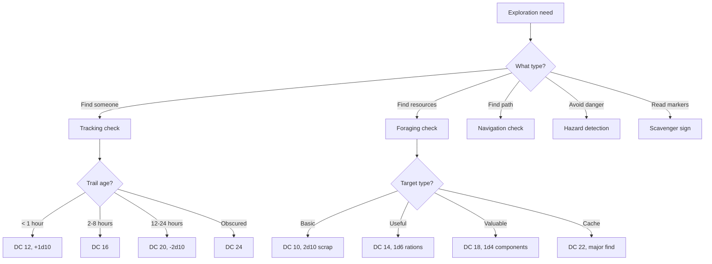
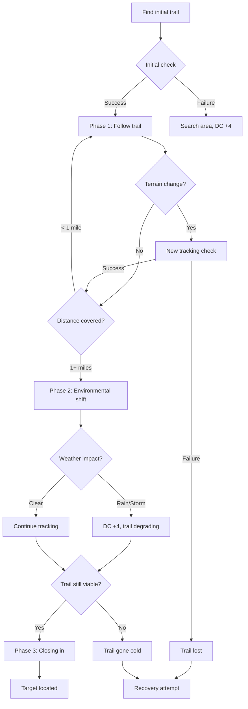
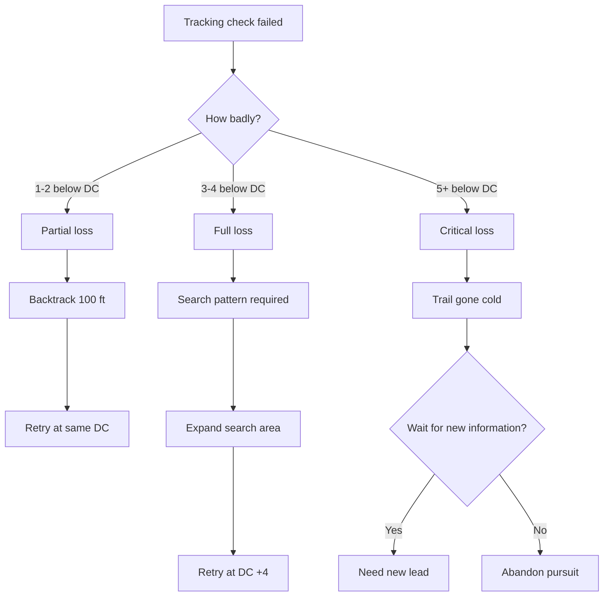
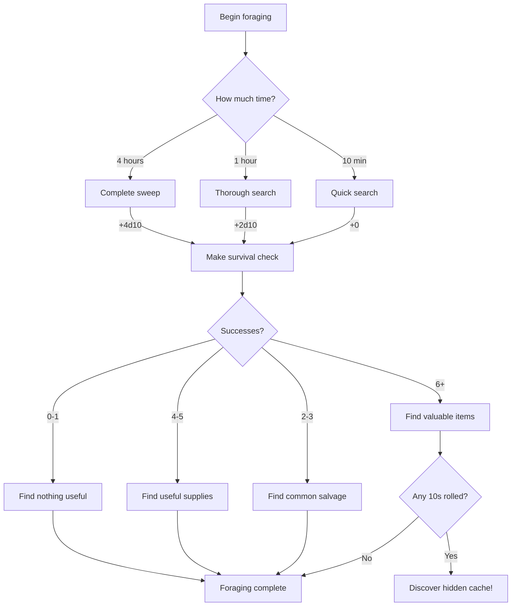

# Wasteland Survival

**Governing Attribute:** WITS

---

## 1. Core Philosophy

Wasteland Survival resolves: *Can this character navigate, track, and scavenge in the broken technological ruins of Aethelgard?*

This is reading metal debris fields, following boot-prints through glitched terrain, and recognizing which salvage is safe to touch.

**Primary Users:** Veiðimaðr, Myr-Stalkers, Adept archetypes

---

## 2. Trigger Events

### 2.1 When to Use Wasteland Survival

| Trigger | Description | Alternative |
|---------|-------------|-------------|
| **Tracking** | Following tracks through ruins | Ask NPCs for directions |
| **Foraging** | Searching for salvageable resources | Trade with merchants |
| **Navigation** | Finding paths through unfamiliar terrain | Hire a guide |
| **Hazard Detection** | Identifying environmental dangers | Trigger and survive |
| **Scavenger Sign Reading** | Interpreting territorial markers | Ignore at your peril |

### 2.2 Exploration Decision Tree



---

## 3. DC Tables

### 3.1 Tracking

| Difficulty | DC | Example |
|------------|-----|---------|
| Obvious Trail | 8 | Caravan through ash |
| Fresh Trail (< 1 hour) | 12 | Recent boot prints |
| Standard Trail (2-8 hours) | 16 | Normal tracking |
| Old Trail (12-24 hours) | 20 | Fading signs |
| Obscured Trail | 24 | Deliberately hidden |

**Modifiers:**
| Condition | Modifier |
|-----------|----------|
| Blood trail | -4 DC |
| Rain (recent) | +4 DC |
| Multiple targets | -2 DC |
| Single careful target | +2 DC |

### 3.2 Foraging

| Target | DC | Yield |
|--------|-----|-------|
| Common Salvage | 10 | 2d10 scrap units |
| Useful Supplies | 14 | 1d6 rations OR 1d4 water |
| Valuable Components | 18 | 1d4 rare components |
| Hidden Cache | 22 | 1d100 Marks + items |

**Time Requirements:**
| Search Type | Duration |
|-------------|----------|
| Quick search | 10 minutes |
| Thorough search | 1 hour |
| Complete sweep | 4 hours |

### 3.3 Navigation

| Terrain | DC | Example |
|---------|-----|---------|
| Open Wasteland | 8 | Flat ash plains |
| Moderate Ruins | 12 | Partially collapsed |
| Dense Ruins | 16 | Heavy rubble, blocked |
| Labyrinthine | 20 | Multi-level ruins |
| [Glitched] Labyrinth | 24 | Non-Euclidean geometry |

### 3.4 Hazard Detection

| Hazard Type | DC | Consequence if Missed |
|-------------|-----|----------------------|
| Obvious danger | 8 | Minor damage |
| Hidden pit | 12 | 2d10 fall damage |
| Toxic zone | 16 | Poison (3 rounds) |
| Glitch pocket | 20 | Random effect |
| Ambush site | 16 | Surprise attack |

---

## 4. Extended Tracking Procedure

Tracking over distance requires **multiple checks** as conditions change. This section details the full pursuit sequence.

### 4.1 Tracking Phases



### 4.2 Phase Breakdown

#### Phase 1: Initial Acquisition (First Check)
**Purpose:** Locate and identify the trail

| Step | Action | DC |
|------|--------|-----|
| 1 | Search area for signs | Base DC by age |
| 2 | Identify trail type | Automatic if step 1 succeeds |
| 3 | Determine direction | Automatic |
| 4 | Estimate target count | DC 10 (contested) |
| 5 | Estimate trail age | DC 12 |

**On Failure:** 
- Cannot find trail initially
- May attempt again after 10 minutes at DC +2
- After 3 failures, trail is considered unfindable

#### Phase 2: Pursuit (Subsequent Checks)
**Purpose:** Maintain the trail over distance

**Check Frequency:**
| Terrain | Check Every |
|---------|-------------|
| Open wasteland | 2 miles |
| Moderate ruins | 1 mile |
| Dense ruins | 0.5 miles |
| Labyrinthine | Every room/intersection |

**Cumulative Modifiers:**
| Factor | Modifier per Check |
|--------|-------------------|
| Each hour passed | +1 DC |
| Rain during pursuit | +2 DC per hour |
| Target deliberately hiding | +2 DC |
| Fresh blood/injury | -2 DC per check |

#### Phase 3: Closing In (Final Check)
**Purpose:** Pinpoint target location

| Distance to Target | DC Modifier | Stealth Option |
|-------------------|-------------|----------------|
| Within 500 ft | -4 DC | Target may detect pursuit |
| Within 100 ft | -6 DC | Contested vs. target's Perception |
| Within 50 ft | Auto-success | Immediate encounter |

### 4.3 Losing the Trail

When a tracking check fails:



#### Recovery Procedures

| Loss Type | Recovery Action | Time Cost | New DC |
|-----------|-----------------|-----------|--------|
| Partial | Backtrack, careful search | 10 min | Same |
| Full | Spiral search pattern | 30 min | +4 |
| Critical | Return to last known point | 1 hour | +8 or new lead |

### 4.4 Counter-Tracking (Hiding Your Trail)

When a character wants to avoid being tracked:

**Concealment Check:** Wasteland Survival (contested)
- Tracker rolls vs. Concealer's result
- Concealer sets "DC" that tracker must beat

**Concealment Techniques:**

| Technique | Bonus | Time Cost |
|-----------|-------|-----------|
| Walk on hard surfaces | +2 to conceal | None |
| Brush away tracks | +4 to conceal | +50% travel time |
| False trail | +6 to conceal | +100% travel time |
| Water crossing | +8 to conceal | Requires water source |
| Backtracking | +4 to conceal | +25% travel time |

### 4.5 Extended Pursuit Example

> **Scenario:** Kira pursues a fleeing Iron-Bane raider through dense ruins.
>
> **Setup:**
> - WITS: 6, Rank 3 (Journeyman)
> - Pool: 9d10
> - Trail: Fresh (< 1 hour), single target
> - Terrain: Dense ruins
>
> ---
>
> **Phase 1 - Initial Acquisition:**
> - DC: 12 (Fresh) + 2 (single careful) = 14
> - Roll: 9d10 → 5 successes ✓
> - Result: Trail found, heading northwest
>
> ---
>
> **Phase 2 - First Pursuit Check (0.5 miles):**
> - DC: 14 + 1 (1 hour passed) = 15
> - Roll: 9d10 → 4 successes ✓
> - Result: Trail continues through collapsed warehouse
>
> ---
>
> **Phase 2 - Second Pursuit Check (1 mile):**
> - DC: 15 + 1 (another hour) = 16
> - Roll: 9d10 → 3 successes ✗ (needed 3 for DC 16)
> - Result: PARTIAL LOSS - trail obscured by rubble
>
> ---
>
> **Recovery Attempt:**
> - Action: Backtrack 100 ft, careful search
> - Time: +10 minutes
> - Roll: 9d10 → 5 successes ✓
> - Result: Trail recovered, raider doubled back
>
> ---
>
> **Phase 3 - Closing In:**
> - Distance: Within 200 ft
> - DC: 16 - 4 = 12
> - Roll: 9d10 → 6 successes ✓
> - Result: Raider located in abandoned bunker
>
> **Total Time:** 2 hours 10 minutes
> **Checks Made:** 5 (4 tracking + 1 recovery)

---

## 4. Dice Pool Calculation

```
Pool = WITS + Rank + Equipment Mod + Environmental
```

### 4.1 Equipment Modifiers

| Equipment | Modifier |
|-----------|----------|
| Survival kit | +1d10 |
| Binoculars/scope | +1d10 to tracking at range |
| Compass (working) | +1d10 to navigation |
| No equipment | +0 |

### 4.2 Environmental Modifiers

| Condition | Modifier |
|-----------|----------|
| Good visibility | +1d10 |
| Fresh trail | +1d10 |
| Old trail (12+ hours) | -2d10 |
| Static Storm | -4d10 |
| Night (no light) | -2d10 |
| Familiar territory | +2d10 |

---

## 5. Foraging Workflow

### 5.1 Foraging Decision Tree



### 5.2 Foraging Yield Table

| Successes | Common Salvage | Useful Supplies | Rare Components |
|-----------|----------------|-----------------|-----------------|
| 2-3 | 2d10 scrap | — | — |
| 4-5 | 3d10 scrap | 1d6 rations | — |
| 6-7 | 4d10 scrap | 1d6 rations | 1 component |
| 8+ | 5d10 scrap | 2d6 rations | 1d4 components |

---

## 6. Master Rank Benefits (Rank 5)

| Ability | Effect |
|---------|--------|
| **Wasteland Cartographer** | Auto-succeed navigation DC ≤ 10 |
| **Apex Scavenger** | Never come up empty, +50% all yields |
| **Master Tracker** | Follow trails up to 48 hours old |
| **Hazard Sense** | Auto-detect DC ≤ 16 hazards |

---

## 7. Example Scenarios

### Scenario A: Tracking a Wounded Beast

> **Situation:** Bjorn tracks a fleeing Skar-beast through [Blighted] terrain.
>
> **Character:**
> - WITS: 5
> - Wasteland Survival: Rank 2 (Apprentice)
> - Blood trail: -4 DC
>
> **DC:** 16 (Standard) - 4 (blood) = 12
>
> **Pool:** 5 + 2 = 7d10
>
> **Roll:** 7d10 → [7, 8, 3, 9, 1, 7, 4] = 4 successes
>
> **Result:** 4 ≥ 2 (DC 12 threshold) → SUCCESS!
>
> **Outcome:** Bjorn follows the blood trail to the beast's lair.

### Scenario B: Foraging in Ruins

> **Situation:** Kira spends 1 hour searching an abandoned warehouse.
>
> **Character:**
> - WITS: 6
> - Wasteland Survival: Rank 3 (Journeyman)
> - Survival kit: +1d10
> - Thorough search: +2d10
>
> **Pool:** 6 + 3 + 1 + 2 = 12d10
>
> **DC:** 14 (Useful Supplies)
>
> **Roll:** 12d10 → 6 successes + one 10
>
> **Result:** 6 successes → Valuable components!
> **Bonus:** Rolled a 10 → Discovers hidden cache!
>
> **Yield:** 1d4 components + 1d100 Marks + random item

### Scenario C: Navigation Through Glitched Zone

> **Situation:** Sigrid must navigate a [Glitched] labyrinth to reach the boss arena.
>
> **Character:**
> - WITS: 7
> - Wasteland Survival: Rank 4 (Expert)
> - Compass: +1d10
>
> **DC:** 24 (Glitched Labyrinth)
>
> **Pool:** 7 + 4 + 1 = 12d10
>
> **Roll:** 12d10 → 5 successes
>
> **Result:** 5 ≥ 5 (DC 24 threshold) → SUCCESS!
>
> **Outcome:** Sigrid navigates the impossible geometry, arriving at the arena.

---

## 8. Exploration Synergies

### 8.1 Combined Skill Checks

| Situation | Primary | Secondary |
|-----------|---------|-----------|
| Find hidden path | Navigation | Acrobatics (to traverse) |
| Track to lair | Tracking | System Bypass (to enter) |
| Avoid patrol | Hazard Detection | Acrobatics (Stealth) |
| Find and loot | Foraging | System Bypass (locked containers) |

### 8.2 Specialization Synergies

| Specialization | Synergy |
|----------------|---------|
| **Veiðimaðr** | +2d10 to tracking living creatures |
| **Myr-Stalker** | +1d10 in swamp/marsh terrain |
| **Gantry-Runner** | +1d10 in industrial ruins |

---

---

## 11. Balance Data

### 11.1 Scavenging Economy

| Search Type | Avg Yield (Value) | Time Cost | Value/Hour |
|-------------|-------------------|-----------|------------|
| Quick (10 min) | ~8 scrap | 0.16 hr | ~48 scrap/hr |
| Thorough (1 hr) | ~15 scrap + chance of rations | 1.0 hr | ~20 value/hr |
| Complete (4 hr) | ~25 scrap + high component chance | 4.0 hr | ~15 value/hr |

> **Analysis:** Quick searches are most efficient for raw scrap, but Thorough/Complete searches are required for specific components and survival essentials (rations).

### 11.2 Failure Rates (Standard DC 12)

| Skill Rank | Attribute (WITS) | Pool | Success % |
|------------|------------------|------|-----------|
| Untrained | 5 | 5d10 | ~60% |
| Novice | 6 | 7d10 | ~85% |
| Expert | 8 | 12d10 | >99% |

---

## 10. Phased Implementation Guide

### Phase 1: Data & Persistence
- [ ] **Define Skill**: Add `WastelandSurvival` to `Skills` enum and `SkillRegistry`.
- [ ] **Persistence**: Ensure proficiency Rank (0-3) is saved in `CharData`.
- [ ] **Unlock Logic**: Implement `GrantSkill(WastelandSurvival)` logic for Explorer background.

### Phase 2: Core Logic (Actions)
- [ ] **Forage Action**: Implement `Forage()` method with biome-specific lookup tables.
- [ ] **Salvage Action**: Implement `Salvage()` method for dismantling items/scrap.
- [ ] **Scout Action**: Implement `Scout()` method revealing adjacent room data.

### Phase 3: Systems Integration
- [ ] **Alchemy Link**: Connect Foraging results to Alchemy ingredients.
- [ ] **Bodging Link**: Connect Salvage scrap to Bodging resource pool.
- [ ] **Room Engine**: Ensure `Scout` checks `Room.Hazards` and `Room.Enemies`.

### Phase 4: UI & Feedback
- [ ] **TUI**: Create `skill survival` submenu with options (Forage, Salvage, Scout).
- [ ] **Logs**: "Foraging result: Found {Item} (Quality: {Quality})".
- [ ] **Visuals**: Add map icons for Scouted rooms.

---

## 11. Testing Requirements

### 11.1 Unit Tests
- [ ] **Rank Bonuses**: Verify Rank 1 adds +1d10, Rank 2 adds +2d10.
- [ ] **Biome Tables**: Verify Foraging in 'Ruins' returns correct loot ID list.
- [ ] **Scout Range**: Verify Scouting reveals X range based on successes.

### 11.2 Key Test Cases
- [ ] **Forage Success**: Force success -> Inventory contains item.
- [ ] **Forage Failure**: Force failure -> No item (+ potentially stress).
- [ ] **Salvage Yield**: Verify scrap amount correlates with item value.

### 11.3 Manual QA
- [ ] **UI Command**: Type `use survival forage` -> Verify outcome.
- [ ] **Inventory Sync**: Verify items appear immediately after log message.
- [ ] **Map Update**: Verify fog of war clears for Scouted rooms.

---

## 12. Voice Guidance

### 12.1 Tone Profile

| Property | Value |
|----------|-------|
| **Theme** | Reading the story of the ruins. |
| **Tone** | Vigilant, Analytical, Gritty. "The trash tells a truth." |
| **Key Words** | Scuff, oxidation, disturb, pattern, decay. |

### 12.2 Narrative Examples

| Result | Example Text |
|--------|--------------|
| **Success (Tracking)** | "The ash here is compressed, just slightly. A heel-turn. He hesitated before heading west." |
| **Success (Foraging)** | "Beneath the rust-slurry, you spot the telltale glint of a pre-Glitch servo." |
| **Failure** | "Just wind and garbage. The ruins refuse to give up their ghosts today." |
| **Critical Success** | "You see the timeline like a map. They camped here, cooked rat-meat, and left in a hurry two hours ago." |
| **Critical Failure** | "You reach for a stable-looking beam—it crumbles. The whole pile shifts dangerously." |

---

## 13. Logging Requirements

**Reference:** [../../01-core/logging.md](../../01-core/logging.md)

### 13.1 Log Events

| Event | Level | Message Template | Properties |
|-------|-------|------------------|------------|
| Skill Use | Debug | "Skill used: Wasteland Survival ({Action}) by {CharacterId}" | `Action`, `CharacterId` |
| Check Result | Verbose | "Survival Check: {Successes} vs DC {DC}" | `Successes`, `DC` |
| Loot Spawn | Info | "Foraged: {ItemName} (Qty: {Qty})" | `ItemName`, `Qty` |
| Hazard Warn | Warning | "Scout detected hazard: {HazardId}" | `HazardId` |

### 13.2 Example Implementation

```csharp
public SurvivalResult Forage(Character character, Biome biome)
{
    _logger.Debug("Skill used: Wasteland Survival (Forage) by {CharacterId}", character.Id);
    
    // ... logic ...
    
    if (success)
    {
        _logger.Info("Foraged: {ItemName} (Qty: {Qty})", item.Name, qty);
    }
    
    return result;
}
```

---

## 14. Integration Points

| System | Integration |
|--------|-------------|
| **Exploration** | Core navigation and foraging |
| **Resource Management** | Gather supplies, find caches |
| **Combat** | Detect ambushes, track enemies |
| **Crafting** | Gather components and materials |

---

## 15. Related Documentation

| Document | Purpose |
|----------|---------|
| [Skills Overview](overview.md) | Core skill mechanics |
| [Crafting System](../../04-systems/crafting.md) | Material usage |
