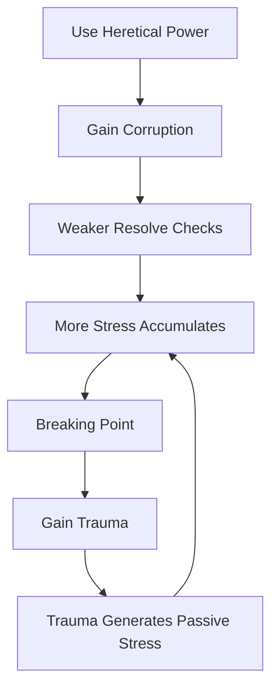

# Trauma Economy — The Price of Knowing

> *"In a broken world, the most profound forms of power are inextricably linked to the psychic wound of reality itself. Accessing them requires a direct, quantifiable sacrifice of your sanity and spiritual integrity."*

---

## Document Control

| Version | Date | Changes |
|---------|------|---------|
| 1.0 | 2025-12-07 | Initial specification (consolidated from legacy v5.0) |

---

## 1. Overview

### 1.1 Identity Table

| Property | Value |
|----------|-------|
| Spec ID | `SPEC-CORE-TRAUMA` |
| Category | Core System |
| Dependencies | `SPEC-CORE-DICE`, `SPEC-CORE-ATTR-WILL` |
| Priority | Should-Have |

### 1.2 Core Philosophy

The Trauma Economy is not merely a "sanity system"—it is an **active, player-driven economy** where the currencies are **Psychic Stress** and **Runic Blight Corruption**, and the goods are forbidden secrets, heretical power, and the unnatural advantages needed to survive.

**Design Pillars:**

- **Diegetic Horror**: Mechanizes the lore of the Great Silence into gameplay
- **Strategic Resource Management**: Trauma currencies are active, spendable resources
- **Two-Currency Depth**: Stress (volatile) vs. Corruption (permanent)
- **Ludonarrative Harmony**: UI distortion reflects internal character state
- **Specialization Identity**: Different builds have fundamentally different trauma relationships

### 1.3 The Two Currencies

| Currency | Nature | Recovery | Effect |
|----------|--------|----------|--------|
| **Psychic Stress** | Volatile, short-term | Sanctuary Rest | Breaking Point → Trauma |
| **Runic Blight Corruption** | Insidious, permanent | *Near-impossible* | Terminal Error → Character Loss |

### 1.4 The Marketplace Metaphor

Players actively **purchase** power with trauma:

| Good | Price |
|------|-------|
| Heretical abilities | Stress cost |
| Forbidden knowledge | Stress + risk |
| Mystic spells | Corruption risk |
| Glitched artifacts | Permanent Corruption |
| Ultimate power | Everything |

---

## 2. Psychic Stress System

### 2.1 Stress Range

| Value | State | UI Effect |
|-------|-------|-----------|
| 0-19 | Calm | Normal |
| 20-39 | Uneasy | Minor distortion |
| 40-59 | Anxious | Moderate distortion |
| 60-79 | Panicked | Major distortion |
| 80-99 | Breaking | Severe distortion |
| 100 | **Breaking Point** | Full breakdown |

### 2.2 Defense Penalty

Stress directly reduces Defense (via FINESSE integration):

```
Defense Penalty = floor(Psychic Stress / 20)
```

| Stress | Penalty |
|--------|---------|
| 0-19 | 0 |
| 20-39 | −1 |
| 40-59 | −2 |
| 60-79 | −3 |
| 80-99 | −4 |
| 100 | −5 |

> See [stress.md](./resources/stress.md) for full Defense penalty mechanics.

### 2.3 Stress Sources

#### Combat Sources (Resistible)

| Source | Base Stress | Resist Check |
|--------|-------------|--------------|
| Boss fight aura | 10-15 | `WILL` vs DC 3 |
| Forlorn presence | 10-20 | `WILL` vs DC 4 |
| Elite psychic attack | 15-25 | `WILL` vs DC 3 |
| Ally drops to 0 HP | 10 | `WILL` vs DC 2 |

#### Environmental Sources (Resistible)

| Source | Base Stress | Resist Check |
|--------|-------------|--------------|
| Psychic Resonance zone | 8 | `WILL` vs DC 2 |
| Blight corridor | 10-15 | `WILL` vs DC 3 |
| Paradox encounter | 15-25 | `WILL` vs DC 4 |
| Corpse discovery | 5 | `WILL` vs DC 1 |

#### Self-Inflicted Sources (Non-Resistible)

| Source | Stress | Notes |
|--------|--------|-------|
| Psychic Lash ability | 10 | No resist (chosen) |
| Mass Psychic Lash | 20 | No resist |
| Blood Sacrifice | 15 | No resist |
| Forbidden reading | 10-25 | No resist |

### 2.4 Stress Resistance (Resolve Check)

```
Mental Resolve = WILL dice vs Stress DC
Final Stress = max(0, Base Stress - Net Successes)
```

**Example:**
```
Base Stress:    10 (Boss fight)
WILL:           6 dice
Roll:           2 successes
Final Stress:   10 - 2 = 8
```

### 2.5 Stress Recovery

| Method | Recovery | Availability |
|--------|----------|--------------|
| Sanctuary Rest | Full (→ 0) | Safe zones |
| Short Rest | `WILL × 2` | Out of combat |
| Long Rest | `WILL × 5` | Safe location |
| Bone-Setter ability | 10-20 | In combat |
| Consumable | 10-15 | Limited |

---

## 3. Breaking Point System

### 3.1 Trigger Condition

When Psychic Stress reaches **exactly 100**:
1. Breaking Point triggers immediately
2. Resolve Check determines outcome
3. Permanent Trauma may be acquired
4. Stress resets (not to 0)

### 3.2 Breaking Point Check

```
Breaking Point: WILL vs DC 3
```

| Result | Stress Reset | Additional Effect |
|--------|--------------|-------------------|
| **Success** | 75 | Gain `[Disoriented]` for 2 turns |
| **Failure** | 50 | Gain `[Stunned]` 1 turn + **Permanent Trauma** |
| **Critical Success** | 50 | Gain temporary `[Hardened]` buff |
| **Fumble** | 75 | Trauma + additional Stress effect |

### 3.3 Trauma Acquisition

On Breaking Point failure:
1. Determine **context** of trauma (combat, isolation, darkness, Forlorn)
2. Roll from appropriate trauma category
3. Add trauma to character's permanent list
4. Apply immediate mechanical effects
5. Display trauma card

### 3.4 Permanent Traumas

Traumas are **irremovable** (within normal gameplay):

| Trauma | Source Context | Mechanical Effect |
|--------|----------------|-------------------|
| `[HYPERVIGILANCE]` | Combat | +3 Stress/turn in combat |
| `[PARANOIA]` | Betrayal | Cannot benefit from ally adjacency |
| `[NYCTOPHOBIA]` | Darkness | +5 Stress in dark rooms |
| `[ISOLOPHOBIA]` | Isolation | +5 Stress when alone |
| `[EXISTENTIAL DREAD]` | Forlorn | −1 to all Resolve Checks |
| `[MEMORY FRAGMENTATION]` | Paradox | −2 WITS for skill checks |

### 3.5 Trauma Limit

| Count | Effect |
|-------|--------|
| 1-4 | Accumulating penalties |
| 5 | Maximum traumas |
| 6th failure | **Character Unplayable** (lost to madness) |

---

## 4. Runic Blight Corruption System

### 4.1 Corruption Range

| Value | State | Effect |
|-------|-------|--------|
| 0-20 | Clean | None |
| 21-40 | Tainted | Occasional reality glitches |
| 41-60 | Infected | Frequent glitches |
| 61-80 | Corrupted | Constant glitches, Wild Magic (Mystics) |
| 81-99 | Terminal | Extreme transformation |
| 100 | **Terminal Error** | Character lost to Blight |

### 4.2 Corruption Sources

| Source | Corruption | Notes |
|--------|------------|-------|
| Mystic spell (standard) | 0-2 | Low risk |
| Mystic spell (powerful) | 3-5 | Moderate risk |
| Mystic overcasting | 10+ | Emergency only |
| Heretical ability | 2-10 | By design |
| Glitched artifact use | 1-5 | Per use |
| Forbidden ritual | 5-15 | Story-driven |
| Focus ability (failed) | 5 | Random risk |

### 4.3 Corruption Thresholds

| Threshold | Effect | Trigger |
|-----------|--------|---------|
| **25** | +1 Tech checks, −1 Social | One-time |
| **50** | +2 Tech, −2 Social, no human faction rep | One-time |
| **75** | Acquire `[MACHINE AFFINITY]` trauma, NPCs fear | One-time |
| **100** | **Terminal Error** — Game Over | Immediate |

### 4.4 Terminal Error

At Corruption 100:
```
Transformation Check: DC 8 - (Corruption over 100 / 5)
```

**On Failure**: Character becomes **Forlorn** — permanently unplayable, potentially becomes an enemy in future runs (roguelike mechanic).

### 4.5 Corruption Recovery

> [!WARNING]
> Corruption is **near-permanent by design**.

**Extremely Rare Recovery Methods:**

| Method | Recovery | Availability |
|--------|----------|--------------|
| Purification Ritual | 1-3 points | Once per character |
| Legendary Item | 5 points | Saga Quest reward |
| Story Event | Variable | DM discretion |

**Design Intent**: Recovery exists but is intentionally punishing—barely worth pursuing.

---

## 5. Currency Interaction

### 5.1 Corruption → Stress Relationship

High Corruption weakens Stress resistance:

```
Resolve Check Penalty = −1 die per 20 Corruption
```

| Corruption | Resolve Penalty |
|------------|-----------------|
| 0-19 | 0 |
| 20-39 | −1 die |
| 40-59 | −2 dice |
| 60-79 | −3 dice |
| 80-99 | −4 dice |

### 5.2 The Compounding Death Spiral



This is **intentional design** — the Trauma Economy punishes overreliance on forbidden power.

### 5.3 Building Identity Through Trauma

| Build Type | Stress Relationship | Corruption Relationship |
|------------|---------------------|-------------------------|
| **Coherent** | Avoids, slow progression | Near-zero |
| **Heretical Warrior** | Pays actively, manages | Low-moderate |
| **Mystic** | Moderate exposure | Primary concern |
| **God-Sleeper Cultist** | Embraces | Maximum risk |

---

## 6. UI Integration

### 6.1 UI Distortion Tiers

| Stress | Tier | Visual Effect |
|--------|------|---------------|
| 0-19 | 0 | Normal text |
| 20-39 | 1 | Leetspeak substitutions (e→3, o→0) |
| 40-59 | 2 | Unicode intrusion, formatting errors |
| 60-79 | 3 | Heavy static, data log intrusions |
| 80-99 | 4 | Severe breakdown |
| 100 | — | Full glitch, Breaking Point modal |

### 6.2 Stress Display

```
┌─────────────────────────────────────────┐
│  PSYCHIC STRESS                         │
│  ψ: ████████████████░░░░  82/100        │
│     [BREAKING]                          │
│     Defense: -4                         │
│                                         │
│  ⚠ DANGER: One more event triggers      │
│    BREAKING POINT                       │
└─────────────────────────────────────────┘
```

### 6.3 Corruption Display

```
┌─────────────────────────────────────────┐
│  RUNIC BLIGHT CORRUPTION                │
│  ⌘: ██████████████████░░  72/100        │
│     [CORRUPTED] Wild Magic Active       │
│     Threshold 75 in 3 points            │
│                                         │
│  Tech: +2  |  Social: -2                │
└─────────────────────────────────────────┘
```

### 6.4 Breaking Point Modal

```
╔═══════════════════════════════════════════════════════════╗
║             ▓▓▓ BREAKING POINT ▓▓▓                        ║
║                                                           ║
║  Your mind fractures under the weight of horrors         ║
║  witnessed. Reality fragments around you.                 ║
║                                                           ║
║  Rolling WILL (6 dice) vs DC 3...                        ║
║  [████████░░] 2 successes — FAILURE                      ║
║                                                           ║
║  ┌─────────────────────────────────────────────────────┐  ║
║  │  TRAUMA ACQUIRED: [HYPERVIGILANCE]                  │  ║
║  │                                                     │  ║
║  │  "Every shadow hides a threat. Every silence        │  ║
║  │   precedes an attack. You cannot rest."             │  ║
║  │                                                     │  ║
║  │  Effect: +3 Psychic Stress per turn in combat      │  ║
║  └─────────────────────────────────────────────────────┘  ║
║                                                           ║
║  Psychic Stress reset to 50.                             ║
║  You are [STUNNED] for 1 turn.                           ║
║                                                           ║
║                    [Continue]                             ║
╚═══════════════════════════════════════════════════════════╝
```

---

## 7. Technical Implementation

### 7.1 Service Architecture

```csharp
public interface ITraumaEconomyService
{
    // Stress
    StressResult AddStress(Character character, int baseAmount, 
                           StressSource source, bool resistible);
    int RecoverStress(Character character, int amount);
    bool CheckBreakingPoint(Character character);
    BreakingPointResult TriggerBreakingPoint(Character character);
    
    // Corruption
    void AddCorruption(Character character, int amount, CorruptionSource source);
    bool CheckCorruptionThreshold(Character character, int oldValue);
    bool IsTerminalCorruption(Character character);
    
    // Combined
    int GetResolveModifier(Character character);  // Corruption penalty
    int GetDefensePenalty(Character character);   // Stress penalty
    UIDistortionTier GetDistortionTier(Character character);
}

public record StressResult(int StressGained, int NewTotal, bool BreakingPointTriggered);
public record BreakingPointResult(bool Passed, int NewStress, Trauma? TraumaGained);
```

### 7.2 Stress Application Logic

```csharp
public StressResult AddStress(Character character, int baseAmount, 
                              StressSource source, bool resistible)
{
    int finalStress = baseAmount;
    
    if (resistible)
    {
        int willDice = character.Attributes.Will;
        int corruptionPenalty = character.Corruption / 20;
        int effectiveDice = Math.Max(1, willDice - corruptionPenalty);
        
        int successes = _diceService.RollPool(effectiveDice, 3); // DC 3
        finalStress = Math.Max(0, baseAmount - successes);
    }
    
    character.PsychicStress = Math.Min(100, character.PsychicStress + finalStress);
    bool breaking = character.PsychicStress >= 100;
    
    return new StressResult(finalStress, character.PsychicStress, breaking);
}
```

### 7.3 Database Schema

```sql
-- Stress/Corruption state
CREATE TABLE character_trauma_state (
    character_id UUID PRIMARY KEY REFERENCES characters(id),
    psychic_stress INT NOT NULL DEFAULT 0 CHECK (psychic_stress BETWEEN 0 AND 100),
    corruption INT NOT NULL DEFAULT 0 CHECK (corruption BETWEEN 0 AND 100),
    distortion_tier INT NOT NULL DEFAULT 0,
    breaking_point_count INT NOT NULL DEFAULT 0,
    corruption_threshold_25 BOOLEAN NOT NULL DEFAULT FALSE,
    corruption_threshold_50 BOOLEAN NOT NULL DEFAULT FALSE,
    corruption_threshold_75 BOOLEAN NOT NULL DEFAULT FALSE
);

-- Permanent traumas
CREATE TABLE character_traumas (
    id SERIAL PRIMARY KEY,
    character_id UUID NOT NULL REFERENCES characters(id) ON DELETE CASCADE,
    trauma_type VARCHAR(100) NOT NULL,
    context VARCHAR(100),
    acquired_at TIMESTAMP NOT NULL DEFAULT CURRENT_TIMESTAMP,
    source_description TEXT
);

CREATE INDEX idx_char_traumas ON character_traumas(character_id);
```

---

## 8. Phased Implementation Guide

### Phase 1: Core Logic
- [ ] **Interfaces**: Define `ITraumaEconomyService` and support types.
- [ ] **Formulas**: Implement `CalculateResist` and penalty calculations.
- [ ] **Trauma Registry**: Create registry of all standard Traumas and effects.

### Phase 2: Persistence
- [ ] **Schema**: Implement `character_trauma_state` and `character_traumas`.
- [ ] **Repositories**: Update `CharacterRepository` to include trauma data.
- [ ] **Migrations**: Generate and apply DB migration.

### Phase 3: Integration
- [ ] **Combat**: Hook `EventBus` to trigger Stress checks on ally KO.
- [ ] **Exploration**: Add `PsychicResonance` zone logic to RoomState.
- [ ] **Attributes**: Hook `Defense` calculation to reduce by `floor(Stress/20)`.

### Phase 4: UI & Feedback
- [ ] **Distortion**: Implement text scrambler shader/logic based on Stress Tier.
- [ ] **HUD**: Add Stress Bar and Corruption Bar with threshold markers.
- [ ] **Modals**: Create "Breaking Point" dramatic event window.

---

## 9. Testing Requirements

### 9.1 Unit Tests
- [ ] **Stress Cap**: Verify Stress cannot exceed 100.
- [ ] **Resistance**: Verify `WILL` rolls reduce incoming stress.
- [ ] **Breaking Point**: Verify trigger at exact 100.
- [ ] **Reset**: Verify Stress resets to 75/50 after Breaking Point (not 0).
- [ ] **Defense**: Verify `-1` Defense per 20 Stress.
- [ ] **Resolve Penalty**: Verify `-1` die per 20 Corruption.

### 9.2 Integration Tests
- [ ] **Combat-Trauma**: Kill ally -> Trigger Stress -> Hit 100 -> Gain Trauma -> Verify Combat Effect.
- [ ] **Persistence**: Save with "Paranoia" -> Load -> Character still has "Paranoia".

### 9.3 Manual QA
- [ ] **Visuals**: Verify text starts glitching at 20+ Stress.
- [ ] **Breaking Point**: Intentionally trigger Breaking Point and verify UI Modal flow.

---

## 10. Logging Requirements

**Reference:** [logging.md](logging.md)

### 10.1 Log Events

| Event | Level | Message Template | Properties |
|-------|-------|------------------|------------|
| Stress Gain | Verbose | "{Character} gained {Amount} Stress (Reason: {Source})" | `Character`, `Amount`, `Source` |
| Breaking Point | Information | "{Character} HIT BREAKING POINT! Result: {Result}" | `Character`, `Result` |
| Trauma Acquired | Warning | "{Character} acquired permanent trauma: [{Trauma}]" | `Character`, `Trauma` |
| Corruption Gain | Information | "{Character} corrupted by {Amount} (Total: {Total})" | `Character`, `Amount`, `Total` |
| Terminal Error | Fatal | "TERMINAL ERROR: {Character} lost to corruption." | `Character` |

---

## 11. Related Specifications

| Spec ID | Relationship |
|---------|--------------|
| [resting-system.md](../04-systems/resting-system.md) | Stress recovery mechanics, Sanctuary vs Wilderness |
| [stress.md](./resources/stress.md) | Detailed Stress mechanics |
| `SPEC-CORE-ATTR-WILL` | Primary resistance attribute |
| `SPEC-CORE-ATTR-FINESSE` | Defense penalty integration |
| `SPEC-CORE-SAGA` | Trauma Modifier for Legend |
| `SPEC-MAGIC-CASTING` | Mystic Corruption generation |
