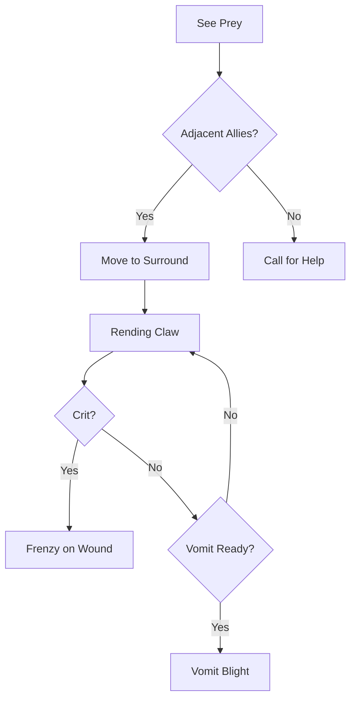

# Forlorn Shambler

> *"It walks like a man, but the rhythm is wrong. A puppet jerking on unseen strings, leaking black ichor onto the snow."*

---

## 1. Overview

| Property | Value |
|----------|-------|
| **Category** | Blight-Creature |
| **Threat Tier** | Minion |
| **Origin** | Blight-Mutated Human |
| **Habitat** | Blighted Ruins, Deep Zones |
| **Behavior** | Aggressive Swarm |
| **Pack Size** | Pack (3-6) |

---

## 2. Lineage & Origin

### 2.1 Pre-Glitch Baseline

| Property | Value |
|----------|-------|
| **Baseline Species** | Human (Homo sapiens) |
| **Original Function** | Scavenger / Explorer |
| **Era of Creation** | Post-Glitch mutation |

### 2.2 Mutation Vector

| Vector | Description |
|--------|-------------|
| **Primary Cause** | Terminal Corruption (100+) |
| **Visible Mutations** | Black veins, weeping eyes, elongated limbs |
| **Behavioral Changes** | Loss of higher function, driven by hunger for Aether |

---

## 3. Stat Block

### 3.1 Core Statistics

| Stat | Value | Notes |
|------|-------|-------|
| **HP** | 30 | Fragile but numb to pain |
| **Armor** | 1 | Natural toughness (frozen skin) |
| **Speed** | Walk 4 | Shuffling, uneven gait |
| **Initiative** | -2 | Slow reactions |

### 3.2 Attributes

| Attribute | Value | Modifier |
|-----------|-------|----------|
| **MIGHT** | 4 | +0 |
| **AGILITY** | 2 | -1 |
| **WITS** | 1 | -2 |
| **WILL** | 5 | +1 (Mindless hunger) |
| **PRESENCE** | 1 | -2 |

### 3.3 Defenses

| Defense | Value | Save DC |
|---------|-------|---------|
| **Physical** | 12 | DC 12 |
| **Mental** | 10 | DC 10 |
| **Aetheric** | 8 | DC 8 |

### 3.4 Resistances & Vulnerabilities

| Type | Effect |
|------|--------|
| **Resistant** | Cold — frozen flesh numbs pain |
| **Vulnerable** | Fire — dried Blight-flesh ignites easily |
| **Immune** | [Frightened] — no higher cognition to terrify |

### 3.5 Creature Traits

> **Reference:** [Creature Traits System](../../03-combat/creature-traits.md)

| Trait | Category | Effect | Notes |
|-------|----------|--------|-------|
| **ForlornAura** | Psychic | +3 Stress/turn to characters within 2 tiles | Radiates existential dread |
| **Infectious** | Corruption | Characters who kill gain +1 Corruption | Blight transfers at death |
| **Swarmer** | Strategy | +2 Accuracy when 2+ allies adjacent to target | Coordinated encirclement |
| **FireVulnerable** | Resistance | 150% Fire damage | Dried Blight-flesh ignites |

> **Trait Balance:** Minion tier (2-4 points) with 4 traits. ForlornAura (3) + Infectious (1) + Swarmer (1) + FireVulnerable (-1) = **4 points** (within budget).

---

## 4. Abilities

### 4.1 Basic Attack

| Property | Value |
|----------|-------|
| **Name** | Rening Claw |
| **Type** | Melee |
| **Range** | Melee (1) |
| **Damage** | 1d6 + 2 Physical |
| **Effects** | On crit: Applies [Bleeding] (1 stack) |

**Resolution:** Roll MIGHT (4d10) vs Defense DC

### 4.2 Special Abilities

#### Vomit Blight

| Property | Value |
|----------|-------|
| **Type** | Active |
| **Trigger** | Standard Action |
| **Effect** | Examples adjacent enemies to Corruption (DC 12 VIGOR save or +2 Corruption) |
| **Cooldown** | Recharge on 5-6 (d6) |

#### Hordemind (Passive)

| Property | Value |
|----------|-------|
| **Type** | Passive |
| **Effect** | +1 to Hit for each adjacent ally Shambler |

---

## 5. Tactics & Behavior

### 5.1 Combat Behavior



### 5.2 Tactical Notes

| Situation | Behavior |
|-----------|----------|
| **Opening** | Moves directly toward nearest noise/light. No stealth. |
| **Grouped** | Attempts to surround single targets to trigger Hordemind. |
| **Wounded** | Does not retreat. Becomes more erratic. |

---

## 6. Encounter Design

### 6.1 Recommended Encounters

| Encounter Type | Composition | Challenge |
|----------------|-------------|-----------|
| **Easy** | 2 Shamblers | Low |
| **Medium** | 4 Shamblers + 1 Bloated Husk | Moderate |
| **Hard** | 8 Shamblers (Swarm) | High |

### 6.2 Counter-Play

| Method | Effectiveness |
|--------|--------------|
| **Fire** | High (Causes panic) |
| **Kiting** | High (They are slow) |
| **Stealth** | Low (They smell Aether/Life) |

---

## 7. Loot & Rewards

### 7.1 Drop Table

| Item | Drop Rate | Notes |
|------|-----------|-------|
| Scrap Cloth | 40% | Tattered rags |
| Old Keys | 10% | From before the change |
| Blight Ichor | 20% | Crafting component (Dangerous) |

---

## 8. Balance Data

### 8.1 Threat Assessment

| Metric | Rating (1-5) | Notes |
|--------|--------------|-------|
| **Damage Output** | 2 | Low per hit, dangerous in packs |
| **Survivability** | 2 | Low HP, low armor |
| **Control** | 1 | No CC, just Corruption risk |
| **Mobility** | 1 | Very slow |
| **Solo Threat** | 1 | Negligible alone |

### 8.2 Party Level Scaling

| Party Level | Enemy Count | Notes |
|-------------|-------------|-------|
| 1-3 | 3-5 | Standard threat |
| 4-6 | 6-10 | Cannon fodder |
| 7+ | 10+ | Environmental hazard |

### 8.3 Spawning Data

> **Reference:** [Encounter Generation System](../../03-combat/encounter-generation.md)

| Property | Value | Notes |
|----------|-------|-------|
| **Spawn Budget Cost** | 1 | Minion tier |
| **Threat Value** | 8 | Low individual threat; dangerous in swarms |
| **Faction** | Forlorn | Blight-corrupted humanoids |
| **Biomes** | The Roots, Niflheim, Alfheim | Blighted ruins, deep zones |

**Elite/Champion Eligibility:**

| Property | Value |
|----------|-------|
| **Can Spawn as Elite** | No (minion tier) |
| **Can Spawn as Champion** | No (minion tier) |
| **Notes** | Shamblers are swarm fodder; use Bloated Husk or Forlorn Scholar for elite variants |

> **Reference:** [Elite & Champion Mechanics](../../03-combat/elite-mechanics.md)

---

## 9. Voice Guidance

### 9.1 Description Templates

**First Sighting:**
> "A shape stumbles from the gloom. It wears the tattered grey of a scavenger, but the skin beneath is slick and black like oil. It opens its mouth, and a sound like tearing wet canvas emerges."

**In Combat:**
> "The Shambler lunges, fingers locked into rigid claws. It doesn't flinch as your blade bites—it just pushes forward, eager to share its sickness."

**Death:**
> "It collapses like a marionette with cut strings. The black ichor pools rapidly, steaming in the cold air."

### 9.2 Sound Design

| Event | Sound Description |
|-------|-------------------|
| **Idle** | Wet breathing, dragging footsteps |
| **Alert** | Guttural clicking, snapping joints |
| **Attack** | Wet shrieks, tearing fabric |

---

## 10. Logging Requirements

**Reference:** [../../01-core/logging.md](../../01-core/logging.md)

### 10.1 Log Events

| Event | Level | Message Template | Properties |
|-------|-------|------------------|------------|
| Spawn | Debug | "Enemy Spawned: {EnemyId} ({Type}) at {Location}" | `EnemyId`, `Type`, `Location` |
| Aggro | Info | "{EnemyId} aggro on {TargetId}" | `EnemyId`, `TargetId` |
| Ability | Verbose | "{EnemyId} uses {Ability} on {TargetId}" | `EnemyId`, `Ability`, `TargetId` |
| Death | Info | "{EnemyId} died. Killer: {SourceId}" | `EnemyId`, `SourceId` |

### 10.2 Example Implementation

```csharp
public void OnAggro(Character target)
{
    _logger.Info("{EnemyId} aggro on {TargetId}", this.Id, target.Id);
    _aiController.SetTarget(target);
}
```

---

## 11. Related Documentation

| Document | Purpose |
|----------|---------|
| [Creature Traits](../../03-combat/creature-traits.md) | Composable trait system |
| [Encounter Generation](../../03-combat/encounter-generation.md) | Spawn budget, faction pools |
| [Spawn Scaling](../../03-combat/spawn-scaling.md) | TDR/PPS formulas |
| [Biome: The Roots](../../07-environment/biomes/the-roots.md) | Primary habitat |

---

## 12. Changelog

| Version | Date | Changes |
|---------|------|---------|
| 1.1 | 2025-12-14 | Added Creature Traits (3.5), Resistances (3.4), Spawning Data (8.3), Related Documentation (11) |
| 1.0 | 2025-12-12 | Initial specification |
