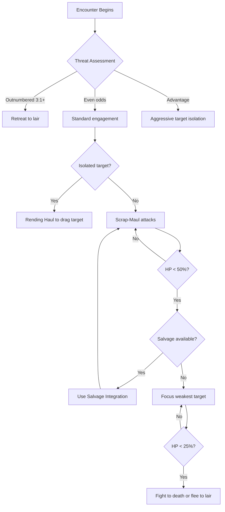

# Skrap-Troll

> *"First comes the scraping—iron on iron, like a beast dragging its bones through rust. Then the smell: old oil, sour blood, and something else. Something the world forgot to name. When it rounds the corner, you see why the Iron-Banes call them 'walking graves.' It is not that they wear the dead machines. The dead machines wear them."*

---

## 1. Overview

| Property | Value |
|----------|-------|
| **Category** | Blight-Creature |
| **Threat Tier** | Standard |
| **Origin** | Blight-Mutated / Mechanical Symbiosis |
| **Habitat** | Jötunheim (Industrial Decay), Collapsed Forge-Halls, Rusted Gantries |
| **Behavior** | Territorial / Scavenger |
| **Pack Size** | Solitary / Pair |

---

## 2. Lineage & Origin (Domain 5 Compliance)

### 2.1 Pre-Glitch Baseline

| Property | Value |
|----------|-------|
| **Baseline Species** | J.T.N. Series Maintenance Servitor (Model: TRL-7 "Hauler") |
| **Original Function** | Heavy-lift maintenance drone; designed to carry damaged equipment to repair bays |
| **Era of Creation** | Age of Forging — manufactured by O.D.I.N. subsidiary foundries |

### 2.2 Mutation Vector

| Vector | Description |
|--------|-------------|
| **Primary Cause** | Ginnungagap Glitch cascading into corrupted repair-loop protocols; subsequent Blight saturation from prolonged exposure to Aetheric fallout in collapsed industrial sectors |
| **Visible Mutations** | Original chassis fused with salvaged scrap metal, forming asymmetrical armor plating; biological tissue growth (Blight-flesh) visible in joints and seams; one or more limbs replaced with improvised claws made from shearing tools and broken gantry struts |
| **Behavioral Changes** | Original "retrieve and repair" directive corrupted into compulsive scavenging; now collects metal, corpses, and functional components to integrate into its own chassis; territorial aggression toward anything perceived as "salvage competition" |

> **Domain 5 Note:** The Skrap-Troll is not a natural species. It is the pathological endpoint of a TRL-7 Hauler's maintenance loop, corrupted by the Glitch and saturated with Blight-matter. Each specimen is unique—a walking archive of everything it has consumed and integrated.

---

## 3. Stat Block

### 3.1 Core Statistics

| Stat | Value | Notes |
|------|-------|-------|
| **HP** | 45 | High for Standard tier; reflects scrap-armor |
| **Armor** | 4 | Salvaged plating (inconsistent coverage) |
| **Speed** | Walk 4 / Climb 2 | Slow but relentless; magnetic grip on metal surfaces |
| **Initiative** | -1 | Bulk slows reaction time |

### 3.2 Attributes

| Attribute | Value | Modifier |
|-----------|-------|----------|
| **MIGHT** | 16 | +3 |
| **AGILITY** | 8 | -1 |
| **WITS** | 6 | -2 |
| **WILL** | 10 | +0 |
| **PRESENCE** | 4 | -3 |

### 3.3 Defenses

| Defense | Value | Save DC |
|---------|-------|---------|
| **Physical** | 14 | DC 14 |
| **Mental** | 8 | DC 8 |
| **Aetheric** | 10 | DC 10 |

### 3.4 Resistances & Vulnerabilities

| Type | Effect |
|------|--------|
| **Resistant** | Physical (slashing/piercing) — scrap plating deflects blade edges |
| **Vulnerable** | Acid — corrodes improvised welds; Fire — ignites oil-soaked joints |
| **Immune** | [Bleeding] — no coherent circulatory system |

### 3.5 Creature Traits

> **Reference:** [Creature Traits System](../../03-combat/creature-traits.md)

| Trait | Category | Effect | Notes |
|-------|----------|--------|-------|
| **IronHeart** | Mechanical | Immune to Bleeding, Poison; -50% Psychic damage | No circulatory system; corrupted machine core |
| **ArmoredPlating** | Mechanical | +4 Soak | Salvaged scrap plating (inconsistent coverage) |
| **Territorial** | Strategy | +2 Accuracy/Defense in starting zone | Defends lair aggressively; will not pursue beyond territory |
| **FireVulnerable** | Resistance | 150% Fire damage; Burning lasts +1 turn | Oil-soaked joints ignite easily |
| **AcidVulnerable** | Resistance | 150% Acid damage | Corrodes improvised welds and Blight-tendons |

> **Trait Balance:** Standard tier (6-10 points) with 5 traits. IronHeart (4) + ArmoredPlating (3) + Territorial (2) + FireVulnerable (-1) + AcidVulnerable (-1) = **7 points** (within budget).

---

## 4. Abilities

### 4.1 Basic Attack

| Property | Value |
|----------|-------|
| **Name** | Scrap-Maul |
| **Type** | Melee |
| **Range** | Reach (adjacent + 1 zone) |
| **Damage** | 2d8 + 3 — *Tier: Medium d8* |
| **Effects** | On hit: Target must pass DC 12 Physical save or be pushed 1 zone (improvised bulk of strike) |

**Resolution:** Roll MIGHT d10 vs target Physical Defense DC

### 4.2 Special Abilities

#### Salvage Integration (Passive)

| Property | Value |
|----------|-------|
| **Type** | Passive |
| **Trigger** | When Skrap-Troll reduces an armored target to 0 HP, or when combat ends in a room containing significant metal debris |
| **Effect** | Skrap-Troll spends 1 round integrating salvage. Regains 1d8 HP and gains +1 Armor (max +2 from this ability per encounter) |
| **Cooldown** | Once per combat |

> **Aetheric Grounding (Domain 3):** The Blight-flesh threading the Skrap-Troll's chassis contains residual repair-runes from its original TRL-7 core. These runes, now corrupted, compel the creature to "heal" by incorporating external matter—a grotesque parody of its original maintenance function.

#### Magnetic Grip (Passive)

| Property | Value |
|----------|-------|
| **Type** | Passive |
| **Trigger** | When moving across ferrous metal surfaces |
| **Effect** | Cannot be forcibly moved (pushed, pulled) while in contact with metal terrain. Ignores difficult terrain from rust, debris, or collapsed gantries |
| **Cooldown** | None |

> **Aetheric Grounding (Domain 3):** Residual lodestone-runes in the Hauler's original magnetic clamps remain partially functional, grounding the creature to iron and steel.

#### Rending Haul (Active)

| Property | Value |
|----------|-------|
| **Type** | Active |
| **Trigger** | Standard action; 3-round cooldown |
| **Effect** | The Skrap-Troll lunges 2 zones and makes a grapple attempt (MIGHT vs target Physical DC). On success, target is [Grabbed] and dragged back to the Troll's original position. Grabbed targets take 1d6 damage at the start of each of their turns until they escape (DC 14 MIGHT or AGILITY check) |
| **Cooldown** | 3 rounds |

> **Aetheric Grounding (Domain 3):** This mirrors the TRL-7's original "retrieval protocol"—a corrupted echo of dragging damaged equipment to repair bays.

### 4.3 Signature Ability (Elite Variant Only)

| Property | Value |
|----------|-------|
| **Name** | Scrap Avalanche |
| **Type** | Major action |
| **Effect** | The Skrap-Troll sheds integrated armor violently, hurling shrapnel in a 3-zone cone. All creatures in the area take 3d6 Physical damage (DC 14 AGILITY save for half). The Troll loses 2 Armor but may immediately use Salvage Integration as a free action if debris is present |
| **Limitations** | Once per combat; cannot use if Armor is 2 or less |

---

## 5. Tactics & Behavior

### 5.1 Combat Behavior



### 5.2 Tactical Notes

| Situation | Behavior |
|-----------|----------|
| **Opening** | Waits for targets to enter its territory; prefers ambush from debris piles or shadowed gantries |
| **Grouped** | If paired, one Troll attempts Rending Haul while the other attacks the grabbed target |
| **Wounded** | Prioritizes Salvage Integration; retreats toward metal-rich terrain |
| **Fleeing** | Flees to lair (always metal-dense); will not pursue if targets leave territory |

### 5.3 Environmental Use

| Element | Usage |
|---------|-------|
| **Terrain** | Uses Magnetic Grip to cling to walls/ceilings in vertical spaces; attacks from unexpected angles |
| **Ambush** | Hides inside scrap piles, indistinguishable from debris until it moves |
| **Lair** | Nests in collapsed forge-halls surrounded by salvage; gains +2 Armor in lair from pre-integrated material |

---

## 6. Encounter Design

### 6.1 Recommended Encounters

| Encounter Type | Composition | Challenge |
|----------------|-------------|-----------|
| **Easy** | 1 Skrap-Troll (isolated, away from lair) | Low |
| **Medium** | 1 Skrap-Troll + 2 Rust-Mites (scavenger swarm) | Moderate |
| **Hard** | 2 Skrap-Trolls (paired, in territory) | High |
| **Deadly** | 1 Skrap-Troll Alpha (Elite) + 1 Standard + Rust-Mite swarm | Extreme |

### 6.2 Synergies

| Paired With | Synergy Effect |
|-------------|----------------|
| **Rust-Mites** | Mites distract and apply [Corroded]; Troll finishes weakened targets |
| **Forlorn Shambler** | Shambler's psychic static disrupts party coordination while Troll isolates targets |
| **Undying Juggernaut** | Juggernaut tanks while Troll flanks and drags backline casters |

### 6.3 Counter-Play

| Method | Effectiveness |
|--------|---------------|
| **Alka-hestur (Acidic Cartridge)** | [Corroded] status strips scrap-armor; Acid vulnerability amplifies damage |
| **Iron-Bane** | Anti-Undying abilities effective against Blight-creatures; [Corroded] application |
| **Fire-based attacks** | Ignites oil-soaked joints; potential for persistent [Burning] |
| **Kiting / mobility** | Slow speed (4) means mobile parties can outmaneuver; avoid Rending Haul range |
| **Target isolation** | Destroy Rust-Mite support first; deny Salvage Integration opportunities |

---

## 7. Loot & Rewards

### 7.1 Drop Table

| Item | Drop Rate | Notes |
|------|-----------|-------|
| **Salvaged Scrap (Common)** | 100% | 2d4 units; crafting material |
| **Corroded Power Coil** | 35% | Alchemical reagent; minor Blight contamination |
| **Intact Lodestone-Rune Fragment** | 15% | Runeforging component; valuable |
| **TRL-7 Core Memory Shard** | 5% | Jötun-Reader lore item; reveals pre-Glitch maintenance logs |

### 7.2 Harvestable Components

| Component | Skill | DC | Use |
|-----------|-------|----|----|
| **Blight-Flesh Sample** | Wasteland Survival | DC 12 | Alchemical reagent (Blighted); risk of Corruption on fumble |
| **Magnetic Clamp Rune** | Tinkering | DC 14 | Runeforging (magnetic attachment enchantments) |
| **Scrap-Plating Section** | Tinkering | DC 10 | Armor repair; improvised shield crafting |

---

## 8. Balance Data

### 8.1 Threat Assessment

| Metric | Rating (1-5) | Notes |
|--------|--------------|-------|
| **Damage Output** | 3 | Solid melee; Rending Haul adds control damage |
| **Survivability** | 4 | High HP + Armor + Salvage Integration |
| **Control** | 3 | Rending Haul grapple; push on basic attack |
| **Mobility** | 2 | Slow; Magnetic Grip is situational |
| **Solo Threat** | 3 | Dangerous alone but manageable; excels with support |

### 8.2 Party Level Scaling

| Party Level | Enemy Count | Notes |
|-------------|-------------|-------|
| 1-3 | 1 (away from lair) | Moderate challenge; test party coordination |
| 4-6 | 1-2 (with Rust-Mites) | Standard encounter; introduces synergies |
| 7-9 | 2-3 (paired, in lair) | Hard encounter; environmental complexity |
| 10+ | Minion/swarm role alongside Elites | Skrap-Troll Alpha leads packs |

### 8.3 Experience/Reward Value

| Tier | XP Value | Loot Value |
|------|----------|------------|
| Standard | 150 XP | Medium |
| Elite (Alpha) | 300 XP | High |

### 8.4 Spawning Data

> **Reference:** [Encounter Generation System](../../03-combat/encounter-generation.md)

| Property | Value | Notes |
|----------|-------|-------|
| **Spawn Budget Cost** | 3 | Standard tier |
| **Threat Value** | 25 | High survivability, moderate damage |
| **Faction** | Corrupted Machinery | Mechanical-Blight hybrid |
| **Biomes** | Jötunheim, The Roots | Collapsed forge-halls, rusted gantries |

**Elite/Champion Eligibility:**

| Property | Value |
|----------|-------|
| **Can Spawn as Elite** | Yes |
| **Can Spawn as Champion** | Yes |
| **Compatible Affixes** | Regeneration, ArmoredPlating, Relentless, Vampiric, Anchored |
| **Incompatible Affixes** | Flight (too heavy), RandomBlink (territorial, anchored) |

> **Reference:** [Elite & Champion Mechanics](../../03-combat/elite-mechanics.md)

**Champion Naming Examples:**
- "The Dreaded Skrap-Troll, Ironhide" (Defensive focus)
- "The Twisted Skrap-Troll, the Relentless" (Offensive focus)

---

## 9. Voice Guidance

### 9.1 Description Templates (Narrator Voice)

**First Sighting:**
> "The heap of rust and ruin shifts. What you took for a collapsed gantry unfolds—iron limbs grinding against iron limbs, a torso of welded scrap, a head that might once have been a maintenance drone's sensor cluster, now threaded with something wet and alive. It regards you with the patient hunger of a thing that has learned to feed."

**In Combat:**
> "The Skrap-Troll swings its improvised limb—a shearing tool fused to corroded struts—with the grinding inevitability of a machine that has forgotten how to stop. Sparks shower where scrap meets armor. The creature does not roar. It does not need to. The shriek of tortured metal speaks for it."

**Death:**
> "The Skrap-Troll collapses, a cascade of loosened plating and severed Blight-tendons. For a moment, the lodestone-runes in its core flicker—a dim, blue-white pulse, like a heartbeat trying to remember itself. Then nothing. Just rust, and silence, and the smell of old oil."

### 9.2 Vocabulary Rules (Domain 4 Compliance)

| Concept | ❌ Avoid | ✅ Use Instead |
|---------|---------|----------------|
| Creature origin | "mutated by radiation" | "twisted by the sickness-light of the Glitch" |
| Mechanical parts | "servo", "actuator", "hydraulic" | "iron-joint", "gear-sinew", "piston-bone" |
| Magnetic ability | "electromagnetic field" | "lodestone-rune grip" |
| Repair function | "self-repair protocol" | "the broken hunger to mend itself" |
| Integration behavior | "assimilates material" | "consumes and becomes" |

### 9.3 Sound Design Notes

| Event | Sound Description |
|-------|-------------------|
| **Idle** | Low grinding; occasional clatter of loose plating; wet squelch of Blight-flesh shifting |
| **Alert** | Sharp metallic shriek; accelerating gear-grind |
| **Attack** | Screeching impact of scrap-on-armor; meaty thud of Blight-limbs |
| **Death** | Cascading clatter of falling scrap; dying electrical hum; wet collapse |

---

## 10. Variants

### 10.1 Skrap-Troll Alpha — Elite

| Change | Value |
|--------|-------|
| **HP Modifier** | +50% (68 HP) |
| **Damage Modifier** | +25% (2d8+4 base) |
| **Additional Ability** | Scrap Avalanche (see Section 4.3) |
| **Visual Difference** | Larger chassis; multiple integrated limbs (4-6); glowing Blight-flesh visible in chest cavity; remnants of TRL-7 designation markings still visible |

### 10.2 Forge-Haunted Skrap-Troll — Blight-Saturated

| Change | Value |
|--------|-------|
| **HP Modifier** | -10% (40 HP) |
| **New Weakness** | Aetheric vulnerability (+50% damage from Galdr) |
| **New Ability** | **Blight-Pulse (Reaction):** When reduced to 0 HP, releases Aetheric burst. All creatures within 1 zone must pass DC 12 WILL save or gain 1 Corruption |
| **Visual Difference** | Blight-flesh overgrowth; glowing cracks in plating; faint static-hum; smells of ozone and rot |

### 10.3 Juvenile Skrap-Troll — Minion

| Change | Value |
|--------|-------|
| **HP Modifier** | -50% (22 HP) |
| **Armor Modifier** | -2 (Armor 2) |
| **Damage Modifier** | -25% (2d6+2) |
| **Removed Ability** | No Rending Haul; No Salvage Integration |
| **Visual Difference** | Smaller; incomplete plating; exposed TRL-chassis visible; erratic movement |

---

## 11. Phased Implementation Guide

### Phase 1: Data & Persistence
- [ ] **Define Entity**: Create `EnemyType` entity for Skrap-Troll with base stats, behavior flags, and category tags.
- [ ] **Seed Data**: Add Skrap-Troll (Standard), Skrap-Troll Alpha (Elite), Juvenile (Minion), and Forge-Haunted (Variant) to `EnemyTypes` table in `DataSeeder.cs`.
- [ ] **Validation**: Verify `Threat Tier` = Standard, `Category` = Blight-Creature matches Domain rules.

### Phase 2: Core Logic
- [ ] **Stat Block**: Implement `SkrapTrollStats` value object with HP 45, Armor 4, Speed 4.
- [ ] **Abilities**: Implement `IAbility` strategy classes:
  - `ScrapMaulAbility` (basic attack with push)
  - `SalvageIntegrationAbility` (passive heal/armor gain)
  - `MagneticGripAbility` (passive terrain interaction)
  - `RendingHaulAbility` (active grapple/drag)
  - `ScrapAvalancheAbility` (Elite signature)
- [ ] **AI State Machine**: Define states in `SkrapTrollAI.cs`:
  - `Idle` → `Alert` (on player detection)
  - `Alert` → `Engage` (standard) or `AmbushWait` (if concealed)
  - `Engage` → `UseRendingHaul` (isolated target) or `BasicAttack` (grouped)
  - `Wounded` → `SeekSalvage` (HP <50%) or `Flee` (HP <25%, no salvage)
- [ ] **Unit Tests**: Verify AI transitions; test Salvage Integration heal; test Magnetic Grip terrain immunity.

### Phase 3: Systems Integration
- [ ] **Spawn Rules**: Add to `EncounterTable` for Jötunheim biome, Collapsed Forge-Halls, Rusted Gantries.
- [ ] **Combat Engine**: Register `SkrapTrollAI` with `TurnOrderService`; implement grapple resolution.
- [ ] **Loot**: Connect `SkrapTrollDropTable` to `LootService`; implement harvesting DCs.

### Phase 4: UI & Feedback
- [ ] **Logs**: Detailed AI decision logs (target selection, Salvage Integration triggers, grapple attempts).
- [ ] **TUI**: "A Skrap-Troll unfolds from the debris!" notification; combat log flavor text.
- [ ] **GUI**: Assign model/sprite; implement Salvage Integration visual (sparks, plating growth); Scrap Avalanche particle effect.

---

## 12. Related Documentation

| Document | Purpose |
|----------|---------|
| Codex: Skrap-Troll | Canonical species entry (Layer 2 diagnostic) |
| Biome: Jötunheim | Industrial Decay habitat context |
| Crafting: Runeforging | Uses for Lodestone-Rune Fragment |
| Crafting: Alchemy | Uses for Blight-Flesh Sample |
| Enemy: Rust-Mites | Synergy creature specification |

### Spawning System References

| Document | Purpose |
|----------|---------|
| [Creature Traits](../../03-combat/creature-traits.md) | Composable trait system |
| [Encounter Generation](../../03-combat/encounter-generation.md) | Spawn budget, faction pools |
| [Spawn Scaling](../../03-combat/spawn-scaling.md) | TDR/PPS formulas, stat scaling |
| [Elite & Champion Mechanics](../../03-combat/elite-mechanics.md) | Elite/Champion generation |
| [Biome Overview](../../07-environment/biomes/biomes-overview.md) | Faction spawn pools by biome |

---

## 13. Logging Requirements

**Reference:** [logging.md](../../01-core/logging.md)

### 13.1 Log Events

| Event | Level | Message Template | Properties |
|-------|-------|------------------|------------|
| Spawn | Debug | "Enemy Spawned: {EnemyId} (Skrap-Troll) at {Location}" | `EnemyId`, `Location` |
| Aggro | Info | "{EnemyId} aggro on {TargetId}" | `EnemyId`, `TargetId` |
| Rending Haul | Info | "{EnemyId} uses Rending Haul on {TargetId}. Grapple: {Success}" | `EnemyId`, `TargetId`, `Success` |
| Salvage Integration | Info | "{EnemyId} integrates salvage. HP: {HPBefore} → {HPAfter}, Armor: {ArmorBefore} → {ArmorAfter}" | `EnemyId`, `HPBefore`, `HPAfter`, `ArmorBefore`, `ArmorAfter` |
| Death | Info | "{EnemyId} died. Killer: {SourceId}" | `EnemyId`, `SourceId` |

### 13.2 Example Implementation

```csharp
public void OnSalvageIntegration()
{
    int hpBefore = CurrentHP;
    int armorBefore = Armor;
    CurrentHP = Math.Min(CurrentHP + _rng.Roll(1, 8), MaxHP);
    Armor = Math.Min(Armor + 1, BaseArmor + 2);
    _logger.Info("{EnemyId} integrates salvage. HP: {HPBefore} → {HPAfter}, Armor: {ArmorBefore} → {ArmorAfter}",
        this.Id, hpBefore, CurrentHP, armorBefore, Armor);
}
```

---

## 14. Testing

### 14.1 Unit Test Coverage

| Area | Coverage | Missing |
|------|----------|---------|
| **Stat Block** | 0% | All validations |
| **Abilities** | 0% | All ability logic |
| **AI Decision Tree** | 0% | All state transitions |
| **Loot Tables** | 0% | All drop rates |

### 14.2 Key Test Cases

```csharp
[TestMethod]
public void SkrapTroll_SalvageIntegration_HealsAndGainsArmor() { ... }

[TestMethod]
public void SkrapTroll_RendingHaul_GrabbedTargetTakesDamage() { ... }

[TestMethod]
public void SkrapTroll_MagneticGrip_ImmuneToPushOnMetal() { ... }

[TestMethod]
public void SkrapTroll_Flee_AtLowHPNoSalvage() { ... }

[TestMethod]
public void SkrapTroll_Drop_RespectsRarity() { ... }
```

### 14.3 UI/UX Testing

| Interface | Requirement | Test Case |
|-----------|-------------|-----------|
| **TUI (Console)** | Spawn Notification | Log shows "A Skrap-Troll unfolds from the debris!" |
| **TUI (Console)** | Attack Description | Combat log displays "The Skrap-Troll swings its scrap-maul..." |
| **TUI (Console)** | Grapple Notification | Log shows "You are grabbed! The Skrap-Troll drags you..." |
| **GUI (Planned)** | Model/Sprite | Asymmetrical scrap-armor renders correctly |
| **GUI (Planned)** | Animations | Salvage Integration shows sparks and plating growth |

### 14.4 QA Checklist

- [ ] Verify stat scaling matches Party Level (Section 8.2)
- [ ] Verify Salvage Integration triggers correctly on kill/debris
- [ ] Test Rending Haul grapple escape mechanics
- [ ] Test Magnetic Grip immunity on ferrous terrain
- [ ] Confirm AI state transitions (Idle → Aggro → Wounded → Flee)
- [ ] Check loot drop frequency over 100 kills
- [ ] Verify Elite variant Scrap Avalanche triggers correctly
- [ ] Test Forge-Haunted Blight-Pulse on death

---

## 15. Changelog

| Version | Date | Changes |
|---------|------|---------|
| 1.2 | 2025-12-14 | Added Spawning Data (8.4); updated Related Documentation with spawning system references |
| 1.1 | 2025-12-14 | Aligned to template and gold standard; added Creature Traits section (3.5); fixed formatting |
| 1.0 | 2025-12-14 | Initial specification |