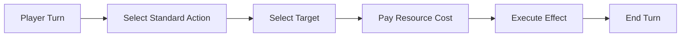
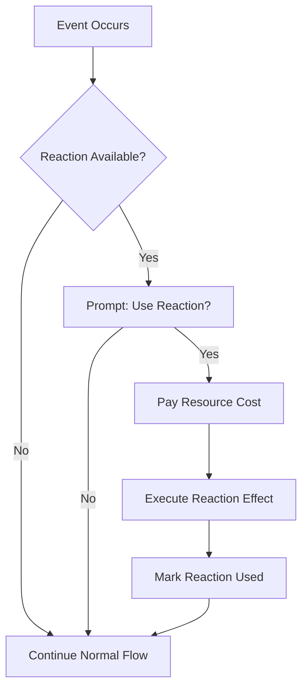
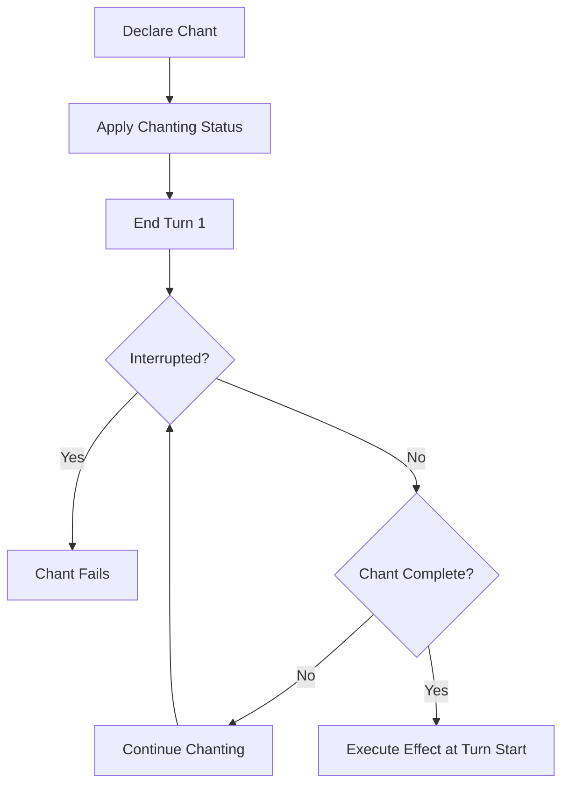
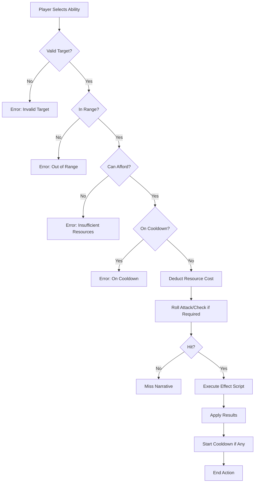

# (SPEC) Active Abilities

Type: Core System
Description: Defines player-initiated commands (standard actions, reactions, chants) with resource costs, targeting, effects, and progression. Core combat mechanic for tactical depth.
Priority: Must-Have
Status: In Design
Target Version: Alpha
Dependencies: Combat Resolution, Status Effects, Dice System
Implementation Difficulty: Very Complex
Balance Validated: No
Dependency Status: Awaiting Design
Document ID: SPEC-COMBAT-ACTIVE-ABILITIES
Domain: Character Progression, Combat, Magic/Abilities
Last Design Review: December 31, 2025
Lifecycle Phase: Design
Proof-of-Concept Flag: No
Resource System: Aether Pool, Cooldowns, Stamina
Sub-Type: Core
Template Validated: Yes
Voice Layer: Layer 3 (Technical)
Voice Validated: Yes

> “Every command is a choice. Every choice shapes your fate. In the broken world, hesitation is death—but so is recklessness.”
> 

---

## 1. Overview

### 1.1 Identity Table

| Property | Value |
| --- | --- |
| Spec ID | `SPEC-COMBAT-ACTIVE-ABILITIES` |
| Category | Combat System |
| Type | Core Mechanics |
| Dependencies | Combat Resolution, Status Effects, Dice System |

### 1.2 Core Philosophy

Active abilities are the **explicit, player-initiated commands** that characters execute to impose their will upon the broken world. They are tactical tools, devastating attacks, and life-saving interventions that form the backbone of combat and interaction.

**Design Pillars:**

| Pillar | Description | Implementation |
| --- | --- | --- |
| **Deliberate Choice** | Every ability is a conscious resource expenditure | Stamina/AP costs create meaningful decisions |
| **Coherent Outcome** | Abilities produce clear, predictable results | Effect scripts define exact mechanics |
| **Specialization Identity** | Abilities express character training | Archetype and Specialization trees |
| **Tactical Depth** | Multiple ability types create layered combat | Actions, Reactions, Chants |

---

## 2. Ability Anatomy

### 2.1 Core Properties

Every active ability is defined by a consistent set of properties:

| Property | Type | Description |
| --- | --- | --- |
| **AbilityId** | GUID | Unique identifier |
| **Name** | String | Thematic ability name (`Shield Bash`, `Aether Dart`) |
| **Command** | String | TUI command syntax (often matches name) |
| **Description** | String | Player-facing effect explanation |
| **ResourceCost** | ResourceCost | Stamina, AP, or unique resource amount |
| **TargetType** | TargetingType | Who/what can be targeted |
| **Range** | RangeType | Distance constraints |
| **ActionType** | ActionType | How used in turn order |
| **EffectScript** | String | Mechanical outcome definition |
| **Tier** | Int | Progression tier (1-4) |
| **Rank** | Int | Power level (1-3) |

### 2.2 Data Model

```csharp
public record ActiveAbility
{
    public Guid AbilityId { get; init; }
    public string Name { get; init; } = string.Empty;
    public string Command { get; init; } = string.Empty;
    public string Description { get; init; } = string.Empty;

    // Cost
    public ResourceType ResourceType { get; init; }
    public int ResourceCost { get; init; }
    public int? SecondaryCost { get; init; }  // For unique resources
    public ResourceType? SecondaryResourceType { get; init; }

    // Targeting
    public TargetingType TargetType { get; init; }
    public RangeType Range { get; init; }
    public int? MaxTargets { get; init; }  // For AoE

    // Action Economy
    public ActionType ActionType { get; init; }
    public int? Cooldown { get; init; }  // Turns until reusable
    public int? ChantTurns { get; init; }  // For Chanted abilities

    // Progression
    public int Tier { get; init; }
    public int CurrentRank { get; init; }
    public string? SpecializationId { get; init; }
    public string? ArchetypeId { get; init; }

    // Effects
    public string EffectScript { get; init; } = string.Empty;
    public IReadOnlyList<AbilityEffect> Effects { get; init; } = [];
}

public enum ResourceType
{
    Stamina,
    AetherPool,     // AP for mystics
    Fury,           // Berserkr resource
    Momentum,       // Skirmisher resource
    CoherentData,   // Jötun-Reader resource
    Corruption,     // Blót-Priest resource
    Focus,          // Seiðkona resource
    None            // Free abilities
}

public enum TargetingType
{
    Self,
    SingleEnemy,
    SingleAlly,
    AllEnemies,
    AllAllies,
    AllEnemiesInRow,
    AllEnemiesInColumn,
    AdjacentEnemies,
    AdjacentAllies,
    GroundTile,
    Line,           // Line AoE
    Cone,           // Cone AoE
    Radius          // Circular AoE
}

public enum RangeType
{
    Melee,          // Adjacent only
    Reach,          // 2 tiles
    Short,          // 3-4 tiles
    Long,           // 5+ tiles
    Unlimited       // Any visible target
}

public enum ActionType
{
    Standard,       // Primary turn action
    Bonus,          // Additional action (limited)
    Reaction,       // Response to trigger
    Free,           // No action cost
    Chant,          // Multi-turn preparation
    FullTurn        // Consumes entire turn + movement
}
```

---

## 3. Action Types

### 3.1 Standard Actions

The most common ability type. Using a standard action is the character’s primary activity for their turn.

| Property | Value |
| --- | --- |
| Action Type | `Standard` |
| Per Turn | 1 |
| Turn End | Typically ends turn |

**Examples:**
- `Strike` — Basic weapon attack
- `Shield Bash` — Melee attack with stun chance
- `Aether Dart` — Ranged magical attack
- `Analyze` — Apply [Analyzed] debuff

**Combat Flow:**



### 3.2 Reactions

Instantaneous abilities used in response to specific triggers, **outside** the character’s own turn.

| Property | Value |
| --- | --- |
| Action Type | `Reaction` |
| Per Round | 1 (typically) |
| Trigger | Specific event |

**Reaction Triggers:**

| Trigger | Description | Example Reactions |
| --- | --- | --- |
| `OnTargetedByMelee` | When targeted by melee attack | `Parry`, `Evasion` |
| `OnTargetedByRanged` | When targeted by ranged attack | `Deflect`, `Evasion` |
| `OnAllyTargetedByCrit` | When adjacent ally receives critical hit | `Interposing Shield` |
| `OnAllyCritOrFumble` | When ally suffers crit or fumbles | `Fated Intervention` |
| `OnEnemyMiss` | When enemy attack misses | `Riposte` |
| `OnTakeDamage` | When character takes damage | `Adrenaline Surge` |
| `OnKill` | When character kills enemy | `Momentum Strike` |

**Reaction Flow:**



**Example Reactions:**

**Parry** (Hólmgangr):

```
Trigger: OnTargetedByMelee
Cost: 5 Stamina
Effect: Roll FINESSE vs Attack
  - Parry > Attack: Negate damage
  - Parry > Attack by 3+: Negate + Riposte
```

**Interposing Shield** (Skjaldmær):

```
Trigger: OnAllyTargetedByCrit (adjacent ally)
Cost: 8 Stamina
Effect: Redirect attack to self, gain Block bonus
```

**Fated Intervention** (Örlög-bound):

```
Trigger: OnAllyCritOrFumble
Cost: 15 AP
Effect: Reroll the triggering dice result
```

### 3.3 Chanted Abilities

Powerful abilities requiring one or more turns of preparation. High-risk, high-reward mechanics.

| Property | Value |
| --- | --- |
| Action Type | `Chant` |
| Duration | 1-3 turns preparation |
| State | `[Chanting]` status |
| Vulnerability | Defense penalty while chanting |

**Chant Flow:**



**Interruption Mechanics:**
- Taking damage triggers WILL-based Resolve Check
- DC = 10 + (Damage / 5)
- Failure interrupts chant, resource is lost
- Some abilities reduce interruption DC

**Example Chants:**

**Hagalaz’s Storm** (Galdr-caster):

```
Chant Turns: 2
Cost: 25 AP
Range: Long (AoE)
Effect: 4d10 Lightning damage to all enemies in radius
  - [Chanting] applies -3 Defense during preparation
```

**Heartseeker Shot** (Veiðimaðr):

```
Chant Turns: 1
Cost: 15 Stamina
Range: Long
Effect: Single target, auto-critical on hit
  - Must maintain line of sight during chant
```

**Destiny’s Decree** (Örlög-bound):

```
Chant Turns: 1
Cost: 20 AP
Target: Ally
Effect: Next dice roll by target gains +3 automatic successes
```

---

## 4. Resource Systems

### 4.1 Primary Resources

| Resource | Archetype | Regeneration | Max Pool |
| --- | --- | --- | --- |
| **Stamina** | All | +STURDINESS per turn | 50 + (STURDINESS × 5) |
| **Aether Pool (AP)** | Mystic | +WILL per turn | 30 + (WILL × 5) |

### 4.2 Unique Resources

Specializations may introduce unique resources that modify gameplay:

| Resource | Specialization | Mechanic |
| --- | --- | --- |
| **Fury** | Berserkr | Builds on hit, spent on powerful attacks |
| **Momentum** | Skirmisher | Builds on kill/crit, enables bonus actions |
| **Coherent Data** | Jötun-Reader | Collected from environment, spent on analysis |
| **Corruption** | Blót-Priest | Builds from blood magic, risk/reward mechanic |
| **Focus** | Seiðkona | Maintained state, enables spirit abilities |

### 4.3 Resource Cost Validation

```csharp
public bool CanAffordAbility(Character caster, ActiveAbility ability)
{
    // Primary resource check
    var primaryResource = GetResource(caster, ability.ResourceType);
    if (primaryResource < ability.ResourceCost)
        return false;

    // Secondary resource check (if applicable)
    if (ability.SecondaryResourceType.HasValue)
    {
        var secondaryResource = GetResource(caster, ability.SecondaryResourceType.Value);
        if (secondaryResource < ability.SecondaryCost)
            return false;
    }

    return true;
}
```

---

## 5. Effect Scripts

### 5.1 Effect Script Syntax

Effect scripts define the mechanical outcomes of abilities using a structured format:

```
Action:<Type>,<Params>;Action:<Type>,<Params>;...
```

### 5.2 Effect Types

| Effect Type | Parameters | Description |
| --- | --- | --- |
| `Damage` | `Type`, `Dice`, `ScalingStat` | Deal damage |
| `Heal` | `Dice`, `ScalingStat` | Restore HP |
| `ApplyStatus` | `Effect`, `Duration`, `DC` | Apply status effect |
| `RemoveStatus` | `Effect` | Remove status effect |
| `Move` | `Distance`, `Direction` | Force movement |
| `Summon` | `CreatureId`, `Duration` | Create entity |
| `ModifyResource` | `Resource`, `Amount` | Change resource pool |
| `GrantReaction` | `ReactionId` | Enable reaction use |

### 5.3 Example Effect Scripts

**Shield Bash:**

```
Action:Damage,Type:Physical,Dice:2d6,ScalingStat:MIGHT;
Action:ApplyStatus,Effect:Staggered,Duration:1,DC:12
```

**Heal Wounds:**

```
Action:Heal,Dice:3d6,ScalingStat:WILL;
Action:RemoveStatus,Effect:Bleeding
```

**Battle Rage:**

```
Action:ApplyStatus,Effect:BattleRage,Duration:3,Target:Self;
Action:ApplyStatus,Effect:Vulnerable,Duration:3,Target:Self
```

### 5.4 Effect Resolution

```csharp
public interface IEffectResolver
{
    EffectResult ResolveEffect(
        Character caster,
        IEnumerable<Character> targets,
        AbilityEffect effect,
        Random rng);
}

public record AbilityEffect
{
    public EffectType Type { get; init; }
    public DamageType? DamageType { get; init; }
    public string? DiceExpression { get; init; }
    public string? ScalingStat { get; init; }
    public string? StatusEffect { get; init; }
    public int? Duration { get; init; }
    public int? DC { get; init; }
}
```

---

## 6. Acquisition & Progression

### 6.1 Ability Sources

| Source | When Acquired | Examples |
| --- | --- | --- |
| **Archetype** | Character Creation | 3 starting abilities |
| **Specialization** | PP Investment | Unlocked from skill trees |
| **Equipment** | Item equipped | Weapon-granted abilities |
| **Consumables** | Temporary | Scroll/potion effects |

### 6.2 Rank Progression

Abilities automatically gain power through the Milestone system:

| Rank | Trigger | Effect |
| --- | --- | --- |
| **Rank 1** | Ability learned | Base effect |
| **Rank 2** | Learn 2nd Tier 2 ability | +50% scaling (e.g., 2d6 → 3d6) |
| **Rank 3** | Learn Capstone | +100% scaling, may gain new effects |

**Reference:** [ability-rank-advancement-spec.md](../99-legacy/docs/00-specifications/progression/ability-rank-advancement-spec.md)

### 6.3 Rank Scaling

```csharp
public int GetScaledDice(ActiveAbility ability)
{
    var baseDice = ability.BaseDiceCount;
    var rankBonus = ability.CurrentRank - 1;  // +0 at Rank 1, +1 at Rank 2, +2 at Rank 3

    return baseDice + rankBonus;
}
```

---

## 7. Combat Integration

### 7.1 Ability in Combat Resolution



### 7.2 Turn Action Limits

| Action Type | Per Turn | Per Round | Notes |
| --- | --- | --- | --- |
| Standard | 1 | — | Primary action |
| Bonus | 1 | — | Some abilities grant |
| Reaction | — | 1 | Outside own turn |
| Free | Unlimited | — | No action cost |
| Movement | 1 | — | Can split around action |

### 7.3 Ability Context Restrictions

Some abilities have contextual requirements:

| Context | Restriction | Example |
| --- | --- | --- |
| **Weapon Type** | Requires specific weapon | `Parry` requires melee weapon |
| **Position** | Requires adjacency | `Shield Wall` requires adjacent ally |
| **State** | Requires status | `Shadow Strike` requires [Hidden] |
| **Resource** | Requires unique resource | `Blood Rite` requires Corruption |
| **Combat Only** | Cannot use outside combat | Most combat abilities |
| **Non-Combat Only** | Cannot use in combat | `Rest`, `Craft` |

---

## 8. TUI Presentation

### 8.1 Ability Command Syntax

```
> <ability-name> [target]

Examples:
> strike goblin
> heal self
> shield bash warden
> analyze servitor
```

### 8.2 Ability List Display

```
┌─ ABILITIES ─────────────────────────────────────────────────┐
│                                                              │
│ STANDARD ACTIONS                                             │
│ ├─ Strike (10 Stamina)      — Basic weapon attack            │
│ ├─ Shield Bash (15 Stamina) — Attack + Stagger chance        │
│ └─ Battle Cry (12 Stamina)  — AoE intimidation               │
│                                                              │
│ REACTIONS                                                    │
│ └─ Parry (5 Stamina)        — Counter melee attacks          │
│                                                              │
│ CHANTS                                                       │
│ └─ War Hymn (20 Stamina)    — 2 turns, party damage buff     │
│                                                              │
│ Reaction Available: Yes [1/1]                                │
└──────────────────────────────────────────────────────────────┘
```

### 8.3 Ability Execution Feedback

```
> shield bash warden

  [SHIELD BASH — 15 Stamina]

  Gorm slams his shield into the Rusted Warden with a
  thunderous crash!

  [MIGHT Check vs DC 12]
  Rolling... 3 successes (8, 10, 4, 9, 6)

  The Warden staggers backward, guard broken!

  [Damage: 14 Physical]
  [Status Applied: Staggered (1 turn)]
  [Stamina: 65/80]
```

### 8.4 Reaction Prompt

```
┌─ REACTION AVAILABLE ────────────────────────────────────────┐
│                                                              │
│  The Corrupted Servitor attacks Gorm!                        │
│                                                              │
│  Use PARRY? (5 Stamina)                                      │
│                                                              │
│  [Y] Yes — Attempt to parry and counter                      │
│  [N] No  — Accept the attack                                 │
│                                                              │
│  Reaction uses remaining: 1                                  │
└──────────────────────────────────────────────────────────────┘
```

### 8.5 Chant Status Display

```
┌─ CHANTING ──────────────────────────────────────────────────┐
│                                                              │
│  Eira is chanting HAGALAZ'S STORM...                         │
│                                                              │
│  [█████████░░░░░░░░░░] Turn 1/2                              │
│                                                              │
│  While chanting:                                             │
│  • Defense reduced by 3                                      │
│  • Taking damage may interrupt                               │
│  • Cannot move or take other actions                         │
│                                                              │
│  Interruption Check: WILL vs DC (10 + Damage/5)              │
└──────────────────────────────────────────────────────────────┘
```

---

## 9. Service Interface

### 9.1 IAbilityService

```csharp
public interface IAbilityService
{
    // Query
    ActiveAbility? GetAbility(Guid abilityId);
    IReadOnlyList<ActiveAbility> GetCharacterAbilities(Character character);
    IReadOnlyList<ActiveAbility> GetAvailableAbilities(Character character, CombatState? combat);

    // Validation
    AbilityValidation ValidateAbilityUse(
        Character caster,
        ActiveAbility ability,
        IEnumerable<Character> targets,
        CombatState? combat);

    // Execution
    AbilityResult ExecuteAbility(
        Character caster,
        ActiveAbility ability,
        IEnumerable<Character> targets,
        CombatState combat,
        Random rng);

    // Reactions
    IReadOnlyList<ActiveAbility> GetAvailableReactions(
        Character character,
        ReactionTrigger trigger,
        CombatState combat);

    bool CanUseReaction(Character character, ActiveAbility reaction, CombatState combat);

    // Chants
    ChantState? GetActiveChant(Character character);
    bool TryInterruptChant(Character chanter, int damage, Random rng);
    AbilityResult CompleteChant(Character chanter, CombatState combat, Random rng);

    // Progression
    void LearnAbility(Character character, ActiveAbility ability);
    void RankUpAbility(Character character, Guid abilityId);
}
```

### 9.2 DTOs

```csharp
public record AbilityValidation
{
    public bool IsValid { get; init; }
    public string? ErrorMessage { get; init; }
    public AbilityValidationError? ErrorType { get; init; }
}

public enum AbilityValidationError
{
    InvalidTarget,
    OutOfRange,
    InsufficientResources,
    OnCooldown,
    WrongContext,
    MissingRequirement,
    Interrupted
}

public record AbilityResult
{
    public bool Success { get; init; }
    public int? DamageDealt { get; init; }
    public int? HealingDone { get; init; }
    public IReadOnlyList<StatusEffect> StatusesApplied { get; init; } = [];
    public IReadOnlyList<StatusEffect> StatusesRemoved { get; init; } = [];
    public string NarrativeText { get; init; } = string.Empty;
    public int ResourceSpent { get; init; }
    public int? CooldownStarted { get; init; }
}

public record ChantState
{
    public Guid AbilityId { get; init; }
    public int TurnsRemaining { get; init; }
    public int TotalTurns { get; init; }
    public int DefensePenalty { get; init; }
}
```

### 9.3 Events

| Event | Trigger | Payload |
| --- | --- | --- |
| `AbilityUsedEvent` | Ability executed | `CasterId`, `AbilityId`, `TargetIds`, `Success` |
| `AbilityFailedEvent` | Ability failed validation | `CasterId`, `AbilityId`, `Reason` |
| `ReactionTriggeredEvent` | Reaction prompt shown | `CharacterId`, `ReactionId`, `TriggerEvent` |
| `ReactionUsedEvent` | Reaction executed | `CharacterId`, `ReactionId`, `Result` |
| `ChantStartedEvent` | Chant begun | `CasterId`, `AbilityId`, `TotalTurns` |
| `ChantInterruptedEvent` | Chant interrupted | `CasterId`, `AbilityId`, `DamageTaken` |
| `ChantCompletedEvent` | Chant finished | `CasterId`, `AbilityId`, `Result` |
| `AbilityLearnedEvent` | New ability acquired | `CharacterId`, `AbilityId` |
| `AbilityRankedUpEvent` | Ability rank increased | `CharacterId`, `AbilityId`, `NewRank` |

---

## 10. Database Schema

### 10.1 Abilities Table

```sql
CREATE TABLE Abilities (
    AbilityId           UNIQUEIDENTIFIER PRIMARY KEY,
    Name                NVARCHAR(100) NOT NULL,
    Command             NVARCHAR(50) NOT NULL,
    Description         NVARCHAR(500) NOT NULL,

    -- Resource Cost
    ResourceType        NVARCHAR(20) NOT NULL,
    ResourceCost        INT NOT NULL,
    SecondaryResourceType NVARCHAR(20) NULL,
    SecondaryCost       INT NULL,

    -- Targeting
    TargetType          NVARCHAR(30) NOT NULL,
    Range               NVARCHAR(20) NOT NULL,
    MaxTargets          INT NULL,

    -- Action Economy
    ActionType          NVARCHAR(20) NOT NULL,
    Cooldown            INT NULL,
    ChantTurns          INT NULL,

    -- Progression
    Tier                INT NOT NULL DEFAULT 1,
    SpecializationId    NVARCHAR(50) NULL,
    ArchetypeId         NVARCHAR(50) NULL,

    -- Effects
    EffectScript        NVARCHAR(MAX) NOT NULL,

    -- Metadata
    CreatedAt           DATETIME2 DEFAULT GETUTCDATE(),
    IsActive            BIT DEFAULT 1
);

CREATE INDEX IX_Abilities_Spec ON Abilities(SpecializationId);
CREATE INDEX IX_Abilities_Archetype ON Abilities(ArchetypeId);
CREATE INDEX IX_Abilities_ActionType ON Abilities(ActionType);
```

### 10.2 Character Abilities Table

```sql
CREATE TABLE CharacterAbilities (
    CharacterAbilityId  UNIQUEIDENTIFIER PRIMARY KEY,
    CharacterId         UNIQUEIDENTIFIER NOT NULL,
    AbilityId           UNIQUEIDENTIFIER NOT NULL,
    CurrentRank         INT NOT NULL DEFAULT 1,
    IsEquipped          BIT NOT NULL DEFAULT 1,
    CooldownRemaining   INT NULL,
    LearnedAt           DATETIME2 DEFAULT GETUTCDATE(),

    CONSTRAINT FK_CharAbility_Character FOREIGN KEY (CharacterId)
        REFERENCES Characters(CharacterId),
    CONSTRAINT FK_CharAbility_Ability FOREIGN KEY (AbilityId)
        REFERENCES Abilities(AbilityId)
);

CREATE UNIQUE INDEX IX_CharAbility_Unique ON CharacterAbilities(CharacterId, AbilityId);
```

### 10.3 Reaction Triggers Table

```sql
CREATE TABLE ReactionTriggers (
    TriggerId           UNIQUEIDENTIFIER PRIMARY KEY,
    AbilityId           UNIQUEIDENTIFIER NOT NULL,
    TriggerType         NVARCHAR(50) NOT NULL,
    TriggerCondition    NVARCHAR(200) NULL,  -- Additional conditions
    Priority            INT NOT NULL DEFAULT 0,

    CONSTRAINT FK_ReacTrigger_Ability FOREIGN KEY (AbilityId)
        REFERENCES Abilities(AbilityId)
);

CREATE INDEX IX_ReacTrigger_Type ON ReactionTriggers(TriggerType);
```

---

## 11. Phased Implementation Guide

### Phase 1: Core Framework

- [ ]  **Data Model**: Implement `ActiveAbility`, `ResourceType`, `ActionType` enums
- [ ]  **Repository**: Implement `AbilityRepository` with CRUD operations
- [ ]  **Validation**: Implement `ValidateAbilityUse()` with all checks

### Phase 2: Standard Actions

- [ ]  **Execution**: Implement `ExecuteAbility()` for Standard actions
- [ ]  **Effect Resolver**: Implement damage, healing, status effect scripts
- [ ]  **Combat Hook**: Integrate with `ICombatEngine.ProcessPlayerAction()`

### Phase 3: Reactions

- [ ]  **Trigger System**: Implement `ReactionTrigger` event broadcasting
- [ ]  **Prompt UI**: Implement reaction prompt in TUI
- [ ]  **Reaction Limit**: Track reactions used per round

### Phase 4: Chants

- [ ]  **Chant State**: Implement `ChantState` tracking
- [ ]  **Interruption**: Implement WILL check on damage
- [ ]  **Completion**: Implement automatic resolution at turn start

### Phase 5: Progression

- [ ]  **Learning**: Implement `LearnAbility()` with PP validation
- [ ]  **Rank Up**: Implement automatic rank triggers
- [ ]  **Scaling**: Implement rank-based effect scaling

### Phase 6: UI Integration

- [ ]  **Ability List**: Display available abilities
- [ ]  **Execution Feedback**: Narrative text generation
- [ ]  **Chant Display**: Show chant progress bar

---

## 12. Testing Requirements

### 12.1 Unit Tests

- [ ]  **Validation**: `ValidateAbilityUse()` returns correct errors for each case
- [ ]  **Resource Cost**: Stamina/AP correctly deducted
- [ ]  **Cooldown**: Ability unavailable during cooldown
- [ ]  **Rank Scaling**: Damage increases correctly per rank
- [ ]  **Effect Scripts**: All effect types parsed and executed correctly

### 12.2 Integration Tests

- [ ]  **Combat Flow**: Ability use correctly processes through combat loop
- [ ]  **Reaction Chain**: Trigger → Prompt → Execute flows correctly
- [ ]  **Chant Interruption**: Damage during chant triggers WILL check
- [ ]  **Status Application**: Abilities correctly apply status effects

### 12.3 Manual QA

- [ ]  **UI**: Ability list displays correct costs and descriptions
- [ ]  **Feedback**: Execution narratives are thematic and clear
- [ ]  **Reaction**: Prompt appears at correct trigger moments

---

## 13. Logging Requirements

**Reference:** [logging.md](../00-project/logging.md)

### 13.1 Log Events

| Event | Level | Message Template | Properties |
| --- | --- | --- | --- |
| Ability Used | Info | “{Character} used {Ability} on {Targets}.” | `Character`, `Ability`, `Targets` |
| Ability Failed | Warning | “{Character} failed to use {Ability}: {Reason}.” | `Character`, `Ability`, `Reason` |
| Reaction Triggered | Info | “{Character} can react with {Reaction} to {Trigger}.” | `Character`, `Reaction`, `Trigger` |
| Chant Started | Info | “{Character} begins chanting {Ability} ({Turns} turns).” | `Character`, `Ability`, `Turns` |
| Chant Interrupted | Warning | “{Character}’s {Ability} was interrupted!” | `Character`, `Ability` |
| Rank Up | Info | “{Character}’s {Ability} advanced to Rank {Rank}.” | `Character`, `Ability`, `Rank` |

---

## 14. Related Specifications

| Spec ID | Relationship |
| --- | --- |
| [passive-abilities](https://www.notion.so/passive-abilities-24f0439fe8854f9e9737f2137aab0b30?pvs=21) | Companion ability system (always-on effects) |
| [Combat Resolution](https://www.notion.so/Combat-Resolution-641d2c20571b46908b198d4b7bd27640?pvs=21) | Ability execution in combat |
| [defensive-reactions](https://www.notion.so/defensive-reactions-2d1d919a05d94eb1990b0e8eaa4f459e?pvs=21) | Reaction mechanics (Parry, Block, Evasion) |
| [status-effects](https://www.notion.so/status-effects-826679a6535a487d8743a9ec9e33febb?pvs=21) | Effects applied by abilities |
| [Ability Template](../.templates/ability.md) | Individual ability documentation |
| [Dice System](../01-core/dice-system.md) | Check resolution |

---

## 15. Changelog

| Version | Date | Changes |
| --- | --- | --- |
| 1.0 | 2025-12-14 | Initial specification (migrated and adapted from legacy) |