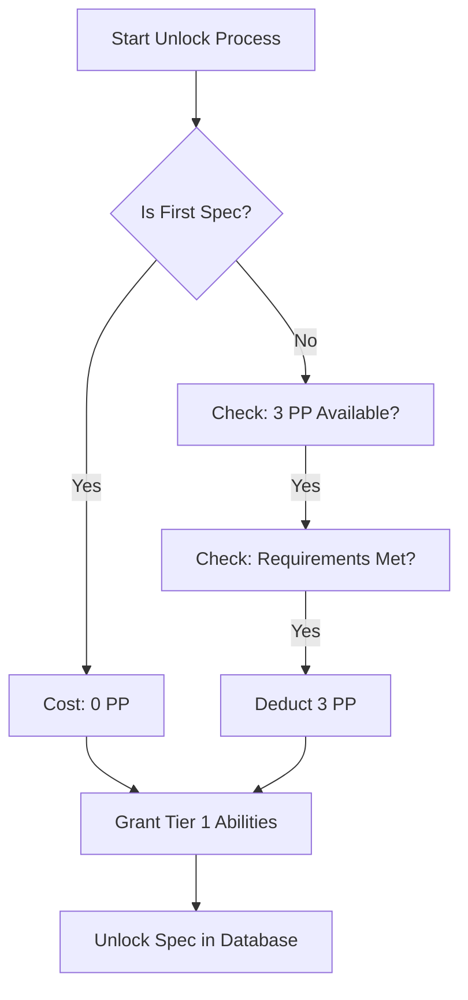

# Archetype & Specialization System

> *"Your blood defines your beginning. Your choices define your legend."*

---

## 1. Overview

### 1.1 Identity Table

| Property | Value |
|----------|-------|
| Spec ID | `SPEC-CORE-ARCHETYPES` |
| Category | Core System |
| Priority | Must-Have |
| Status | Proposed |

### 1.2 Core Philosophy

The Archetype & Specialization System provides players with distinct character identities at creation (Archetypes) and advanced build customization during gameplay (Specializations).

**Design Pillars:**
- **Distinct Archetype Identity**: Each archetype feels fundamentally different in combat, utilizing unique resource priorities and attribute distributions.
- **Specialization as Build Direction**: Specializations provide focused playstyle refinement. A Warrior can become a tank (Skjaldmaer) or a berserker (Berserkr).
- **Meaningful Choice Through Scarcity**: Unlocking specializations requires significant Progression Point (PP) investment, forcing players to choose between broad versatility (multiple specs) or deep mastery (completing trees).

---

## 2. Player Experience

### 2.1 How Players Interact

Players encounter this system in two distinct phases:

1.  **Creation (The Archetype)**: At character creation, the player selects one of four immutable Archetypes. This defines their starting attributes, resource pools, and first 3 abilities.
2.  **Progression (The Specialization)**:
    *   **At Creation**: The player selects their *first* Specialization for free, unlocking its Tier 1 abilities immediately.
    *   **During Gameplay**: Players spend PP to unlock *additional* specializations or advance within their current specialization tree.

### 2.2 Key Features

- **Archetype Selection**: Permanent choice of Warrior, Adept, Skirmisher, or Mystic.
- **Specialization Browsing**: Players can view all specializations available to their archetype, seeing requirements and themes.
- **Unlock Mechanics**: First specialization is free. Subsequent unlocks cost **3 PP**.
- **Tiered Progression**: Abilities within a specialization are organized into 4 Tiers, requiring cumulative PP investment to unlock.

---

## 3. Mechanics

### 3.1 Archetype System

Archetypes define the mathematical foundation of a character.

| Archetype | MIGHT | FINESSE | WITS | WILL | STURDINESS | Total | Playstyle |
|-----------|-------|---------|------|------|------------|-------|-----------|
| **Warrior** | 4 | 3 | 2 | 2 | 4 | 15 | High HP/Stamina, melee damage, tank |
| **Adept** | 3 | 3 | 3 | 2 | 3 | 14 | Balanced generalist, skill-based |
| **Skirmisher** | 3 | 4 | 3 | 2 | 3 | 15 | Agile, precision, hit-and-run |
| **Mystic** | 2 | 3 | 4 | 4 | 2 | 15 | High AP, Aetheric damage, fragile |

**Derived Stats:**
- **Max HP**: 50 + (STURDINESS × 10) + (Milestones × 10)
- **Max Stamina**: 20 + (MIGHT + FINESSE) × 5 + (Milestones × 5)
- **Max Aether Pool**: 20 + (WILL + WITS) × 5

### 3.2 Specialization Unlock Flow



**Requirements Check:**
To unlock a *subsequent* specialization, a character must meet:
1.  **Archetype Match**: Must match character's archetype.
2.  **Legend Requirement**: Legend ≥ MinLegend.
3.  **Corruption Requirement**: Corruption within [Min, Max] range.
4.  **Quest Requirement**: Completed specific quest (if applicable).

### 3.3 Specialization Ability Tree Structure

Specializations consist of 9 abilities across 4 tiers.

| Tier | Abilities | Cost (Each) | Prerequisite |
|------|-----------|-------------|--------------|
| **Tier 1** | 3 | 0 PP* | Unlocked Specialization (*Granted Free) |
| **Tier 2** | 3 | 4 PP | Tier 1 learned + 8 PP total in tree |
| **Tier 3** | 2 | 5 PP | Tier 2 learned + 16 PP total in tree |
| **Capstone** | 1 | 6 PP | Both Tier 3 learned + 24 PP total in tree |

*Note: Tier 1 abilities are granted automatically upon unlocking the specialization.*

---

## 4. Calculations

### 4.1 Unlock Requirements Formula

```
CanUnlock = (IsFirstSpec OR PP >= 3)
            AND (Legend >= MinLegend)
            AND (Corruption >= MinCorruption)
            AND (Corruption <= MaxCorruption)
            AND (RequiredQuestCompleted OR RequiredQuest == null)
```

### 4.2 Tree Progression Logic

```
PP_In_Tree = SUM(All_Learned_Abilities_In_Spec.PPCost) + UnlockCost(if paid)

Check for Tier 2: PP_In_Tree >= 8
Check for Tier 3: PP_In_Tree >= 16
Check for Capstone: PP_In_Tree >= 24
```

---

## 5. Integration Points

### 5.1 Dependencies

| System | Dependency Type |
|--------|-----------------|
| **Character Creation** | Archetype and First Specialization selected during creation flow. |
| **Saga System** | Uses PP for unlocks and ability purchases. Checks Legend for requirements. |
| **Trauma Economy** | Heretical specializations require/check Corruption levels. |

### 5.2 Triggered By

| Trigger | Source |
|---------|--------|
| `OnMilestoneReached` | Saga System (checks if new unlocks are available) |
| `OnCorruptionChanged` | Trauma System (may lock/unlock Heretical specs) |

---

## 6. UI Requirements

### 6.1 Specialization Browser

```
[ BERSERKR ] - Warrior Specialization
------------------------------------------------
Path: Heretical (Requires Corruption > 0)
Role: Burst DPS
------------------------------------------------
[LOCKED] Requirements:
  - Legend: 3 (You have 1)
  - PP: 3 (You have 0)
------------------------------------------------
"Your saga is written in blood..."
```

### 6.2 Feedback Messages

| Event | Message Template |
|-------|------------------|
| Unlock Success | "You have unlocked the [Name] specialization!" |
| Unlock Fail (PP) | "Not enough Progression Points (need 3, have [X])." |
| Unlock Fail (Arch) | "This specialization is for [Archetype], you are [YourArchetype]." |

---

## 7. Balance Data

### 7.1 Archetype Tuning

- **Warrior**: Highest effective HP (HP + Stamina mitigation). Vulnerable to mental trauma.
- **Mystic**: Glass cannon. Highest potential burst damage via Aether, but lowest survivability.
- **Skirmisher**: Mitigation through avoidance (Evasion). Spiky damage intake.
- **Adept**: Baseline. No weaknesses, no extreme strengths. Dependent on item/crafting utility.

### 7.2 PP Economy Pacing

- **Milestone 0**: Start with 1 Archetype + 1 Specialization (Tier 1).
- **Milestone 3**: 3 PP earned. Choice: Unlock 2nd Spec OR Save for Tier 2 abilities.
- **Milestone 12**: ~12 PP earned. Enough to reach Tier 3 in primary spec OR Tier 2 in two specs.

---

## 8. Archetype Reference

### 8.1 Warrior
*Melee tank and sustained damage dealer.*
- **Starting Abilities**: Strike, Defensive Stance, Warrior's Vigor (+10% HP).
- **Resources**: Stamina (Primary), HP (High).

### 8.2 Adept
*Balanced skill-based generalist.*
- **Starting Abilities**: Exploit Weakness, Scavenge, Resourceful (+Item Effect).
- **Resources**: Stamina (Balanced). Note: 14 Starting Attribute Points.

### 8.3 Skirmisher
*Agile, precision-based combatant.*
- **Starting Abilities**: Quick Strike, Evasive Stance, Fleet Footed (+Move).
- **Resources**: Stamina (High), HP (Medium).

### 8.4 Mystic
*Aether-wielding Weaver.*
- **Starting Abilities**: Aether Dart, Focus Aether, Aetheric Attunement (+AP Regen).
- **Resources**: Aether Pool (High), HP (Low).

---

## 9. Implementation

### 9.1 Service Interface

```csharp
public interface ISpecializationService
{
    // Queries
    IEnumerable<SpecializationData> GetAvailableSpecializations(ArchetypeID archetype);
    bool CanUnlock(PlayerCharacter pc, int specializationId);

    // Actions
    void UnlockSpecialization(PlayerCharacter pc, int specializationId);
    void LearnAbility(PlayerCharacter pc, int abilityId);
}
```

### 9.2 Data Model

```csharp
public class SpecializationData
{
    public int ID { get; set; }
    public string Name { get; set; }
    public int ArchetypeID { get; set; } // 1=Warrior, 2=Adept, 4=Skirmisher, 5=Mystic
    public UnlockRequirements Requirements { get; set; }
    public int PPCostToUnlock { get; set; } = 3;
}
```

---

## 10. Testing

### 10.1 Key Test Cases

- [ ] **Creation Flow**: Verify first specialization is free.
- **Archetype Match**: Verify Warrior cannot unlock Mystic specializations.
- **Resource Calc**: Verify HP/Stamina/AP recalculate correctly upon Archetype selection.
- **Tree Progression**: Verify Tier 2 cannot be learned without 8 PP invested in tree.

### 10.2 Known Issues

- **Legacy Conflict**: Some legacy data might reference "Scavenger" class. This should be treated as invalid/legacy and not a true Archetype.
- **Berserkr Spec Discrepancy**: The `Berserkr` specific documentation lists a 10 PP unlock cost. This system spec defines the standard (3 PP). Specific specializations may override the base cost, but standard creation flow assumes at least one is available for 0 PP (or standard cost).

---

## 11. Related Specifications

| Spec | Relationship |
|------|--------------|
| `SPEC-CORE-CHARACTER-CREATION` | Defines the initial selection flow. |
| `SPEC-CORE-SAGA` | Defines the PP economy used here. |
| `SPEC-COMBAT-RESOLUTION` | Archetype attributes drive combat dice pools. |
