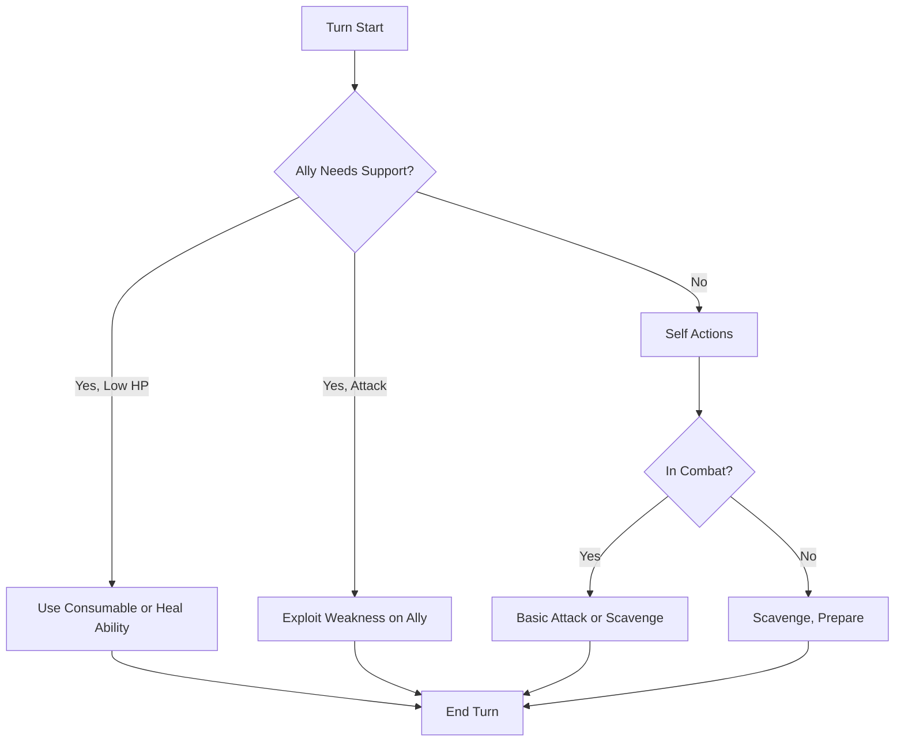

# Adept — Master of Mundane Arts

> *"While others wield swords or Aether, you wield knowledge. You see what others miss, find what others overlook, and turn scarcity into abundance."*

---

## Document Control

| Version | Date | Changes |
|---------|------|---------|
| 1.0 | 2025-12-07 | Initial specification |

---

## 1. Overview

### 1.1 Identity Table

| Property | Value |
|----------|-------|
| Spec ID | `SPEC-ARCHETYPE-ADEPT` |
| Archetype ID | 2 |
| Role | Skill Specialist / Support |
| Primary Resource | Stamina |
| Combat Style | Utility, analysis, resource optimization |

### 1.2 Core Fantasy

The Adept is the **master of mundane arts**—the character who thrives on skill, knowledge, and preparation rather than raw power. Adepts excel at:
- **Analyzing enemies** to find weaknesses
- **Finding resources** where others see nothing
- **Supporting allies** with tactical advantages
- **Maximizing consumables** and prepared items

### 1.3 Playstyle Summary

| Strength | Description |
|----------|-------------|
| Balanced Stats | No major weaknesses in attributes |
| Enhanced Consumables | +20% effectiveness from Resourceful |
| Utility Focus | Analysis, scavenging, support |
| Versatile Specializations | Healing, crafting, performance, analysis |

| Weakness | Description |
|----------|-------------|
| Lower Attribute Total | Only 14 points (vs. 15 for others) |
| No Standout Combat | Neither tank nor DPS |
| Lower WILL | 2 WILL means Stress vulnerability |
| Team-Dependent | Best in party, weaker solo |

---

## 2. Starting Attributes

### 2.1 Attribute Distribution

| Attribute | Value | Comparison |
|-----------|-------|------------|
| **MIGHT** | 3 | Average |
| **FINESSE** | 3 | Average |
| **WITS** | 3 | Average |
| **WILL** | 2 | Lowest |
| **STURDINESS** | 3 | Average |
| **Total** | 14 | **Below Standard** |

> [!IMPORTANT]
> Adept is the **only archetype with 14 attribute points** instead of 15. This is balanced by stronger passive abilities and specialization versatility.

### 2.2 Attribute Distribution Philosophy

- **All 3s (except WILL)**: Genuine generalist, no dump stat
- **WILL 2**: Slight Stress vulnerability balanced by non-combat focus
- **Balanced**: Can function in any role, excels in none

---

## 3. Starting Resources

### 3.1 Resource Pools at Creation

| Resource | Formula | Value |
|----------|---------|-------|
| **Max HP** | `50 + (STURDINESS × 10)` | **80** |
| **Max Stamina** | `20 + (MIGHT + FINESSE) × 5` | **50** |
| **Max AP** | `10` (minimal) | **10** |

### 3.2 Resource Philosophy

- **HP**: Average (80), adequate for mid-line positioning
- **Stamina**: Lower than martial archetypes (50 vs. 55)
- **AP**: Minimal; Adepts do not use Aetheric abilities

---

## 4. Starting Abilities

### 4.1 Exploit Weakness (Utility)

| Property | Value |
|----------|-------|
| Type | Utility |
| Cost | 5 Stamina |
| Effect | Grant +2 bonus dice to next attack (self or ally) |
| Range | Self or adjacent ally |
| Duration | Next attack |

**Description**: The Adept identifies a vulnerability in the enemy's defenses, granting tactical advantage.

**Mechanics**:
- **+2 Bonus Dice**: Add 2d10 to the next attack roll
- **Transferable**: Can grant to an ally instead of using yourself
- **Stacks**: Multiple uses on same target do stack (max +6 dice)

**Tactical Use**:
- Set up a powerful ally's attack
- Compensate for low-accuracy builds
- Critical hit fishing (more dice = more Triumph chances)

---

### 4.2 Scavenge (Utility)

| Property | Value |
|----------|-------|
| Type | Utility |
| Cost | 10 Stamina |
| Effect | Search area for consumable items |
| Range | Current room/area |
| Limit | Once per area |

**Description**: The Adept's trained eye spots resources others would miss.

**Mechanics**:
- **Roll WITS**: Determine quality of found items
- **Guaranteed Find**: Always finds something (quality varies)
- **One Per Area**: Cannot repeatedly scavenge same location

| WITS Roll | Result |
|-----------|--------|
| 0-1 successes | Basic consumable (bandage, ration) |
| 2-3 successes | Standard consumable (potion, tool) |
| 4+ successes | Quality consumable (advanced potion) |

---

### 4.3 Resourceful (Passive)

| Property | Value |
|----------|-------|
| Type | Passive |
| Cost | None |
| Effect | +20% effectiveness of consumable items |

**Description**: The Adept knows exactly how to apply resources for maximum effect.

**Examples**:
| Consumable | Base Effect | With Resourceful |
|------------|-------------|------------------|
| Health Potion | 2d10 healing | 2d10 + 4 healing |
| Stamina Tonic | 20 Stamina | 24 Stamina |
| Antidote | Remove poison | Remove poison + 10 HP |
| Bandage | 10 HP | 12 HP |

**Interaction with Scavenge**: Items found via Scavenge also benefit from Resourceful.

---

## 5. Available Specializations

### 5.1 Adept Specializations

| Specialization | Role | Path Type | Key Mechanic |
|----------------|------|-----------|--------------|
| **Bone-Setter** | Healer / Medic | Coherent | Field Medicine |
| **Jötun-Reader** | Analyst / Lore | Coherent | System Diagnosis |
| **Skald** | Bard / Buffer | Coherent | Performance, Coherence |
| **Scrap-Tinker** | Crafter / Gadgeteer | Coherent | Brewing, Gadgets |
| **Einbúi** | Solo Survivor | Coherent | Self-Sufficiency |

### 5.2 Specialization Synergies

| Specialization | Synergy with Base Adept |
|----------------|-------------------------|
| **Bone-Setter** | Resourceful enhances healing items; Exploit Weakness sets up heals |
| **Jötun-Reader** | Exploit Weakness + analysis synergy; WITS 3 for lore |
| **Skald** | Coherence resource; support focus maintained |
| **Scrap-Tinker** | Resourceful enhances crafted items; Scavenge provides materials |
| **Einbúi** | Scavenge essential for solo play; Resourceful maximizes scarce resources |

---

## 6. Combat Role

### 6.1 Positioning

```
Ideal Formation:
   [Enemy] [Enemy] [Enemy]
              ↑
       [Warrior]    ← Frontline
   [ADEPT] ← [Skirmisher] ← Mid-line
       [Mystic]     ← Backline
```

**Adepts belong in the mid-line**, close enough to assist but not exposed.

### 6.2 Combat Loop



---

## 7. Progression Path

### 7.1 Attribute Priorities

| Priority | Attribute | Reason |
|----------|-----------|--------|
| 1st | WITS | Scavenge rolls, specialization synergy |
| 2nd | WILL | Stress vulnerability mitigation |
| 3rd | STURDINESS | Survivability |
| 4th | FINESSE | Accuracy, Stamina |
| 5th | MIGHT | Only for combat-focused builds |

### 7.2 Specialization Recommendation

| Player Type | Recommended Specialization |
|-------------|---------------------------|
| Support Role | Bone-Setter, Skald |
| Solo Player | Einbúi |
| Crafter Focus | Scrap-Tinker |
| Lore/Puzzle Focus | Jötun-Reader |

---

## 8. The "14 Points" Trade-off

### 8.1 Why Adept Has Fewer Points

The Adept's reduced attribute total is balanced by:

| Compensation | Effect |
|--------------|--------|
| **Resourceful Passive** | +20% on all consumables (equivalent to ~1 attribute point in value) |
| **Scavenge Ability** | Free resources that other archetypes must buy/find |
| **Versatile Specializations** | More non-combat options than any archetype |
| **No Bad Attributes** | No dump stat except WILL |

### 8.2 Solo vs. Party Balance

| Context | Adept Performance |
|---------|-------------------|
| **In Party** | Strong support, force multiplier |
| **Solo** | Viable with Einbúi, relies on consumables |
| **Dungeons** | Scavenge excels in resource-scarce environments |
| **Boss Fights** | Exploit Weakness + ally burst = powerful |

---

## 9. Technical Implementation

### 9.1 AdeptArchetype Class

```csharp
public class AdeptArchetype : Archetype
{
    public override string Name => "Adept";
    public override int ArchetypeId => 2;
    public override string Tagline => "Master of mundane arts, balanced survivor";
    public override PrimaryResource PrimaryResource => PrimaryResource.Stamina;
    
    public override Attributes GetBaseAttributes() => new Attributes
    {
        Might = 3,
        Finesse = 3,
        Wits = 3,
        Will = 2,
        Sturdiness = 3
    };
    
    public override List<Ability> GetStartingAbilities() => new()
    {
        new ExploitWeaknessAbility(),
        new ScavengeAbility(),
        new ResourcefulPassive()
    };
}
```

---

## 10. Phased Implementation Guide

### Phase 1: Class Logic
- [ ] **Class**: Create `AdeptArchetype`.
- [ ] **Stats**: Implement unique 14-point distribution logic.

### Phase 2: Abilities
- [ ] **ExploitWeakness**: Implement buff (+2 dice) application logic.
- [ ] **Scavenge**: Implement Loot Table roll and Area limitation logic.
- [ ] **Resourceful**: Implement `IConsumableModifier` interface for +20% effect.

### Phase 3: Systems Integration
- [ ] **ItemSystem**: Ensure consumables check for Modifier interfaces before use.
- [ ] **Exploration**: Hook Scavenge into Room context.

### Phase 4: UI & Feedback
- [ ] **Scavenge**: Button enabled only once per room.
- [ ] **Tooltip**: Show "Resourceful Bonus" on item tooltips.

---

## 11. Testing Requirements

### 11.1 Unit Tests
- [ ] **Attributes**: Total = 14.
- [ ] **HP/Stamina**: 80/50.
- [ ] **Resourceful**: Potion (10 HP) -> Heals 12 HP.
- [ ] **Exploit**: Adds `BuffID` to target.
- [ ] **Scavenge**: Returns item from Loot Table based on WITS roll.

### 11.2 Integration Tests
- [ ] **Limit**: Scavenge -> Move Room -> Scavenge (Allowed). Scavenge -> Scavenge (Blocked).
- [ ] **Combat**: Exploit Weakness -> Next Ally Attack rolls 2 extra dice.

### 11.3 Manual QA
- [ ] **Gameplay**: Use Potion with Adept vs Warrior, verify healing difference.
- [ ] **Log**: "Found Bandage (Standard)" message appears.

---

## 12. Logging Requirements

**Reference:** [logging.md](../../../00-project/logging.md)

### 12.1 Log Events

| Event | Level | Message Template | Properties |
|-------|-------|------------------|------------|
| Scavenge | Info | "{Character} scavenged {Item} (Quality: {Quality})." | `Character`, `Item`, `Quality` |
| Exploit | Info | "{Character} exploited weakness on {Target}." | `Character`, `Target` |
| Resourceful | Debug | "Resourceful increased {Item} effect by {Amount}." | `Item`, `Amount` |

---

## 13. Related Specifications

| Spec ID | Relationship |
|---------|--------------|
| `SPEC-CORE-ARCHETYPES` | Parent overview |
| `SPEC-CORE-ATTR-WITS` | Key attribute |
| `SPEC-SPEC-BONE-SETTER` | Specialization |
| `SPEC-SPEC-SKALD` | Specialization |
| `SPEC-SPEC-EINBUI` | Specialization |

---

## 14. Changelog

| Version | Date | Changes |
|---------|------|---------|
| 1.0 | 2025-12-07 | Initial specification |
| 1.1 | 2025-12-13 | Standardized with Phased Implementation, Testing, and Logging |
