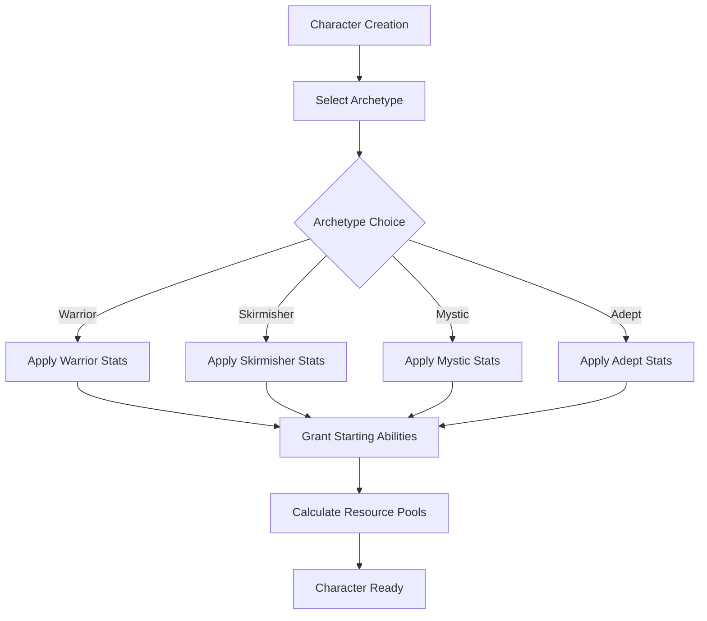

# Archetypes — Character Foundation System

> *"Your Archetype is the foundation of your saga—the core identity from which all else grows. Choose wisely, for this choice is permanent."*

---

## Document Control

| Version | Date | Changes |
|---------|------|---------|
| 1.0 | 2025-12-07 | Initial specification |

---

## 1. Overview

### 1.1 Identity Table

| Property | Value |
|----------|-------|
| Spec ID | `SPEC-CORE-ARCHETYPES` |
| Category | Core System |
| Selection | Character Creation (permanent) |
| Count | **Exactly 4 archetypes** |

### 1.2 The Four Archetypes

| Archetype | Role | Primary Resource | Spec Link |
|-----------|------|------------------|-----------|
| **Warrior** | Melee Tank / Sustained Damage | Stamina | [warrior.md](./warrior.md) |
| **Skirmisher** | Agile DPS / Mobility | Stamina | [skirmisher.md](./skirmisher.md) |
| **Mystic** | Aether Caster / Control | Aether Pool | [mystic.md](./mystic.md) |
| **Adept** | Skill Specialist / Support | Stamina | [adept.md](./adept.md) |

> [!IMPORTANT]
> There are **exactly four archetypes**. Other class-like names (Ranger, Skald, Bone-Setter) are **Specializations**, not Archetypes.

### 1.3 Design Philosophy

**Design Pillars:**

- **Distinct Identity**: Each archetype feels fundamentally different in combat
- **Permanent Choice**: Archetype cannot be changed after character creation
- **Specialization Foundation**: Archetypes unlock different specialization trees
- **Attribute Distribution**: Archetypes pre-allocate attributes to encode playstyle

---

## 2. Archetype Selection

### 2.1 Character Creation Flow



### 2.2 Selection UI

```
╔═══════════════════════════════════════════════════════════╗
║  CHOOSE YOUR ARCHETYPE                                    ║
╠═══════════════════════════════════════════════════════════╣
║                                                           ║
║  [1] WARRIOR                                              ║
║      "The unyielding bulwark against chaos"              ║
║      ⚔ MIGHT 4 | STURDINESS 4 | 99 HP                    ║
║                                                           ║
║  [2] SKIRMISHER                                           ║
║      "Swift as shadow, deadly as precision"              ║
║      ⚔ FINESSE 4 | WITS 3 | +1 Movement                  ║
║                                                           ║
║  [3] MYSTIC                                               ║
║      "Wielder of tainted Aether, shaper of reality"      ║
║      ⚔ WILL 4 | WITS 4 | 70 Aether Pool                  ║
║                                                           ║
║  [4] ADEPT                                                ║
║      "Master of mundane arts, balanced survivor"         ║
║      ⚔ Balanced stats | +20% consumable effect           ║
║                                                           ║
╚═══════════════════════════════════════════════════════════╝
```

---

## 3. Starting Attributes

### 3.1 Attribute Distribution Table

| Archetype | MIGHT | FINESSE | WITS | WILL | STURDINESS | Total |
|-----------|-------|---------|------|------|------------|-------|
| **Warrior** | 4 | 3 | 2 | 2 | 4 | 15 |
| **Skirmisher** | 3 | 4 | 3 | 2 | 3 | 15 |
| **Mystic** | 2 | 3 | 4 | 4 | 2 | 15 |
| **Adept** | 3 | 3 | 3 | 2 | 3 | 14* |

> [!NOTE]
> *Adept has only 14 attribute points, balanced by stronger passive abilities and consumable bonuses.

### 3.2 Derived Statistics at Creation

| Archetype | Max HP | Max Stamina | Max AP | Notes |
|-----------|--------|-------------|--------|-------|
| **Warrior** | 99* | 55 | 10 | *Includes Vigor bonus |
| **Skirmisher** | 80 | 55 | 10 | Same Stamina as Warrior |
| **Mystic** | 70 | 45 | 70 | Lowest HP, highest AP |
| **Adept** | 80 | 50 | 10 | Balanced across the board |

**Formulas:**
```
Max HP = 50 + (STURDINESS × 10) + Passive Bonuses
Max Stamina = 20 + (MIGHT + FINESSE) × 5
Max AP = 20 + (WILL + WITS) × 5 + Passive Bonuses (Mystic only has base AP)
```

---

## 4. Starting Abilities

### 4.1 Ability Summary

| Archetype | Ability 1 | Ability 2 | Passive |
|-----------|-----------|-----------|---------|
| **Warrior** | Strike | Defensive Stance | Warrior's Vigor |
| **Skirmisher** | Quick Strike | Evasive Stance | Fleet Footed |
| **Mystic** | Aether Dart | Focus Aether | Aetheric Attunement |
| **Adept** | Exploit Weakness | Scavenge | Resourceful |

### 4.2 Starting Ability Details

#### Warrior
| Ability | Type | Cost | Effect |
|---------|------|------|--------|
| Strike | Attack | 10 Stamina | 2d6 + MIGHT damage |
| Defensive Stance | Mode | 15 Stamina | +3 Soak, −25% damage dealt |
| Warrior's Vigor | Passive | — | +10% Maximum HP |

#### Skirmisher
| Ability | Type | Cost | Effect |
|---------|------|------|--------|
| Quick Strike | Attack | 8 Stamina | 2d6 + FINESSE damage |
| Evasive Stance | Mode | 12 Stamina | +3 Evasion, −10% damage dealt |
| Fleet Footed | Passive | — | +1 Movement, +1 Initiative |

#### Mystic
| Ability | Type | Cost | Effect |
|---------|------|------|--------|
| Aether Dart | Attack | 5 AP | 2d6 + WILL Aetheric damage |
| Focus Aether | Channel | 10 Stamina | Restore 15 AP |
| Aetheric Attunement | Passive | — | +10 Max AP, +1 AP regen/turn |

#### Adept
| Ability | Type | Cost | Effect |
|---------|------|------|--------|
| Exploit Weakness | Utility | 5 Stamina | +2 dice to next attack |
| Scavenge | Utility | 10 Stamina | Find consumable in area |
| Resourceful | Passive | — | +20% consumable effectiveness |

---

## 5. Specialization Access

### 5.1 Specializations by Archetype

| Archetype | Specializations | Count |
|-----------|-----------------|-------|
| **Warrior** | Berserkr, Iron-Bane, Skjaldmaer, Skar-Horde Aspirant, Atgeir-Wielder, Gorge-Maw Ascetic | 6 |
| **Skirmisher** | Veiðimaðr, Myrk-gengr, Strandhögg, Hlekkr-master | 4 |
| **Mystic** | Seiðkona, Echo-Caller, + more planned | 2+ |
| **Adept** | Bone-Setter, Jötun-Reader, Skald, Scrap-Tinker, Einbúi | 5 |

### 5.2 Unlock Requirements

```
Base Unlock Cost: 3 PP per specialization
Additional Requirements: Legend, Corruption range, Quest completion (varies)
```

---

## 6. Technical Implementation

### 6.1 Archetype Base Class

```csharp
public abstract class Archetype
{
    public abstract string Name { get; }
    public abstract int ArchetypeId { get; }
    public abstract string Tagline { get; }
    public abstract PrimaryResource PrimaryResource { get; }
    
    public abstract Attributes GetBaseAttributes();
    public abstract List<Ability> GetStartingAbilities();
    public abstract int CalculateMaxHp(Character character);
    public abstract int CalculateMaxStamina(Character character);
    public abstract int CalculateMaxAp(Character character);
}

public enum PrimaryResource { Stamina, AetherPool }
```

### 6.2 Database Schema

```sql
CREATE TABLE archetypes (
    id SERIAL PRIMARY KEY,
    name VARCHAR(50) NOT NULL UNIQUE,
    tagline TEXT NOT NULL,
    primary_resource VARCHAR(20) NOT NULL,
    might_base INT NOT NULL,
    finesse_base INT NOT NULL,
    wits_base INT NOT NULL,
    will_base INT NOT NULL,
    sturdiness_base INT NOT NULL
);

INSERT INTO archetypes VALUES
(1, 'Warrior', 'The unyielding bulwark against chaos', 'Stamina', 4, 3, 2, 2, 4),
(2, 'Adept', 'Master of mundane arts, balanced survivor', 'Stamina', 3, 3, 3, 2, 3),
(3, 'Skirmisher', 'Swift as shadow, deadly as precision', 'Stamina', 3, 4, 3, 2, 3),
(4, 'Mystic', 'Wielder of tainted Aether, shaper of reality', 'AetherPool', 2, 3, 4, 4, 2);
```

---

## 7. Phased Implementation Guide

### Phase 1: Data Layer
- [ ] **Schema**: Create `archetypes` table and seed data.
- [ ] **Model**: Create `Archetype` entity and DTOs.

### Phase 2: Factory Logic
- [ ] **Factory**: Implement `CharacterFactory` with Archetype selection.
- [ ] **Attributes**: Implement base attribute application logic.

### Phase 3: Resource Calculation
- [ ] **Formulas**: Implement derived stat calculations (HP, Stamina, AP).
- [ ] **Resources**: Implement `IResourceService` using Archetype formulas.

### Phase 4: UI & Feedback
- [ ] **Selection Screen**: Implement Character Creation UI.
- [ ] **Preview**: Show calculated stats when hovering Archetype.

---

## 8. Testing Requirements

### 8.1 Unit Tests
- [ ] **Detailed Stats**: Warrior selection -> MIGHT 4, STURDINESS 4.
- [ ] **Resource Calc**: Mystic selection -> AP Pool initialized to 70.
- [ ] **Max HP**: Warrior HP -> 50 + (STURDINESS*10) + Vigor (10%).

### 8.2 Integration Tests
- [ ] **Persistence**: Save Character -> Archetype persisted correctly.
- [ ] **Load**: Load Character -> Correct derived stats restored.

### 8.3 Manual QA
- [ ] **Creation UI**: Select each archetype, verify description and stats update.
- [ ] **Gameplay**: Start game, verify starting abilities are present.

---

## 9. Logging Requirements

**Reference:** [logging.md](../../../00-project/logging.md)

### 9.1 Log Events

| Event | Level | Message Template | Properties |
|-------|-------|------------------|------------|
| Character Created | Info | "Created Character {Name} with Archetype {Archetype}." | `Name`, `Archetype` |
| Stat Calc | Debug | "Calculated MaxHP: {Value} for {Archetype}." | `Value`, `Archetype` |

---

## 10. Related Specifications

| Spec ID | Relationship |
|---------|--------------|
| `SPEC-CORE-ATTRIBUTES` | Attribute distributions |
| `SPEC-CORE-RESOURCES` | HP, Stamina, AP calculations |
| `SPEC-CORE-SAGA` | Specialization unlock costs (PP) |
| `SPEC-ARCHETYPE-WARRIOR` | Warrior details |
| `SPEC-ARCHETYPE-SKIRMISHER` | Skirmisher details |
| `SPEC-ARCHETYPE-MYSTIC` | Mystic details |
| `SPEC-ARCHETYPE-ADEPT` | Adept details |

---

## 11. Changelog

| Version | Date | Changes |
|---------|------|---------|
| 1.0 | 2025-12-07 | Initial specification |
| 1.1 | 2025-12-13 | Standardized with Phased Implementation, Testing, and Logging |
