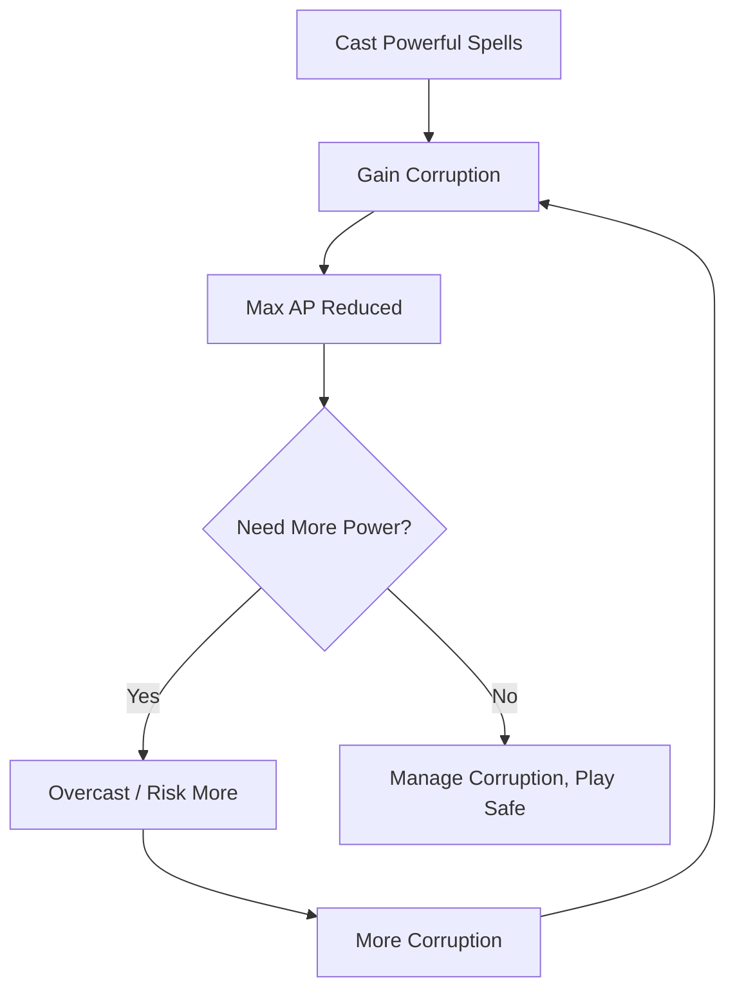
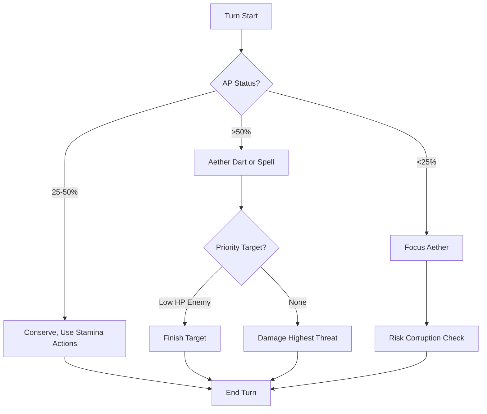

# Mystic — Wielder of Tainted Aether

> *"You touch the wound in reality, draw power from the chaos, and shape it to your will. Every spell risks corruption—but the power you command is unmatched."*

---

## Document Control

| Version | Date | Changes |
|---------|------|---------|
| 1.0 | 2025-12-07 | Initial specification |

---

## 1. Overview

### 1.1 Identity Table

| Property | Value |
|----------|-------|
| Spec ID | `SPEC-ARCHETYPE-MYSTIC` |
| Archetype ID | 4 |
| Role | Aether Caster / Reality Shaper |
| Primary Resource | **Aether Pool (AP)** |
| Combat Style | Ranged, control, Aetheric manipulation |

### 1.2 Core Fantasy

The Mystic is the **wielder of tainted power**—the only archetype that directly manipulates the corrupted Aether permeating Aethelgard. Mystics excel at:
- **Ranged Aetheric attacks** that bypass physical armor
- **Reality manipulation** through spells and effects
- **Utility and control** that reshape battlefield conditions
- **Accepting corruption risk** in exchange for unmatched power

### 1.3 Playstyle Summary

| Strength | Description |
|----------|-------------|
| Highest WILL/WITS | 4 in both mental attributes |
| Massive AP Pool | 70 base AP (with Attunement) |
| Aetheric Damage | Bypasses physical armor |
| Best Stress Resistance | WILL 4 for Resolve Checks |

| Weakness | Description |
|----------|-------------|
| Lowest HP | 70 HP (most fragile) |
| Lowest Stamina | 45 Stamina |
| Corruption Risk | Spells can generate Corruption |
| AP Scarcity | Limited spell casts per encounter |

---

## 2. Starting Attributes

### 2.1 Attribute Distribution

| Attribute | Value | Comparison |
|-----------|-------|------------|
| **MIGHT** | 2 | Lowest |
| **FINESSE** | 3 | Average |
| **WITS** | 4 | Highest (tied with WILL) |
| **WILL** | 4 | Highest (tied with WITS) |
| **STURDINESS** | 2 | Lowest |
| **Total** | 15 | Standard |

### 2.2 Attribute Distribution Philosophy

- **WILL 4**: Primary spellcasting stat, Stress resistance
- **WITS 4**: Puzzle solving, lore, analysis
- **FINESSE 3**: Adequate accuracy
- **MIGHT/STURDINESS 2**: Dump stats; Mystics avoid physical confrontation

---

## 3. Starting Resources

### 3.1 Resource Pools at Creation

| Resource | Formula | Value |
|----------|---------|-------|
| **Max HP** | `50 + (STURDINESS × 10)` | **70** |
| **Max Stamina** | `20 + (MIGHT + FINESSE) × 5` | **45** |
| **Max AP** | `20 + (WILL + WITS) × 5 + 10 (Attunement)` | **70** |

### 3.2 Resource Philosophy

- **HP**: Lowest of all archetypes; Mystics must stay out of melee
- **Stamina**: Lowest; used only for movement/Focus Aether
- **AP**: Highest and primary resource; all spells cost AP

---

## 4. Starting Abilities

### 4.1 Aether Dart (Basic Attack)

| Property | Value |
|----------|-------|
| Type | Attack |
| Cost | 5 AP |
| Damage | 2d6 + WILL |
| Range | Ranged (5) |
| Damage Type | Aetheric |

**Description**: A bolt of condensed Aether hurled at an enemy.

**Key Difference from Physical Attacks**:
- **Ranged**: Can attack from 5 tiles away
- **Aetheric Damage**: Bypasses physical armor (Soak)
- **Uses AP**: Not Stamina

**Scaling**:
- At WILL 4: `2d6 + 4` = 6-16 damage (avg 11)
- At WILL 6: `2d6 + 6` = 8-18 damage (avg 13)

---

### 4.2 Focus Aether (Channel)

| Property | Value |
|----------|-------|
| Type | Channel |
| Cost | 10 Stamina |
| Effect | Restore 15 AP |
| Action | Standard Action |
| Risk | See below |

**Description**: The Mystic centers their mind and draws additional Aether into their pool.

**Corruption Risk**:
```
On Focus Aether use: Roll 1d10
If result = 1: Gain 5 Corruption
Otherwise: No corruption
```

**Tactical Use**:
- Use when AP depleted mid-combat
- Costs a full action (no attack that turn)
- ~10% chance of Corruption per use

---

### 4.3 Aetheric Attunement (Passive)

| Property | Value |
|----------|-------|
| Type | Passive |
| Cost | None |
| Effect | +10 Maximum AP, +1 AP regeneration per turn |

**Description**: The Mystic's natural affinity for Aether grants expanded reserves and natural regeneration.

**Breakdown**:
- **+10 Max AP**: Pool increases from 60 to 70
- **+1 AP/turn**: Slowly regenerates in combat (but not enough to sustain)

**Economy Impact**:
- 7 extra Aether Dart casts per long rest
- Sustained fights allow 1-2 more casts from regen

---

## 5. Available Specializations

### 5.1 Mystic Specializations

| Specialization | Role | Path Type | Key Mechanic |
|----------------|------|-----------|--------------|
| **Seiðkona** (Seer) | Divination / Support | Coherent | Fate Manipulation |
| **Echo-Caller** | Sound / Debuff | Coherent | Aetheric Resonance |
| *More planned* | — | — | — |

> [!NOTE]
> Mystic has fewer specializations than other archetypes. Each is designed to be more impactful.

### 5.2 Specialization Synergies

| Specialization | Synergy with Base Mystic |
|----------------|--------------------------|
| **Seiðkona** | WITS 4 aids divination; WILL 4 for Trauma resistance from forbidden knowledge |
| **Echo-Caller** | AP pool powers sound abilities; ranged focus maintained |

---

## 6. Corruption Integration

### 6.1 The Mystic's Burden

Mystics are the **primary Corruption accumulators** in the game:

| Source | Corruption Risk |
|--------|-----------------|
| Focus Aether | 10% chance of +5 |
| Powerful spells | 1-5 per cast |
| Forbidden spells | 5-15 per cast |
| Overcasting | 10+ (emergency) |

### 6.2 Corruption → AP Penalty

```
Max AP Penalty = −5% per 10 Corruption
```

| Corruption | Penalty | At 70 Base AP |
|------------|---------|---------------|
| 0-9 | 0% | 70 |
| 20-29 | 10% | 63 |
| 40-49 | 20% | 56 |
| 60+ | 30%+ | 49 or less |

> [!WARNING]
> High Corruption Mystics have significantly reduced spell capacity, creating the **death spiral**.

### 6.3 The Mystic Death Spiral



---

## 7. Combat Role

### 7.1 Positioning

```
Ideal Formation:
   [Enemy] [Enemy] [Enemy]
              ↑
       [Warrior]    ← Frontline
       [Skirmisher] [Adept]
       [MYSTIC]     ← Backline (5 range)
```

**Mystics belong at the back**, maximizing their range advantage.

### 7.2 Combat Loop



---

## 8. Progression Path

### 8.1 Attribute Priorities

| Priority | Attribute | Reason |
|----------|-----------|--------|
| 1st | WILL | More AP, spell power, Stress resistance |
| 2nd | WITS | AP pool, puzzle/lore |
| 3rd | STURDINESS | Survivability (70 HP is very low) |
| 4th | FINESSE | Accuracy, some evasion |
| 5th | MIGHT | Only for hybrid builds |

### 8.2 Corruption Budget

Experienced Mystic players plan their **Corruption budget** for a campaign:

```
Total Corruption Available: 100 (before Terminal Error)
Threshold Penalties: 25, 50, 75, 100
Recommended Budget: ~40-50 Corruption by campaign end
```

---

## 9. Technical Implementation

### 9.1 Mystic Archetype Class

```csharp
public class MysticArchetype : Archetype
{
    public override string Name => "Mystic";
    public override int ArchetypeId => 4;
    public override string Tagline => "Wielder of tainted Aether, shaper of reality";
    public override PrimaryResource PrimaryResource => PrimaryResource.AetherPool;
    
    public override Attributes GetBaseAttributes() => new Attributes
    {
        Might = 2,
        Finesse = 3,
        Wits = 4,
        Will = 4,
        Sturdiness = 2
    };
    
    public override List<Ability> GetStartingAbilities() => new()
    {
        new AetherDartAbility(),
        new FocusAetherAbility(),
        new AethericAttunementPassive()
    };
    
    public override int CalculateMaxAp(Character character)
    {
        int baseAp = 20 + (character.Attributes.Will + character.Attributes.Wits) * 5;
        int attunementBonus = 10;
        int subtotal = baseAp + attunementBonus;
        
        // Apply corruption penalty
        float corruptionMult = 1.0f - (character.Corruption / 10 * 0.05f);
        return (int)(subtotal * corruptionMult);
    }
}
```

---

## 10. Phased Implementation Guide

### Phase 1: Class Logic
- [ ] **Class**: Create `MysticArchetype` inheriting base.
- [ ] **Stats**: Implement Attribute and Unique Resource (Aether) overrides.

### Phase 2: Abilities
- [ ] **Dart**: Implement AP-based ranged attack.
- [ ] **Focus**: Implement standard action resource recovery with Corruption risk.
- [ ] **Attunement**: Implement Passive AP modifiers.

### Phase 3: Corruption Integration
- [ ] **Calculations**: Implement `CalculateMaxAp` with Corruption penalty.
- [ ] **DeathSpiral**: Verify low AP at high Corruption.

### Phase 4: Visuals
- [ ] **AP Bar**: Unique purple Aether UI bar.
- [ ] **Effects**: Particle effects for Aether Dart.

---

## 11. Testing Requirements

### 11.1 Unit Tests
- [ ] **Attributes**: WILL=4, WITS=4, Low HP.
- [ ] **AP Calc**: Base + Attunement = 70.
- [ ] **Corruption**: 20 Corruption -> 10% AP Penalty -> Max AP 63.
- [ ] **Dart**: Costs 5 AP, deals Aetheric damage.
- [ ] **Focus**: Restores 15 AP. Risk roll can trigger Corruption gain.

### 11.2 Integration Tests
- [ ] **Cast Loop**: Use AP -> Focus Aether -> Use AP (verify economy).
- [ ] **Regen**: Turn End -> +1 AP regen.

### 11.3 Manual QA
- [ ] **UI**: Focus Aether button shows risk tooltip.
- [ ] **Gameplay**: High Corruption reduces max AP bar length visually.

---

## 12. Logging Requirements

**Reference:** [logging.md](../../../00-project/logging.md)

### 12.1 Log Events

| Event | Level | Message Template | Properties |
|-------|-------|------------------|------------|
| Cast | Info | "{Character} casts {Spell}." | `Character`, `Spell` |
| Focus | Info | "{Character} channels to restore {Amount} AP." | `Character`, `Amount` |
| Corruption | Warning | "Aetheric feedback! {Character} gains {Amount} Corruption." | `Character`, `Amount` |

---

## 13. Related Specifications

| Spec ID | Relationship |
|---------|--------------|
| `SPEC-CORE-ARCHETYPES` | Parent overview |
| `SPEC-CORE-RES-AETHER` | Primary resource |
| `SPEC-CORE-TRAUMA` | Corruption integration |
| `SPEC-CORE-ATTR-WILL` | Primary attribute |
| `SPEC-SPEC-SEIDKONA` | Specialization |

---

## 14. Changelog

| Version | Date | Changes |
|---------|------|---------|
| 1.0 | 2025-12-07 | Initial specification |
| 1.1 | 2025-12-13 | Standardized with Phased Implementation, Testing, and Logging |
