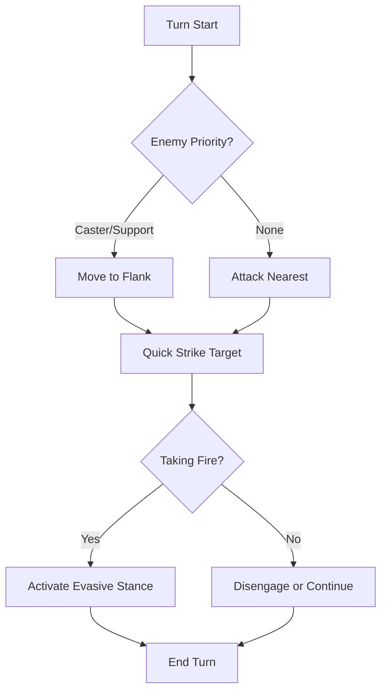

# Skirmisher — Swift as Shadow

> *"You are the wind through the ruins, the blade in the dark. Where Warriors endure and Mystics command, you strike and vanish before the enemy can react."*

---

## Document Control

| Version | Date | Changes |
|---------|------|---------|
| 1.0 | 2025-12-07 | Initial specification |

---

## 1. Overview

### 1.1 Identity Table

| Property | Value |
|----------|-------|
| Spec ID | `SPEC-ARCHETYPE-SKIRMISHER` |
| Archetype ID | 3 |
| Role | Agile DPS / Mobility Specialist |
| Primary Resource | Stamina |
| Combat Style | Hit-and-run, precision strikes, positioning |

### 1.2 Core Fantasy

The Skirmisher is the **agile shadow**—the character who controls the battlefield through movement and precision. Skirmishers excel at:
- **Striking vulnerable targets** with precision attacks
- **Evading damage** rather than absorbing it
- **Repositioning** to exploit tactical advantages
- **Finishing wounded enemies** before they can recover

### 1.3 Playstyle Summary

| Strength | Description |
|----------|-------------|
| Highest FINESSE | 4 FINESSE for accuracy and evasion |
| Mobility | +1 Movement, +1 Initiative from Fleet Footed |
| Efficient Attacks | Quick Strike costs only 8 Stamina |
| Evasion Focus | Evasive Stance for dodging |

| Weakness | Description |
|----------|-------------|
| Lower HP | 80 HP (less than Warrior) |
| Low WILL | 2 WILL means Stress vulnerability |
| Glass Cannon | Must avoid hits, not take them |
| Positioning Dependent | Requires tactical play to maximize |

---

## 2. Starting Attributes

### 2.1 Attribute Distribution

| Attribute | Value | Comparison |
|-----------|-------|------------|
| **MIGHT** | 3 | Average |
| **FINESSE** | 4 | Highest |
| **WITS** | 3 | Average |
| **WILL** | 2 | Lowest |
| **STURDINESS** | 3 | Average |
| **Total** | 15 | Standard |

### 2.2 Attribute Distribution Philosophy

- **FINESSE 4**: Precision, evasion, and accuracy
- **WITS 3**: Situational awareness, puzzle competence
- **MIGHT/STURDINESS 3**: Adequate physical capability
- **WILL 2**: Dump stat; Skirmishers avoid mental confrontation

---

## 3. Starting Resources

### 3.1 Resource Pools at Creation

| Resource | Formula | Value |
|----------|---------|-------|
| **Max HP** | `50 + (STURDINESS × 10)` | **80** |
| **Max Stamina** | `20 + (MIGHT + FINESSE) × 5` | **55** |
| **Max AP** | `10` (minimal) | **10** |

### 3.2 Resource Philosophy

- **HP**: Average; must be protected through evasion
- **Stamina**: Same as Warrior (55); high mobility costs Stamina
- **AP**: Minimal; Skirmishers do not use Aetheric abilities

---

## 4. Starting Abilities

### 4.1 Quick Strike (Basic Attack)

| Property | Value |
|----------|-------|
| Type | Attack |
| Cost | 8 Stamina |
| Damage | 2d6 + FINESSE |
| Range | Melee (1) |
| Target | Single |

**Description**: A rapid, precise strike that prioritizes speed over raw power.

**Comparison to Warrior's Strike**:
| Aspect | Quick Strike | Strike |
|--------|--------------|--------|
| Cost | 8 Stamina | 10 Stamina |
| Damage | 2d6 + FINESSE (4) | 2d6 + MIGHT (4) |
| Uses | ~6.8/full Stamina | ~5.5/full Stamina |

**Net**: Same damage per hit, but more attacks per Stamina pool.

---

### 4.2 Evasive Stance (Mode)

| Property | Value |
|----------|-------|
| Type | Mode (Toggle) |
| Cost | 12 Stamina (activation) |
| Duration | Until deactivated or combat ends |
| Effect | +3 Evasion, −10% damage dealt |

**Description**: The Skirmisher adopts a fluid, defensive posture, becoming harder to hit.

**Mechanics**:
- **+3 Evasion**: Increases Defense by 3 (DC to hit increases)
- **−10% Damage**: Slightly reduced offensive output
- **Toggle**: Free action to switch on/off

**Comparison to Defensive Stance**:
| Aspect | Evasive Stance | Defensive Stance |
|--------|----------------|------------------|
| Defense Type | Evasion (avoid hit) | Soak (reduce damage) |
| Damage Penalty | −10% | −25% |
| Stamina Cost | 12 | 15 |
| Best For | Dodging | Tanking |

---

### 4.3 Fleet Footed (Passive)

| Property | Value |
|----------|-------|
| Type | Passive |
| Cost | None |
| Effect | +1 Movement Range, +1 Initiative |

**Description**: The Skirmisher's natural agility grants superior mobility and reaction speed.

**Breakdown**:
- **+1 Movement**: Can move one additional tile per turn
- **+1 Initiative**: Acts earlier in turn order

**Tactical Value**: Allows repositioning to flanks, escape from danger, or reaching priority targets.

---

## 5. Available Specializations

### 5.1 Skirmisher Specializations

| Specialization | Role | Path Type | Key Mechanic |
|----------------|------|-----------|--------------|
| **Veiðimaðr** (Hunter) | Tracker / Precision | Coherent | Prey Marking |
| **Myrk-gengr** (Shadow-Walker) | Stealth / Ambush | Coherent | Invisibility |
| **Strandhögg** (Glitch-Raider) | System Exploiter | Heretical | Glitch Exploitation |
| **Hlekkr-master** (Chain-Master) | Crowd Control | Coherent | Chain Weapons |

### 5.2 Specialization Synergies

| Specialization | Synergy with Base Skirmisher |
|----------------|------------------------------|
| **Veiðimaðr** | Fleet Footed aids tracking; Quick Strike enables rapid prey takedowns |
| **Myrk-gengr** | Evasive Stance complements stealth; mobility for repositioning |
| **Strandhögg** | Movement enables reaching distant targets; WITS 3 helps system analysis |
| **Hlekkr-master** | Mobility keeps enemies in chain range; Evasive Stance when surrounded |

---

## 6. Combat Role

### 6.1 Positioning

```
Ideal Formation:
   [Enemy] [Enemy] [Enemy]
              ↑
       [SKIRMISHER] → Flanking
       [Warrior]    ← Frontline
       [Adept]
       [Mystic]
```

**Skirmishers belong on the flanks**, striking vulnerable targets and repositioning.

### 6.2 Combat Loop



---

## 7. Progression Path

### 7.1 Attribute Priorities

| Priority | Attribute | Reason |
|----------|-----------|--------|
| 1st | FINESSE | More damage, accuracy, evasion |
| 2nd | STURDINESS | Survivability buffer |
| 3rd | MIGHT | Stamina pool increase |
| 4th | WITS | Utility, puzzle competence |
| 5th | WILL | Only if Stress is a problem |

### 7.2 Momentum Resource (Specialization)

Some Skirmisher specializations use **Momentum** as a secondary resource:

```
Momentum builds from: Movement + Attacks in same turn
Momentum enables: Finishing moves, chain abilities
See: SPEC-CORE-RES-MOMENTUM
```

---

## 8. Technical Implementation

### 8.1 Skirmisher Archetype Class

```csharp
public class SkirmisherArchetype : Archetype
{
    public override string Name => "Skirmisher";
    public override int ArchetypeId => 3;
    public override string Tagline => "Swift as shadow, deadly as precision";
    public override PrimaryResource PrimaryResource => PrimaryResource.Stamina;
    
    public override Attributes GetBaseAttributes() => new Attributes
    {
        Might = 3,
        Finesse = 4,
        Wits = 3,
        Will = 2,
        Sturdiness = 3
    };
    
    public override List<Ability> GetStartingAbilities() => new()
    {
        new QuickStrikeAbility(),
        new EvasiveStanceAbility(),
        new FleetFootedPassive()
    };
}
```

---

## 9. Phased Implementation Guide

### Phase 1: Class Logic
- [ ] **Class**: Create `SkirmisherArchetype` inheriting base.
- [ ] **Stats**: Implement unique attribute distribution (Higher Finesse).

### Phase 2: Abilities
- [ ] **QuickStrike**: Implement low-cost attack logic (8 Stamina).
- [ ] **FleetFooted**: Implement +1 Movement and +1 Initiative modifiers.
- [ ] **Stance**: Implement Evasive Stance toggle (+Evasion).

### Phase 3: Resource Logic
- [ ] **Momentum**: Prepare hooks for derived Momentum resource (if applicable).

### Phase 4: Visuals
- [ ] **Animation**: Faster attack animation for Quick Strike.
- [ ] **Overlay**: Movement grid shows extended range.

---

## 10. Testing Requirements

### 10.1 Unit Tests
- [ ] **Attributes**: FINESSE=4, MIGHT=3.
- [ ] **Resources**: Correct Stamina (55) and HP (80).
- [ ] **Fleet Footed**: Movement = Base + 1. Initiative = Base + 1.
- [ ] **Cost**: Quick Strike deducts 8 Stamina.
- [ ] **Stance**: Evasive Stance adds +3 Defense/Evasion.

### 10.2 Integration Tests
- [ ] **Movement**: Character can actually move 1 extra tile on map.
- [ ] **Combat**: Evasive Stance causes enemy attacks to miss more often (roll check).

### 10.3 Manual QA
- [ ] **UI**: Verify "Fleet Footed" icon in status bar.
- [ ] **Gameplay**: Toggle Stance -> Verify Evasion stat updates in Character Sheet.

---

## 11. Logging Requirements

**Reference:** [logging.md](../../../00-project/logging.md)

### 11.1 Log Events

| Event | Level | Message Template | Properties |
|-------|-------|------------------|------------|
| Stance On | Info | "{Character} enters Evasive Stance." | `Character` |
| Fleet Move | Debug | "{Character} utilizes Fleet Footed for extra movement." | `Character` |
| Quick Strike | Info | "{Character} performs Quick Strike on {Target}." | `Character`, `Target` |

---

## 12. Related Specifications

| Spec ID | Relationship |
|---------|--------------|
| `SPEC-CORE-ARCHETYPES` | Parent overview |
| `SPEC-CORE-ATTR-FINESSE` | Primary attribute |
| `SPEC-CORE-RES-MOMENTUM` | Specialization resource |
| `SPEC-SPEC-MYRK-GENGR` | Specialization |

---

## 13. Changelog

| Version | Date | Changes |
|---------|------|---------|
| 1.0 | 2025-12-07 | Initial specification |
| 1.1 | 2025-12-13 | Standardized with Phased Implementation, Testing, and Logging |
