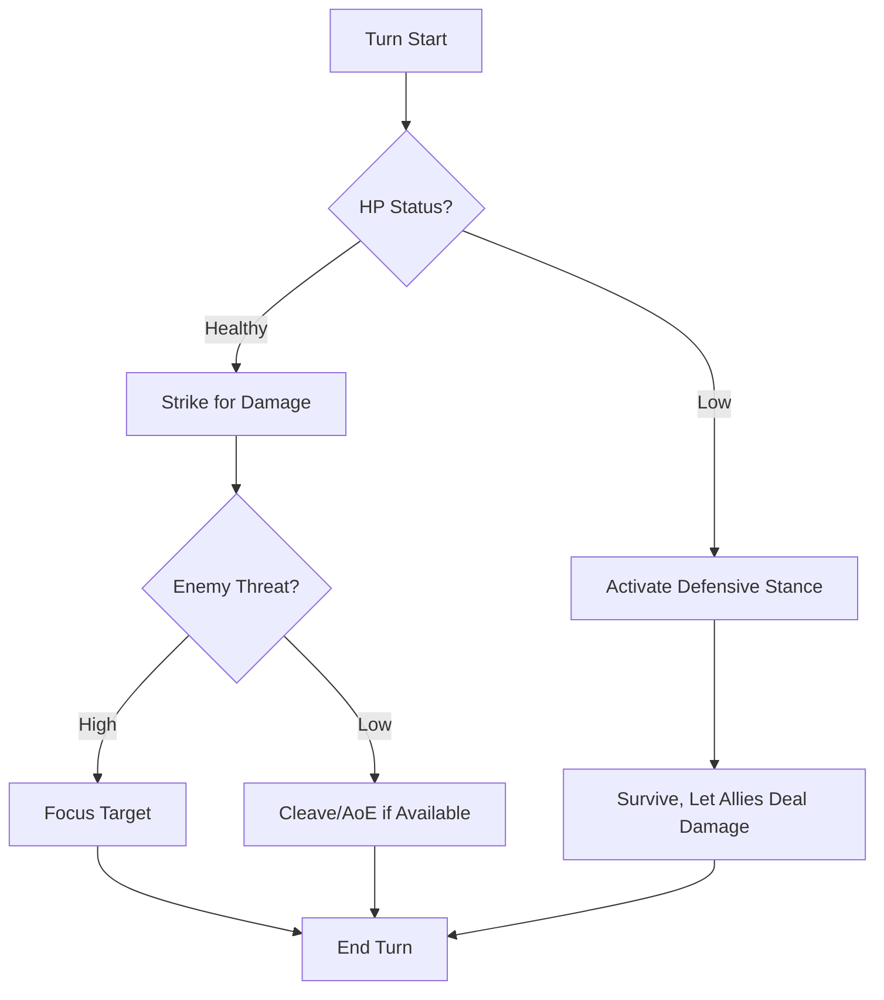

# Warrior — The Unyielding Bulwark

> *"Where others falter, you stand. Where others break, you endure. The chaos of Aethelgard shatters against you like waves against ancient stone."*

---

## Document Control

| Version | Date | Changes |
|---------|------|---------|
| 1.0 | 2025-12-07 | Initial specification |

---

## 1. Overview

### 1.1 Identity Table

| Property | Value |
|----------|-------|
| Spec ID | `SPEC-ARCHETYPE-WARRIOR` |
| Archetype ID | 1 |
| Role | Melee Tank / Sustained DPS |
| Primary Resource | Stamina |
| Combat Style | Frontline, sustained damage, damage absorption |

### 1.2 Core Fantasy

The Warrior is the **unyielding bulwark**—the character who stands at the front and refuses to fall. Warriors excel at:
- **Taking damage** that would destroy others
- **Dealing consistent melee damage** over extended fights
- **Protecting allies** by controlling enemy positioning
- **Surviving** where others cannot

### 1.3 Playstyle Summary

| Strength | Description |
|----------|-------------|
| Highest HP | 99 base (with Vigor), scales to 200+ |
| Best Stamina | 55 base, sustains long fights |
| Damage Soak | Defensive Stance grants +3 Soak |
| Simple but Reliable | Straightforward abilities, few surprises |

| Weakness | Description |
|----------|-------------|
| Low WITS/WILL | Poor at puzzles, weak to psychic effects |
| Limited Range | Melee-focused, vulnerable to kiting |
| Low Mobility | No innate movement bonuses |
| Minimal AP | Cannot use Aetheric abilities effectively |

---

## 2. Starting Attributes

### 2.1 Attribute Distribution

| Attribute | Value | Comparison |
|-----------|-------|------------|
| **MIGHT** | 4 | Highest (tied with STURDINESS) |
| **FINESSE** | 3 | Average |
| **WITS** | 2 | Lowest (tied with WILL) |
| **WILL** | 2 | Lowest (tied with WITS) |
| **STURDINESS** | 4 | Highest (tied with MIGHT) |
| **Total** | 15 | Standard |

### 2.2 Attribute Distribution Philosophy

- **MIGHT 4**: Physical power for melee damage
- **STURDINESS 4**: Durability for high HP and Soak
- **FINESSE 3**: Adequate for accuracy and Stamina
- **WITS/WILL 2**: Dump stats; Warriors rely on brawn, not brains

---

## 3. Starting Resources

### 3.1 Resource Pools at Creation

| Resource | Formula | Value |
|----------|---------|-------|
| **Max HP** | `50 + (STURDINESS × 10) + 10% Vigor` | **99** |
| **Max Stamina** | `20 + (MIGHT + FINESSE) × 5` | **55** |
| **Max AP** | `10` (minimal) | **10** |

### 3.2 Resource Philosophy

- **HP**: Warriors have the highest HP of any archetype (~10% ahead of next)
- **Stamina**: Tied with Skirmisher for highest; powers all abilities
- **AP**: Minimal; Warriors do not use Aetheric abilities

---

## 4. Starting Abilities

### 4.1 Strike (Basic Attack)

| Property | Value |
|----------|-------|
| Type | Attack |
| Cost | 10 Stamina |
| Damage | 2d6 + MIGHT |
| Range | Melee (1) |
| Target | Single |

**Description**: A powerful melee strike that leverages the Warrior's physical strength.

**Scaling**:
- At MIGHT 4: `2d6 + 4` = 6-16 damage (avg 11)
- At MIGHT 6: `2d6 + 6` = 8-18 damage (avg 13)

---

### 4.2 Defensive Stance (Mode)

| Property | Value |
|----------|-------|
| Type | Mode (Toggle) |
| Cost | 15 Stamina (activation) |
| Duration | Until deactivated or combat ends |
| Effect | +3 Soak, −25% damage dealt |

**Description**: The Warrior enters a defensive posture, absorbing more damage at the cost of offensive power.

**Mechanics**:
- **+3 Soak**: Reduces incoming damage by 3 (flat)
- **−25% Damage**: All outgoing damage reduced by 25%
- **Toggle**: Can be activated/deactivated as a free action each turn

**Tactical Use**:
- Activate when protecting allies or low HP
- Deactivate for burst damage phase
- Combine with tank specializations (Skjaldmaer) for extreme durability

---

### 4.3 Warrior's Vigor (Passive)

| Property | Value |
|----------|-------|
| Type | Passive |
| Cost | None |
| Effect | +10% Maximum HP |

**Description**: The Warrior's constitution grants additional vitality.

**Calculation**:
```
Base HP = 50 + (STURDINESS × 10) = 50 + 40 = 90
Vigor Bonus = 90 × 0.10 = 9
Final HP = 90 + 9 = 99
```

**Scaling**: As STURDINESS increases, Vigor bonus grows proportionally.

---

## 5. Available Specializations

### 5.1 Warrior Specializations

| Specialization | Role | Path Type | Key Resource |
|----------------|------|-----------|--------------|
| **Berserkr** | Burst DPS | Heretical | Rage |
| **Iron-Bane** | Anti-Mechanical / Undying | Coherent | Righteous Fervor |
| **Skjaldmaer** | Shield Tank | Coherent | Block Charges |
| **Skar-Horde Aspirant** | Savage Berserker | Heretical | Savagery |
| **Atgeir-Wielder** | Reach Specialist | Coherent | Versatility |
| **Gorge-Maw Ascetic** | Corruption Tank | Heretical | Corruption |

### 5.2 Specialization Synergies

| Specialization | Synergy with Base Warrior |
|----------------|---------------------------|
| **Berserkr** | Strike → Rage generation; Vigor offsets self-damage |
| **Skjaldmaer** | Defensive Stance stacks with shield abilities |
| **Iron-Bane** | High HP helps survive undying mechanics |
| **Atgeir-Wielder** | Strike replaced with reach attacks; Stance still useful |

---

## 6. Combat Role

### 6.1 Positioning

```
Ideal Formation:
   [Enemy] [Enemy] [Enemy]
         ↓ ↓ ↓
       [WARRIOR]        ← Frontline
   [Skirmisher] [Adept]  ← Mid
       [Mystic]          ← Back
```

**Warriors belong at the front**, absorbing damage and controlling enemy movement.

### 6.2 Combat Loop



---

## 7. Progression Path

### 7.1 Attribute Priorities

| Priority | Attribute | Reason |
|----------|-----------|--------|
| 1st | STURDINESS | More HP, more survivability |
| 2nd | MIGHT | More damage on all attacks |
| 3rd | FINESSE | Accuracy, Stamina pool |
| 4th | WILL | Only if struggling with Stress |
| 5th | WITS | Only for specific builds |

### 7.2 Milestone HP Scaling

| Milestone | Base HP | Vigor | Total | Notes |
|-----------|---------|-------|-------|-------|
| 0 | 90 | +9 | 99 | Starting |
| 5 | 90 + 50 | +14 | 154 | +10 HP/Milestone |
| 10 | 90 + 100 | +19 | 209 | Mid-game |
| 20 | 90 + 200 | +29 | 319 | Late-game |

---

## 8. Technical Implementation

### 8.1 Warrior Archetype Class

```csharp
public class WarriorArchetype : Archetype
{
    public override string Name => "Warrior";
    public override int ArchetypeId => 1;
    public override string Tagline => "The unyielding bulwark against chaos";
    public override PrimaryResource PrimaryResource => PrimaryResource.Stamina;
    
    public override Attributes GetBaseAttributes() => new Attributes
    {
        Might = 4,
        Finesse = 3,
        Wits = 2,
        Will = 2,
        Sturdiness = 4
    };
    
    public override List<Ability> GetStartingAbilities() => new()
    {
        new StrikeAbility(),
        new DefensiveStanceAbility(),
        new WarriorsVigorPassive()
    };
    
    public override int CalculateMaxHp(Character character)
    {
        int baseHp = 50 + (character.Attributes.Sturdiness * 10);
        int milestoneBonus = character.CurrentMilestone * 10;
        int vigorBonus = (int)((baseHp + milestoneBonus) * 0.10);
        return baseHp + milestoneBonus + vigorBonus;
    }
}
```

---

## 9. Phased Implementation Guide

### Phase 1: Class Logic
- [ ] **Class**: Create `WarriorArchetype` inheriting from base.
- [ ] **Stats**: Implement Attribute and Resource calculation overrides.

### Phase 2: Abilities
- [ ] **Strike**: Implement basic 2d6+MIGHT attack.
- [ ] **Stance**: Implement Toggle ability for Soak/Damage mod.
- [ ] **Vigor**: Implement Passive HP modifier logic.

### Phase 3: Progression
- [ ] **Milestones**: Hook HP calculation to Character Milestone level.

### Phase 4: Visuals
- [ ] **Stance**: Add visual effect for Defensive Stance (Shield icon).

---

## 10. Testing Requirements

### 10.1 Unit Tests
- [ ] **Stats**: MIGHT=4, STURDINESS=4 on creation.
- [ ] **HP Calc**: Base 90 + 9(Vigor) = 99 HP.
- [ ] **Stance**: Active = +3 Soak, -25% Dmg. Deactivated = 0/0.
- [ ] **Scaling**: At Milestone 10 -> HP calculates correctly with Vigor.

### 10.2 Integration Tests
- [ ] **Combat**: Strike deals correct damage to Enemy.
- [ ] **Tanking**: Taking damage in Stance reduces incoming damage.

### 10.3 Manual QA
- [ ] **Creation**: Select Warrior -> Verify stats.
- [ ] **Gameplay**: Toggle Stance -> Combat Log confirms change.

---

## 11. Logging Requirements

**Reference:** [logging.md](../../../00-project/logging.md)

### 11.1 Log Events

| Event | Level | Message Template | Properties |
|-------|-------|------------------|------------|
| Stance On | Info | "{Character} assumes Defensive Stance." | `Character` |
| Stance Off | Info | "{Character} drops Defensive Stance." | `Character` |
| Vigor Calc | Debug | "Warrior Vigor added {Amount} HP to max." | `Amount` |

---

## 12. Related Specifications

| Spec ID | Relationship |
|---------|--------------|
| `SPEC-CORE-ARCHETYPES` | Parent overview |
| `SPEC-CORE-RES-HP` | HP calculation |
| `SPEC-CORE-RES-STAMINA` | Primary resource |
| `SPEC-SPEC-BERSERKR` | Specialization |
| `SPEC-SPEC-SKJALDMAER` | Specialization |

---

## 13. Changelog

| Version | Date | Changes |
|---------|------|---------|
| 1.0 | 2025-12-07 | Initial specification |
| 1.1 | 2025-12-13 | Standardized with Phased Implementation, Testing, and Logging |
