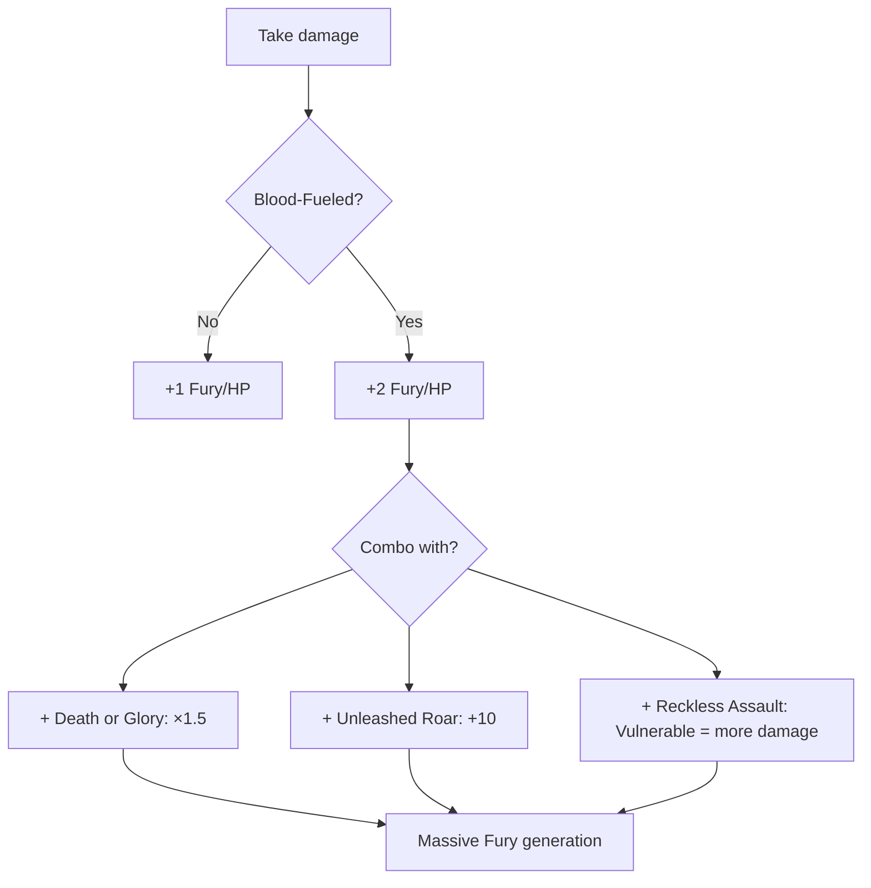

# Blood-Fueled

**Ability ID:** 3006 | **Tier:** 2 | **Type:** Passive | **PP Cost:** 4

---

## 1. Overview

| Property | Value |
|----------|-------|
| **Action** | Free (always active) |
| **Target** | Self |
| **Resource Cost** | None |
| **Prerequisite** | 8 PP in Berserkr tree |
| **Starting Rank** | 2 |

---

## 2. Description

> Pain is a catalyst. Every wound is an invitation to greater violence. The Berserkr has learned to transform suffering into power.

> [!IMPORTANT]
> **Core Passive:** This fundamentally alters the Berserkr's strategy — makes taking damage VALUABLE.

---

## 3. Mechanical Effects

### 3.1 Primary Effect

```
Fury from taking damage = DOUBLED
Base: 1 Fury per HP lost
With Blood-Fueled: 2 Fury per HP lost
```

### 3.2 Impact Example

| Damage Taken | Normal Fury | With Blood-Fueled |
|--------------|-------------|-------------------|
| 5 HP | 5 | 10 |
| 10 HP | 10 | 20 |
| 20 HP | 20 | 40 |
| 30 HP | 30 | 60 |

---

## 4. Rank Progression

### Rank 2 (Starting Rank)

**Mechanical Effects:**
- Double Fury from damage taken
- Base: 2 Fury per HP lost

---

### Rank 3 (Upgrade Cost: +3 PP, requires Rank 2)

**Mechanical Effects:**
- Double Fury from damage taken
- **NEW:** When taking 10+ damage in one hit, also gain +5 Stamina
- **NEW:** First hit each combat that damages you generates TRIPLE Fury

---

## 5. Blood-Fueled Strategy



---

## 6. Synergies

| Combination | Effect |
|-------------|--------|
| + Death or Glory | +50% on top of doubling |
| + Reckless Assault | Vulnerable = more damage = more Fury |
| + Unleashed Roar | Taunted enemy attacks fuel you |
| + Bone-Setter | Heals you so you can take more |

---

## 7. Balance Data

### 7.1 Efficiency
- **Normal:** 10 Dmg -> 10 Fury (+10/turn regen) = 20 Fury (Too slow for 40-cost abilities).
- **Blood-Fueled:** 10 Dmg -> 20 Fury = 30 Fury (Can use *Reckless Assault* every 2 turns).
- **Comparison:** Essential for high-apm Berserkr playstyles.

### 7.2 Risk
- **Health as Resource:** Encourages face-tanking. Without *Bone-Setter* support, this is fatal.

---

## 8. Phased Implementation Guide

### Phase 1: Mechanics
- [ ] **Hooks**: Override `OnTakeDamage` in Berserkr handler.
- [ ] **Formula**: `FuryGain = Damage * ScaleFactor`.
- [ ] **Rank 2**: locked ScaleFactor to 2.

### Phase 2: Logic Integration
- [ ] **Rank 3**: Add Stamina recovery logic (`if Damage > 10 then RestoreStamina(5)`).
- [ ] **First Blood**: Track `HasTakenDamageThisCombat`. If false -> Multiplier = 3.

### Phase 3: Visuals
- [ ] **VFX**: Red pulsating aura when taking damage.
- [ ] **Audio**: "Heartbeat" thumping sound increases with Fury.

---

## 9. Testing Requirements

### 9.1 Unit Tests
- [ ] **Base**: Take 10 damage -> Gain 20 Fury.
- [ ] **Rank 3**: Take 12 damage -> Gain 24 Fury + 5 Stamina.
- [ ] **First Blood**: First hit (10) -> 30 Fury. Second hit (10) -> 20 Fury.

### 9.2 Integration Tests
- [ ] **Death or Glory**: Low HP + Damage -> Verify Multiplicative stacking (2.0 * 1.5 = 3.0?).
- [ ] **Death**: Taking fatal damage? Max Fury gained, but dead.

### 9.3 Manual QA
- [ ] **Feedback**: Does the player feel "powerful" when getting hit?

---

## 10. Logging Requirements

**Reference:** [logging.md](../../../../../00-project/logging.md)

### 10.1 Log Events
| Event | Level | Message Template | Properties |
|-------|-------|------------------|------------|
| Fury | Info | "Blood fuels your rage! (+{Fury} Fury)" | `Fury` |
| Stamina | Debug | "Pain brings focus. (+{Stamina} Stamina)" | `Stamina` |

---

## 11. Related Specifications
| Document | Purpose |
|----------|---------|
| [Death or Glory](death-or-glory.md) | Multiplier synergy |
| [Resources](../../../../01-core/resources/fury.md) | Resource definition |

---

## 12. Changelog
| Version | Date | Changes |
|---------|------|---------|
| 1.0 | 2025-12-07 | Initial specification |
| 1.1 | 2025-12-14 | Standardized with Balance, Phased Guide, Testing, Logging |
