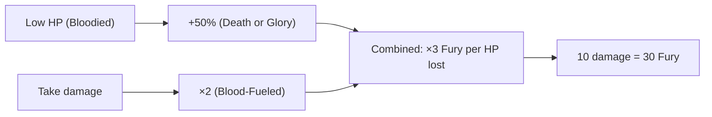

# Death or Glory

**Ability ID:** 3008 | **Tier:** 3 | **Type:** Passive | **PP Cost:** 5

---

## 1. Overview

| Property | Value |
|----------|-------|
| **Action** | Free (always active) |
| **Target** | Self |
| **Resource Cost** | None |
| **Condition** | While [Bloodied] (below 50% HP) |
| **Prerequisite** | 20 PP in Berserkr tree |
| **Starting Rank** | 2 |

---

## 2. Description

> The Berserkr fights with the greatest ferocity when on the brink of death. Desperation fuels transcendent rage.

> [!WARNING]
> **High-Risk Passive:** Rewards staying at low HP — the closer to death, the more powerful you become.

---

## 3. Mechanical Effects

### 3.1 Primary Effect

```
Condition: Below 50% HP ([Bloodied])
Effect: All Fury generation increased by 50%
```

### 3.2 Fury Scaling

| Fury Source | Normal | With Death or Glory |
|-------------|--------|---------------------|
| Wild Swing (per enemy) | +5 | +7.5 → 8 |
| Reckless Assault | +15 | +22.5 → 23 |
| Damage taken (per HP) | +1 (+2 w/ Blood-Fueled) | +1.5 (+3 w/ Blood-Fueled) |
| Unleashed Roar (attacked) | +10 | +15 |

---

## 4. Rank Progression

### Rank 2 (Starting Rank)

**Mechanical Effects:**
- +50% Fury generation while [Bloodied]
- Applies to all sources

---

### Rank 3 (Upgrade Cost: +3 PP, requires Rank 2)

**Mechanical Effects:**
- +50% Fury generation while [Bloodied]
- **NEW:** +75% Fury generation while below 25% HP
- **NEW:** +2 damage while [Bloodied]

---

## 5. Death or Glory Workflow

```mermaid
flowchart TD
    HP[Current HP] --> CHECK{HP level?}
    
    CHECK --> |"Above 50%"| NORMAL[Normal Fury generation]
    CHECK --> |"25-50% (Bloodied)"| BONUS[+50% Fury generation]
    CHECK --> |"Below 25% (Critical)"| MAJOR[+75% Fury (Rank 3)]
    
    BONUS --> COMBO{With Blood-Fueled?}
    MAJOR --> COMBO
    
    COMBO --> |Yes| ULTIMATE[Massive Fury generation]
    COMBO --> |No| GOOD[Strong Fury generation]
```

---

## 6. The Ultimate Combo



---

## 7. Synergies

| Combination | Effect |
|-------------|--------|
| + Blood-Fueled | 3× normal Fury from damage |
| + Bone-Setter (Triage) | +25% healing when bloodied |
| + Reckless Assault | More damage = more Fury |

---

## 8. Balance Data

### 8.1 Scaling
| % HP | Multiplier | Notes |
|------|------------|-------|
| >50% | 1.0x | Base rate |
| <50% | 1.5x | Standard Burst window |
| <25% | 1.75x | Panic/Clutch window (Rank 3) |

### 8.2 Economy
- **Synergy:** Stacked with *Blood-Fueled*, this creates an exponential power curve at low health.
- **Risk:** Requires staying in "One-Shot Range" against bosses to maximize.

---

## 9. Phased Implementation Guide

### Phase 1: Mechanics
- [ ] **State**: Implement `IsBloodied` property (HP <= MaxHP / 2).
- [ ] **Modifier**: Hook `CalculateFuryGain`. If `IsBloodied`, apply *1.5.

### Phase 2: Logic Integration
- [ ] **Critical**: Add Rank 3 check (HP <= MaxHP / 4) -> *1.75.
- [ ] **Damage**: Add flat +2 damage bonus (Rank 3).

### Phase 3: Visuals
- [ ] **Post-Process**: Screen edges turn bloody/red vignetting.
- [ ] **Character**: Model emits steam/heat haze.

---

## 10. Testing Requirements

### 10.1 Unit Tests
- [ ] **Threshold**: HP 51% -> 1.0x. HP 49% -> 1.5x.
- [ ] **Critical**: HP 24% -> 1.75x (Rank 3).
- [ ] **Damage**: Attack damage +2 when Bloodied (Rank 3).

### 10.2 Integration Tests
- [ ] **Healing**: Healed above 50% -> Multiplier drops instantly.
- [ ] **Sources**: Verify works on Attack Gen, Damage Gen, and Skill Gen.

### 10.3 Manual QA
- [ ] **UI**: Verify "Bloodied" icon/state appears.

---

## 11. Logging Requirements

**Reference:** [logging.md](../../../../../00-project/logging.md)

### 11.1 Log Events
| Event | Level | Message Template | Properties |
|-------|-------|------------------|------------|
| Bonus | Debug | "Death or Glory amplified Fury (+{Extra})." | `Extra` |
| State | Info | "{Character} enters a bloodied rage!" | `Character` |

---

## 12. Related Specifications
| Document | Purpose |
|----------|---------|
| [Blood-Fueled](blood-fueled.md) | Multiplier synergy |
| [HP Reference](../../../../01-core/resources/hp.md) | Health mechanics |

---

## 13. Changelog
| Version | Date | Changes |
|---------|------|---------|
| 1.0 | 2025-12-07 | Initial specification |
| 1.1 | 2025-12-14 | Standardized with Balance, Phased Guide, Testing, Logging |
