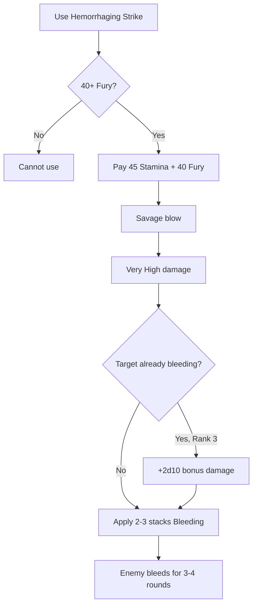

# Hemorrhaging Strike

**Ability ID:** 3007 | **Tier:** 3 | **Type:** Active | **PP Cost:** 5

---

## 1. Overview

| Property | Value |
|----------|-------|
| **Action** | Standard Action |
| **Target** | Single enemy |
| **Resource Cost** | 45 Stamina + 40 Fury |
| **Effect** | Very High damage + [Bleeding] |
| **Prerequisite** | 20 PP in Berserkr tree |
| **Starting Rank** | 2 |

---

## 2. Description

> Focusing their rage into a single, savage blow, the Berserkr opens a grievous injury that will bleed the enemy dry.

---

## 3. Mechanical Effects

### 3.1 Primary Effect

```
Damage = Very High Physical damage
Apply [Bleeding] = 2 stacks (3 rounds)
Cost = 45 Stamina + 40 Fury
```

### 3.2 Total Damage

| Component | Damage |
|-----------|--------|
| Initial hit | Very High (~4d10) |
| Bleeding (2 stacks × 3 rounds) | 2d6 × 3 = 6d6 |
| **Total** | ~4d10 + 6d6 |

---

## 4. Rank Progression

### Rank 2 (Starting Rank)

**Mechanical Effects:**
- Very High damage
- Apply 2 stacks [Bleeding] (3 rounds)
- Cost: 45 Stamina + 40 Fury

---

### Rank 3 (Upgrade Cost: +3 PP, requires Rank 2)

**Mechanical Effects:**
- Massive damage
- Apply 3 stacks [Bleeding] (4 rounds)
- **NEW:** If target already bleeding, +2d10 bonus damage

---

## 5. Hemorrhaging Strike Workflow



---

## 6. Synergy with Bleeding

| State | Effect |
|-------|--------|
| Target not bleeding | Apply fresh stacks |
| Target already bleeding | Add stacks (max 5 total) |
| Target at 5 stacks | Bonus damage only |

---

## 7. Tactical Applications

| Situation | Application |
|-----------|-------------|
| **Boss fight** | High single-target burst |
| **Tanky enemies** | Bleed ignores Soak |
| **Fury dump** | Spend excess Fury |

---

## 8. Balance Data

### 8.1 Efficiency
- **Cost:** 45 Stamina + 40 Fury is EXPENSIVE. Requires roughly 3-4 rounds of buildup.
- **Damage:** ~50 total damage (4d10 + 6d6) over 3 rounds.
- **DPE (Damage Per Energy):** High efficiency if full DoT runs its course. Low efficiency if target dies immediately (wasted stacks).

### 8.2 Comparison
- **Vs Wild Swing:** Wild Swing is cheap/spammable. This is a "Finisher" or "Tank Buster".

---

## 9. Phased Implementation Guide

### Phase 1: Mechanics
- [ ] **Action**: Create `HemorrhagingStrike` ability entity.
- [ ] **Cost**: Implement dual-resource cost (Stamina + Fury).
- [ ] **Effect**: Implement `ApplyBleed` (2 stacks).

### Phase 2: Logic Integration
- [ ] **Rank 3**: Helper function `GetBleedStacks(target)`. If > 0, Add +2d10 Damage.
- [ ] **Stacking**: Ensure [Bleeding] stacks correctly (Duration refresh? Cap at 5?).

### Phase 3: Visuals
- [ ] **VFX**: Excessive blood splatter particles.
- [ ] **SFX**: "Gushing" or "wet tear" sound.

---

## 10. Testing Requirements

### 10.1 Unit Tests
- [ ] **Cost**: Verify consumption of 45 Stamina AND 40 Fury.
- [ ] **Application**: Target gains effect [Bleeding] Count=2.
- [ ] **Bonus**: Target bleeding -> Damage check = Base + 2d10.

### 10.2 Integration Tests
- [ ] **Immunity**: Target immune to Bleed (Skeleton?) -> Only takes initial damage.
- [ ] **Death**: Target dies from Dot -> Kill credit assigned to Berserkr.

### 10.3 Manual QA
- [ ] **Log**: Check combat log for "X bleeds for Y damage."

---

## 11. Logging Requirements

**Reference:** [logging.md](../../../../../00-project/logging.md)

### 11.1 Log Events
| Event | Level | Message Template | Properties |
|-------|-------|------------------|------------|
| Cast | Info | "{Character} tears into {Target}!" | `Character`, `Target` |
| Dot | Info | "{Target} bleeds profusely ({Damage})." | `Target`, `Damage` |

---

## 12. Related Specifications
| Document | Purpose |
|----------|---------|
| [Status Effects](../../../../04-systems/status-effects/bleeding.md) | Bleeding mechanic |
| [Resources](../../../../01-core/resources/fury.md) | Fury resource |

---

## 13. Changelog
| Version | Date | Changes |
|---------|------|---------|
| 1.0 | 2025-12-07 | Initial specification |
| 1.1 | 2025-12-14 | Standardized with Balance, Phased Guide, Testing, Logging |
