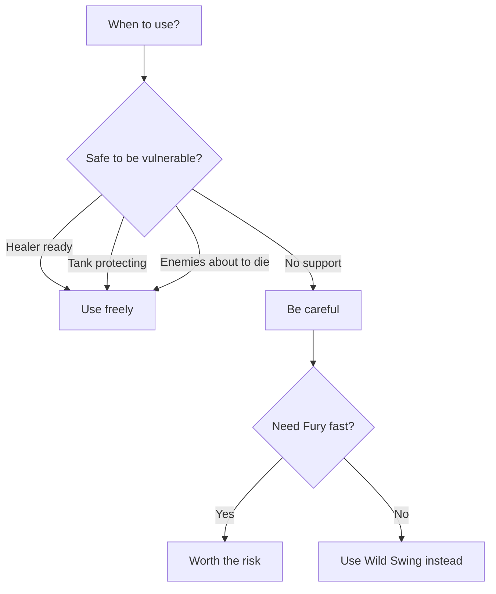

# Reckless Assault

**Ability ID:** 3003 | **Tier:** 1 | **Type:** Active | **PP Cost:** 3

---

## 1. Overview

| Property | Value |
|----------|-------|
| **Action** | Standard Action |
| **Target** | Single enemy |
| **Resource Cost** | 35 Stamina |
| **Fury Generation** | +15 |
| **Drawback** | [Vulnerable] for 1 round |
| **Prerequisite** | Berserkr specialization |

---

## 2. Description

> Lowering their guard completely, the Berserkr lunges forward to deliver a powerful, single-target attack.

> [!WARNING]
> **Risk/Reward:** High Fury generation, but you become [Vulnerable] for 1 round (increased damage taken).

---

## 3. Mechanical Effects

### 3.1 Primary Effect

```
Damage = High Physical damage
Target = Single enemy
Fury Generation = +15
Self-Debuff = [Vulnerable] for 1 round
```

### 3.2 Risk Analysis

| Factor | Value |
|--------|-------|
| Fury gained | 15 (highest single-target) |
| Damage dealt | High |
| Danger | +25% damage taken for 1 round |

---

## 4. Rank Progression

### Rank 1 (Base — included with ability unlock)

**Mechanical Effects:**
- High damage
- +15 Fury
- [Vulnerable] 1 round
- Cost: 35 Stamina

---

### Rank 2 (Upgrade Cost: +2 PP)

**Mechanical Effects:**
- Very High damage
- +18 Fury
- [Vulnerable] severity reduced

---

### Rank 3 (Upgrade Cost: +3 PP, requires Rank 2)

**Mechanical Effects:**
- Massive damage
- +20 Fury
- **NEW:** [Vulnerable] lasts until end of YOUR turn only
- **NEW:** If target dies, no [Vulnerable] applied

---

## 5. Reckless Assault Workflow

```mermaid
flowchart TD
    START[Use Reckless Assault] --> COST[Pay 35 Stamina]
    COST --> ATTACK[Attack single target]
    ATTACK --> DAMAGE[Deal high damage]
    DAMAGE --> FURY[+15 Fury]
    
    FURY --> KILL{Target killed?}
    KILL --> |Yes, Rank 3| SAFE[No Vulnerable]
    KILL --> |No| VULNERABLE[Apply [Vulnerable] to self]
    VULNERABLE --> RISK[Take more damage for 1 round]
```

---

## 6. Decision Tree



---

## 7. Synergies

| Combination | Effect |
|-------------|--------|
| + Bone-Setter | Heals the damage you take |
| + Skjaldmær | Tank absorbs attacks |
| + Blood-Fueled | Taking damage = more Fury |

---

## 8. Balance Data

### 8.1 Risk Model
- **Input:** 35 Stamina (High cost).
- **Output:** Highest single-target non-ultimate damage + 15 Fury.
- **Cost:** +25% Damage Taken (Vulnerable).
- **Verdict:** Highly efficient if the enemy dies or you have a tank. Suicide if used on a Boss while agro'd.

### 8.2 Fury Economy
- **Generation:** 1 Stamina -> 0.42 Fury. Efficient conversion compared to *Wild Swing*.

---

## 9. Phased Implementation Guide

### Phase 1: Mechanics
- [ ] **Action**: Create `RecklessAssault` entity.
- [ ] **Effect**: `DealDamage` + `ApplySelfStatus(Vulnerable)`.

### Phase 2: Logic Integration
- [ ] **Rank 3**: On Kill -> `RemoveStatus(Vulnerable)`.
- [ ] **Rank 3**: Set Vulnerable duration to `EndOfTurn` instead of `StartOfNextTurn`.

### Phase 3: Visuals
- [ ] **Anim**: Wild overhand swing.
- [ ] **VFX**: Armor shatter effect on self (indicating vulnerability).

---

## 10. Testing Requirements

### 10.1 Unit Tests
- [ ] **Damage**: Verify base damage > Normal Attack.
- [ ] **Self-Debuff**: Caster has [Vulnerable] after cast.
- [ ] **Fury**: Caster gains +15 Fury.

### 10.2 Integration Tests
- [ ] **Target Death**: Level 3 caster kills target -> [Vulnerable] is not applied.
- [ ] **Damage Taken**: Enemy attacks caster next turn -> Caster takes +25% damage.

### 10.3 Manual QA
- [ ] **Feel**: Does the "crunch" of the hit feel satisfying enough to warrant the risk?

---

## 11. Logging Requirements

**Reference:** [logging.md](../../../../../00-project/logging.md)

### 11.1 Log Events
| Event | Level | Message Template | Properties |
|-------|-------|------------------|------------|
| Cast | Info | "{Character} lunges recklessly at {Target}!" | `Character`, `Target` |
| Risk | Warn | "{Character} is left wide open!" | `Character` |

---

## 12. Related Specifications
| Document | Purpose |
|----------|---------|
| [Status Effects](../../../../04-systems/status-effects/vulnerable.md) | Vulnerable status |
| [Blood-Fueled](blood-fueled.md) | Fury synergy |

---

## 13. Changelog
| Version | Date | Changes |
|---------|------|---------|
| 1.0 | 2025-12-07 | Initial specification |
| 1.1 | 2025-12-14 | Standardized with Balance, Phased Guide, Testing, Logging |
