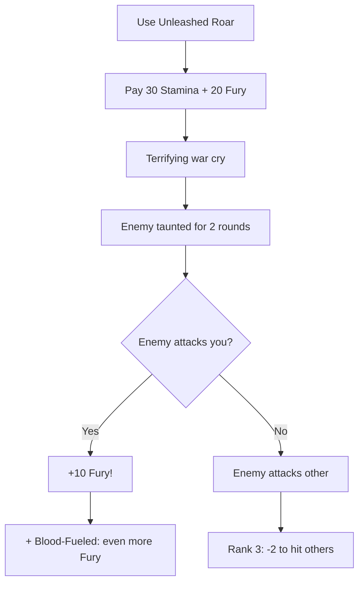

# Unleashed Roar

**Ability ID:** 3004 | **Tier:** 2 | **Type:** Active | **PP Cost:** 4

---

## 1. Overview

| Property | Value |
|----------|-------|
| **Action** | Standard Action |
| **Target** | Single enemy |
| **Resource Cost** | 30 Stamina + 20 Fury |
| **Effect** | Taunt + Fury generation |
| **Duration** | 2 rounds |
| **Prerequisite** | 8 PP in Berserkr tree |
| **Starting Rank** | 2 |

---

## 2. Description

> The Berserkr lets out a terrifying, guttural war cry, challenging a single foe to face their wrath.

---

## 3. Mechanical Effects

### 3.1 Primary Effect

```
Effect 1: Taunt single enemy for 2 rounds
Effect 2: When taunted enemy attacks you, gain +10 Fury
```

> [!TIP]
> **Fury Loop:** This ability COSTS Fury but generates MORE if the enemy attacks you. Converts incoming damage into power.

---

## 4. Rank Progression

### Rank 2 (Starting Rank)

**Mechanical Effects:**
- Taunt single enemy (2 rounds)
- +10 Fury when attacked by taunted enemy
- Cost: 30 Stamina + 20 Fury

---

### Rank 3 (Upgrade Cost: +3 PP, requires Rank 2)

**Mechanical Effects:**
- Taunt duration: 3 rounds
- +15 Fury when attacked
- **NEW:** Enemy has -2 to hit others (wants to attack you)
- **NEW:** If taunted enemy attacks you, they take 1d6 damage

---

## 5. Unleashed Roar Workflow



---

## 6. Tactical Applications

| Situation | Application |
|-----------|-------------|
| **Low Fury** | Force enemy to fuel you |
| **Protect ally** | Pull aggro |
| **Synergy** | With Blood-Fueled = massive Fury |

---

## 7. Balance Data

### 7.1 Aggro Economics
| Action | Cost | Return |
|--------|------|--------|
| Cast | 30 Stam + 20 Fury | Aggro Control |
| Hit Taken | HP (Risk) | +10 Fury |
| Net (3 hits) | -HP | +30 - 20 = +10 Net Fury |

### 7.2 Utility
- **Tank Logic:** Essential for off-tanking. Allows Berserkr to peel for squishies like Runasmidr.

---

## 8. Phased Implementation Guide

### Phase 1: Mechanics
- [ ] **Effect**: Implement `Taunt` status (Forces AI targeting).
- [ ] **Trigger**: Hook `OnAttackReceived`. If Source has `TauntedBy == Self`, Add Fury.

### Phase 2: Logic Integration
- [ ] **Rank 3**: Implement Thorns effect (1d6 Damage). This requires an `OnHit` hook calculation.
- [ ] **AI**: Update `AIController` to respect Taunt status (Override target priority).

### Phase 3: Visuals
- [ ] **Audio**: Loud, distorted war cry sample.
- [ ] **VFX**: Soundwave cone or red "shout" lines.

---

## 9. Testing Requirements

### 9.1 Unit Tests
- [ ] **Cost**: Verify consumption.
- [ ] **Effect**: Target state `Taunted` is true. `TauntedBy` is Caster.
- [ ] **Reaction**: Target attacks Caster -> Caster gains +10 Fury.
- [ ] **Rank 3**: Target attacks Caster -> Target takes 1d6 damage.

### 9.2 Integration Tests
- [ ] **AI Behavior**: Taunted enemy ignores closer/softer target to attack Berserkr.
- [ ] **Death**: If Berserkr dies, Taunt expires.

### 9.3 Manual QA
- [ ] **Log**: Verify "Draugr's focus snaps to the Berserkr!"

---

## 10. Logging Requirements

**Reference:** [logging.md](../../../../../00-project/logging.md)

### 10.1 Log Events
| Event | Level | Message Template | Properties |
|-------|-------|------------------|------------|
| Cast | Info | "{Character} bellows a challenge at {Target}!" | `Character`, `Target` |
| Effect | Debug | "Taunt triggered Fury generation." | - |

---

## 11. Related Specifications
| Document | Purpose |
|----------|---------|
| [Status Effects](../../../../04-systems/status-effects/taunted.md) | Taunt mechanic |
| [Blood-Fueled](blood-fueled.md) | Fury synergy |

---

## 12. Changelog
| Version | Date | Changes |
|---------|------|---------|
| 1.0 | 2025-12-07 | Initial specification |
| 1.1 | 2025-12-14 | Standardized with Balance, Phased Guide, Testing, Logging |
