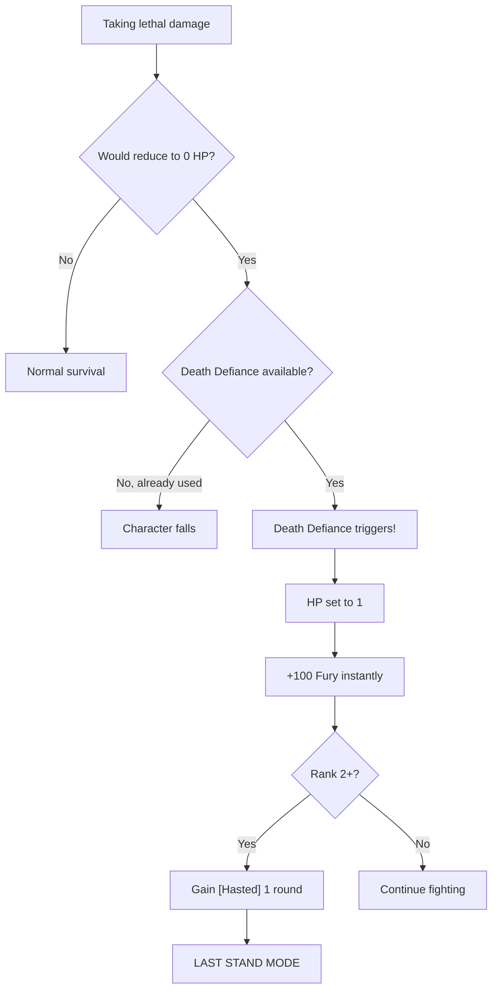

# Unstoppable Fury

**Ability ID:** 3009 | **Tier:** 4 (Capstone) | **Type:** Passive | **PP Cost:** 6

---

## 1. Overview

| Property | Value |
|----------|-------|
| **Action** | Free (triggered) |
| **Target** | Self |
| **Resource Cost** | None |
| **Prerequisite** | Full Berserkr tree (40 PP) |
| **Starting Rank** | 1 |

---

## 2. Description

> The Berserkr's rage transcends mere emotion and becomes a force of nature, allowing them to defy death itself through sheer will and fury.

> [!IMPORTANT]
> **Capstone:** Two powerful benefits — permanent immunities AND a once-per-combat "last stand" moment.

---

## 3. Mechanical Effects

### 3.1 Dual Benefits

**Benefit 1: Control Immunity**
```
IMMUNE to [Feared]
IMMUNE to [Stunned]
```

**Benefit 2: Death Defiance (Once per combat)**
```
Trigger: First time reduced to 0 HP
Effect: HP set to 1, instantly gain 100 Fury
Limit: Once per combat
```

---

## 4. Rank Progression

### Rank 1 (Starting Rank)

**Mechanical Effects:**
- Immune to [Feared] and [Stunned]
- Death Defiance: HP → 1, gain 100 Fury (once/combat)

---

### Rank 2 (Unlocked: Tree progression)

**Mechanical Effects:**
- All Rank 1 effects
- **NEW:** Also immune to [Disoriented]
- **NEW:** When Death Defiance triggers, also gain [Hasted] for 1 round

---

### Rank 3 (Unlocked: Full tree completion)

**Mechanical Effects:**
- All Rank 2 effects
- **NEW:** Death Defiance can trigger TWICE per combat
- **NEW:** Each time Death Defiance triggers, gain +2 damage for rest of combat

---

## 5. Unstoppable Fury Workflow

### 5.1 Immunity System

```mermaid
flowchart TD
    THREAT[Control effect incoming] --> TYPE{Effect type?}
    
    TYPE --> |[Feared]| IMMUNE1[IMMUNE - no effect]
    TYPE --> |[Stunned]| IMMUNE2[IMMUNE - no effect]
    TYPE --> |[Disoriented] R2+| IMMUNE3[IMMUNE - no effect]
    TYPE --> |Other| NORMAL[Normal save]
```

### 5.2 Death Defiance



---

## 6. The "Last Stand" Moment

When Death Defiance triggers:

| State | Value |
|-------|-------|
| HP | 1 |
| Fury | 100 |
| Next action | Whirlwind of Destruction (free) |
| Danger | One more hit = death |
| Fantasy | "You cannot stop me!" |

---

## 7. Tactical Implications

### 7.1 Immunity Value

| Without Capstone | With Capstone |
|------------------|---------------|
| -2 WILL = easy fear | Immune to fear |
| Stunned = lost turn | Immune to stun |
| Major weakness | Weakness removed |

### 7.2 Death Defiance Strategy

| Situation | Strategy |
|-----------|----------|
| About to die | Let it trigger, unleash 100 Fury |
| Low HP | Play aggressive, defiance is safety net |
| Post-trigger | Need healing IMMEDIATELY |

---

## 8. Synergies

| Combination | Effect |
|-------------|--------|
| + Bone-Setter | Critical: heals you after trigger |
| + Death or Glory | Bloodied = +50% Fury (already at 100) |
| + Whirlwind | 100 Fury = perfect for AoE dump |

---

## 9. Balance Data

### 9.1 Capstone Budget
- **Immunity:** Fear/Stun immunity accounts for ~50% of the budget.
- **Defiance:** Once per combat "Extra Life" is huge. 100 Fury instant gain allows for immediate `Whirlwind` + `Hemorrhaging Strike` combo to turn the tide.

### 9.2 Limitations
- **Health:** Sets HP to 1. If you don't heal or kill everything immediately, you die to the next breeze.
- **Cooldown:** "Per Combat" prevents abuse in long dungeons, but allows aggressive play in every encounter.

---

## 10. Phased Implementation Guide

### Phase 1: Mechanics
- [ ] **State**: Add `HasTriggeredDefiance` boolean to Combat State. Reset OnCombatStart.
- [ ] **Hook**: `OnTakeDamage` -> If FinalHP <= 0 -> Intercept.
- [ ] **Effect**: Set HP = 1. Add 100 Fury. Set `HasTriggeredDefiance = true`.

### Phase 2: Logic Integration
- [ ] **Immunity**: Update `CanApplyStatus(Stun/Fear)` to check for `UnstoppableFury` capability.
- [ ] **Rank 3**: Counter check (Count < 2).
- [ ] **Damage**: Hook `GetDamageBonus` -> If `HasTriggeredDefiance`, return +2.

### Phase 3: Visuals
- [ ] **VFX**: Golden/Rage flame burst on trigger.
- [ ] **Anim**: "Roar" animation plays instantly (interrupting death anim).

---

## 11. Testing Requirements

### 11.1 Unit Tests
- [ ] **Immunity**: Attempt apply Fear -> Failed.
- [ ] **Death**: Take lethal -> HP is 1. Fury +100.
- [ ] **Limit**: Trigger twice (Rank 1) -> Second time fails (Die).
- [ ] **Rank 3**: Trigger twice -> Success. Trigger thrice -> Die.

### 11.2 Integration Tests
- [ ] **Heal**: Trigger Defiance -> Cast Healing -> HP > 1.
- [ ] **Combo**: Trigger -> Immediately cast Whirlwind (Cost 30 Fury) -> Success.

### 11.3 Manual QA
- [ ] **Feel**: Does the "Death" moment feel instantaneous or is there a lag?

---

## 12. Logging Requirements

**Reference:** [logging.md](../../../../../00-project/logging.md)

### 12.1 Log Events
| Event | Level | Message Template | Properties |
|-------|-------|------------------|------------|
| Defiance | Warn | "{Character} refuses to die! (HP 1, Fury MAX)" | `Character` |
| Immunity | Debug | "Unstoppable Fury negated {Effect}." | `Effect` |

---

## 13. Related Specifications
| Document | Purpose |
|----------|---------|
| [Status Effects](../../../../04-systems/status-effects/stunned.md) | Stunned effect |
| [Healing](../../specializations/bone-setter/abilities/triage.md) | Critical partner |

---

## 14. Changelog
| Version | Date | Changes |
|---------|------|---------|
| 1.0 | 2025-12-07 | Initial specification |
| 1.1 | 2025-12-14 | Standardized with Balance, Phased Guide, Testing, Logging |
