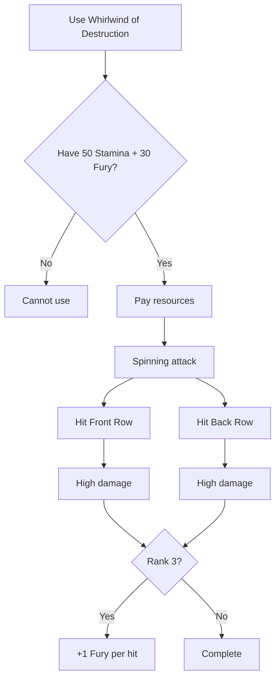

# Whirlwind of Destruction

**Ability ID:** 3005 | **Tier:** 2 | **Type:** Active | **PP Cost:** 4

---

## 1. Overview

| Property | Value |
|----------|-------|
| **Action** | Standard Action |
| **Target** | ALL enemies (Front + Back Row) |
| **Resource Cost** | 50 Stamina + 30 Fury |
| **Prerequisite** | 8 PP in Berserkr tree |
| **Starting Rank** | 2 |

---

## 2. Description

> An evolution of Wild Swing—a spinning vortex of pure destruction that reaches across the entire battlefield.

> [!IMPORTANT]
> **Ultimate AoE:** This is the only Berserkr ability that hits BOTH rows — the ultimate crowd-clearer.

---

## 3. Mechanical Effects

### 3.1 Primary Effect

```
Damage = High Physical damage
Target = ALL enemies (Front Row + Back Row)
Cost = 50 Stamina + 30 Fury
```

---

## 4. Rank Progression

### Rank 2 (Starting Rank)

**Mechanical Effects:**
- High damage to ALL enemies
- Hits both rows
- Cost: 50 Stamina + 30 Fury

---

### Rank 3 (Upgrade Cost: +3 PP, requires Rank 2)

**Mechanical Effects:**
- Very High damage
- **NEW:** Stamina cost reduced to 40
- **NEW:** +1 Fury per enemy hit (partial refund)

---

## 5. Whirlwind Workflow



---

## 6. Comparison to Wild Swing

| Aspect | Wild Swing | Whirlwind of Destruction |
|--------|------------|--------------------------|
| Target | Front Row only | Both rows |
| Cost | 40 Stamina | 50 Stamina + 30 Fury |
| Fury | Generates +5/enemy | Costs 30, minor refund |
| Tier | 1 | 2 |
| Use | Build Fury | Spend Fury |

---

## 7. Tactical Applications

| Situation | Application |
|-----------|-------------|
| **Many enemies** | Maximum damage output |
| **Back row threats** | Reach archers/casters |
| **Fury dump** | Spend excess Fury |

---

## 8. Balance Data

### 8.1 AoE Efficiency
- **Cost:** 50 Stamina + 30 Fury is huge. ~60% of Stamina pool.
- **Output:** Hits 4-8 enemies. 4d8 x 4 = ~72 damage. Extremely efficient compared to 4 single attacks (160 Stamina).
- **Fury:** Rank 3 Refund (e.g. 5 enemies = +5 Fury) softens the blow slightly.

### 8.2 Comparison
- **Vs Mage:** Physical AoE is rarer than Magic AoE. This is the premier physical crowd control.

---

## 9. Phased Implementation Guide

### Phase 1: Mechanics
- [ ] **Action**: Create `Whirlwind` ability entity.
- [ ] **Targeting**: `GetAllEnemies()` hook.
- [ ] **Cost**: Dual resource consumption.

### Phase 2: Logic Integration
- [ ] **Rank 3**: Implement Refund logic (`Fury += EnemiesHit`).
- [ ] **Rank 3**: Discount logic (Cost 50 -> 40 if Rank >= 3).

### Phase 3: Visuals
- [ ] **Anim**: Spin attack sequence.
- [ ] **VFX**: Blur/Weapon trail effect.

---

## 10. Testing Requirements

### 10.1 Unit Tests
- [ ] **Targets**: Verify Front AND Back row enemies take damage.
- [ ] **Cost**: Verify consumption.
- [ ] **Rank 3**: Verify cost reduction (40 instead of 50). Verify refund (Hit 3 -> +3 Fury).

### 10.2 Integration Tests
- [ ] **Friendly Fire**: Ensure allies are NOT hit (unless spec changes).
- [ ] **OnHit Effects**: Verify weapon procs (e.g. Vampiric) trigger on EACH enemy hit? (Usually yes, major synergy).

### 10.3 Manual QA
- [ ] **Log**: "Whirlwind hits Draugr A, Draugr B, Skeleton Archer C..."

---

## 11. Logging Requirements

**Reference:** [logging.md](../../../../../00-project/logging.md)

### 11.1 Log Events
| Event | Level | Message Template | Properties |
|-------|-------|------------------|------------|
| Cast | Info | "{Character} becomes a whirlwind of steel!" | `Character` |
| Hit | Debug | "Whirlwind struck {Target} ({Damage})." | `Target`, `Damage` |
| Refund | Debug | "Rank 3 refund: +{Amount} Fury." | `Amount` |

---

## 12. Related Specifications
| Document | Purpose |
|----------|---------|
| [Wild Swing](wild-swing.md) | The lesser version |
| [Resources](../../../../01-core/resources/stamina.md) | Resource definition |

---

## 13. Changelog
| Version | Date | Changes |
|---------|------|---------|
| 1.0 | 2025-12-07 | Initial specification |
| 1.1 | 2025-12-14 | Standardized with Balance, Phased Guide, Testing, Logging |
