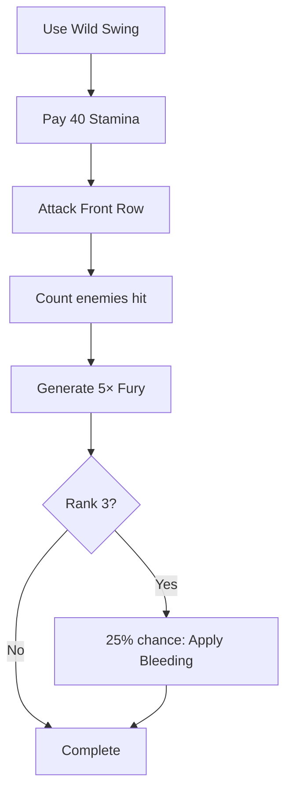

# Wild Swing

**Ability ID:** 3002 | **Tier:** 1 | **Type:** Active | **PP Cost:** 3

---

## 1. Overview

| Property | Value |
|----------|-------|
| **Action** | Standard Action |
| **Target** | All enemies in Front Row |
| **Resource Cost** | 40 Stamina |
| **Fury Generation** | +5 per enemy hit |
| **Prerequisite** | Berserkr specialization |

---

## 2. Description

> The Berserkr unleashes a wide, reckless swing, caring little for precision and focusing only on widespread destruction.

---

## 3. Mechanical Effects

### 3.1 Primary Effect

```
Damage = Moderate Physical damage
Target = All enemies in Front Row
Fury Generation = 5 × enemies hit
```

### 3.2 Fury Generation Scaling

| Enemies Hit | Fury Generated |
|-------------|----------------|
| 1 | 5 |
| 2 | 10 |
| 3 | 15 |
| 4+ | 20+ |

---

## 4. Rank Progression

### Rank 1 (Base — included with ability unlock)

**Mechanical Effects:**
- Moderate damage to Front Row
- +5 Fury per enemy hit
- Cost: 40 Stamina

---

### Rank 2 (Upgrade Cost: +2 PP)

**Mechanical Effects:**
- Damage increased to High
- +7 Fury per enemy hit
- Cost reduced to 35 Stamina

---

### Rank 3 (Upgrade Cost: +3 PP, requires Rank 2)

**Mechanical Effects:**
- Damage increased to Very High
- +10 Fury per enemy hit
- **NEW:** 25% chance to apply [Bleeding] (1 stack)

---

## 5. Wild Swing Workflow



---

## 6. Tactical Applications

| Situation | Application |
|-----------|-------------|
| **Many enemies** | Maximum Fury generation |
| **Fury building** | Primary AoE builder |
| **Opener** | Start combat with Fury |

---

## 7. Balance Data

### 7.1 Generator Efficiency
- **Cost:** 40 Stamina.
- **Return:** Up to 20 Fury (4 enemies). 0.5 Fury/Stamina efficiency.
- **Comparison:** *Reckless Assault* is 0.42 Fury/Stamina but purely single target. Wild Swing is the superior builder in AoE.

---

## 8. Phased Implementation Guide

### Phase 1: Mechanics
- [ ] **Action**: Create `WildSwing` ability entity.
- [ ] **Targeting**: `GetFrontRowEnemies()` hook.
- [ ] **Effect**: Iterate targets -> DealDamage -> Fury += Gain.

### Phase 2: Logic Integration
- [ ] **Rank Levels**: Scale Gain (5 -> 7 -> 10). Scale Damage (Mod -> High -> Very High).
- [ ] **Rank 3**: Add RNG Bleed check (`Random.NextDouble() < 0.25`).

### Phase 3: Visuals
- [ ] **Anim**: Horizontal cleave animation.
- [ ] **VFX**: Spark/impact effects on multiple targets.

---

## 9. Testing Requirements

### 9.1 Unit Tests
- [ ] **Targets**: Only Front Row enemies hit. Back Row ignored.
- [ ] **Fury**: Hit 3 enemies (Rank 1) -> +15 Fury.
- [ ] **Bleed**: Rank 3 -> Check bleed application chance.

### 9.2 Integration Tests
- [ ] **Misses**: If attack misses an enemy (Evasion), does it generate Fury? (Usually no, "per enemy HIT").
- [ ] **Death**: Killing enemies with Swing still generates Fury.

### 9.3 Manual QA
- [ ] **Feel**: Does hitting 4 enemies at once feel chunky?

---

## 10. Logging Requirements

**Reference:** [logging.md](../../../../../00-project/logging.md)

### 10.1 Log Events
| Event | Level | Message Template | Properties |
|-------|-------|------------------|------------|
| Cast | Info | "{Character} swings wildly!" | `Character` |
| Fury | Debug | "Wild Swing generated {Amount} Fury." | `Amount` |

---

## 11. Related Specifications
| Document | Purpose |
|----------|---------|
| [Whirlwind of Destruction](whirlwind-of-destruction.md) | The greater version |
| [Resources](../../../../01-core/resources/fury.md) | Resource definition |

---

## 12. Changelog
| Version | Date | Changes |
|---------|------|---------|
| 1.0 | 2025-12-07 | Initial specification |
| 1.1 | 2025-12-14 | Standardized with Balance, Phased Guide, Testing, Logging |
