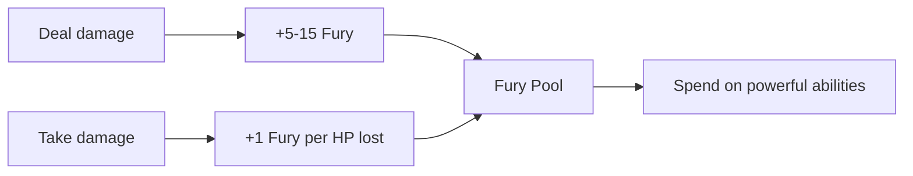

# Berserkr (The Roaring Fire)

---

## 1. Identity

| Property | Value |
|----------|-------|
| **Display Name** | Berserkr |
| **Translation** | "The Roaring Fire" |
| **Archetype** | Warrior |
| **Path Type** | Heretical |
| **Mechanical Role** | Burst Damage / Melee DPS |
| **Primary Attribute** | MIGHT |
| **Secondary Attribute** | VIGOR |
| **Resource System** | Stamina + Fury |
| **Trauma Risk** | High (WILL penalty) |
| **Icon** | 🔥 |

---

## 2. Unlock Requirements

| Requirement | Value | Notes |
|-------------|-------|-------|
| **PP Cost to Unlock** | 10 PP | High-impact role |
| **Minimum Legend** | 3 | Early-mid game |
| **Maximum Corruption** | 100 | No restriction |
| **Required Quest** | None | Combat-unlocked |

---

## 3. Design Philosophy

**Tagline:** "Your saga is written in the blood of your enemies and the scars on your own body."

**Core Fantasy:** You are the unstoppable barbarian, the terrifying whirlwind of destruction. You have learned to channel the world's trauma into pure, untamed physical power. You abandon tactical finesse and personal safety for the promise of overwhelming, glorious violence.

**Mechanical Identity:**
1. **Fury Resource** — Unique 0-100 bar that builds from dealing AND taking damage
2. **High-Risk, High-Reward** — Trade defense for highest sustained melee damage
3. **Heretical Path** — WILL penalty while Fury is active
4. **Momentum-Based** — The longer the fight, the more dangerous you become
5. **AoE Specialist** — Excels against multiple enemies

**Gameplay Feel:** A visceral, aggressive, momentum-based damage dealer. Manage the razor's edge between overwhelming power and catastrophic collapse.

---

## 4. The Fury System

### 4.1 Fury Mechanics

| Property | Value |
|----------|-------|
| **Range** | 0-100 |
| **Decay** | None during combat |
| **Reset** | Completely lost on Sanctuary Rest |

### 4.2 Fury Generation



| Source | Fury Gained |
|--------|-------------|
| Dealing damage (hit) | +5-15 per hit |
| Taking damage | +1 per HP lost |
| Blood-Fueled (passive) | Double damage generation |
| Death or Glory (bloodied) | +50% all generation |
| Unleashed Roar (taunted) | +10 when attacked |

### 4.3 Fury Spending

| Cost | Abilities |
|------|-----------|
| 20 Fury | Unleashed Roar |
| 30 Fury | Whirlwind of Destruction |
| 40 Fury | Hemorrhaging Strike |

### 4.4 The Trauma Interface

> [!WARNING]
> **Heretical Penalty:** While the Berserkr has ANY Fury, they suffer **-2 dice to all WILL-based Resolve Checks.**

This makes the Berserkr exceptionally vulnerable to:
- Psychic attacks
- Fear effects
- Mental debuffs

---

## 5. Rank Progression

### 5.1 Rank Upgrade System

All abilities start at **Rank 1** when unlocked. Players choose which abilities to invest in for higher ranks:

| Upgrade | PP Cost | Effect |
|---------|---------|--------|
| **Rank 2** | +2 PP | Enhanced effects, reduced costs |
| **Rank 3** | +3 PP | Mastered form, bonus effects |

> [!TIP]
> Unlike the old system, rank upgrades are now **optional per-ability choices**. You don't need to buy other abilities to upgrade the ones you love.

### 5.2 PP Investment Table

| Ability | Tier | Unlock (R1) | +R2 | +R3 | Max Total |
|---------|------|-------------|-----|-----|-----------|
| Primal Vigor I | 1 | 3 PP | +2 | +3 | 8 PP |
| Wild Swing | 1 | 3 PP | +2 | +3 | 8 PP |
| Reckless Assault | 1 | 3 PP | +2 | +3 | 8 PP |
| Unleashed Roar | 2 | 4 PP | +2 | +3 | 9 PP |
| Whirlwind of Destruction | 2 | 4 PP | +2 | +3 | 9 PP |
| Blood-Fueled | 2 | 4 PP | +2 | +3 | 9 PP |
| Hemorrhaging Strike | 3 | 5 PP | +2 | +3 | 10 PP |
| Death or Glory | 3 | 5 PP | +2 | +3 | 10 PP |
| Unstoppable Fury | 4 | 6 PP | +2 | +3 | 11 PP |

**Specialization Unlock:** 10 PP  
**Full Tree (Rank 1 only):** 10 + 37 = **47 PP**  
**Full Tree (all Rank 3):** 10 + 37 + 45 = **92 PP**

---

## 6. Ability Tree

### 6.1 Visual Structure

```
                    TIER 1: FOUNDATIONAL FURY (3 PP each)
    ┌─────────────────────┼─────────────────────┐
    │                     │                     │
[Primal Vigor I]     [Wild Swing]       [Reckless
   (Passive)           (Active)          Assault]
    │                     │                (Active)
    └─────────────────────┴─────────────────────┘
                          │
                          ▼
                TIER 2: ADVANCED CARNAGE (4 PP each)
    ┌─────────────────────┼─────────────────────┐
    │                     │                     │
[Unleashed         [Whirlwind of      [Blood-Fueled]
   Roar]           Destruction]         (Passive)
  (Active)            (Active)
    └─────────────────────┴─────────────────────┘
                          │
                          ▼
                TIER 3: MASTERY (5 PP each)
          ┌───────────────┴───────────────┐
          │                               │
  [Hemorrhaging        [Death or Glory]
     Strike]               (Passive)
    (Active)
          └───────────────┬───────────────┘
                          │
                          ▼
              TIER 4: CAPSTONE (6 PP)
                          │
               [Unstoppable Fury]
                   (Passive)
```

### 6.2 Ability Index

| ID | Ability | Tier | Type | PP | Spec Document |
|----|---------|------|------|-----|---------------|
| 3001 | Primal Vigor I | 1 | Passive | 3 | [primal-vigor-i.md](abilities/primal-vigor-i.md) |
| 3002 | Wild Swing | 1 | Active | 3 | [wild-swing.md](abilities/wild-swing.md) |
| 3003 | Reckless Assault | 1 | Active | 3 | [reckless-assault.md](abilities/reckless-assault.md) |
| 3004 | Unleashed Roar | 2 | Active | 4 | [unleashed-roar.md](abilities/unleashed-roar.md) |
| 3005 | Whirlwind of Destruction | 2 | Active | 4 | [whirlwind-of-destruction.md](abilities/whirlwind-of-destruction.md) |
| 3006 | Blood-Fueled | 2 | Passive | 4 | [blood-fueled.md](abilities/blood-fueled.md) |
| 3007 | Hemorrhaging Strike | 3 | Active | 5 | [hemorrhaging-strike.md](abilities/hemorrhaging-strike.md) |
| 3008 | Death or Glory | 3 | Passive | 5 | [death-or-glory.md](abilities/death-or-glory.md) |
| 3009 | Unstoppable Fury | 4 | Passive | 6 | [unstoppable-fury.md](abilities/unstoppable-fury.md) |

---

## 7. Situational Power Profile

### 7.1 Optimal Conditions

| Situation | Why Strong |
|-----------|------------|
| Long brutal encounters | Fury accumulates |
| Multiple enemies | AoE abilities scale |
| Attrition fights | Taking damage = Fury |
| Strong healer support | Survives reckless style |

### 7.2 Weakness Conditions

| Situation | Why Weak |
|-----------|----------|
| Short burst fights | No time to build Fury |
| Psychic-heavy enemies | -2 WILL penalty |
| Solo play | No support |
| Heavy CC enemies | Vulnerable to fear/stun |

---

## 8. Party Synergies

### 8.1 Positive Synergies

| Partner | Synergy |
|---------|---------|
| **Skjaldmær** | Tank absorbs what Berserkr can't |
| **Bone-Setter** | Heals through reckless damage |
| **Skald** | Fear immunity covers weakness |
| **Controllers** | Debuff so Berserkr can focus damage |

### 8.2 Negative Synergies

| Partner | Issue |
|---------|-------|
| Other "selfish" DPS | Compete for healer attention |
| Fragile compositions | Can't support reckless style |

---

## 9. Integration Points

| System | Integration |
|--------|-------------|
| **Fury Resource** | Unique mechanic |
| **Trauma Economy** | WILL penalty (heretical) |
| **Status Effects** | Applies [Bleeding], [Vulnerable] |
| **Combat** | AoE damage specialist |

---

## 10. Balance Data

### 10.1 Power Curve

| Legend | Damage Output | Survivability | Utility |
|--------|---------------|---------------|---------|
| 1-3 | Medium | Low | None |
| 4-6 | High | Medium | Low |
| 7-10 | Very High | Medium | Low |

### 10.2 Role Effectiveness

| Role | Rating (1-5) | Notes |
|------|--------------|-------|
| Single Target DPS | ★★★★☆ | Strong with Hemorrhaging Strike |
| AoE DPS | ★★★★★ | Wild Swing + Whirlwind excel |
| Tanking | ★★☆☆☆ | Survives through damage, not mitigation |
| Healing | ☆☆☆☆☆ | None |
| Utility | ★☆☆☆☆ | Morale debuff via Roar only |

### 10.3 Fury Economy Analysis

| Metric | Value | Notes |
|--------|-------|-------|
| Avg Fury per turn | +15-25 | Depends on enemies hit |
| Ability cost avg | 30 Fury | Standard Fury spender |
| Turns to max Fury | 4-6 | From zero |
| Reset condition | Sanctuary Rest | Complete loss |

---

## 11. Voice Guidance

**Reference:** [/docs/.templates/flavor-text/specialization-abilities.md#skar-horde]

### 11.1 Tone Profile

| Property | Value |
|----------|-------|
| **Tone** | Primal, violent, unrestrained |
| **Key Words** | Blood, fury, beast, roar, unstoppable |
| **Sentence Style** | Short, punchy, exclamatory |

### 11.2 Example Voice

> **Activation:** "BLOOD! The fury SURGES!"
> **Effect:** "You become the storm. Enemies fall like leaves."
> **Failure:** "The rage... fades. You feel hollow."

---

## 12. Phased Implementation Guide

### Phase 1: Resource & Persistence
- [ ] **Define Resource**: Implement `Fury` property (0-100) on Character Entity.
- [ ] **Generation Logic**: Hook into `DamageDealt` and `DamageTaken` events in `CombatService` to gen Fury.
- [ ] **Persistence**: Ensure `Fury` value is saved/loaded in `GameStateService`.
- [ ] **Sanctuary Reset**: Implement clear-on-rest logic in `RestService`.

### Phase 2: Core Logic & Trauma
- [ ] **Penalty Logic**: Implement `IDiceModifier` that applies -2 WILL dice when Fury > 0.
- [ ] **Passive Effects**: Implement `Primal Vigor` and `Unstoppable Fury` passive handlers.
- [ ] **Validation**: Ensure Fury cannot exceed 100 or drop below 0.

### Phase 3: Ability Integration
- [ ] **Ability Factory**: Register `BerserkrSpecialization` in `SpecializationFactory`.
- [ ] **Spenders**: Implement cost checking (e.g., "Requires 30 Fury") in `AbilityService`.
- [ ] **Status Hooks**: Connect `Hemorrhaging Strike` to `Bleeding` status effect.

### Phase 4: UI & Feedback
- [ ] **Fury Bar**: Create TUI/GUI widget for Fury (Red/Yellow/Orange states).
- [ ] **Combat Logs**: Add specific logs for Fury generation ("{Name} roars, gaining 15 Fury!").
- [ ] **Visuals**: Trigger red screen pulse VFX when Fury > 80.

---

## 13. Testing Requirements

### 13.1 Unit Tests
- [ ] **Generation**: Verify damage deal/take adds correct Fury amount.
- [ ] **Penalty**: Verify WILL rolls have -2 dice penalty when Fury > 0.
- [ ] **Cap**: Verify Fury does not exceed 100.
- [ ] **Reset**: Verify Sanctuary Rest sets Fury to 0.

### 13.2 Balance Verification
- [ ] **Simulation**: Run 10-turn combat sim; average Fury should hover 40-60.
- [ ] **Trauma Risk**: Verify WILL penalty causes ~20% more failed resolve checks.

### 13.3 Manual QA
- [ ] **UI Check**: Fury bar updates in real-time.
- [ ] **Save/Load**: Fury persists across save/load cycle.
- [ ] **Rest**: Short Rest does NOT clear Fury; Sanctuary DOES.

---

## 14. Logging Requirements

**Reference:** [logging.md](../../../00-project/logging.md)

### 14.1 Log Events

| Event | Level | Message Template | Properties |
|-------|-------|------------------|------------|
| Spec Unlock | Info | "Unlocked Specialization: Berserkr for {Character}." | `Character` |
| Fury Max | Info | "{Character} reached MAX FURY!" | `Character` |
| Fury Reset | Info | "{Character} Fury reset to 0 (Sanctuary Rest)." | `Character` |
| Passive Trigger | Debug | "Primal Vigor healed {Character} for {Amount}." | `Character`, `Amount` |

---

## 15. Related Documentation

| Document | Purpose |
|----------|---------|
| [Bleeding](../../04-systems/status-effects/bleeding.md) | Hemorrhaging Strike effect |
| [Feared](../../04-systems/status-effects/feared.md) | Capstone immunity |
| [Stunned](../../04-systems/status-effects/stunned.md) | Capstone immunity |
| [Fury Resource](../../01-core/resources/fury.md) | Unique resource system |

---

## 16. Changelog

| Version | Date | Changes |
|---------|------|---------|
| 1.0 | 2025-12-07 | Initial specification |
| 1.1 | 2025-12-08 | Added Balance Data, Voice Guidance, Implementation Status, Changelog (golden standard) |

