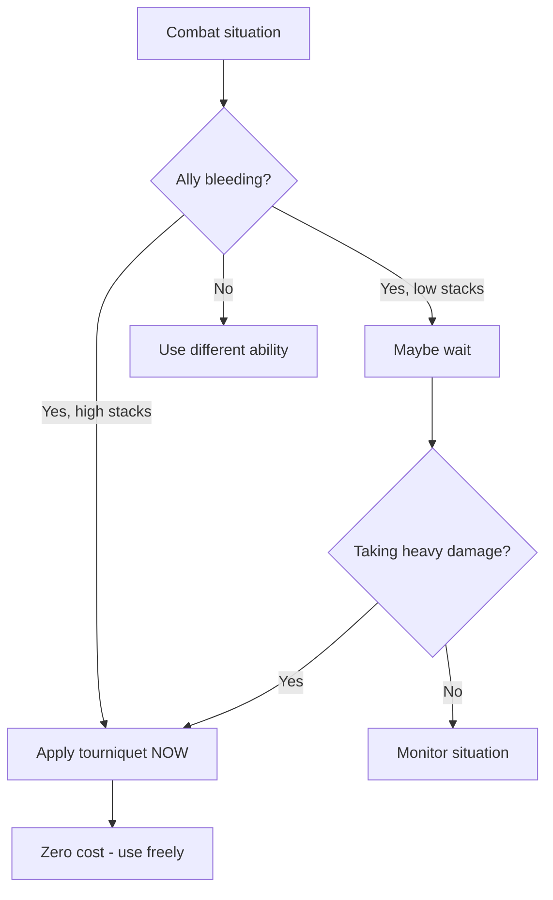

# Apply Tourniquet

**Ability ID:** 2003 | **Tier:** 1 | **Type:** Active | **PP Cost:** 3

---

## 1. Overview

| Property | Value |
|----------|-------|
| **Action** | Standard Action |
| **Target** | Single ally |
| **Resource Cost** | None |
| **Range** | Adjacent (touch) |
| **Prerequisite** | Bone-Setter specialization |

---

## 2. Description

> Seeing a grievous, bleeding wound, the Bone-Setter acts with speed and precision to stop the life-threatening blood loss.

---

## 3. Mechanical Effects

### 3.1 Primary Effect

```
Effect: Immediately removes [Bleeding] status effect
Cost: None (zero-cost emergency response)
Target: Single ally within touch range
```

> [!TIP]
> This is a **zero-cost** cleanse. Unlike other healing abilities, Apply Tourniquet consumes no resources.

---

## 4. Rank Progression

### Rank 1 (Base — included with ability unlock)

**Mechanical Effects:**
- Remove [Bleeding] from single ally
- No resource cost
- Standard Action

---

### Rank 2 (Upgrade Cost: +2 PP)

**Mechanical Effects:**
- All Rank 1 effects
- **NEW:** Also heals 1d6 HP when removing bleeding

**Formula:**
```
BleedingRemoved = ALL stacks
BonusHealing = 1d6
```

---

### Rank 3 (Upgrade Cost: +3 PP, requires Rank 2)

**Mechanical Effects:**
- All Rank 2 effects
- **NEW:** +1d10 resistance to [Bleeding] for 3 rounds

**Formula:**
```
BleedingRemoved = ALL stacks
BonusHealing = 1d6
BleedResistanceBonus = 1d10 (3 rounds)
```

---

## 5. Apply Tourniquet Workflow

```mermaid
flowchart TD
    START[Use Apply Tourniquet] --> CHECK{Ally has [Bleeding]?}
    
    CHECK --> |No| WASTE[No effect, action used]
    CHECK --> |Yes| APPLY[Apply tourniquet]
    
    APPLY --> REMOVE[Remove ALL [Bleeding] stacks]
    REMOVE --> RANK{Rank 2+?}
    
    RANK --> |Yes| HEAL[+1d6 healing]
    RANK --> |No| DONE[Complete]
    
    HEAL --> RANK3{Rank 3?}
    RANK3 --> |Yes| RESIST[+1d10 bleed resistance]
    RANK3 --> |No| DONE
    RESIST --> DONE
```

---

## 6. Tactical Decision Tree



---

## 7. Synergies

| Combination | Effect |
|-------------|--------|
| vs Bleed-heavy enemies | Critical counter |
| + Mend Wound | Cleanse then heal |
| + Triage | Heal more if bloodied |

---

## 8. Balance Data

### 8.1 Action Economy
- **Cost:** Standard Action, 0 Stamina.
- **Value:** Prevents X damage (Bleed ticks).
- **Tradeoff:** Using a full Standard Action to stop a DoT is usually a DPS loss, but life-saving if the DoT is high tier (Rank 3 Hemorrhage deals massive damage).

### 8.2 Comparison
- **Vs Bandages:** Items cost inventory space and hacksilver. This ability is free and infinite.

---

## 9. Phased Implementation Guide

### Phase 1: Mechanics
- [ ] **Action**: Create `ApplyTourniquet` ability.
- [ ] **Effect**: `Target.StatusEffects.RemoveAll(Bleeding)`.

### Phase 2: Logic Integration
- [ ] **Rank 2**: Add Heal effect (`Target.Heal(1d6)`).
- [ ] **Rank 3**: Add Resistance Buff effect.

### Phase 3: Visuals
- [ ] **Anim**: Bandaging/tightening strap animation.
- [ ] **VFX**: White cross or "stunched blood" particles.

---

## 10. Testing Requirements

### 10.1 Unit Tests
- [ ] **Cleanse**: Target has 5 stacks Bleeding -> Ability -> 0 stacks.
- [ ] **Heal**: Rank 2 -> Target HP +1d6.
- [ ] **Zero Cost**: Caster Stamina unchanged.

### 10.2 Integration Tests
- [ ] **Range**: Verify requires adjacent/touch range.
- [ ] **Bleed Re-apply**: Rank 3 resistance -> Apply bleed next turn -> Verify reduced chance/duration.

### 10.3 Manual QA
- [ ] **Log**: "Tourniquet applied. Bleeding stopped."

---

## 11. Logging Requirements

**Reference:** [logging.md](../../../../../00-project/logging.md)

### 11.1 Log Events
| Event | Level | Message Template | Properties |
|-------|-------|------------------|------------|
| Cleanse | Info | "{Character} stems the flow of blood from {Target}." | `Character`, `Target` |
| Heal | Debug | "Tourniquet stabilized wound (+{HP} HP)." | `HP` |

---

## 12. Related Specifications
| Document | Purpose |
|----------|---------|
| [Status Effects](../../../../04-systems/status-effects/bleeding.md) | Bleeding effect |
| [Field Medic](../../../../04-systems/crafting/field-medicine.md) | Crafting trade |

---

## 13. Changelog
| Version | Date | Changes |
|---------|------|---------|
| 1.0 | 2025-12-07 | Initial specification |
| 1.1 | 2025-12-14 | Standardized with Balance, Phased Guide, Testing, Logging |
