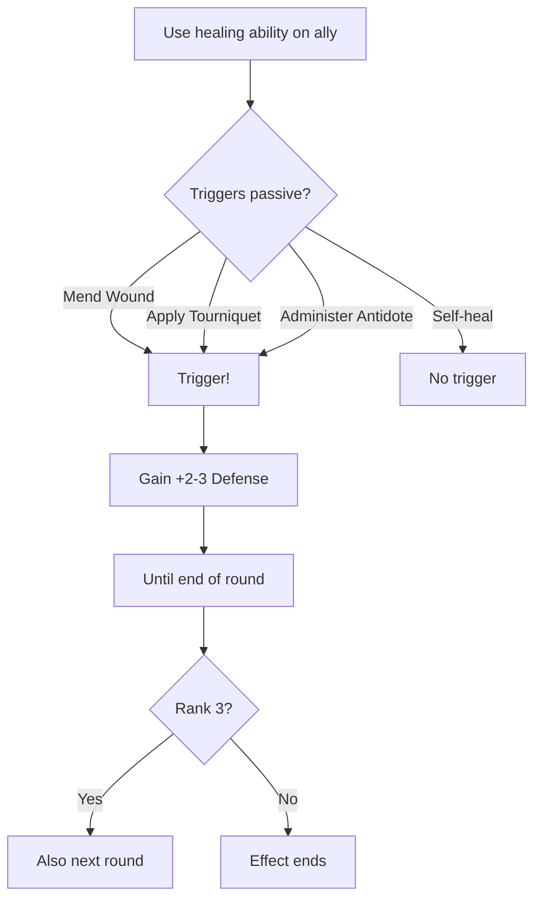

# "First, Do No Harm"

**Ability ID:** 2008 | **Tier:** 3 | **Type:** Passive | **PP Cost:** 5

---

## 1. Overview

| Property | Value |
|----------|-------|
| **Action** | Free (triggered) |
| **Target** | Self |
| **Resource Cost** | None |
| **Trigger** | After using healing ability on ally |
| **Prerequisite** | 20 PP in Bone-Setter tree |
| **Starting Rank** | 2 |

---

## 2. Description

> When focused on the act of healing, the Bone-Setter enters a state of heightened awareness, ensuring they don't become a casualty while saving another.

---

## 3. Mechanical Effects

### 3.1 Primary Effect

```
Trigger: Use single-target healing ability on ally
Effect: Gain +2 Defense until end of round
Duration: Until end of current round
```

> [!TIP]
> This is a **survivability passive** — protects the Bone-Setter while they perform their critical support role.

---

## 4. Rank Progression

### Rank 2 (Starting Rank)

**Mechanical Effects:**
- +2 Defense after healing an ally
- Duration: End of current round
- Triggers on: Mend Wound, Apply Tourniquet, Administer Antidote

---

### Rank 3 (Upgrade Cost: +3 PP, requires Rank 2)

**Mechanical Effects:**
- +3 Defense after healing an ally
- Duration: End of current round AND next round
- **NEW:** Also gain +1d10 to all saves

---

## 5. First, Do No Harm Workflow



---

## 6. Tactical Implications

| Situation | Benefit |
|-----------|---------|
| **Healing in front line** | Survive counter-attacks |
| **High priority target** | Harder to take down |
| **Sustained healing** | Maintain buff continuously |

---

## 7. Balance Data

### 7.1 Survivor Bias
- **Role:** Encourages active healing in combat. If you heal, you survive. If you turtle, you die.
- **Value:** +3 Defense is equivalent to a shield or light cover. Significant mitigation.

---

## 8. Phased Implementation Guide

### Phase 1: Mechanics
- [ ] **Hook**: `OnAbilityUsed`.
- [ ] **Check**: `Ability.Tags.Contains(Healing)`. `Target != Self`.
- [ ] **Effect**: `Self.AddStatus(DefensivePosturing)`.

### Phase 2: Logic Integration
- [ ] **Rank 3**: Duration = 2 rounds.
- [ ] **Bonus**: Add +1d10 to Saves while active.

### Phase 3: Visuals
- [ ] **VFX**: Subtle white "shield" shimmer around the doctor.

---

## 9. Testing Requirements

### 9.1 Unit Tests
- [ ] **Trigger**: Heal Ally -> Buff applied.
- [ ] **NoTrigger**: Heal Self -> Buff NOT applied.
- [ ] **Effect**: Defense increases by 2/3.

### 9.2 Integration Tests
- [ ] **Duration**: Verify expiry at end of round (Rank 2) vs next round (Rank 3).

### 9.3 Manual QA
- [ ] **Log**: "Defensive posture adopted."

---

## 10. Logging Requirements

**Reference:** [logging.md](../../../../../00-project/logging.md)

### 10.1 Log Events
| Event | Level | Message Template | Properties |
|-------|-------|------------------|------------|
| Buff | Debug | "Healing reflex grants +{Defense} Defense." | `Defense` |

---

## 11. Related Specifications
| Document | Purpose |
|----------|---------|
| [Bone-Setter](../bone-setter-overview.md) | Spec overview |

---

## 12. Changelog
| Version | Date | Changes |
|---------|------|---------|
| 1.0 | 2025-12-07 | Initial specification |
| 1.1 | 2025-12-14 | Standardized with Balance, Phased Guide, Testing, Logging |
