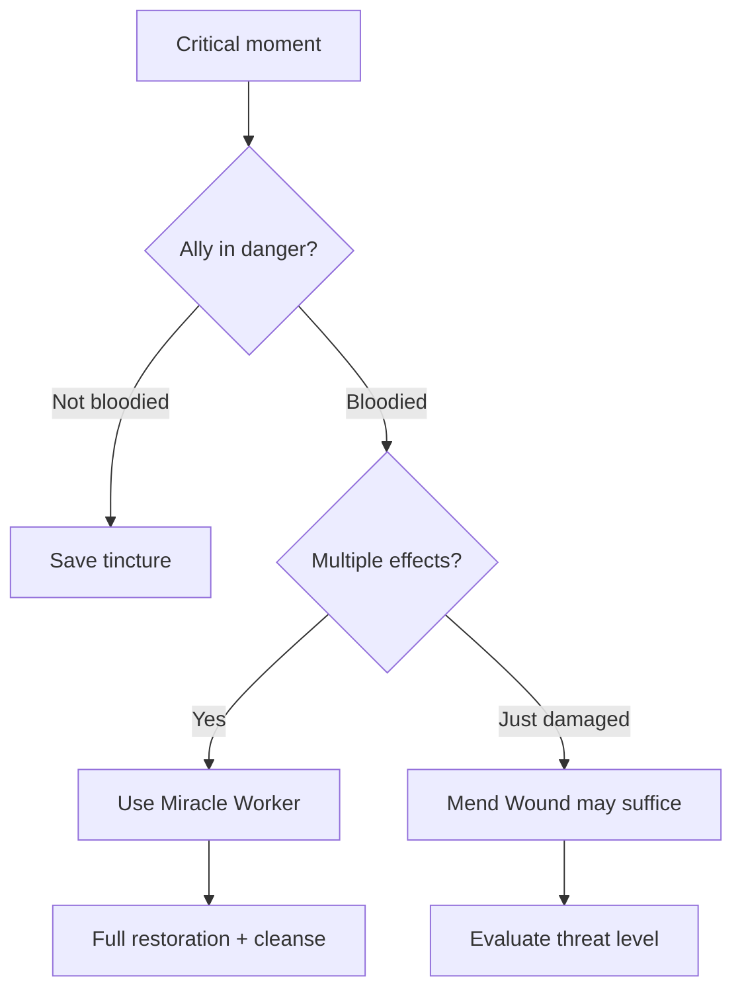

# Miracle Worker

**Ability ID:** 2009 | **Tier:** 4 (Capstone) | **Type:** Active | **PP Cost:** 6

---

## 1. Overview

| Property | Value |
|----------|-------|
| **Action** | Standard Action |
| **Target** | Single [Bloodied] ally |
| **Resource Cost** | 1× [Miracle Tincture] |
| **Range** | Adjacent (touch) |
| **Prerequisite** | Full Bone-Setter tree (40 PP) |
| **Starting Rank** | 1 |

---

## 2. Description

> The Bone-Setter performs a complex and exhausting procedure — a combination of potent stimulants, field surgery, and sheer force of will — that can bring an ally back from the very brink of a fatal system crash.

> [!CAUTION]
> **Requirements:**
> - Target must be [Bloodied] (below 50% HP)
> - Consumes [Miracle Tincture] (rare, crafted DC 24)

---

## 3. Mechanical Effects

### 3.1 Primary Effect

```
Healing = Massive base + (WITS × 3)
Secondary: Remove ALL negative physical status effects
```

### 3.2 Effects Removed

| Status | Removed? |
|--------|----------|
| [Bleeding] | ✓ |
| [Poisoned] | ✓ |
| [Corroded] | ✓ |
| [Stunned] | ✓ |
| [Slowed] | ✓ |
| [Rooted] | ✓ |
| [Feared] | ✗ (mental) |
| [Disoriented] | ✗ (mental) |

---

## 4. Rank Progression

### Rank 1 (Starting Rank)

**Mechanical Effects:**
- Massive healing: 8d6 + (WITS × 3)
- Remove ALL physical status effects
- Cost: 1× [Miracle Tincture]
- Requirement: Target [Bloodied]

**Example:**
```
WITS 6: 8d6 + 18 = 28-66 HP
Average: ~46 HP
```

---

### Rank 2 (Unlocked: Tree progression)

**Mechanical Effects:**
- Healing: 10d6 + (WITS × 3)
- Remove ALL physical status effects
- **NEW:** Also remove [Feared], [Disoriented]

---

### Rank 3 (Unlocked: Full tree completion)

**Mechanical Effects:**
- Healing: 12d6 + (WITS × 3)
- Remove ALL negative status effects
- **NEW:** Target gains [Fortified] for 2 rounds
- **NEW:** Once per day, no [Miracle Tincture] cost

---

## 5. Miracle Worker Workflow

```mermaid
flowchart TD
    START[Use Miracle Worker] --> CHECK1{Target [Bloodied]?}
    
    CHECK1 --> |No| FAIL1[Cannot use - must be bloodied]
    CHECK1 --> |Yes| CHECK2{Have Miracle Tincture?}
    
    CHECK2 --> |No| FAIL2[Cannot use - no tincture]
    CHECK2 --> |Yes| APPLY[Perform procedure]
    
    APPLY --> CONSUME[Tincture consumed]
    CONSUME --> HEAL[Massive healing applied]
    HEAL --> CLEANSE[Remove ALL physical effects]
    
    CLEANSE --> RANK2{Rank 2+?}
    RANK2 --> |Yes| MENTAL[Also remove mental effects]
    RANK2 --> |No| DONE[Target restored]
    
    MENTAL --> RANK3{Rank 3?}
    RANK3 --> |Yes| FORTIFY[Apply [Fortified]]
    RANK3 --> |No| DONE
    FORTIFY --> DONE
```

---

## 6. Tactical Decision Tree



---

## 7. Resource Economy

### 7.1 [Miracle Tincture] Rarity

| Aspect | Value |
|--------|-------|
| Crafting DC | 24 (Legendary) |
| Ingredients | Rare herbs × 4, Mineral extract × 2, Blessed water × 1 |
| Time | 8 hours |
| Availability | 1-2 per expedition typically |

### 7.2 When to Use

| Situation | Use? |
|-----------|------|
| Single ally bloodied | Maybe (Mend Wound cheaper) |
| Ally bloodied + effects | YES |
| Ally about to die | YES |
| Multiple allies down | Save for most critical |

---

## 8. Balance Data

### 8.1 Capstone Value
- **Healing:** 8d6-12d6 + WITS*3 (~46-60 HP). This is essentially a full heal from near-death.
- **Cleanse:** Removing 6+ status effects in one action is unparalleled.
- **Cost:** Miracle Tincture is rare (DC 24 crafting). Acts as natural limiter.

### 8.2 Comparison
- **Vs Mend Wound:** ~4x healing, adds cleanse, adds buff. Justified by rare resource cost.

---

## 9. Phased Implementation Guide

### Phase 1: Mechanics
- [ ] **Check**: Verify Target.IsBloodied.
- [ ] **Cost**: Consume MiracleTincture.
- [ ] **Effect**: Massive heal + `Target.RemoveStatus(Physical)`.

### Phase 2: Logic Integration
- [ ] **Rank 2**: Add Mental status removal.
- [ ] **Rank 3**: Add `Fortified` buff. Add `DailyFreeUse` tracker.

### Phase 3: Visuals
- [ ] **Anim**: Extended "Surgery" animation (2-3 seconds).
- [ ] **VFX**: Golden light envelops target.

---

## 10. Testing Requirements

### 10.1 Unit Tests
- [ ] **Prereq**: Target >50% HP -> Fail.
- [ ] **Heal**: Target HP = ~MaxHP after use.
- [ ] **Cleanse**: Bleeding, Poisoned, Stunned all removed.

### 10.2 Integration Tests
- [ ] **Daily Free**: Use once -> OK. Use twice (Rank 3, no tincture) -> Second fails without tincture.

### 10.3 Manual QA
- [ ] **Log**: "A miracle unfolds. Kára is restored!"

---

## 11. Logging Requirements

**Reference:** [logging.md](../../../../../00-project/logging.md)

### 11.1 Log Events
| Event | Level | Message Template | Properties |
|-------|-------|------------------|------------|
| Miracle | Warn | "{Character} performs a miracle on {Target}!" | `Character`, `Target` |

---

## 12. Related Specifications
| Document | Purpose |
|----------|---------|
| [Alchemy](../../../../04-systems/crafting/alchemy.md) | Tincture crafting |
| [Status Effects](../../../../04-systems/status-effects/bleeding.md) | Status definitions |

---

## 13. Changelog
| Version | Date | Changes |
|---------|------|---------|
| 1.0 | 2025-12-07 | Initial specification |
| 1.1 | 2025-12-14 | Standardized with Balance, Phased Guide, Testing, Logging |
